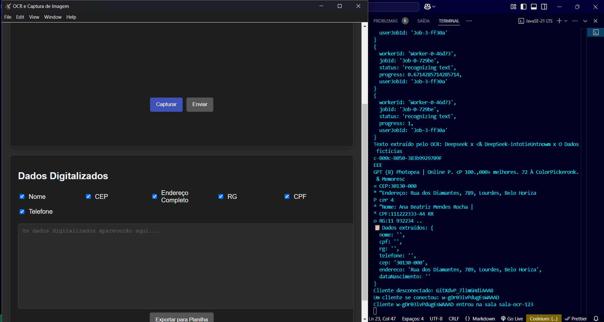

# Sistema de São Jorge (SSJ)  

**Resumo**: Sistema operacional criado com o intuito de diminuir o tempo de trabalho, aumentar a mobilidade e melhorar a performance em processos de digitalização e tratamento de documentos físicos.  

---

## Informações do Artigo  
- **Título**: `SSJ - OCR com Espelhamento em Tempo Real`  
- **Autor**: `Brunno de Brito Barros`  
- **Repositório**: [GitHub](link-do-repositório)  
- **Demonstração**:  
    

---

## Recursos Principais  
- 📸 **Captura de Imagens via Dispositivo Móvel**: Use a câmera do celular para digitalizar documentos.  
- 🔄 **Espelhamento em Tempo Real**: Visualize a tela do celular no PC via Socket.IO.  
- ✨ **OCR Avançado**: Extraia texto de imagens (incluindo manuscritos) com Tesseract.js.  
- 📊 **Exportação para Excel**: Salve dados estruturados automaticamente em planilhas.  
- 🏡 **Validação de Endereço**: Busca de CEP integrada à API ViaCEP.  


---

## Tecnologias Utilizadas  
| Tecnologia          | Descrição                                     |  
|---------------------|-----------------------------------------------|  
| **Electron**        | Framework para construir aplicações desktop.  |  
| **Node.js**         | Ambiente de execução back-end.                |  
| **Tesseract.js**    | OCR para extração de texto de imagens.        |  
| **Socket.IO**       | Comunicação em tempo real entre dispositivos. |  
| **Sharp**           | Pré-processamento de imagens para melhor OCR. |  
| **Ngrok**           | Expõe servidores locais para acesso remoto.   |  

---

## Instalação e Dependências  
### Pré-requisitos  
- Node.js (v18+)  
- NPM 
- Ngrok (para acesso remoto)  
- Electron  (Configurado no Json para startar projeto (npm start))

### Principais Adaptações:  
1. **Foco no Projeto Real**: Removi seções irrelevantes (como conjuntos de dados de áudio/Python) e mantive apenas o necessário para OCR, espelhamento e exportação.  
2. **Instruções Claras**: Detalhei o fluxo de instalação e uso específico para o SSJ.  
3. **Tecnologias Reais**: Liste apenas as tecnologias efetivamente usadas (Electron, Tesseract.js, etc.).  
4. **Imagem Contextual**: Adicionei um placeholder para a screenshot da interface (`image.png`).  


## Hierarquia de Diretórios
```
|—— .env
|—— .gitignore
|—— 1deias do sistema
|    |—— Ideia de sistema para upx caso de.txt
|    |—— Manual do usuario.txt
|    |—— Menus Do Sistema.txt
|    |—— Sisteam Modular .xlsx
|—— dist
|    |—— builder-debug.yml
|    |—— builder-effective-config.yaml
|    |—— win-unpacked
|        |—— chrome_100_percent.pak
|        |—— chrome_200_percent.pak
|        |—— d3dcompiler_47.dll
|        |—— ffmpeg.dll
|        |—— icudtl.dat
|        |—— libEGL.dll
|        |—— libGLESv2.dll
|        |—— LICENSE.electron.txt
|        |—— LICENSES.chromium.html
|        |—— locales
|            |—— af.pak
|            |—— am.pak
|            |—— ar.pak
|            |—— bg.pak
|            |—— bn.pak
|            |—— ca.pak
|            |—— cs.pak
|            |—— da.pak
|            |—— de.pak
|            |—— el.pak
|            |—— en-GB.pak
|            |—— en-US.pak
|            |—— es-419.pak
|            |—— es.pak
|            |—— et.pak
|            |—— fa.pak
|            |—— fi.pak
|            |—— fil.pak
|            |—— fr.pak
|            |—— gu.pak
|            |—— he.pak
|            |—— hi.pak
|            |—— hr.pak
|            |—— hu.pak
|            |—— id.pak
|            |—— it.pak
|            |—— ja.pak
|            |—— kn.pak
|            |—— ko.pak
|            |—— lt.pak
|            |—— lv.pak
|            |—— ml.pak
|            |—— mr.pak
|            |—— ms.pak
|            |—— nb.pak
|            |—— nl.pak
|            |—— pl.pak
|            |—— pt-BR.pak
|            |—— pt-PT.pak
|            |—— ro.pak
|            |—— ru.pak
|            |—— sk.pak
|            |—— sl.pak
|            |—— sr.pak
|            |—— sv.pak
|            |—— sw.pak
|            |—— ta.pak
|            |—— te.pak
|            |—— th.pak
|            |—— tr.pak
|            |—— uk.pak
|            |—— ur.pak
|            |—— vi.pak
|            |—— zh-CN.pak
|            |—— zh-TW.pak
|        |—— resources
|            |—— app-update.yml
|            |—— app.asar
|        |—— resources.pak
|        |—— sistema_de_sao_jorge.exe
|        |—— snapshot_blob.bin
|        |—— v8_context_snapshot.bin
|        |—— vk_swiftshader.dll
|        |—— vk_swiftshader_icd.json
|        |—— vulkan-1.dll
|—— icon.ico
|—— main.js
|—— node_modules
|    |—— .bin
|        |—— asar
|        |—— asar.cmd
|        |—— asar.ps1
|        |—— atob
|        |—— atob.cmd
|        |—— atob.ps1
|        |—— btoa
|        |—— btoa.cmd
|        |—— btoa.ps1
|        |—— color-support
|        |—— color-support.cmd
|        |—— color-support.ps1
|        |—— crc32
|        |—— crc32.cmd
|        |—— crc32.ps1
|        |—— ejs
|        |—— ejs.cmd
|        |—— ejs.ps1
|        |—— electron
|        |—— electron-builder
|        |—— electron-builder.cmd
|        |—— electron-builder.ps1
|        |—— electron-osx-flat
|        |—— electron-osx-flat.cmd
|        |—— electron-osx-flat.ps1
|        |—— electron-osx-sign
|        |—— electron-osx-sign.cmd
|        |—— electron-osx-sign.ps1
|        |—— electron-packager
|        |—— electron-packager.cmd
|        |—— electron-packager.ps1
|        |—— electron-rebuild
|        |—— electron-rebuild.cmd
|        |—— electron-rebuild.ps1
|        |—— electron.cmd
|        |—— electron.ps1
|        |—— extract-zip
|        |—— extract-zip.cmd
|        |—— extract-zip.ps1
|        |—— install-app-deps
|        |—— install-app-deps.cmd
|        |—— install-app-deps.ps1
|        |—— is-ci
|        |—— is-ci.cmd
|        |—— is-ci.ps1
|        |—— is-docker
|        |—— is-docker.cmd
|        |—— is-docker.ps1
|        |—— jake
|        |—— jake.cmd
|        |—— jake.ps1
|        |—— js-yaml
|        |—— js-yaml.cmd
|        |—— js-yaml.ps1
|        |—— json5
|        |—— json5.cmd
|        |—— json5.ps1
|        |—— mime
|        |—— mime.cmd
|        |—— mime.ps1
|        |—— mkdirp
|        |—— mkdirp.cmd
|        |—— mkdirp.ps1
|        |—— node-gyp
|        |—— node-gyp.cmd
|        |—— node-gyp.ps1
|        |—— node-which
|        |—— node-which.cmd
|        |—— node-which.ps1
|        |—— nopt
|        |—— nopt.cmd
|        |—— nopt.ps1
|        |—— opencollective-postinstall
|        |—— opencollective-postinstall.cmd
|        |—— opencollective-postinstall.ps1
|        |—— read-binary-file-arch
|        |—— read-binary-file-arch.cmd
|        |—— read-binary-file-arch.ps1
|        |—— resolve
|        |—— resolve.cmd
|        |—— resolve.ps1
|        |—— rimraf
|        |—— rimraf.cmd
|        |—— rimraf.ps1
|        |—— semver
|        |—— semver.cmd
|        |—— semver.ps1
|        |—— tsc
|        |—— tsc.cmd
|        |—— tsc.ps1
|        |—— tsserver
|        |—— tsserver.cmd
|        |—— tsserver.ps1
|        |—— xlsx
|        |—— xlsx.cmd
|        |—— xlsx.ps1
|    |—— .package-lock.json
|    |—— 7zip-bin
|        |—— 7x.sh
|        |—— index.d.ts
|        |—— index.js
|        |—— LICENSE.txt
|        |—— linux
|            |—— arm
|                |—— 7za
|            |—— arm64
|                |—— 7za
|            |—— ia32
|                |—— 7za
|            |—— x64
|                |—— 7za
|                |—— build.sh
|                |—— do-build.sh
|        |—— mac
|            |—— arm64
|                |—— 7za
|            |—— x64
|                |—— 7za
|        |—— package.json
|        |—— README.md
|        |—— win
|            |—— arm64
|                |—— 7za.exe
|            |—— ia32
|                |—— 7za.exe
|            |—— x64
|                |—— 7za.exe
|    |—— @babel
|        |—— runtime
|            |—— helpers
|                |—— applyDecoratedDescriptor.js
|                |—— applyDecs.js
|                |—— applyDecs2203.js
|                |—— applyDecs2203R.js
|                |—— applyDecs2301.js
|                |—— applyDecs2305.js
|                |—— applyDecs2311.js
|                |—— arrayLikeToArray.js
|                |—— arrayWithHoles.js
|                |—— arrayWithoutHoles.js
|                |—— assertClassBrand.js
|                |—— assertThisInitialized.js
|                |—— asyncGeneratorDelegate.js
|                |—— asyncIterator.js
|                |—— asyncToGenerator.js
|                |—— awaitAsyncGenerator.js
|                |—— AwaitValue.js
|                |—— callSuper.js
|                |—— checkInRHS.js
|                |—— checkPrivateRedeclaration.js
|                |—— classApplyDescriptorDestructureSet.js
|                |—— classApplyDescriptorGet.js
|                |—— classApplyDescriptorSet.js
|                |—— classCallCheck.js
|                |—— classCheckPrivateStaticAccess.js
|                |—— classCheckPrivateStaticFieldDescriptor.js
|                |—— classExtractFieldDescriptor.js
|                |—— classNameTDZError.js
|                |—— classPrivateFieldDestructureSet.js
|                |—— classPrivateFieldGet.js
|                |—— classPrivateFieldGet2.js
|                |—— classPrivateFieldInitSpec.js
|                |—— classPrivateFieldLooseBase.js
|                |—— classPrivateFieldLooseKey.js
|                |—— classPrivateFieldSet.js
|                |—— classPrivateFieldSet2.js
|                |—— classPrivateGetter.js
|                |—— classPrivateMethodGet.js
|                |—— classPrivateMethodInitSpec.js
|                |—— classPrivateMethodSet.js
|                |—— classPrivateSetter.js
|                |—— classStaticPrivateFieldDestructureSet.js
|                |—— classStaticPrivateFieldSpecGet.js
|                |—— classStaticPrivateFieldSpecSet.js
|                |—— classStaticPrivateMethodGet.js
|                |—— classStaticPrivateMethodSet.js
|                |—— construct.js
|                |—— createClass.js
|                |—— createForOfIteratorHelper.js
|                |—— createForOfIteratorHelperLoose.js
|                |—— createSuper.js
|                |—— decorate.js
|                |—— defaults.js
|                |—— defineAccessor.js
|                |—— defineEnumerableProperties.js
|                |—— defineProperty.js
|                |—— dispose.js
|                |—— esm
|                    |—— applyDecoratedDescriptor.js
|                    |—— applyDecs.js
|                    |—— applyDecs2203.js
|                    |—— applyDecs2203R.js
|                    |—— applyDecs2301.js
|                    |—— applyDecs2305.js
|                    |—— applyDecs2311.js
|                    |—— arrayLikeToArray.js
|                    |—— arrayWithHoles.js
|                    |—— arrayWithoutHoles.js
|                    |—— assertClassBrand.js
|                    |—— assertThisInitialized.js
|                    |—— asyncGeneratorDelegate.js
|                    |—— asyncIterator.js
|                    |—— asyncToGenerator.js
|                    |—— awaitAsyncGenerator.js
|                    |—— AwaitValue.js
|                    |—— callSuper.js
|                    |—— checkInRHS.js
|                    |—— checkPrivateRedeclaration.js
|                    |—— classApplyDescriptorDestructureSet.js
|                    |—— classApplyDescriptorGet.js
|                    |—— classApplyDescriptorSet.js
|                    |—— classCallCheck.js
|                    |—— classCheckPrivateStaticAccess.js
|                    |—— classCheckPrivateStaticFieldDescriptor.js
|                    |—— classExtractFieldDescriptor.js
|                    |—— classNameTDZError.js
|                    |—— classPrivateFieldDestructureSet.js
|                    |—— classPrivateFieldGet.js
|                    |—— classPrivateFieldGet2.js
|                    |—— classPrivateFieldInitSpec.js
|                    |—— classPrivateFieldLooseBase.js
|                    |—— classPrivateFieldLooseKey.js
|                    |—— classPrivateFieldSet.js
|                    |—— classPrivateFieldSet2.js
|                    |—— classPrivateGetter.js
|                    |—— classPrivateMethodGet.js
|                    |—— classPrivateMethodInitSpec.js
|                    |—— classPrivateMethodSet.js
|                    |—— classPrivateSetter.js
|                    |—— classStaticPrivateFieldDestructureSet.js
|                    |—— classStaticPrivateFieldSpecGet.js
|                    |—— classStaticPrivateFieldSpecSet.js
|                    |—— classStaticPrivateMethodGet.js
|                    |—— classStaticPrivateMethodSet.js
|                    |—— construct.js
|                    |—— createClass.js
|                    |—— createForOfIteratorHelper.js
|                    |—— createForOfIteratorHelperLoose.js
|                    |—— createSuper.js
|                    |—— decorate.js
|                    |—— defaults.js
|                    |—— defineAccessor.js
|                    |—— defineEnumerableProperties.js
|                    |—— defineProperty.js
|                    |—— dispose.js
|                    |—— extends.js
|                    |—— get.js
|                    |—— getPrototypeOf.js
|                    |—— identity.js
|                    |—— importDeferProxy.js
|                    |—— inherits.js
|                    |—— inheritsLoose.js
|                    |—— initializerDefineProperty.js
|                    |—— initializerWarningHelper.js
|                    |—— instanceof.js
|                    |—— interopRequireDefault.js
|                    |—— interopRequireWildcard.js
|                    |—— isNativeFunction.js
|                    |—— isNativeReflectConstruct.js
|                    |—— iterableToArray.js
|                    |—— iterableToArrayLimit.js
|                    |—— jsx.js
|                    |—— maybeArrayLike.js
|                    |—— newArrowCheck.js
|                    |—— nonIterableRest.js
|                    |—— nonIterableSpread.js
|                    |—— nullishReceiverError.js
|                    |—— objectDestructuringEmpty.js
|                    |—— objectSpread.js
|                    |—— objectSpread2.js
|                    |—— objectWithoutProperties.js
|                    |—— objectWithoutPropertiesLoose.js
|                    |—— OverloadYield.js
|                    |—— package.json
|                    |—— possibleConstructorReturn.js
|                    |—— readOnlyError.js
|                    |—— regeneratorRuntime.js
|                    |—— set.js
|                    |—— setFunctionName.js
|                    |—— setPrototypeOf.js
|                    |—— skipFirstGeneratorNext.js
|                    |—— slicedToArray.js
|                    |—— superPropBase.js
|                    |—— superPropGet.js
|                    |—— superPropSet.js
|                    |—— taggedTemplateLiteral.js
|                    |—— taggedTemplateLiteralLoose.js
|                    |—— tdz.js
|                    |—— temporalRef.js
|                    |—— temporalUndefined.js
|                    |—— toArray.js
|                    |—— toConsumableArray.js
|                    |—— toPrimitive.js
|                    |—— toPropertyKey.js
|                    |—— toSetter.js
|                    |—— typeof.js
|                    |—— unsupportedIterableToArray.js
|                    |—— using.js
|                    |—— usingCtx.js
|                    |—— wrapAsyncGenerator.js
|                    |—— wrapNativeSuper.js
|                    |—— wrapRegExp.js
|                    |—— writeOnlyError.js
|                |—— extends.js
|                |—— get.js
|                |—— getPrototypeOf.js
|                |—— identity.js
|                |—— importDeferProxy.js
|                |—— inherits.js
|                |—— inheritsLoose.js
|                |—— initializerDefineProperty.js
|                |—— initializerWarningHelper.js
|                |—— instanceof.js
|                |—— interopRequireDefault.js
|                |—— interopRequireWildcard.js
|                |—— isNativeFunction.js
|                |—— isNativeReflectConstruct.js
|                |—— iterableToArray.js
|                |—— iterableToArrayLimit.js
|                |—— jsx.js
|                |—— maybeArrayLike.js
|                |—— newArrowCheck.js
|                |—— nonIterableRest.js
|                |—— nonIterableSpread.js
|                |—— nullishReceiverError.js
|                |—— objectDestructuringEmpty.js
|                |—— objectSpread.js
|                |—— objectSpread2.js
|                |—— objectWithoutProperties.js
|                |—— objectWithoutPropertiesLoose.js
|                |—— OverloadYield.js
|                |—— possibleConstructorReturn.js
|                |—— readOnlyError.js
|                |—— regeneratorRuntime.js
|                |—— set.js
|                |—— setFunctionName.js
|                |—— setPrototypeOf.js
|                |—— skipFirstGeneratorNext.js
|                |—— slicedToArray.js
|                |—— superPropBase.js
|                |—— superPropGet.js
|                |—— superPropSet.js
|                |—— taggedTemplateLiteral.js
|                |—— taggedTemplateLiteralLoose.js
|                |—— tdz.js
|                |—— temporalRef.js
|                |—— temporalUndefined.js
|                |—— toArray.js
|                |—— toConsumableArray.js
|                |—— toPrimitive.js
|                |—— toPropertyKey.js
|                |—— toSetter.js
|                |—— typeof.js
|                |—— unsupportedIterableToArray.js
|                |—— using.js
|                |—— usingCtx.js
|                |—— wrapAsyncGenerator.js
|                |—— wrapNativeSuper.js
|                |—— wrapRegExp.js
|                |—— writeOnlyError.js
|            |—— LICENSE
|            |—— package.json
|            |—— README.md
|            |—— regenerator
|                |—— index.js
|    |—— @develar
|        |—— schema-utils
|            |—— CHANGELOG.md
|            |—— declarations
|                |—— index.d.ts
|                |—— keywords
|                    |—— absolutePath.d.ts
|                |—— util
|                    |—— Range.d.ts
|                |—— validate.d.ts
|                |—— ValidationError.d.ts
|            |—— dist
|                |—— index.js
|                |—— keywords
|                    |—— absolutePath.js
|                |—— util
|                    |—— Range.js
|                |—— validate.js
|                |—— ValidationError.js
|            |—— LICENSE
|            |—— package.json
|            |—— README.md
|    |—— @electron
|        |—— asar
|            |—— bin
|                |—— asar.js
|            |—— lib
|                |—— asar.d.ts
|                |—— asar.js
|                |—— asar.js.map
|                |—— crawlfs.d.ts
|                |—— crawlfs.js
|                |—— crawlfs.js.map
|                |—— disk.d.ts
|                |—— disk.js
|                |—— disk.js.map
|                |—— filesystem.d.ts
|                |—— filesystem.js
|                |—— filesystem.js.map
|                |—— integrity.d.ts
|                |—— integrity.js
|                |—— integrity.js.map
|                |—— pickle.d.ts
|                |—— pickle.js
|                |—— pickle.js.map
|                |—— types
|                    |—— glob.d.ts
|                    |—— glob.js
|                    |—— glob.js.map
|                |—— wrapped-fs.d.ts
|                |—— wrapped-fs.js
|                |—— wrapped-fs.js.map
|            |—— LICENSE.md
|            |—— node_modules
|                |—— brace-expansion
|                    |—— index.js
|                    |—— LICENSE
|                    |—— package.json
|                    |—— README.md
|                |—— minimatch
|                    |—— LICENSE
|                    |—— minimatch.js
|                    |—— package.json
|                    |—— README.md
|            |—— package.json
|            |—— README.md
|        |—— get
|            |—— dist
|                |—— cjs
|                    |—— artifact-utils.d.ts
|                    |—— artifact-utils.js
|                    |—— artifact-utils.js.map
|                    |—— Cache.d.ts
|                    |—— Cache.js
|                    |—— Cache.js.map
|                    |—— downloader-resolver.d.ts
|                    |—— downloader-resolver.js
|                    |—— downloader-resolver.js.map
|                    |—— Downloader.d.ts
|                    |—— Downloader.js
|                    |—— Downloader.js.map
|                    |—— GotDownloader.d.ts
|                    |—— GotDownloader.js
|                    |—— GotDownloader.js.map
|                    |—— index.d.ts
|                    |—— index.js
|                    |—— index.js.map
|                    |—— proxy.d.ts
|                    |—— proxy.js
|                    |—— proxy.js.map
|                    |—— types.d.ts
|                    |—— types.js
|                    |—— types.js.map
|                    |—— utils.d.ts
|                    |—— utils.js
|                    |—— utils.js.map
|                |—— esm
|                    |—— artifact-utils.d.ts
|                    |—— artifact-utils.js
|                    |—— artifact-utils.js.map
|                    |—— Cache.d.ts
|                    |—— Cache.js
|                    |—— Cache.js.map
|                    |—— downloader-resolver.d.ts
|                    |—— downloader-resolver.js
|                    |—— downloader-resolver.js.map
|                    |—— Downloader.d.ts
|                    |—— Downloader.js
|                    |—— Downloader.js.map
|                    |—— GotDownloader.d.ts
|                    |—— GotDownloader.js
|                    |—— GotDownloader.js.map
|                    |—— index.d.ts
|                    |—— index.js
|                    |—— index.js.map
|                    |—— proxy.d.ts
|                    |—— proxy.js
|                    |—— proxy.js.map
|                    |—— types.d.ts
|                    |—— types.js
|                    |—— types.js.map
|                    |—— utils.d.ts
|                    |—— utils.js
|                    |—— utils.js.map
|            |—— LICENSE
|            |—— package.json
|            |—— README.md
|        |—— notarize
|            |—— lib
|                |—— check-signature.d.ts
|                |—— check-signature.js
|                |—— check-signature.js.map
|                |—— helpers.d.ts
|                |—— helpers.js
|                |—— helpers.js.map
|                |—— index.d.ts
|                |—— index.js
|                |—— index.js.map
|                |—— legacy.d.ts
|                |—— legacy.js
|                |—— legacy.js.map
|                |—— notarytool.d.ts
|                |—— notarytool.js
|                |—— notarytool.js.map
|                |—— spawn.d.ts
|                |—— spawn.js
|                |—— spawn.js.map
|                |—— staple.d.ts
|                |—— staple.js
|                |—— staple.js.map
|                |—— types.d.ts
|                |—— types.js
|                |—— types.js.map
|                |—— validate-args.d.ts
|                |—— validate-args.js
|                |—— validate-args.js.map
|            |—— LICENSE
|            |—— node_modules
|                |—— fs-extra
|                    |—— CHANGELOG.md
|                    |—— lib
|                        |—— copy
|                            |—— copy.js
|                            |—— index.js
|                        |—— copy-sync
|                            |—— copy-sync.js
|                            |—— index.js
|                        |—— empty
|                            |—— index.js
|                        |—— ensure
|                            |—— file.js
|                            |—— index.js
|                            |—— link.js
|                            |—— symlink-paths.js
|                            |—— symlink-type.js
|                            |—— symlink.js
|                        |—— fs
|                            |—— index.js
|                        |—— index.js
|                        |—— json
|                            |—— index.js
|                            |—— jsonfile.js
|                            |—— output-json-sync.js
|                            |—— output-json.js
|                        |—— mkdirs
|                            |—— index.js
|                            |—— make-dir.js
|                        |—— move
|                            |—— index.js
|                            |—— move.js
|                        |—— move-sync
|                            |—— index.js
|                            |—— move-sync.js
|                        |—— output
|                            |—— index.js
|                        |—— path-exists
|                            |—— index.js
|                        |—— remove
|                            |—— index.js
|                            |—— rimraf.js
|                        |—— util
|                            |—— stat.js
|                            |—— utimes.js
|                    |—— LICENSE
|                    |—— package.json
|                    |—— README.md
|                |—— jsonfile
|                    |—— CHANGELOG.md
|                    |—— index.js
|                    |—— LICENSE
|                    |—— package.json
|                    |—— README.md
|                    |—— utils.js
|                |—— universalify
|                    |—— index.js
|                    |—— LICENSE
|                    |—— package.json
|                    |—— README.md
|            |—— package.json
|            |—— README.md
|        |—— osx-sign
|            |—— bin
|                |—— electron-osx-flat-usage.txt
|                |—— electron-osx-flat.js
|                |—— electron-osx-sign-usage.txt
|                |—— electron-osx-sign.js
|            |—— dist
|                |—— cjs
|                    |—— flat.d.ts
|                    |—— flat.js
|                    |—— flat.js.map
|                    |—— index.d.ts
|                    |—— index.js
|                    |—— index.js.map
|                    |—— sign.d.ts
|                    |—— sign.js
|                    |—— sign.js.map
|                    |—— types.d.ts
|                    |—— types.js
|                    |—— types.js.map
|                    |—— util-entitlements.d.ts
|                    |—— util-entitlements.js
|                    |—— util-entitlements.js.map
|                    |—— util-identities.d.ts
|                    |—— util-identities.js
|                    |—— util-identities.js.map
|                    |—— util-provisioning-profiles.d.ts
|                    |—— util-provisioning-profiles.js
|                    |—— util-provisioning-profiles.js.map
|                    |—— util.d.ts
|                    |—— util.js
|                    |—— util.js.map
|                |—— esm
|                    |—— flat.d.ts
|                    |—— flat.js
|                    |—— flat.js.map
|                    |—— index.d.ts
|                    |—— index.js
|                    |—— index.js.map
|                    |—— sign.d.ts
|                    |—— sign.js
|                    |—— sign.js.map
|                    |—— types.d.ts
|                    |—— types.js
|                    |—— types.js.map
|                    |—— util-entitlements.d.ts
|                    |—— util-entitlements.js
|                    |—— util-entitlements.js.map
|                    |—— util-identities.d.ts
|                    |—— util-identities.js
|                    |—— util-identities.js.map
|                    |—— util-provisioning-profiles.d.ts
|                    |—— util-provisioning-profiles.js
|                    |—— util-provisioning-profiles.js.map
|                    |—— util.d.ts
|                    |—— util.js
|                    |—— util.js.map
|            |—— entitlements
|                |—— default.darwin.gpu.plist
|                |—— default.darwin.plist
|                |—— default.darwin.plugin.plist
|                |—— default.darwin.renderer.plist
|                |—— default.mas.child.plist
|                |—— default.mas.plist
|            |—— LICENSE
|            |—— node_modules
|                |—— fs-extra
|                    |—— lib
|                        |—— copy
|                            |—— copy-sync.js
|                            |—— copy.js
|                            |—— index.js
|                        |—— empty
|                            |—— index.js
|                        |—— ensure
|                            |—— file.js
|                            |—— index.js
|                            |—— link.js
|                            |—— symlink-paths.js
|                            |—— symlink-type.js
|                            |—— symlink.js
|                        |—— fs
|                            |—— index.js
|                        |—— index.js
|                        |—— json
|                            |—— index.js
|                            |—— jsonfile.js
|                            |—— output-json-sync.js
|                            |—— output-json.js
|                        |—— mkdirs
|                            |—— index.js
|                            |—— make-dir.js
|                            |—— utils.js
|                        |—— move
|                            |—— index.js
|                            |—— move-sync.js
|                            |—— move.js
|                        |—— output-file
|                            |—— index.js
|                        |—— path-exists
|                            |—— index.js
|                        |—— remove
|                            |—— index.js
|                            |—— rimraf.js
|                        |—— util
|                            |—— stat.js
|                            |—— utimes.js
|                    |—— LICENSE
|                    |—— package.json
|                    |—— README.md
|                |—— isbinaryfile
|                    |—— lib
|                        |—— index.d.ts
|                        |—— index.js
|                    |—— LICENSE.txt
|                    |—— package.json
|                    |—— README.md
|                |—— jsonfile
|                    |—— CHANGELOG.md
|                    |—— index.js
|                    |—— LICENSE
|                    |—— package.json
|                    |—— README.md
|                    |—— utils.js
|                |—— universalify
|                    |—— index.js
|                    |—— LICENSE
|                    |—— package.json
|                    |—— README.md
|            |—— package.json
|            |—— README.md
|        |—— rebuild
|            |—— lib
|                |—— arch.d.ts
|                |—— arch.js
|                |—— arch.js.map
|                |—— cache.d.ts
|                |—— cache.js
|                |—— cache.js.map
|                |—— clang-fetcher.d.ts
|                |—— clang-fetcher.js
|                |—— clang-fetcher.js.map
|                |—— cli.d.ts
|                |—— cli.js
|                |—— cli.js.map
|                |—— constants.d.ts
|                |—— constants.js
|                |—— constants.js.map
|                |—— electron-locator.d.ts
|                |—— electron-locator.js
|                |—— electron-locator.js.map
|                |—— fetcher.d.ts
|                |—— fetcher.js
|                |—— fetcher.js.map
|                |—— main.d.ts
|                |—— main.js
|                |—— main.js.map
|                |—— module-rebuilder.d.ts
|                |—— module-rebuilder.js
|                |—— module-rebuilder.js.map
|                |—— module-type
|                    |—— index.d.ts
|                    |—— index.js
|                    |—— index.js.map
|                    |—— node-gyp
|                        |—— node-gyp.d.ts
|                        |—— node-gyp.js
|                        |—— node-gyp.js.map
|                        |—— worker.d.ts
|                        |—— worker.js
|                        |—— worker.js.map
|                    |—— node-pre-gyp.d.ts
|                    |—— node-pre-gyp.js
|                    |—— node-pre-gyp.js.map
|                    |—— prebuild-install.d.ts
|                    |—— prebuild-install.js
|                    |—— prebuild-install.js.map
|                    |—— prebuildify.d.ts
|                    |—— prebuildify.js
|                    |—— prebuildify.js.map
|                |—— module-walker.d.ts
|                |—— module-walker.js
|                |—— module-walker.js.map
|                |—— node-api.d.ts
|                |—— node-api.js
|                |—— node-api.js.map
|                |—— prebuild-shim.d.ts
|                |—— prebuild-shim.js
|                |—— prebuild-shim.js.map
|                |—— read-package-json.d.ts
|                |—— read-package-json.js
|                |—— read-package-json.js.map
|                |—— rebuild.d.ts
|                |—— rebuild.js
|                |—— rebuild.js.map
|                |—— search-module.d.ts
|                |—— search-module.js
|                |—— search-module.js.map
|                |—— sysroot-fetcher.d.ts
|                |—— sysroot-fetcher.js
|                |—— sysroot-fetcher.js.map
|                |—— types.d.ts
|                |—— types.js
|                |—— types.js.map
|            |—— LICENSE
|            |—— node_modules
|                |—— .bin
|                    |—— semver
|                    |—— semver.cmd
|                    |—— semver.ps1
|                |—— fs-extra
|                    |—— lib
|                        |—— copy
|                            |—— copy-sync.js
|                            |—— copy.js
|                            |—— index.js
|                        |—— empty
|                            |—— index.js
|                        |—— ensure
|                            |—— file.js
|                            |—— index.js
|                            |—— link.js
|                            |—— symlink-paths.js
|                            |—— symlink-type.js
|                            |—— symlink.js
|                        |—— fs
|                            |—— index.js
|                        |—— index.js
|                        |—— json
|                            |—— index.js
|                            |—— jsonfile.js
|                            |—— output-json-sync.js
|                            |—— output-json.js
|                        |—— mkdirs
|                            |—— index.js
|                            |—— make-dir.js
|                            |—— utils.js
|                        |—— move
|                            |—— index.js
|                            |—— move-sync.js
|                            |—— move.js
|                        |—— output-file
|                            |—— index.js
|                        |—— path-exists
|                            |—— index.js
|                        |—— remove
|                            |—— index.js
|                            |—— rimraf.js
|                        |—— util
|                            |—— stat.js
|                            |—— utimes.js
|                    |—— LICENSE
|                    |—— package.json
|                    |—— README.md
|                |—— jsonfile
|                    |—— CHANGELOG.md
|                    |—— index.js
|                    |—— LICENSE
|                    |—— package.json
|                    |—— README.md
|                    |—— utils.js
|                |—— semver
|                    |—— bin
|                        |—— semver.js
|                    |—— classes
|                        |—— comparator.js
|                        |—— index.js
|                        |—— range.js
|                        |—— semver.js
|                    |—— functions
|                        |—— clean.js
|                        |—— cmp.js
|                        |—— coerce.js
|                        |—— compare-build.js
|                        |—— compare-loose.js
|                        |—— compare.js
|                        |—— diff.js
|                        |—— eq.js
|                        |—— gt.js
|                        |—— gte.js
|                        |—— inc.js
|                        |—— lt.js
|                        |—— lte.js
|                        |—— major.js
|                        |—— minor.js
|                        |—— neq.js
|                        |—— parse.js
|                        |—— patch.js
|                        |—— prerelease.js
|                        |—— rcompare.js
|                        |—— rsort.js
|                        |—— satisfies.js
|                        |—— sort.js
|                        |—— valid.js
|                    |—— index.js
|                    |—— internal
|                        |—— constants.js
|                        |—— debug.js
|                        |—— identifiers.js
|                        |—— lrucache.js
|                        |—— parse-options.js
|                        |—— re.js
|                    |—— LICENSE
|                    |—— package.json
|                    |—— preload.js
|                    |—— range.bnf
|                    |—— ranges
|                        |—— gtr.js
|                        |—— intersects.js
|                        |—— ltr.js
|                        |—— max-satisfying.js
|                        |—— min-satisfying.js
|                        |—— min-version.js
|                        |—— outside.js
|                        |—— simplify.js
|                        |—— subset.js
|                        |—— to-comparators.js
|                        |—— valid.js
|                    |—— README.md
|                |—— universalify
|                    |—— index.js
|                    |—— LICENSE
|                    |—— package.json
|                    |—— README.md
|            |—— package.json
|            |—— README.md
|        |—— universal
|            |—— dist
|                |—— cjs
|                    |—— asar-utils.d.ts
|                    |—— asar-utils.js
|                    |—— asar-utils.js.map
|                    |—— debug.d.ts
|                    |—— debug.js
|                    |—— debug.js.map
|                    |—— file-utils.d.ts
|                    |—— file-utils.js
|                    |—— file-utils.js.map
|                    |—— index.d.ts
|                    |—— index.js
|                    |—— index.js.map
|                    |—— sha.d.ts
|                    |—— sha.js
|                    |—— sha.js.map
|                |—— esm
|                    |—— asar-utils.d.ts
|                    |—— asar-utils.js
|                    |—— asar-utils.js.map
|                    |—— debug.d.ts
|                    |—— debug.js
|                    |—— debug.js.map
|                    |—— file-utils.d.ts
|                    |—— file-utils.js
|                    |—— file-utils.js.map
|                    |—— index.d.ts
|                    |—— index.js
|                    |—— index.js.map
|                    |—— sha.d.ts
|                    |—— sha.js
|                    |—— sha.js.map
|            |—— entry-asar
|                |—— has-asar.js
|                |—— has-asar.js.map
|                |—— no-asar.js
|                |—— no-asar.js.map
|            |—— LICENSE
|            |—— node_modules
|                |—— fs-extra
|                    |—— lib
|                        |—— copy
|                            |—— copy-sync.js
|                            |—— copy.js
|                            |—— index.js
|                        |—— empty
|                            |—— index.js
|                        |—— ensure
|                            |—— file.js
|                            |—— index.js
|                            |—— link.js
|                            |—— symlink-paths.js
|                            |—— symlink-type.js
|                            |—— symlink.js
|                        |—— esm.mjs
|                        |—— fs
|                            |—— index.js
|                        |—— index.js
|                        |—— json
|                            |—— index.js
|                            |—— jsonfile.js
|                            |—— output-json-sync.js
|                            |—— output-json.js
|                        |—— mkdirs
|                            |—— index.js
|                            |—— make-dir.js
|                            |—— utils.js
|                        |—— move
|                            |—— index.js
|                            |—— move-sync.js
|                            |—— move.js
|                        |—— output-file
|                            |—— index.js
|                        |—— path-exists
|                            |—— index.js
|                        |—— remove
|                            |—— index.js
|                        |—— util
|                            |—— stat.js
|                            |—— utimes.js
|                    |—— LICENSE
|                    |—— package.json
|                    |—— README.md
|                |—— jsonfile
|                    |—— CHANGELOG.md
|                    |—— index.js
|                    |—— LICENSE
|                    |—— package.json
|                    |—— README.md
|                    |—— utils.js
|                |—— minimatch
|                    |—— dist
|                        |—— commonjs
|                            |—— assert-valid-pattern.d.ts
|                            |—— assert-valid-pattern.d.ts.map
|                            |—— assert-valid-pattern.js
|                            |—— assert-valid-pattern.js.map
|                            |—— ast.d.ts
|                            |—— ast.d.ts.map
|                            |—— ast.js
|                            |—— ast.js.map
|                            |—— brace-expressions.d.ts
|                            |—— brace-expressions.d.ts.map
|                            |—— brace-expressions.js
|                            |—— brace-expressions.js.map
|                            |—— escape.d.ts
|                            |—— escape.d.ts.map
|                            |—— escape.js
|                            |—— escape.js.map
|                            |—— index.d.ts
|                            |—— index.d.ts.map
|                            |—— index.js
|                            |—— index.js.map
|                            |—— package.json
|                            |—— unescape.d.ts
|                            |—— unescape.d.ts.map
|                            |—— unescape.js
|                            |—— unescape.js.map
|                        |—— esm
|                            |—— assert-valid-pattern.d.ts
|                            |—— assert-valid-pattern.d.ts.map
|                            |—— assert-valid-pattern.js
|                            |—— assert-valid-pattern.js.map
|                            |—— ast.d.ts
|                            |—— ast.d.ts.map
|                            |—— ast.js
|                            |—— ast.js.map
|                            |—— brace-expressions.d.ts
|                            |—— brace-expressions.d.ts.map
|                            |—— brace-expressions.js
|                            |—— brace-expressions.js.map
|                            |—— escape.d.ts
|                            |—— escape.d.ts.map
|                            |—— escape.js
|                            |—— escape.js.map
|                            |—— index.d.ts
|                            |—— index.d.ts.map
|                            |—— index.js
|                            |—— index.js.map
|                            |—— package.json
|                            |—— unescape.d.ts
|                            |—— unescape.d.ts.map
|                            |—— unescape.js
|                            |—— unescape.js.map
|                    |—— LICENSE
|                    |—— package.json
|                    |—— README.md
|                |—— universalify
|                    |—— index.js
|                    |—— LICENSE
|                    |—— package.json
|                    |—— README.md
|            |—— package.json
|            |—— README.md
|    |—— @gar
|        |—— promisify
|            |—— index.js
|            |—— LICENSE.md
|            |—— package.json
|            |—— README.md
|    |—— @isaacs
|        |—— cliui
|            |—— build
|                |—— index.cjs
|                |—— index.d.cts
|                |—— lib
|                    |—— index.js
|            |—— index.mjs
|            |—— LICENSE.txt
|            |—— node_modules
|                |—— ansi-regex
|                    |—— index.d.ts
|                    |—— index.js
|                    |—— license
|                    |—— package.json
|                    |—— readme.md
|                |—— ansi-styles
|                    |—— index.d.ts
|                    |—— index.js
|                    |—— license
|                    |—— package.json
|                    |—— readme.md
|                |—— emoji-regex
|                    |—— es2015
|                        |—— index.d.ts
|                        |—— index.js
|                        |—— RGI_Emoji.d.ts
|                        |—— RGI_Emoji.js
|                        |—— text.d.ts
|                        |—— text.js
|                    |—— index.d.ts
|                    |—— index.js
|                    |—— LICENSE-MIT.txt
|                    |—— package.json
|                    |—— README.md
|                    |—— RGI_Emoji.d.ts
|                    |—— RGI_Emoji.js
|                    |—— text.d.ts
|                    |—— text.js
|                |—— string-width
|                    |—— index.d.ts
|                    |—— index.js
|                    |—— license
|                    |—— package.json
|                    |—— readme.md
|                |—— strip-ansi
|                    |—— index.d.ts
|                    |—— index.js
|                    |—— license
|                    |—— package.json
|                    |—— readme.md
|                |—— wrap-ansi
|                    |—— index.d.ts
|                    |—— index.js
|                    |—— license
|                    |—— package.json
|                    |—— readme.md
|            |—— package.json
|            |—— README.md
|    |—— @malept
|        |—— cross-spawn-promise
|            |—— dist
|                |—— src
|                    |—— index.d.ts
|                    |—— index.js
|                    |—— index.js.map
|            |—— LICENSE
|            |—— package.json
|            |—— README.md
|        |—— flatpak-bundler
|            |—— index.js
|            |—— LICENSE
|            |—— node_modules
|                |—— fs-extra
|                    |—— CHANGELOG.md
|                    |—— lib
|                        |—— copy
|                            |—— copy.js
|                            |—— index.js
|                        |—— copy-sync
|                            |—— copy-sync.js
|                            |—— index.js
|                        |—— empty
|                            |—— index.js
|                        |—— ensure
|                            |—— file.js
|                            |—— index.js
|                            |—— link.js
|                            |—— symlink-paths.js
|                            |—— symlink-type.js
|                            |—— symlink.js
|                        |—— fs
|                            |—— index.js
|                        |—— index.js
|                        |—— json
|                            |—— index.js
|                            |—— jsonfile.js
|                            |—— output-json-sync.js
|                            |—— output-json.js
|                        |—— mkdirs
|                            |—— index.js
|                            |—— make-dir.js
|                        |—— move
|                            |—— index.js
|                            |—— move.js
|                        |—— move-sync
|                            |—— index.js
|                            |—— move-sync.js
|                        |—— output
|                            |—— index.js
|                        |—— path-exists
|                            |—— index.js
|                        |—— remove
|                            |—— index.js
|                            |—— rimraf.js
|                        |—— util
|                            |—— stat.js
|                            |—— utimes.js
|                    |—— LICENSE
|                    |—— package.json
|                    |—— README.md
|                |—— jsonfile
|                    |—— CHANGELOG.md
|                    |—— index.js
|                    |—— LICENSE
|                    |—— package.json
|                    |—— README.md
|                    |—— utils.js
|                |—— universalify
|                    |—— index.js
|                    |—— LICENSE
|                    |—— package.json
|                    |—— README.md
|            |—— package.json
|            |—— README.md
|    |—— @npmcli
|        |—— fs
|            |—— lib
|                |—— common
|                    |—— get-options.js
|                    |—— node.js
|                    |—— owner-sync.js
|                    |—— owner.js
|                |—— copy-file.js
|                |—— cp
|                    |—— index.js
|                    |—— LICENSE
|                    |—— polyfill.js
|                |—— errors.js
|                |—— fs.js
|                |—— index.js
|                |—— mkdir.js
|                |—— mkdtemp.js
|                |—— rm
|                    |—— index.js
|                    |—— polyfill.js
|                |—— with-owner-sync.js
|                |—— with-owner.js
|                |—— with-temp-dir.js
|                |—— write-file.js
|            |—— LICENSE.md
|            |—— node_modules
|                |—— .bin
|                    |—— semver
|                    |—— semver.cmd
|                    |—— semver.ps1
|                |—— semver
|                    |—— bin
|                        |—— semver.js
|                    |—— classes
|                        |—— comparator.js
|                        |—— index.js
|                        |—— range.js
|                        |—— semver.js
|                    |—— functions
|                        |—— clean.js
|                        |—— cmp.js
|                        |—— coerce.js
|                        |—— compare-build.js
|                        |—— compare-loose.js
|                        |—— compare.js
|                        |—— diff.js
|                        |—— eq.js
|                        |—— gt.js
|                        |—— gte.js
|                        |—— inc.js
|                        |—— lt.js
|                        |—— lte.js
|                        |—— major.js
|                        |—— minor.js
|                        |—— neq.js
|                        |—— parse.js
|                        |—— patch.js
|                        |—— prerelease.js
|                        |—— rcompare.js
|                        |—— rsort.js
|                        |—— satisfies.js
|                        |—— sort.js
|                        |—— valid.js
|                    |—— index.js
|                    |—— internal
|                        |—— constants.js
|                        |—— debug.js
|                        |—— identifiers.js
|                        |—— lrucache.js
|                        |—— parse-options.js
|                        |—— re.js
|                    |—— LICENSE
|                    |—— package.json
|                    |—— preload.js
|                    |—— range.bnf
|                    |—— ranges
|                        |—— gtr.js
|                        |—— intersects.js
|                        |—— ltr.js
|                        |—— max-satisfying.js
|                        |—— min-satisfying.js
|                        |—— min-version.js
|                        |—— outside.js
|                        |—— simplify.js
|                        |—— subset.js
|                        |—— to-comparators.js
|                        |—— valid.js
|                    |—— README.md
|            |—— package.json
|            |—— README.md
|        |—— move-file
|            |—— lib
|                |—— index.js
|            |—— LICENSE.md
|            |—— package.json
|            |—— README.md
|    |—— @pkgjs
|        |—— parseargs
|            |—— .editorconfig
|            |—— CHANGELOG.md
|            |—— examples
|                |—— is-default-value.js
|                |—— limit-long-syntax.js
|                |—— negate.js
|                |—— no-repeated-options.js
|                |—— ordered-options.mjs
|                |—— simple-hard-coded.js
|            |—— index.js
|            |—— internal
|                |—— errors.js
|                |—— primordials.js
|                |—— util.js
|                |—— validators.js
|            |—— LICENSE
|            |—— package.json
|            |—— README.md
|            |—— utils.js
|    |—— @sindresorhus
|        |—— is
|            |—— dist
|                |—— index.d.ts
|                |—— index.js
|                |—— types.d.ts
|                |—— types.js
|            |—— license
|            |—— package.json
|            |—— readme.md
|    |—— @socket.io
|        |—— component-emitter
|            |—— lib
|                |—— cjs
|                    |—— index.d.ts
|                    |—— index.js
|                    |—— package.json
|                |—— esm
|                    |—— index.d.ts
|                    |—— index.js
|                    |—— package.json
|            |—— LICENSE
|            |—— package.json
|            |—— Readme.md
|    |—— @szmarczak
|        |—— http-timer
|            |—— dist
|                |—— source
|                    |—— index.d.ts
|                    |—— index.js
|            |—— LICENSE
|            |—— package.json
|            |—— README.md
|    |—— @tootallnate
|        |—— once
|            |—— dist
|                |—— index.d.ts
|                |—— index.js
|                |—— index.js.map
|                |—— overloaded-parameters.d.ts
|                |—— overloaded-parameters.js
|                |—— overloaded-parameters.js.map
|                |—— types.d.ts
|                |—— types.js
|                |—— types.js.map
|            |—— LICENSE
|            |—— package.json
|            |—— README.md
|    |—— @types
|        |—— cacheable-request
|            |—— index.d.ts
|            |—— LICENSE
|            |—— package.json
|            |—— README.md
|        |—— cors
|            |—— index.d.ts
|            |—— LICENSE
|            |—— package.json
|            |—— README.md
|        |—— debug
|            |—— index.d.ts
|            |—— LICENSE
|            |—— package.json
|            |—— README.md
|        |—— fs-extra
|            |—— index.d.ts
|            |—— LICENSE
|            |—— package.json
|            |—— README.md
|        |—— http-cache-semantics
|            |—— index.d.ts
|            |—— LICENSE
|            |—— package.json
|            |—— README.md
|        |—— keyv
|            |—— index.d.ts
|            |—— LICENSE
|            |—— package.json
|            |—— README.md
|        |—— ms
|            |—— index.d.ts
|            |—— LICENSE
|            |—— package.json
|            |—— README.md
|        |—— node
|            |—— assert
|                |—— strict.d.ts
|            |—— assert.d.ts
|            |—— async_hooks.d.ts
|            |—— buffer.buffer.d.ts
|            |—— buffer.d.ts
|            |—— child_process.d.ts
|            |—— cluster.d.ts
|            |—— compatibility
|                |—— disposable.d.ts
|                |—— index.d.ts
|                |—— indexable.d.ts
|                |—— iterators.d.ts
|            |—— console.d.ts
|            |—— constants.d.ts
|            |—— crypto.d.ts
|            |—— dgram.d.ts
|            |—— diagnostics_channel.d.ts
|            |—— dns
|                |—— promises.d.ts
|            |—— dns.d.ts
|            |—— dom-events.d.ts
|            |—— domain.d.ts
|            |—— events.d.ts
|            |—— fs
|                |—— promises.d.ts
|            |—— fs.d.ts
|            |—— globals.d.ts
|            |—— globals.typedarray.d.ts
|            |—— http.d.ts
|            |—— http2.d.ts
|            |—— https.d.ts
|            |—— index.d.ts
|            |—— inspector.d.ts
|            |—— LICENSE
|            |—— module.d.ts
|            |—— net.d.ts
|            |—— os.d.ts
|            |—— package.json
|            |—— path.d.ts
|            |—— perf_hooks.d.ts
|            |—— process.d.ts
|            |—— punycode.d.ts
|            |—— querystring.d.ts
|            |—— readline
|                |—— promises.d.ts
|            |—— readline.d.ts
|            |—— README.md
|            |—— repl.d.ts
|            |—— sea.d.ts
|            |—— stream
|                |—— consumers.d.ts
|                |—— promises.d.ts
|                |—— web.d.ts
|            |—— stream.d.ts
|            |—— string_decoder.d.ts
|            |—— test.d.ts
|            |—— timers
|                |—— promises.d.ts
|            |—— timers.d.ts
|            |—— tls.d.ts
|            |—— trace_events.d.ts
|            |—— ts5.6
|                |—— buffer.buffer.d.ts
|                |—— globals.typedarray.d.ts
|                |—— index.d.ts
|            |—— tty.d.ts
|            |—— url.d.ts
|            |—— util.d.ts
|            |—— v8.d.ts
|            |—— vm.d.ts
|            |—— wasi.d.ts
|            |—— worker_threads.d.ts
|            |—— zlib.d.ts
|        |—— raf
|            |—— index.d.ts
|            |—— LICENSE
|            |—— package.json
|            |—— README.md
|        |—— responselike
|            |—— index.d.ts
|            |—— LICENSE
|            |—— package.json
|            |—— README.md
|        |—— yauzl
|            |—— index.d.ts
|            |—— LICENSE
|            |—— package.json
|            |—— README.md
|    |—— @xmldom
|        |—— xmldom
|            |—— CHANGELOG.md
|            |—— index.d.ts
|            |—— lib
|                |—— .eslintrc.yml
|                |—— conventions.js
|                |—— dom-parser.js
|                |—— dom.js
|                |—— entities.js
|                |—— index.js
|                |—— sax.js
|            |—— LICENSE
|            |—— package.json
|            |—— readme.md
|            |—— SECURITY.md
|    |—— abbrev
|        |—— abbrev.js
|        |—— LICENSE
|        |—— package.json
|        |—— README.md
|    |—— accepts
|        |—— HISTORY.md
|        |—— index.js
|        |—— LICENSE
|        |—— package.json
|        |—— README.md
|    |—— adler-32
|        |—— adler32.js
|        |—— LICENSE
|        |—— package.json
|        |—— README.md
|        |—— types
|            |—— index.d.ts
|            |—— tsconfig.json
|            |—— tslint.json
|    |—— agent-base
|        |—— dist
|            |—— helpers.d.ts
|            |—— helpers.d.ts.map
|            |—— helpers.js
|            |—— helpers.js.map
|            |—— index.d.ts
|            |—— index.d.ts.map
|            |—— index.js
|            |—— index.js.map
|        |—— LICENSE
|        |—— package.json
|        |—— README.md
|    |—— agentkeepalive
|        |—— browser.js
|        |—— index.d.ts
|        |—— index.js
|        |—— lib
|            |—— agent.js
|            |—— constants.js
|            |—— https_agent.js
|        |—— LICENSE
|        |—— package.json
|        |—— README.md
|    |—— aggregate-error
|        |—— index.d.ts
|        |—— index.js
|        |—— license
|        |—— package.json
|        |—— readme.md
|    |—— ajv
|        |—— .tonic_example.js
|        |—— dist
|            |—— ajv.bundle.js
|            |—— ajv.min.js
|            |—— ajv.min.js.map
|        |—— lib
|            |—— ajv.d.ts
|            |—— ajv.js
|            |—— cache.js
|            |—— compile
|                |—— async.js
|                |—— equal.js
|                |—— error_classes.js
|                |—— formats.js
|                |—— index.js
|                |—— resolve.js
|                |—— rules.js
|                |—— schema_obj.js
|                |—— ucs2length.js
|                |—— util.js
|            |—— data.js
|            |—— definition_schema.js
|            |—— dot
|                |—— allOf.jst
|                |—— anyOf.jst
|                |—— coerce.def
|                |—— comment.jst
|                |—— const.jst
|                |—— contains.jst
|                |—— custom.jst
|                |—— defaults.def
|                |—— definitions.def
|                |—— dependencies.jst
|                |—— enum.jst
|                |—— errors.def
|                |—— format.jst
|                |—— if.jst
|                |—— items.jst
|                |—— missing.def
|                |—— multipleOf.jst
|                |—— not.jst
|                |—— oneOf.jst
|                |—— pattern.jst
|                |—— properties.jst
|                |—— propertyNames.jst
|                |—— ref.jst
|                |—— required.jst
|                |—— uniqueItems.jst
|                |—— validate.jst
|                |—— _limit.jst
|                |—— _limitItems.jst
|                |—— _limitLength.jst
|                |—— _limitProperties.jst
|            |—— dotjs
|                |—— allOf.js
|                |—— anyOf.js
|                |—— comment.js
|                |—— const.js
|                |—— contains.js
|                |—— custom.js
|                |—— dependencies.js
|                |—— enum.js
|                |—— format.js
|                |—— if.js
|                |—— index.js
|                |—— items.js
|                |—— multipleOf.js
|                |—— not.js
|                |—— oneOf.js
|                |—— pattern.js
|                |—— properties.js
|                |—— propertyNames.js
|                |—— README.md
|                |—— ref.js
|                |—— required.js
|                |—— uniqueItems.js
|                |—— validate.js
|                |—— _limit.js
|                |—— _limitItems.js
|                |—— _limitLength.js
|                |—— _limitProperties.js
|            |—— keyword.js
|            |—— refs
|                |—— data.json
|                |—— json-schema-draft-04.json
|                |—— json-schema-draft-06.json
|                |—— json-schema-draft-07.json
|                |—— json-schema-secure.json
|        |—— LICENSE
|        |—— package.json
|        |—— README.md
|        |—— scripts
|            |—— .eslintrc.yml
|            |—— bundle.js
|            |—— compile-dots.js
|            |—— info
|            |—— prepare-tests
|            |—— publish-built-version
|            |—— travis-gh-pages
|    |—— ajv-keywords
|        |—— ajv-keywords.d.ts
|        |—— index.js
|        |—— keywords
|            |—— allRequired.js
|            |—— anyRequired.js
|            |—— deepProperties.js
|            |—— deepRequired.js
|            |—— dot
|                |—— patternRequired.jst
|                |—— switch.jst
|                |—— _formatLimit.jst
|            |—— dotjs
|                |—— patternRequired.js
|                |—— README.md
|                |—— switch.js
|                |—— _formatLimit.js
|            |—— dynamicDefaults.js
|            |—— formatMaximum.js
|            |—— formatMinimum.js
|            |—— index.js
|            |—— instanceof.js
|            |—— oneRequired.js
|            |—— patternRequired.js
|            |—— prohibited.js
|            |—— range.js
|            |—— regexp.js
|            |—— select.js
|            |—— switch.js
|            |—— transform.js
|            |—— typeof.js
|            |—— uniqueItemProperties.js
|            |—— _formatLimit.js
|            |—— _util.js
|        |—— LICENSE
|        |—— package.json
|        |—— README.md
|    |—— ansi-regex
|        |—— index.d.ts
|        |—— index.js
|        |—— license
|        |—— package.json
|        |—— readme.md
|    |—— ansi-styles
|        |—— index.d.ts
|        |—— index.js
|        |—— license
|        |—— package.json
|        |—— readme.md
|    |—— app-builder-bin
|        |—— index.d.ts
|        |—— index.js
|        |—— LICENSE
|        |—— linux
|            |—— arm
|                |—— app-builder
|            |—— arm64
|                |—— app-builder
|            |—— ia32
|                |—— app-builder
|            |—— loong64
|                |—— app-builder
|            |—— riscv64
|                |—— app-builder
|            |—— x64
|                |—— app-builder
|        |—— mac
|            |—— app-builder_amd64
|            |—— app-builder_arm64
|        |—— package.json
|        |—— readme.md
|        |—— win
|            |—— arm64
|                |—— app-builder.exe
|            |—— ia32
|                |—— app-builder.exe
|            |—— x64
|                |—— app-builder.exe
|    |—— app-builder-lib
|        |—— certs
|            |—— root_certs.keychain
|        |—— node_modules
|            |—— .bin
|                |—— semver
|                |—— semver.cmd
|                |—— semver.ps1
|            |—— fs-extra
|                |—— lib
|                    |—— copy
|                        |—— copy-sync.js
|                        |—— copy.js
|                        |—— index.js
|                    |—— empty
|                        |—— index.js
|                    |—— ensure
|                        |—— file.js
|                        |—— index.js
|                        |—— link.js
|                        |—— symlink-paths.js
|                        |—— symlink-type.js
|                        |—— symlink.js
|                    |—— fs
|                        |—— index.js
|                    |—— index.js
|                    |—— json
|                        |—— index.js
|                        |—— jsonfile.js
|                        |—— output-json-sync.js
|                        |—— output-json.js
|                    |—— mkdirs
|                        |—— index.js
|                        |—— make-dir.js
|                        |—— utils.js
|                    |—— move
|                        |—— index.js
|                        |—— move-sync.js
|                        |—— move.js
|                    |—— output-file
|                        |—— index.js
|                    |—— path-exists
|                        |—— index.js
|                    |—— remove
|                        |—— index.js
|                        |—— rimraf.js
|                    |—— util
|                        |—— stat.js
|                        |—— utimes.js
|                |—— LICENSE
|                |—— package.json
|                |—— README.md
|            |—— jsonfile
|                |—— CHANGELOG.md
|                |—— index.js
|                |—— LICENSE
|                |—— package.json
|                |—— README.md
|                |—— utils.js
|            |—— semver
|                |—— bin
|                    |—— semver.js
|                |—— classes
|                    |—— comparator.js
|                    |—— index.js
|                    |—— range.js
|                    |—— semver.js
|                |—— functions
|                    |—— clean.js
|                    |—— cmp.js
|                    |—— coerce.js
|                    |—— compare-build.js
|                    |—— compare-loose.js
|                    |—— compare.js
|                    |—— diff.js
|                    |—— eq.js
|                    |—— gt.js
|                    |—— gte.js
|                    |—— inc.js
|                    |—— lt.js
|                    |—— lte.js
|                    |—— major.js
|                    |—— minor.js
|                    |—— neq.js
|                    |—— parse.js
|                    |—— patch.js
|                    |—— prerelease.js
|                    |—— rcompare.js
|                    |—— rsort.js
|                    |—— satisfies.js
|                    |—— sort.js
|                    |—— valid.js
|                |—— index.js
|                |—— internal
|                    |—— constants.js
|                    |—— debug.js
|                    |—— identifiers.js
|                    |—— lrucache.js
|                    |—— parse-options.js
|                    |—— re.js
|                |—— LICENSE
|                |—— package.json
|                |—— preload.js
|                |—— range.bnf
|                |—— ranges
|                    |—— gtr.js
|                    |—— intersects.js
|                    |—— ltr.js
|                    |—— max-satisfying.js
|                    |—— min-satisfying.js
|                    |—— min-version.js
|                    |—— outside.js
|                    |—— simplify.js
|                    |—— subset.js
|                    |—— to-comparators.js
|                    |—— valid.js
|                |—— README.md
|            |—— universalify
|                |—— index.js
|                |—— LICENSE
|                |—— package.json
|                |—— README.md
|        |—— out
|            |—— appInfo.d.ts
|            |—— appInfo.js
|            |—— appInfo.js.map
|            |—— asar
|                |—— asar.d.ts
|                |—— asar.js
|                |—— asar.js.map
|                |—— asarFileChecker.d.ts
|                |—— asarFileChecker.js
|                |—— asarFileChecker.js.map
|                |—— asarUtil.d.ts
|                |—— asarUtil.js
|                |—— asarUtil.js.map
|                |—— integrity.d.ts
|                |—— integrity.js
|                |—— integrity.js.map
|                |—— unpackDetector.d.ts
|                |—— unpackDetector.js
|                |—— unpackDetector.js.map
|            |—— binDownload.d.ts
|            |—— binDownload.js
|            |—— binDownload.js.map
|            |—— codeSign
|                |—— codesign.d.ts
|                |—— codesign.js
|                |—— codesign.js.map
|                |—— macCodeSign.d.ts
|                |—— macCodeSign.js
|                |—— macCodeSign.js.map
|                |—— windowsCodeSign.d.ts
|                |—— windowsCodeSign.js
|                |—— windowsCodeSign.js.map
|                |—— windowsSignAzureManager.d.ts
|                |—— windowsSignAzureManager.js
|                |—— windowsSignAzureManager.js.map
|                |—— windowsSignToolManager.d.ts
|                |—— windowsSignToolManager.js
|                |—— windowsSignToolManager.js.map
|            |—— configuration.d.ts
|            |—— configuration.js
|            |—— configuration.js.map
|            |—— core.d.ts
|            |—— core.js
|            |—— core.js.map
|            |—— electron
|                |—— ElectronFramework.d.ts
|                |—— ElectronFramework.js
|                |—— ElectronFramework.js.map
|                |—— electronMac.d.ts
|                |—— electronMac.js
|                |—— electronMac.js.map
|                |—— electronVersion.d.ts
|                |—— electronVersion.js
|                |—— electronVersion.js.map
|                |—— electronWin.d.ts
|                |—— electronWin.js
|                |—— electronWin.js.map
|                |—— injectFFMPEG.d.ts
|                |—— injectFFMPEG.js
|                |—— injectFFMPEG.js.map
|            |—— errorMessages.d.ts
|            |—— errorMessages.js
|            |—— errorMessages.js.map
|            |—— fileMatcher.d.ts
|            |—— fileMatcher.js
|            |—— fileMatcher.js.map
|            |—— fileTransformer.d.ts
|            |—— fileTransformer.js
|            |—— fileTransformer.js.map
|            |—— forge-maker.d.ts
|            |—— forge-maker.js
|            |—— forge-maker.js.map
|            |—— Framework.d.ts
|            |—— Framework.js
|            |—— Framework.js.map
|            |—— frameworks
|                |—— LibUiFramework.d.ts
|                |—— LibUiFramework.js
|                |—— LibUiFramework.js.map
|            |—— index.d.ts
|            |—— index.js
|            |—— index.js.map
|            |—— linuxPackager.d.ts
|            |—— linuxPackager.js
|            |—— linuxPackager.js.map
|            |—— macPackager.d.ts
|            |—— macPackager.js
|            |—— macPackager.js.map
|            |—— options
|                |—— AppXOptions.d.ts
|                |—— AppXOptions.js
|                |—— AppXOptions.js.map
|                |—— CommonWindowsInstallerConfiguration.d.ts
|                |—— CommonWindowsInstallerConfiguration.js
|                |—— CommonWindowsInstallerConfiguration.js.map
|                |—— FileAssociation.d.ts
|                |—— FileAssociation.js
|                |—— FileAssociation.js.map
|                |—— linuxOptions.d.ts
|                |—— linuxOptions.js
|                |—— linuxOptions.js.map
|                |—— macOptions.d.ts
|                |—— macOptions.js
|                |—— macOptions.js.map
|                |—— metadata.d.ts
|                |—— metadata.js
|                |—— metadata.js.map
|                |—— MsiOptions.d.ts
|                |—— MsiOptions.js
|                |—— MsiOptions.js.map
|                |—— MsiWrappedOptions.d.ts
|                |—— MsiWrappedOptions.js
|                |—— MsiWrappedOptions.js.map
|                |—— pkgOptions.d.ts
|                |—— pkgOptions.js
|                |—— pkgOptions.js.map
|                |—— PlatformSpecificBuildOptions.d.ts
|                |—— PlatformSpecificBuildOptions.js
|                |—— PlatformSpecificBuildOptions.js.map
|                |—— SnapOptions.d.ts
|                |—— SnapOptions.js
|                |—— SnapOptions.js.map
|                |—— SquirrelWindowsOptions.d.ts
|                |—— SquirrelWindowsOptions.js
|                |—— SquirrelWindowsOptions.js.map
|                |—— winOptions.d.ts
|                |—— winOptions.js
|                |—— winOptions.js.map
|            |—— packager.d.ts
|            |—— packager.js
|            |—— packager.js.map
|            |—— packagerApi.d.ts
|            |—— packagerApi.js
|            |—— packagerApi.js.map
|            |—— platformPackager.d.ts
|            |—— platformPackager.js
|            |—— platformPackager.js.map
|            |—— presets
|                |—— rectCra.d.ts
|                |—— rectCra.js
|                |—— rectCra.js.map
|            |—— ProtonFramework.d.ts
|            |—— ProtonFramework.js
|            |—— ProtonFramework.js.map
|            |—— publish
|                |—— BitbucketPublisher.d.ts
|                |—— BitbucketPublisher.js
|                |—— BitbucketPublisher.js.map
|                |—— KeygenPublisher.d.ts
|                |—— KeygenPublisher.js
|                |—— KeygenPublisher.js.map
|                |—— PublishManager.d.ts
|                |—— PublishManager.js
|                |—— PublishManager.js.map
|                |—— s3
|                    |—— BaseS3Publisher.d.ts
|                    |—— BaseS3Publisher.js
|                    |—— BaseS3Publisher.js.map
|                    |—— s3Publisher.d.ts
|                    |—— s3Publisher.js
|                    |—— s3Publisher.js.map
|                    |—— spacesPublisher.d.ts
|                    |—— spacesPublisher.js
|                    |—— spacesPublisher.js.map
|                |—— SnapStorePublisher.d.ts
|                |—— SnapStorePublisher.js
|                |—— SnapStorePublisher.js.map
|                |—— updateInfoBuilder.d.ts
|                |—— updateInfoBuilder.js
|                |—— updateInfoBuilder.js.map
|            |—— targets
|                |—— AppImageTarget.d.ts
|                |—— AppImageTarget.js
|                |—— AppImageTarget.js.map
|                |—— AppxTarget.d.ts
|                |—— AppxTarget.js
|                |—— AppxTarget.js.map
|                |—— archive.d.ts
|                |—— archive.js
|                |—— archive.js.map
|                |—— ArchiveTarget.d.ts
|                |—— ArchiveTarget.js
|                |—— ArchiveTarget.js.map
|                |—— differentialUpdateInfoBuilder.d.ts
|                |—— differentialUpdateInfoBuilder.js
|                |—— differentialUpdateInfoBuilder.js.map
|                |—— FlatpakTarget.d.ts
|                |—— FlatpakTarget.js
|                |—— FlatpakTarget.js.map
|                |—— FpmTarget.d.ts
|                |—— FpmTarget.js
|                |—— FpmTarget.js.map
|                |—— LinuxTargetHelper.d.ts
|                |—— LinuxTargetHelper.js
|                |—— LinuxTargetHelper.js.map
|                |—— MsiTarget.d.ts
|                |—— MsiTarget.js
|                |—— MsiTarget.js.map
|                |—— MsiWrappedTarget.d.ts
|                |—— MsiWrappedTarget.js
|                |—— MsiWrappedTarget.js.map
|                |—— nsis
|                    |—— Commands.d.ts
|                    |—— Commands.js
|                    |—— Commands.js.map
|                    |—— Defines.d.ts
|                    |—— Defines.js
|                    |—— Defines.js.map
|                    |—— nsisLang.d.ts
|                    |—— nsisLang.js
|                    |—— nsisLang.js.map
|                    |—— nsisLicense.d.ts
|                    |—— nsisLicense.js
|                    |—— nsisLicense.js.map
|                    |—— nsisOptions.d.ts
|                    |—— nsisOptions.js
|                    |—— nsisOptions.js.map
|                    |—— nsisScriptGenerator.d.ts
|                    |—— nsisScriptGenerator.js
|                    |—— nsisScriptGenerator.js.map
|                    |—— NsisTarget.d.ts
|                    |—— NsisTarget.js
|                    |—— NsisTarget.js.map
|                    |—— nsisUtil.d.ts
|                    |—— nsisUtil.js
|                    |—— nsisUtil.js.map
|                    |—— WebInstallerTarget.d.ts
|                    |—— WebInstallerTarget.js
|                    |—— WebInstallerTarget.js.map
|                |—— pkg.d.ts
|                |—— pkg.js
|                |—— pkg.js.map
|                |—— snap.d.ts
|                |—— snap.js
|                |—— snap.js.map
|                |—— targetFactory.d.ts
|                |—— targetFactory.js
|                |—— targetFactory.js.map
|                |—— targetUtil.d.ts
|                |—— targetUtil.js
|                |—— targetUtil.js.map
|                |—— tools.d.ts
|                |—— tools.js
|                |—— tools.js.map
|            |—— util
|                |—— appBuilder.d.ts
|                |—— appBuilder.js
|                |—— appBuilder.js.map
|                |—— appFileCopier.d.ts
|                |—— appFileCopier.js
|                |—— appFileCopier.js.map
|                |—— AppFileWalker.d.ts
|                |—— AppFileWalker.js
|                |—— AppFileWalker.js.map
|                |—— bundledTool.d.ts
|                |—— bundledTool.js
|                |—— bundledTool.js.map
|                |—— cacheManager.d.ts
|                |—— cacheManager.js
|                |—— cacheManager.js.map
|                |—— config
|                    |—— config.d.ts
|                    |—— config.js
|                    |—— config.js.map
|                    |—— load.d.ts
|                    |—— load.js
|                    |—— load.js.map
|                |—— filename.d.ts
|                |—— filename.js
|                |—— filename.js.map
|                |—— filter.d.ts
|                |—— filter.js
|                |—— filter.js.map
|                |—— flags.d.ts
|                |—— flags.js
|                |—— flags.js.map
|                |—— hash.d.ts
|                |—— hash.js
|                |—— hash.js.map
|                |—— langs.d.ts
|                |—— langs.js
|                |—— langs.js.map
|                |—— license.d.ts
|                |—— license.js
|                |—— license.js.map
|                |—— macosVersion.d.ts
|                |—— macosVersion.js
|                |—— macosVersion.js.map
|                |—— macroExpander.d.ts
|                |—— macroExpander.js
|                |—— macroExpander.js.map
|                |—— NodeModuleCopyHelper.d.ts
|                |—— NodeModuleCopyHelper.js
|                |—— NodeModuleCopyHelper.js.map
|                |—— normalizePackageData.d.ts
|                |—— normalizePackageData.js
|                |—— normalizePackageData.js.map
|                |—— packageDependencies.d.ts
|                |—— packageDependencies.js
|                |—— packageDependencies.js.map
|                |—— packageMetadata.d.ts
|                |—— packageMetadata.js
|                |—— packageMetadata.js.map
|                |—— pathManager.d.ts
|                |—— pathManager.js
|                |—— pathManager.js.map
|                |—— rebuild
|                    |—— rebuild.d.ts
|                    |—— rebuild.js
|                    |—— rebuild.js.map
|                    |—— remote-rebuild.d.ts
|                    |—— remote-rebuild.js
|                    |—— remote-rebuild.js.map
|                |—— repositoryInfo.d.ts
|                |—— repositoryInfo.js
|                |—— repositoryInfo.js.map
|                |—— resolve.d.ts
|                |—— resolve.js
|                |—— resolve.js.map
|                |—— timer.d.ts
|                |—— timer.js
|                |—— timer.js.map
|                |—— yarn.d.ts
|                |—— yarn.js
|                |—— yarn.js.map
|            |—— version.d.ts
|            |—— version.js
|            |—— version.js.map
|            |—— vm
|                |—— MonoVm.d.ts
|                |—— MonoVm.js
|                |—— MonoVm.js.map
|                |—— ParallelsVm.d.ts
|                |—— ParallelsVm.js
|                |—— ParallelsVm.js.map
|                |—— vm.d.ts
|                |—— vm.js
|                |—— vm.js.map
|                |—— WineVm.d.ts
|                |—— WineVm.js
|                |—— WineVm.js.map
|            |—— wine.d.ts
|            |—— wine.js
|            |—— wine.js.map
|            |—— winPackager.d.ts
|            |—— winPackager.js
|            |—— winPackager.js.map
|        |—— package.json
|        |—— README.md
|        |—— scheme.json
|        |—— templates
|            |—— appx
|                |—— appxmanifest.xml
|                |—— priconfig.xml
|            |—— entitlements.mac.plist
|            |—— icons
|                |—— electron-linux
|                    |—— 128x128.png
|                    |—— 16x16.png
|                    |—— 256x256.png
|                    |—— 32x32.png
|                    |—— 48x48.png
|                    |—— 64x64.png
|                |—— proton-native
|                    |—— linux
|                        |—— 1024x1024.png
|                        |—— 128x128.png
|                        |—— 16x16.png
|                        |—— 256x256.png
|                        |—— 32x32.png
|                        |—— 48x48.png
|                        |—— 512x512.png
|                        |—— 64x64.png
|                    |—— proton-native.icns
|                    |—— proton-native.ico
|                    |—— proton-native.svg
|            |—— linux
|                |—— after-install.tpl
|                |—— after-remove.tpl
|                |—— desktop.tpl
|            |—— msi
|                |—— template.xml
|            |—— msiWrapped
|                |—— template.xml
|            |—— nsis
|                |—— assistedInstaller.nsh
|                |—— assistedMessages.yml
|                |—— common.nsh
|                |—— empty-license.txt
|                |—— include
|                    |—— allowOnlyOneInstallerInstance.nsh
|                    |—— extractAppPackage.nsh
|                    |—— FileAssociation.nsh
|                    |—— getProcessInfo.nsh
|                    |—— installer.nsh
|                    |—— installUtil.nsh
|                    |—— nsProcess.nsh
|                    |—— StdUtils.nsh
|                    |—— StrContains.nsh
|                    |—— UAC.nsh
|                    |—— webPackage.nsh
|                |—— installer.nsi
|                |—— installSection.nsh
|                |—— messages.yml
|                |—— multiUser.nsh
|                |—— multiUserUi.nsh
|                |—— oneClick.nsh
|                |—— portable.nsi
|                |—— README.md
|                |—— uninstaller.nsh
|            |—— snap
|                |—— snapcraft.yaml
|    |—— aproba
|        |—— CHANGELOG.md
|        |—— index.js
|        |—— LICENSE
|        |—— package.json
|        |—— README.md
|    |—— archiver
|        |—— CHANGELOG.md
|        |—— index.js
|        |—— lib
|            |—— core.js
|            |—— error.js
|            |—— plugins
|                |—— json.js
|                |—— tar.js
|                |—— zip.js
|        |—— LICENSE
|        |—— package.json
|        |—— README.md
|    |—— archiver-utils
|        |—— CHANGELOG.md
|        |—— file.js
|        |—— index.js
|        |—— LICENSE
|        |—— node_modules
|            |—— readable-stream
|                |—— .travis.yml
|                |—— CONTRIBUTING.md
|                |—— doc
|                    |—— wg-meetings
|                        |—— 2015-01-30.md
|                |—— duplex-browser.js
|                |—— duplex.js
|                |—— GOVERNANCE.md
|                |—— lib
|                    |—— internal
|                        |—— streams
|                            |—— BufferList.js
|                            |—— destroy.js
|                            |—— stream-browser.js
|                            |—— stream.js
|                    |—— _stream_duplex.js
|                    |—— _stream_passthrough.js
|                    |—— _stream_readable.js
|                    |—— _stream_transform.js
|                    |—— _stream_writable.js
|                |—— LICENSE
|                |—— package.json
|                |—— passthrough.js
|                |—— readable-browser.js
|                |—— readable.js
|                |—— README.md
|                |—— transform.js
|                |—— writable-browser.js
|                |—— writable.js
|            |—— safe-buffer
|                |—— index.d.ts
|                |—— index.js
|                |—— LICENSE
|                |—— package.json
|                |—— README.md
|            |—— string_decoder
|                |—— .travis.yml
|                |—— lib
|                    |—— string_decoder.js
|                |—— LICENSE
|                |—— package.json
|                |—— README.md
|        |—— package.json
|        |—— README.md
|    |—— are-we-there-yet
|        |—— lib
|            |—— index.js
|            |—— tracker-base.js
|            |—— tracker-group.js
|            |—— tracker-stream.js
|            |—— tracker.js
|        |—— LICENSE.md
|        |—— package.json
|        |—— README.md
|    |—— argparse
|        |—— argparse.js
|        |—— CHANGELOG.md
|        |—— lib
|            |—— sub.js
|            |—— textwrap.js
|        |—— LICENSE
|        |—— package.json
|        |—— README.md
|    |—— array-flatten
|        |—— array-flatten.js
|        |—— LICENSE
|        |—— package.json
|        |—— README.md
|    |—— async
|        |—— all.js
|        |—— allLimit.js
|        |—— allSeries.js
|        |—— any.js
|        |—— anyLimit.js
|        |—— anySeries.js
|        |—— apply.js
|        |—— applyEach.js
|        |—— applyEachSeries.js
|        |—— asyncify.js
|        |—— auto.js
|        |—— autoInject.js
|        |—— bower.json
|        |—— cargo.js
|        |—— cargoQueue.js
|        |—— CHANGELOG.md
|        |—— compose.js
|        |—— concat.js
|        |—— concatLimit.js
|        |—— concatSeries.js
|        |—— constant.js
|        |—— detect.js
|        |—— detectLimit.js
|        |—— detectSeries.js
|        |—— dir.js
|        |—— dist
|            |—— async.js
|            |—— async.min.js
|            |—— async.mjs
|        |—— doDuring.js
|        |—— doUntil.js
|        |—— doWhilst.js
|        |—— during.js
|        |—— each.js
|        |—— eachLimit.js
|        |—— eachOf.js
|        |—— eachOfLimit.js
|        |—— eachOfSeries.js
|        |—— eachSeries.js
|        |—— ensureAsync.js
|        |—— every.js
|        |—— everyLimit.js
|        |—— everySeries.js
|        |—— filter.js
|        |—— filterLimit.js
|        |—— filterSeries.js
|        |—— find.js
|        |—— findLimit.js
|        |—— findSeries.js
|        |—— flatMap.js
|        |—— flatMapLimit.js
|        |—— flatMapSeries.js
|        |—— foldl.js
|        |—— foldr.js
|        |—— forEach.js
|        |—— forEachLimit.js
|        |—— forEachOf.js
|        |—— forEachOfLimit.js
|        |—— forEachOfSeries.js
|        |—— forEachSeries.js
|        |—— forever.js
|        |—— groupBy.js
|        |—— groupByLimit.js
|        |—— groupBySeries.js
|        |—— index.js
|        |—— inject.js
|        |—— internal
|            |—— applyEach.js
|            |—— asyncEachOfLimit.js
|            |—— awaitify.js
|            |—— breakLoop.js
|            |—— consoleFunc.js
|            |—— createTester.js
|            |—— DoublyLinkedList.js
|            |—— eachOfLimit.js
|            |—— filter.js
|            |—— getIterator.js
|            |—— Heap.js
|            |—— initialParams.js
|            |—— isArrayLike.js
|            |—— iterator.js
|            |—— map.js
|            |—— once.js
|            |—— onlyOnce.js
|            |—— parallel.js
|            |—— promiseCallback.js
|            |—— queue.js
|            |—— range.js
|            |—— reject.js
|            |—— setImmediate.js
|            |—— withoutIndex.js
|            |—— wrapAsync.js
|        |—— LICENSE
|        |—— log.js
|        |—— map.js
|        |—— mapLimit.js
|        |—— mapSeries.js
|        |—— mapValues.js
|        |—— mapValuesLimit.js
|        |—— mapValuesSeries.js
|        |—— memoize.js
|        |—— nextTick.js
|        |—— package.json
|        |—— parallel.js
|        |—— parallelLimit.js
|        |—— priorityQueue.js
|        |—— queue.js
|        |—— race.js
|        |—— README.md
|        |—— reduce.js
|        |—— reduceRight.js
|        |—— reflect.js
|        |—— reflectAll.js
|        |—— reject.js
|        |—— rejectLimit.js
|        |—— rejectSeries.js
|        |—— retry.js
|        |—— retryable.js
|        |—— select.js
|        |—— selectLimit.js
|        |—— selectSeries.js
|        |—— seq.js
|        |—— series.js
|        |—— setImmediate.js
|        |—— some.js
|        |—— someLimit.js
|        |—— someSeries.js
|        |—— sortBy.js
|        |—— timeout.js
|        |—— times.js
|        |—— timesLimit.js
|        |—— timesSeries.js
|        |—— transform.js
|        |—— tryEach.js
|        |—— unmemoize.js
|        |—— until.js
|        |—— waterfall.js
|        |—— whilst.js
|        |—— wrapSync.js
|    |—— async-exit-hook
|        |—— CHANGELOG.md
|        |—— index.js
|        |—— license
|        |—— package.json
|        |—— readme.md
|    |—— asynckit
|        |—— bench.js
|        |—— index.js
|        |—— lib
|            |—— abort.js
|            |—— async.js
|            |—— defer.js
|            |—— iterate.js
|            |—— readable_asynckit.js
|            |—— readable_parallel.js
|            |—— readable_serial.js
|            |—— readable_serial_ordered.js
|            |—— state.js
|            |—— streamify.js
|            |—— terminator.js
|        |—— LICENSE
|        |—— package.json
|        |—— parallel.js
|        |—— README.md
|        |—— serial.js
|        |—— serialOrdered.js
|        |—— stream.js
|    |—— at-least-node
|        |—— index.js
|        |—— LICENSE
|        |—— package.json
|        |—— README.md
|    |—— atob
|        |—— bin
|            |—— atob.js
|        |—— bower.json
|        |—— browser-atob.js
|        |—— LICENSE
|        |—— LICENSE.DOCS
|        |—— node-atob.js
|        |—— package.json
|        |—— README.md
|        |—— test.js
|    |—— author-regex
|        |—— index.js
|        |—— LICENSE
|        |—— package.json
|        |—— README.md
|    |—— axios
|        |—— CHANGELOG.md
|        |—— dist
|            |—— axios.js
|            |—— axios.js.map
|            |—— axios.min.js
|            |—— axios.min.js.map
|            |—— browser
|                |—— axios.cjs
|                |—— axios.cjs.map
|            |—— esm
|                |—— axios.js
|                |—— axios.js.map
|                |—— axios.min.js
|                |—— axios.min.js.map
|            |—— node
|                |—— axios.cjs
|                |—— axios.cjs.map
|        |—— index.d.cts
|        |—— index.d.ts
|        |—— index.js
|        |—— lib
|            |—— adapters
|                |—— adapters.js
|                |—— fetch.js
|                |—— http.js
|                |—— README.md
|                |—— xhr.js
|            |—— axios.js
|            |—— cancel
|                |—— CanceledError.js
|                |—— CancelToken.js
|                |—— isCancel.js
|            |—— core
|                |—— Axios.js
|                |—— AxiosError.js
|                |—— AxiosHeaders.js
|                |—— buildFullPath.js
|                |—— dispatchRequest.js
|                |—— InterceptorManager.js
|                |—— mergeConfig.js
|                |—— README.md
|                |—— settle.js
|                |—— transformData.js
|            |—— defaults
|                |—— index.js
|                |—— transitional.js
|            |—— env
|                |—— classes
|                    |—— FormData.js
|                |—— data.js
|                |—— README.md
|            |—— helpers
|                |—— AxiosTransformStream.js
|                |—— AxiosURLSearchParams.js
|                |—— bind.js
|                |—— buildURL.js
|                |—— callbackify.js
|                |—— combineURLs.js
|                |—— composeSignals.js
|                |—— cookies.js
|                |—— deprecatedMethod.js
|                |—— formDataToJSON.js
|                |—— formDataToStream.js
|                |—— fromDataURI.js
|                |—— HttpStatusCode.js
|                |—— isAbsoluteURL.js
|                |—— isAxiosError.js
|                |—— isURLSameOrigin.js
|                |—— null.js
|                |—— parseHeaders.js
|                |—— parseProtocol.js
|                |—— progressEventReducer.js
|                |—— readBlob.js
|                |—— README.md
|                |—— resolveConfig.js
|                |—— speedometer.js
|                |—— spread.js
|                |—— throttle.js
|                |—— toFormData.js
|                |—— toURLEncodedForm.js
|                |—— trackStream.js
|                |—— validator.js
|                |—— ZlibHeaderTransformStream.js
|            |—— platform
|                |—— browser
|                    |—— classes
|                        |—— Blob.js
|                        |—— FormData.js
|                        |—— URLSearchParams.js
|                    |—— index.js
|                |—— common
|                    |—— utils.js
|                |—— index.js
|                |—— node
|                    |—— classes
|                        |—— FormData.js
|                        |—— URLSearchParams.js
|                    |—— index.js
|            |—— utils.js
|        |—— LICENSE
|        |—— MIGRATION_GUIDE.md
|        |—— package.json
|        |—— README.md
|        |—— SECURITY.md
|    |—— balanced-match
|        |—— .github
|            |—— FUNDING.yml
|        |—— index.js
|        |—— LICENSE.md
|        |—— package.json
|        |—— README.md
|    |—— base64-arraybuffer
|        |—— CHANGELOG.md
|        |—— dist
|            |—— base64-arraybuffer.es5.js
|            |—— base64-arraybuffer.es5.js.map
|            |—— base64-arraybuffer.umd.js
|            |—— base64-arraybuffer.umd.js.map
|            |—— lib
|                |—— index.js
|                |—— index.js.map
|            |—— types
|                |—— index.d.ts
|        |—— LICENSE
|        |—— package.json
|        |—— README.md
|        |—— rollup.config.ts
|    |—— base64-js
|        |—— base64js.min.js
|        |—— index.d.ts
|        |—— index.js
|        |—— LICENSE
|        |—— package.json
|        |—— README.md
|    |—— base64id
|        |—— CHANGELOG.md
|        |—— lib
|            |—— base64id.js
|        |—— LICENSE
|        |—— package.json
|        |—— README.md
|    |—— bl
|        |—— .travis.yml
|        |—— bl.js
|        |—— BufferList.js
|        |—— LICENSE.md
|        |—— package.json
|        |—— README.md
|        |—— test
|            |—— convert.js
|            |—— indexOf.js
|            |—— isBufferList.js
|            |—— test.js
|    |—— bluebird
|        |—— changelog.md
|        |—— js
|            |—— browser
|                |—— bluebird.core.js
|                |—— bluebird.core.min.js
|                |—— bluebird.js
|                |—— bluebird.min.js
|            |—— release
|                |—— any.js
|                |—— assert.js
|                |—— async.js
|                |—— bind.js
|                |—— bluebird.js
|                |—— call_get.js
|                |—— cancel.js
|                |—— catch_filter.js
|                |—— context.js
|                |—— debuggability.js
|                |—— direct_resolve.js
|                |—— each.js
|                |—— errors.js
|                |—— es5.js
|                |—— filter.js
|                |—— finally.js
|                |—— generators.js
|                |—— join.js
|                |—— map.js
|                |—— method.js
|                |—— nodeback.js
|                |—— nodeify.js
|                |—— promise.js
|                |—— promise_array.js
|                |—— promisify.js
|                |—— props.js
|                |—— queue.js
|                |—— race.js
|                |—— reduce.js
|                |—— schedule.js
|                |—— settle.js
|                |—— some.js
|                |—— synchronous_inspection.js
|                |—— thenables.js
|                |—— timers.js
|                |—— using.js
|                |—— util.js
|        |—— LICENSE
|        |—— package.json
|        |—— README.md
|    |—— bluebird-lst
|        |—— index.d.ts
|        |—— index.js
|        |—— package.json
|    |—— bmp-js
|        |—— .npmignore
|        |—— bmp-js.iml
|        |—— index.js
|        |—— lib
|            |—— decoder.js
|            |—— encoder.js
|        |—— LICENSE
|        |—— package.json
|        |—— README.md
|        |—— test
|            |—— bit1.bmp
|            |—— bit16_565.bmp
|            |—— bit16_565_out.bmp
|            |—— bit16_a444.bmp
|            |—— bit16_a444_out.bmp
|            |—— bit16_a555.bmp
|            |—— bit16_a555_out.bmp
|            |—— bit16_x444.bmp
|            |—— bit16_x444_out.bmp
|            |—— bit16_x555.bmp
|            |—— bit16_x555_out.bmp
|            |—— bit1_out.bmp
|            |—— bit24.bmp
|            |—— bit24_out.bmp
|            |—— bit32.bmp
|            |—— bit32_alpha.bmp
|            |—— bit32_alpha_out.bmp
|            |—— bit32_out.bmp
|            |—— bit4.bmp
|            |—— bit4_out.bmp
|            |—— bit4_RLE.bmp
|            |—— bit4_RLE_out.bmp
|            |—— bit8.bmp
|            |—— bit8_out.bmp
|            |—— bit8_RLE.bmp
|            |—— bit8_RLE_out.bmp
|            |—— test.js
|    |—— body-parser
|        |—— HISTORY.md
|        |—— index.js
|        |—— lib
|            |—— read.js
|            |—— types
|                |—— json.js
|                |—— raw.js
|                |—— text.js
|                |—— urlencoded.js
|        |—— LICENSE
|        |—— node_modules
|            |—— debug
|                |—— .coveralls.yml
|                |—— .eslintrc
|                |—— .npmignore
|                |—— .travis.yml
|                |—— CHANGELOG.md
|                |—— component.json
|                |—— karma.conf.js
|                |—— LICENSE
|                |—— Makefile
|                |—— node.js
|                |—— package.json
|                |—— README.md
|                |—— src
|                    |—— browser.js
|                    |—— debug.js
|                    |—— index.js
|                    |—— inspector-log.js
|                    |—— node.js
|            |—— iconv-lite
|                |—— Changelog.md
|                |—— encodings
|                    |—— dbcs-codec.js
|                    |—— dbcs-data.js
|                    |—— index.js
|                    |—— internal.js
|                    |—— sbcs-codec.js
|                    |—— sbcs-data-generated.js
|                    |—— sbcs-data.js
|                    |—— tables
|                        |—— big5-added.json
|                        |—— cp936.json
|                        |—— cp949.json
|                        |—— cp950.json
|                        |—— eucjp.json
|                        |—— gb18030-ranges.json
|                        |—— gbk-added.json
|                        |—— shiftjis.json
|                    |—— utf16.js
|                    |—— utf7.js
|                |—— lib
|                    |—— bom-handling.js
|                    |—— extend-node.js
|                    |—— index.d.ts
|                    |—— index.js
|                    |—— streams.js
|                |—— LICENSE
|                |—— package.json
|                |—— README.md
|            |—— ms
|                |—— index.js
|                |—— license.md
|                |—— package.json
|                |—— readme.md
|        |—— package.json
|        |—— README.md
|        |—— SECURITY.md
|    |—— boolean
|        |—— .eslintrc.json
|        |—— .npmpackagejsonlintrc.json
|        |—— .releaserc.json
|        |—— build
|            |—— lib
|                |—— boolean.d.ts
|                |—— boolean.js
|                |—— index.d.ts
|                |—— index.js
|                |—— isBooleanable.d.ts
|                |—— isBooleanable.js
|        |—— CHANGELOG.md
|        |—— lib
|            |—— boolean.ts
|            |—— index.ts
|            |—— isBooleanable.ts
|        |—— LICENSE.txt
|        |—— licenseCheck.json
|        |—— package.json
|        |—— README.md
|        |—— tsconfig.json
|    |—— brace-expansion
|        |—— .github
|            |—— FUNDING.yml
|        |—— index.js
|        |—— LICENSE
|        |—— package.json
|        |—— README.md
|    |—— btoa
|        |—— bin
|            |—— btoa.js
|        |—— index.js
|        |—— LICENSE
|        |—— LICENSE.DOCS
|        |—— package.json
|        |—— README.md
|        |—— test.js
|    |—— buffer
|        |—— AUTHORS.md
|        |—— index.d.ts
|        |—— index.js
|        |—— LICENSE
|        |—— package.json
|        |—— README.md
|    |—— buffer-crc32
|        |—— index.js
|        |—— LICENSE
|        |—— package.json
|        |—— README.md
|    |—— buffer-equal
|        |—— .eslintrc
|        |—— .github
|            |—— FUNDING.yml
|        |—— CHANGELOG.md
|        |—— example
|            |—— eq.js
|        |—— index.js
|        |—— LICENSE
|        |—— package.json
|        |—— README.md
|        |—— test
|            |—— eq.js
|    |—— buffer-from
|        |—— index.js
|        |—— LICENSE
|        |—— package.json
|        |—— readme.md
|    |—— builder-util
|        |—— LICENSE
|        |—— node_modules
|            |—— fs-extra
|                |—— lib
|                    |—— copy
|                        |—— copy-sync.js
|                        |—— copy.js
|                        |—— index.js
|                    |—— empty
|                        |—— index.js
|                    |—— ensure
|                        |—— file.js
|                        |—— index.js
|                        |—— link.js
|                        |—— symlink-paths.js
|                        |—— symlink-type.js
|                        |—— symlink.js
|                    |—— fs
|                        |—— index.js
|                    |—— index.js
|                    |—— json
|                        |—— index.js
|                        |—— jsonfile.js
|                        |—— output-json-sync.js
|                        |—— output-json.js
|                    |—— mkdirs
|                        |—— index.js
|                        |—— make-dir.js
|                        |—— utils.js
|                    |—— move
|                        |—— index.js
|                        |—— move-sync.js
|                        |—— move.js
|                    |—— output-file
|                        |—— index.js
|                    |—— path-exists
|                        |—— index.js
|                    |—— remove
|                        |—— index.js
|                        |—— rimraf.js
|                    |—— util
|                        |—— stat.js
|                        |—— utimes.js
|                |—— LICENSE
|                |—— package.json
|                |—— README.md
|            |—— jsonfile
|                |—— CHANGELOG.md
|                |—— index.js
|                |—— LICENSE
|                |—— package.json
|                |—— README.md
|                |—— utils.js
|            |—— universalify
|                |—— index.js
|                |—— LICENSE
|                |—— package.json
|                |—— README.md
|        |—— out
|            |—— 7za.d.ts
|            |—— 7za.js
|            |—— 7za.js.map
|            |—— arch.d.ts
|            |—— arch.js
|            |—— arch.js.map
|            |—— asyncTaskManager.d.ts
|            |—— asyncTaskManager.js
|            |—— asyncTaskManager.js.map
|            |—— DebugLogger.d.ts
|            |—— DebugLogger.js
|            |—— DebugLogger.js.map
|            |—— deepAssign.d.ts
|            |—— deepAssign.js
|            |—— deepAssign.js.map
|            |—— fs.d.ts
|            |—— fs.js
|            |—— fs.js.map
|            |—— log.d.ts
|            |—— log.js
|            |—— log.js.map
|            |—— nodeHttpExecutor.d.ts
|            |—— nodeHttpExecutor.js
|            |—— nodeHttpExecutor.js.map
|            |—— promise.d.ts
|            |—— promise.js
|            |—— promise.js.map
|            |—— util.d.ts
|            |—— util.js
|            |—— util.js.map
|        |—— package.json
|        |—— readme.md
|    |—— builder-util-runtime
|        |—— LICENSE
|        |—— out
|            |—— blockMapApi.d.ts
|            |—— blockMapApi.js
|            |—— blockMapApi.js.map
|            |—— CancellationToken.d.ts
|            |—— CancellationToken.js
|            |—— CancellationToken.js.map
|            |—— error.d.ts
|            |—— error.js
|            |—— error.js.map
|            |—— httpExecutor.d.ts
|            |—— httpExecutor.js
|            |—— httpExecutor.js.map
|            |—— index.d.ts
|            |—— index.js
|            |—— index.js.map
|            |—— MemoLazy.d.ts
|            |—— MemoLazy.js
|            |—— MemoLazy.js.map
|            |—— ProgressCallbackTransform.d.ts
|            |—— ProgressCallbackTransform.js
|            |—— ProgressCallbackTransform.js.map
|            |—— publishOptions.d.ts
|            |—— publishOptions.js
|            |—— publishOptions.js.map
|            |—— retry.d.ts
|            |—— retry.js
|            |—— retry.js.map
|            |—— rfc2253Parser.d.ts
|            |—— rfc2253Parser.js
|            |—— rfc2253Parser.js.map
|            |—— updateInfo.d.ts
|            |—— updateInfo.js
|            |—— updateInfo.js.map
|            |—— uuid.d.ts
|            |—— uuid.js
|            |—— uuid.js.map
|            |—— xml.d.ts
|            |—— xml.js
|            |—— xml.js.map
|        |—— package.json
|        |—— readme.md
|    |—— bytes
|        |—— History.md
|        |—— index.js
|        |—— LICENSE
|        |—— package.json
|        |—— Readme.md
|    |—— cacache
|        |—— lib
|            |—— content
|                |—— path.js
|                |—— read.js
|                |—— rm.js
|                |—— write.js
|            |—— entry-index.js
|            |—— get.js
|            |—— index.js
|            |—— memoization.js
|            |—— put.js
|            |—— rm.js
|            |—— util
|                |—— fix-owner.js
|                |—— hash-to-segments.js
|                |—— move-file.js
|                |—— tmp.js
|            |—— verify.js
|        |—— LICENSE.md
|        |—— node_modules
|            |—— glob
|                |—— common.js
|                |—— glob.js
|                |—— LICENSE
|                |—— package.json
|                |—— README.md
|                |—— sync.js
|            |—— lru-cache
|                |—— index.d.ts
|                |—— index.js
|                |—— index.mjs
|                |—— LICENSE
|                |—— package.json
|                |—— README.md
|            |—— minimatch
|                |—— lib
|                    |—— path.js
|                |—— LICENSE
|                |—— minimatch.js
|                |—— package.json
|                |—— README.md
|        |—— package.json
|        |—— README.md
|    |—— cacheable-lookup
|        |—— index.d.ts
|        |—— LICENSE
|        |—— package.json
|        |—— README.md
|        |—— source
|            |—— index.js
|    |—— cacheable-request
|        |—— LICENSE
|        |—— package.json
|        |—— README.md
|        |—— src
|            |—— index.js
|    |—— call-bind-apply-helpers
|        |—— .eslintrc
|        |—— .github
|            |—— FUNDING.yml
|        |—— .nycrc
|        |—— actualApply.d.ts
|        |—— actualApply.js
|        |—— applyBind.d.ts
|        |—— applyBind.js
|        |—— CHANGELOG.md
|        |—— functionApply.d.ts
|        |—— functionApply.js
|        |—— functionCall.d.ts
|        |—— functionCall.js
|        |—— index.d.ts
|        |—— index.js
|        |—— LICENSE
|        |—— package.json
|        |—— README.md
|        |—— reflectApply.d.ts
|        |—— reflectApply.js
|        |—— test
|            |—— index.js
|        |—— tsconfig.json
|    |—— call-bound
|        |—— .eslintrc
|        |—— .github
|            |—— FUNDING.yml
|        |—— .nycrc
|        |—— CHANGELOG.md
|        |—— index.d.ts
|        |—— index.js
|        |—— LICENSE
|        |—— package.json
|        |—— README.md
|        |—— test
|            |—— index.js
|        |—— tsconfig.json
|    |—— canvg
|        |—— lib
|            |—— BoundingBox.d.ts
|            |—— BoundingBox.d.ts.map
|            |—— Canvg.d.ts
|            |—— Canvg.d.ts.map
|            |—— Document
|                |—— AElement.d.ts
|                |—— AElement.d.ts.map
|                |—— AnimateColorElement.d.ts
|                |—— AnimateColorElement.d.ts.map
|                |—— AnimateElement.d.ts
|                |—— AnimateElement.d.ts.map
|                |—— AnimateTransformElement.d.ts
|                |—— AnimateTransformElement.d.ts.map
|                |—— CircleElement.d.ts
|                |—— CircleElement.d.ts.map
|                |—— ClipPathElement.d.ts
|                |—— ClipPathElement.d.ts.map
|                |—— DefsElement.d.ts
|                |—— DefsElement.d.ts.map
|                |—— DescElement.d.ts
|                |—— DescElement.d.ts.map
|                |—— Document.d.ts
|                |—— Document.d.ts.map
|                |—— Element.d.ts
|                |—— Element.d.ts.map
|                |—— elements.d.ts
|                |—— elements.d.ts.map
|                |—— EllipseElement.d.ts
|                |—— EllipseElement.d.ts.map
|                |—— FeColorMatrixElement.d.ts
|                |—— FeColorMatrixElement.d.ts.map
|                |—— FeCompositeElement.d.ts
|                |—— FeCompositeElement.d.ts.map
|                |—— FeDropShadowElement.d.ts
|                |—— FeDropShadowElement.d.ts.map
|                |—— FeGaussianBlurElement.d.ts
|                |—— FeGaussianBlurElement.d.ts.map
|                |—— FeMorphologyElement.d.ts
|                |—— FeMorphologyElement.d.ts.map
|                |—— FilterElement.d.ts
|                |—— FilterElement.d.ts.map
|                |—— FontElement.d.ts
|                |—— FontElement.d.ts.map
|                |—— FontFaceElement.d.ts
|                |—— FontFaceElement.d.ts.map
|                |—— GElement.d.ts
|                |—— GElement.d.ts.map
|                |—— GlyphElement.d.ts
|                |—— GlyphElement.d.ts.map
|                |—— GradientElement.d.ts
|                |—— GradientElement.d.ts.map
|                |—— ImageElement.d.ts
|                |—— ImageElement.d.ts.map
|                |—— index.d.ts
|                |—— index.d.ts.map
|                |—— LinearGradientElement.d.ts
|                |—— LinearGradientElement.d.ts.map
|                |—— LineElement.d.ts
|                |—— LineElement.d.ts.map
|                |—— MarkerElement.d.ts
|                |—— MarkerElement.d.ts.map
|                |—— MaskElement.d.ts
|                |—— MaskElement.d.ts.map
|                |—— MissingGlyphElement.d.ts
|                |—— MissingGlyphElement.d.ts.map
|                |—— PathElement.d.ts
|                |—— PathElement.d.ts.map
|                |—— PatternElement.d.ts
|                |—— PatternElement.d.ts.map
|                |—— PolygonElement.d.ts
|                |—— PolygonElement.d.ts.map
|                |—— PolylineElement.d.ts
|                |—— PolylineElement.d.ts.map
|                |—— RadialGradientElement.d.ts
|                |—— RadialGradientElement.d.ts.map
|                |—— RectElement.d.ts
|                |—— RectElement.d.ts.map
|                |—— RenderedElement.d.ts
|                |—— RenderedElement.d.ts.map
|                |—— StopElement.d.ts
|                |—— StopElement.d.ts.map
|                |—— StyleElement.d.ts
|                |—— StyleElement.d.ts.map
|                |—— SVGElement.d.ts
|                |—— SVGElement.d.ts.map
|                |—— SymbolElement.d.ts
|                |—— SymbolElement.d.ts.map
|                |—— TextElement.d.ts
|                |—— TextElement.d.ts.map
|                |—— TextNode.d.ts
|                |—— TextNode.d.ts.map
|                |—— TextPathElement.d.ts
|                |—— TextPathElement.d.ts.map
|                |—— TitleElement.d.ts
|                |—— TitleElement.d.ts.map
|                |—— TRefElement.d.ts
|                |—— TRefElement.d.ts.map
|                |—— TSpanElement.d.ts
|                |—— TSpanElement.d.ts.map
|                |—— UnknownElement.d.ts
|                |—— UnknownElement.d.ts.map
|                |—— UseElement.d.ts
|                |—— UseElement.d.ts.map
|            |—— Font.d.ts
|            |—— Font.d.ts.map
|            |—— index.babel.js
|            |—— index.cjs
|            |—— index.d.ts
|            |—— index.d.ts.map
|            |—— index.es.js
|            |—— index.js
|            |—— Mouse.d.ts
|            |—— Mouse.d.ts.map
|            |—— Parser.d.ts
|            |—— Parser.d.ts.map
|            |—— PathParser.d.ts
|            |—— PathParser.d.ts.map
|            |—— Point.d.ts
|            |—— Point.d.ts.map
|            |—— presets
|                |—— index.d.ts
|                |—— index.d.ts.map
|                |—— node.d.ts
|                |—— node.d.ts.map
|                |—— offscreen.d.ts
|                |—— offscreen.d.ts.map
|                |—— types.d.ts
|                |—— types.d.ts.map
|            |—— Property.d.ts
|            |—— Property.d.ts.map
|            |—— Screen.d.ts
|            |—— Screen.d.ts.map
|            |—— SVGFontLoader.d.ts
|            |—— SVGFontLoader.d.ts.map
|            |—— Transform
|                |—— index.d.ts
|                |—— index.d.ts.map
|                |—— Matrix.d.ts
|                |—— Matrix.d.ts.map
|                |—— Rotate.d.ts
|                |—— Rotate.d.ts.map
|                |—— Scale.d.ts
|                |—— Scale.d.ts.map
|                |—— Skew.d.ts
|                |—— Skew.d.ts.map
|                |—— SkewX.d.ts
|                |—— SkewX.d.ts.map
|                |—— SkewY.d.ts
|                |—— SkewY.d.ts.map
|                |—— Transform.d.ts
|                |—— Transform.d.ts.map
|                |—— Translate.d.ts
|                |—— Translate.d.ts.map
|                |—— types.d.ts
|                |—— types.d.ts.map
|            |—— types.d.ts
|            |—— types.d.ts.map
|            |—— umd.js
|            |—— umd.js.map
|            |—— util
|                |—— debug.d.ts
|                |—— debug.d.ts.map
|                |—— index.d.ts
|                |—— index.d.ts.map
|                |—— math.d.ts
|                |—— math.d.ts.map
|                |—— string.d.ts
|                |—— string.d.ts.map
|                |—— styles.d.ts
|                |—— styles.d.ts.map
|            |—— ViewPort.d.ts
|            |—— ViewPort.d.ts.map
|        |—— LICENSE
|        |—— node_modules
|            |—— regenerator-runtime
|                |—— LICENSE
|                |—— package.json
|                |—— path.js
|                |—— README.md
|                |—— runtime.js
|        |—— package.json
|        |—— README.md
|    |—— cfb
|        |—— cfb.js
|        |—— dist
|            |—— cfb.js
|            |—— cfb.min.js
|            |—— cfb.min.map
|            |—— LICENSE
|            |—— xlscfb.js
|        |—— LICENSE
|        |—— package.json
|        |—— README.md
|        |—— types
|            |—— index.d.ts
|            |—— tsconfig.json
|        |—— xlscfb.flow.js
|    |—— chalk
|        |—— index.d.ts
|        |—— license
|        |—— package.json
|        |—— readme.md
|        |—— source
|            |—— index.js
|            |—— templates.js
|            |—— util.js
|    |—— chownr
|        |—— chownr.js
|        |—— LICENSE
|        |—— package.json
|        |—— README.md
|    |—— chromium-pickle-js
|        |—— lib
|            |—— exports.js
|            |—— pickle.js
|        |—— package.json
|        |—— README.md
|    |—— ci-info
|        |—— CHANGELOG.md
|        |—— index.d.ts
|        |—— index.js
|        |—— LICENSE
|        |—— package.json
|        |—— README.md
|        |—— vendors.json
|    |—— clean-stack
|        |—— index.d.ts
|        |—— index.js
|        |—— license
|        |—— package.json
|        |—— readme.md
|    |—— cli-cursor
|        |—— index.d.ts
|        |—— index.js
|        |—— license
|        |—— package.json
|        |—— readme.md
|    |—— cli-spinners
|        |—— index.d.ts
|        |—— index.js
|        |—— license
|        |—— package.json
|        |—— readme.md
|        |—— spinners.json
|    |—— cliui
|        |—— build
|            |—— index.cjs
|            |—— index.d.cts
|            |—— lib
|                |—— index.js
|                |—— string-utils.js
|        |—— CHANGELOG.md
|        |—— index.mjs
|        |—— LICENSE.txt
|        |—— package.json
|        |—— README.md
|    |—— clone
|        |—— .npmignore
|        |—— clone.iml
|        |—— clone.js
|        |—— LICENSE
|        |—— package.json
|        |—— README.md
|    |—— clone-response
|        |—— LICENSE
|        |—— package.json
|        |—— README.md
|        |—— src
|            |—— index.js
|    |—— codepage
|        |—— bits
|            |—— 10000.js
|            |—— 10001.js
|            |—— 10002.js
|            |—— 10003.js
|            |—— 10004.js
|            |—— 10005.js
|            |—— 10006.js
|            |—— 10007.js
|            |—— 10008.js
|            |—— 10010.js
|            |—— 10017.js
|            |—— 10021.js
|            |—— 10029.js
|            |—— 10079.js
|            |—— 10081.js
|            |—— 10082.js
|            |—— 1010.js
|            |—— 1026.js
|            |—— 1047.js
|            |—— 1132.js
|            |—— 1140.js
|            |—— 1141.js
|            |—— 1142.js
|            |—— 1143.js
|            |—— 1144.js
|            |—— 1145.js
|            |—— 1146.js
|            |—— 1147.js
|            |—— 1148.js
|            |—— 1149.js
|            |—— 1250.js
|            |—— 1251.js
|            |—— 1252.js
|            |—— 1253.js
|            |—— 1254.js
|            |—— 1255.js
|            |—— 1256.js
|            |—— 1257.js
|            |—— 1258.js
|            |—— 1361.js
|            |—— 20000.js
|            |—— 20001.js
|            |—— 20002.js
|            |—— 20003.js
|            |—— 20004.js
|            |—— 20005.js
|            |—— 20105.js
|            |—— 20106.js
|            |—— 20107.js
|            |—— 20108.js
|            |—— 20261.js
|            |—— 20269.js
|            |—— 20273.js
|            |—— 20277.js
|            |—— 20278.js
|            |—— 20280.js
|            |—— 20284.js
|            |—— 20285.js
|            |—— 20290.js
|            |—— 20297.js
|            |—— 20420.js
|            |—— 20423.js
|            |—— 20424.js
|            |—— 20833.js
|            |—— 20838.js
|            |—— 20866.js
|            |—— 20871.js
|            |—— 20880.js
|            |—— 20905.js
|            |—— 20924.js
|            |—— 20932.js
|            |—— 20936.js
|            |—— 20949.js
|            |—— 21025.js
|            |—— 21027.js
|            |—— 21866.js
|            |—— 28591.js
|            |—— 28592.js
|            |—— 28593.js
|            |—— 28594.js
|            |—— 28595.js
|            |—— 28596.js
|            |—— 28597.js
|            |—— 28598.js
|            |—— 28599.js
|            |—— 28600.js
|            |—— 28601.js
|            |—— 28603.js
|            |—— 28604.js
|            |—— 28605.js
|            |—— 28606.js
|            |—— 29001.js
|            |—— 37.js
|            |—— 38598.js
|            |—— 437.js
|            |—— 47451.js
|            |—— 500.js
|            |—— 50220.js
|            |—— 50221.js
|            |—— 50222.js
|            |—— 50225.js
|            |—— 50227.js
|            |—— 51932.js
|            |—— 51936.js
|            |—— 51949.js
|            |—— 52936.js
|            |—— 54936.js
|            |—— 57002.js
|            |—— 57003.js
|            |—— 57004.js
|            |—— 57005.js
|            |—— 57006.js
|            |—— 57007.js
|            |—— 57008.js
|            |—— 57009.js
|            |—— 57010.js
|            |—— 57011.js
|            |—— 620.js
|            |—— 708.js
|            |—— 720.js
|            |—— 737.js
|            |—— 775.js
|            |—— 808.js
|            |—— 850.js
|            |—— 852.js
|            |—— 855.js
|            |—— 857.js
|            |—— 858.js
|            |—— 860.js
|            |—— 861.js
|            |—— 862.js
|            |—— 863.js
|            |—— 864.js
|            |—— 865.js
|            |—— 866.js
|            |—— 869.js
|            |—— 870.js
|            |—— 872.js
|            |—— 874.js
|            |—— 875.js
|            |—— 895.js
|            |—— 932.js
|            |—— 936.js
|            |—— 949.js
|            |—— 950.js
|        |—— cptable.js
|        |—— cputils.js
|        |—— dist
|            |—— cpexcel.full.js
|            |—— sbcs.full.js
|        |—— LICENSE
|        |—— package.json
|        |—— README.md
|        |—— types
|            |—— index.d.ts
|            |—— tsconfig.json
|            |—— tslint.json
|    |—— color-convert
|        |—— CHANGELOG.md
|        |—— conversions.js
|        |—— index.js
|        |—— LICENSE
|        |—— package.json
|        |—— README.md
|        |—— route.js
|    |—— color-name
|        |—— index.js
|        |—— LICENSE
|        |—— package.json
|        |—— README.md
|    |—— color-support
|        |—— bin.js
|        |—— browser.js
|        |—— index.js
|        |—— LICENSE
|        |—— package.json
|        |—— README.md
|    |—— combined-stream
|        |—— lib
|            |—— combined_stream.js
|        |—— License
|        |—— package.json
|        |—— Readme.md
|        |—— yarn.lock
|    |—— commander
|        |—— CHANGELOG.md
|        |—— index.js
|        |—— LICENSE
|        |—— package.json
|        |—— Readme.md
|        |—— typings
|            |—— index.d.ts
|    |—— compare-version
|        |—— index.js
|        |—— package.json
|        |—— README.md
|    |—— compress-commons
|        |—— CHANGELOG.md
|        |—— lib
|            |—— archivers
|                |—— archive-entry.js
|                |—— archive-output-stream.js
|                |—— zip
|                    |—— constants.js
|                    |—— general-purpose-bit.js
|                    |—— unix-stat.js
|                    |—— util.js
|                    |—— zip-archive-entry.js
|                    |—— zip-archive-output-stream.js
|            |—— compress-commons.js
|            |—— util
|                |—— index.js
|        |—— LICENSE
|        |—— package.json
|        |—— README.md
|    |—— concat-map
|        |—— .travis.yml
|        |—— example
|            |—— map.js
|        |—— index.js
|        |—— LICENSE
|        |—— package.json
|        |—— README.markdown
|        |—— test
|            |—— map.js
|    |—— config-file-ts
|        |—— dist
|            |—— compileUtil.d.ts
|            |—— index.d.ts
|            |—— index.js
|            |—— index.js.map
|            |—— loadTsConfig.d.ts
|            |—— tsCompile.d.ts
|        |—— LICENSE
|        |—— node_modules
|            |—— .bin
|                |—— glob
|                |—— glob.cmd
|                |—— glob.ps1
|            |—— glob
|                |—— dist
|                    |—— commonjs
|                        |—— glob.d.ts
|                        |—— glob.d.ts.map
|                        |—— glob.js
|                        |—— glob.js.map
|                        |—— has-magic.d.ts
|                        |—— has-magic.d.ts.map
|                        |—— has-magic.js
|                        |—— has-magic.js.map
|                        |—— ignore.d.ts
|                        |—— ignore.d.ts.map
|                        |—— ignore.js
|                        |—— ignore.js.map
|                        |—— index.d.ts
|                        |—— index.d.ts.map
|                        |—— index.js
|                        |—— index.js.map
|                        |—— package.json
|                        |—— pattern.d.ts
|                        |—— pattern.d.ts.map
|                        |—— pattern.js
|                        |—— pattern.js.map
|                        |—— processor.d.ts
|                        |—— processor.d.ts.map
|                        |—— processor.js
|                        |—— processor.js.map
|                        |—— walker.d.ts
|                        |—— walker.d.ts.map
|                        |—— walker.js
|                        |—— walker.js.map
|                    |—— esm
|                        |—— bin.d.mts
|                        |—— bin.d.mts.map
|                        |—— bin.mjs
|                        |—— bin.mjs.map
|                        |—— glob.d.ts
|                        |—— glob.d.ts.map
|                        |—— glob.js
|                        |—— glob.js.map
|                        |—— has-magic.d.ts
|                        |—— has-magic.d.ts.map
|                        |—— has-magic.js
|                        |—— has-magic.js.map
|                        |—— ignore.d.ts
|                        |—— ignore.d.ts.map
|                        |—— ignore.js
|                        |—— ignore.js.map
|                        |—— index.d.ts
|                        |—— index.d.ts.map
|                        |—— index.js
|                        |—— index.js.map
|                        |—— package.json
|                        |—— pattern.d.ts
|                        |—— pattern.d.ts.map
|                        |—— pattern.js
|                        |—— pattern.js.map
|                        |—— processor.d.ts
|                        |—— processor.d.ts.map
|                        |—— processor.js
|                        |—— processor.js.map
|                        |—— walker.d.ts
|                        |—— walker.d.ts.map
|                        |—— walker.js
|                        |—— walker.js.map
|                |—— LICENSE
|                |—— package.json
|                |—— README.md
|            |—— minimatch
|                |—— dist
|                    |—— commonjs
|                        |—— assert-valid-pattern.d.ts
|                        |—— assert-valid-pattern.d.ts.map
|                        |—— assert-valid-pattern.js
|                        |—— assert-valid-pattern.js.map
|                        |—— ast.d.ts
|                        |—— ast.d.ts.map
|                        |—— ast.js
|                        |—— ast.js.map
|                        |—— brace-expressions.d.ts
|                        |—— brace-expressions.d.ts.map
|                        |—— brace-expressions.js
|                        |—— brace-expressions.js.map
|                        |—— escape.d.ts
|                        |—— escape.d.ts.map
|                        |—— escape.js
|                        |—— escape.js.map
|                        |—— index.d.ts
|                        |—— index.d.ts.map
|                        |—— index.js
|                        |—— index.js.map
|                        |—— package.json
|                        |—— unescape.d.ts
|                        |—— unescape.d.ts.map
|                        |—— unescape.js
|                        |—— unescape.js.map
|                    |—— esm
|                        |—— assert-valid-pattern.d.ts
|                        |—— assert-valid-pattern.d.ts.map
|                        |—— assert-valid-pattern.js
|                        |—— assert-valid-pattern.js.map
|                        |—— ast.d.ts
|                        |—— ast.d.ts.map
|                        |—— ast.js
|                        |—— ast.js.map
|                        |—— brace-expressions.d.ts
|                        |—— brace-expressions.d.ts.map
|                        |—— brace-expressions.js
|                        |—— brace-expressions.js.map
|                        |—— escape.d.ts
|                        |—— escape.d.ts.map
|                        |—— escape.js
|                        |—— escape.js.map
|                        |—— index.d.ts
|                        |—— index.d.ts.map
|                        |—— index.js
|                        |—— index.js.map
|                        |—— package.json
|                        |—— unescape.d.ts
|                        |—— unescape.d.ts.map
|                        |—— unescape.js
|                        |—— unescape.js.map
|                |—— LICENSE
|                |—— package.json
|                |—— README.md
|            |—— minipass
|                |—— dist
|                    |—— commonjs
|                        |—— index.d.ts
|                        |—— index.d.ts.map
|                        |—— index.js
|                        |—— index.js.map
|                        |—— package.json
|                    |—— esm
|                        |—— index.d.ts
|                        |—— index.d.ts.map
|                        |—— index.js
|                        |—— index.js.map
|                        |—— package.json
|                |—— LICENSE
|                |—— package.json
|                |—— README.md
|        |—— package.json
|        |—— README.md
|        |—— src
|            |—— compileUtil.ts
|            |—— index.ts
|            |—— loadTsConfig.ts
|            |—— tsCompile.ts
|    |—— console-control-strings
|        |—— index.js
|        |—— LICENSE
|        |—— package.json
|        |—— README.md
|        |—— README.md~
|    |—— content-disposition
|        |—— HISTORY.md
|        |—— index.js
|        |—— LICENSE
|        |—— package.json
|        |—— README.md
|    |—— content-type
|        |—— HISTORY.md
|        |—— index.js
|        |—— LICENSE
|        |—— package.json
|        |—— README.md
|    |—— cookie
|        |—— index.js
|        |—— LICENSE
|        |—— package.json
|        |—— README.md
|        |—— SECURITY.md
|    |—— cookie-signature
|        |—— .npmignore
|        |—— History.md
|        |—— index.js
|        |—— package.json
|        |—— Readme.md
|    |—— core-js
|        |—— actual
|            |—— aggregate-error.js
|            |—— array
|                |—— at.js
|                |—— concat.js
|                |—— copy-within.js
|                |—— entries.js
|                |—— every.js
|                |—— fill.js
|                |—— filter.js
|                |—— find-index.js
|                |—— find-last-index.js
|                |—— find-last.js
|                |—— find.js
|                |—— flat-map.js
|                |—— flat.js
|                |—— for-each.js
|                |—— from-async.js
|                |—— from.js
|                |—— group-by-to-map.js
|                |—— group-by.js
|                |—— group-to-map.js
|                |—— group.js
|                |—— includes.js
|                |—— index-of.js
|                |—— index.js
|                |—— is-array.js
|                |—— iterator.js
|                |—— join.js
|                |—— keys.js
|                |—— last-index-of.js
|                |—— map.js
|                |—— of.js
|                |—— push.js
|                |—— reduce-right.js
|                |—— reduce.js
|                |—— reverse.js
|                |—— slice.js
|                |—— some.js
|                |—— sort.js
|                |—— splice.js
|                |—— to-reversed.js
|                |—— to-sorted.js
|                |—— to-spliced.js
|                |—— unshift.js
|                |—— values.js
|                |—— virtual
|                    |—— at.js
|                    |—— concat.js
|                    |—— copy-within.js
|                    |—— entries.js
|                    |—— every.js
|                    |—— fill.js
|                    |—— filter.js
|                    |—— find-index.js
|                    |—— find-last-index.js
|                    |—— find-last.js
|                    |—— find.js
|                    |—— flat-map.js
|                    |—— flat.js
|                    |—— for-each.js
|                    |—— group-by-to-map.js
|                    |—— group-by.js
|                    |—— group-to-map.js
|                    |—— group.js
|                    |—— includes.js
|                    |—— index-of.js
|                    |—— index.js
|                    |—— iterator.js
|                    |—— join.js
|                    |—— keys.js
|                    |—— last-index-of.js
|                    |—— map.js
|                    |—— push.js
|                    |—— reduce-right.js
|                    |—— reduce.js
|                    |—— reverse.js
|                    |—— slice.js
|                    |—— some.js
|                    |—— sort.js
|                    |—— splice.js
|                    |—— to-reversed.js
|                    |—— to-sorted.js
|                    |—— to-spliced.js
|                    |—— unshift.js
|                    |—— values.js
|                    |—— with.js
|                |—— with.js
|            |—— array-buffer
|                |—— constructor.js
|                |—— detached.js
|                |—— index.js
|                |—— is-view.js
|                |—— slice.js
|                |—— transfer-to-fixed-length.js
|                |—— transfer.js
|            |—— async-disposable-stack
|                |—— constructor.js
|                |—— index.js
|            |—— async-iterator
|                |—— async-dispose.js
|                |—— drop.js
|                |—— every.js
|                |—— filter.js
|                |—— find.js
|                |—— flat-map.js
|                |—— for-each.js
|                |—— from.js
|                |—— index.js
|                |—— map.js
|                |—— reduce.js
|                |—— some.js
|                |—— take.js
|                |—— to-array.js
|            |—— atob.js
|            |—— btoa.js
|            |—— clear-immediate.js
|            |—— data-view
|                |—— get-float16.js
|                |—— index.js
|                |—— set-float16.js
|            |—— date
|                |—— get-year.js
|                |—— index.js
|                |—— now.js
|                |—— set-year.js
|                |—— to-gmt-string.js
|                |—— to-iso-string.js
|                |—— to-json.js
|                |—— to-primitive.js
|                |—— to-string.js
|            |—— disposable-stack
|                |—— constructor.js
|                |—— index.js
|            |—— dom-collections
|                |—— for-each.js
|                |—— index.js
|                |—— iterator.js
|            |—— dom-exception
|                |—— constructor.js
|                |—— index.js
|                |—— to-string-tag.js
|            |—— error
|                |—— constructor.js
|                |—— index.js
|                |—— is-error.js
|                |—— to-string.js
|            |—— escape.js
|            |—— function
|                |—— bind.js
|                |—— has-instance.js
|                |—— index.js
|                |—— metadata.js
|                |—— name.js
|                |—— virtual
|                    |—— bind.js
|                    |—— index.js
|            |—— get-iterator-method.js
|            |—— get-iterator.js
|            |—— global-this.js
|            |—— index.js
|            |—— instance
|                |—— at.js
|                |—— bind.js
|                |—— code-point-at.js
|                |—— concat.js
|                |—— copy-within.js
|                |—— ends-with.js
|                |—— entries.js
|                |—— every.js
|                |—— fill.js
|                |—— filter.js
|                |—— find-index.js
|                |—— find-last-index.js
|                |—— find-last.js
|                |—— find.js
|                |—— flags.js
|                |—— flat-map.js
|                |—— flat.js
|                |—— for-each.js
|                |—— group-by-to-map.js
|                |—— group-by.js
|                |—— group-to-map.js
|                |—— group.js
|                |—— includes.js
|                |—— index-of.js
|                |—— is-well-formed.js
|                |—— keys.js
|                |—— last-index-of.js
|                |—— map.js
|                |—— match-all.js
|                |—— pad-end.js
|                |—— pad-start.js
|                |—— push.js
|                |—— reduce-right.js
|                |—— reduce.js
|                |—— repeat.js
|                |—— replace-all.js
|                |—— reverse.js
|                |—— slice.js
|                |—— some.js
|                |—— sort.js
|                |—— splice.js
|                |—— starts-with.js
|                |—— to-reversed.js
|                |—— to-sorted.js
|                |—— to-spliced.js
|                |—— to-well-formed.js
|                |—— trim-end.js
|                |—— trim-left.js
|                |—— trim-right.js
|                |—— trim-start.js
|                |—— trim.js
|                |—— unshift.js
|                |—— values.js
|                |—— with.js
|            |—— is-iterable.js
|            |—— iterator
|                |—— dispose.js
|                |—— drop.js
|                |—— every.js
|                |—— filter.js
|                |—— find.js
|                |—— flat-map.js
|                |—— for-each.js
|                |—— from.js
|                |—— index.js
|                |—— map.js
|                |—— reduce.js
|                |—— some.js
|                |—— take.js
|                |—— to-array.js
|                |—— to-async.js
|            |—— json
|                |—— index.js
|                |—— is-raw-json.js
|                |—— parse.js
|                |—— raw-json.js
|                |—— stringify.js
|                |—— to-string-tag.js
|            |—— map
|                |—— group-by.js
|                |—— index.js
|            |—— math
|                |—— acosh.js
|                |—— asinh.js
|                |—— atanh.js
|                |—— cbrt.js
|                |—— clz32.js
|                |—— cosh.js
|                |—— expm1.js
|                |—— f16round.js
|                |—— fround.js
|                |—— hypot.js
|                |—— imul.js
|                |—— index.js
|                |—— log10.js
|                |—— log1p.js
|                |—— log2.js
|                |—— sign.js
|                |—— sinh.js
|                |—— sum-precise.js
|                |—— tanh.js
|                |—— to-string-tag.js
|                |—— trunc.js
|            |—— number
|                |—— constructor.js
|                |—— epsilon.js
|                |—— index.js
|                |—— is-finite.js
|                |—— is-integer.js
|                |—— is-nan.js
|                |—— is-safe-integer.js
|                |—— max-safe-integer.js
|                |—— min-safe-integer.js
|                |—— parse-float.js
|                |—— parse-int.js
|                |—— to-exponential.js
|                |—— to-fixed.js
|                |—— to-precision.js
|                |—— virtual
|                    |—— index.js
|                    |—— to-exponential.js
|                    |—— to-fixed.js
|                    |—— to-precision.js
|            |—— object
|                |—— assign.js
|                |—— create.js
|                |—— define-getter.js
|                |—— define-properties.js
|                |—— define-property.js
|                |—— define-setter.js
|                |—— entries.js
|                |—— freeze.js
|                |—— from-entries.js
|                |—— get-own-property-descriptor.js
|                |—— get-own-property-descriptors.js
|                |—— get-own-property-names.js
|                |—— get-own-property-symbols.js
|                |—— get-prototype-of.js
|                |—— group-by.js
|                |—— has-own.js
|                |—— index.js
|                |—— is-extensible.js
|                |—— is-frozen.js
|                |—— is-sealed.js
|                |—— is.js
|                |—— keys.js
|                |—— lookup-getter.js
|                |—— lookup-setter.js
|                |—— prevent-extensions.js
|                |—— proto.js
|                |—— seal.js
|                |—— set-prototype-of.js
|                |—— to-string.js
|                |—— values.js
|            |—— parse-float.js
|            |—— parse-int.js
|            |—— promise
|                |—— all-settled.js
|                |—— any.js
|                |—— finally.js
|                |—— index.js
|                |—— try.js
|                |—— with-resolvers.js
|            |—— queue-microtask.js
|            |—— README.md
|            |—— reflect
|                |—— apply.js
|                |—— construct.js
|                |—— define-property.js
|                |—— delete-property.js
|                |—— get-own-property-descriptor.js
|                |—— get-prototype-of.js
|                |—— get.js
|                |—— has.js
|                |—— index.js
|                |—— is-extensible.js
|                |—— own-keys.js
|                |—— prevent-extensions.js
|                |—— set-prototype-of.js
|                |—— set.js
|                |—— to-string-tag.js
|            |—— regexp
|                |—— constructor.js
|                |—— dot-all.js
|                |—— escape.js
|                |—— flags.js
|                |—— index.js
|                |—— match.js
|                |—— replace.js
|                |—— search.js
|                |—— split.js
|                |—— sticky.js
|                |—— test.js
|                |—— to-string.js
|            |—— self.js
|            |—— set
|                |—— difference.js
|                |—— index.js
|                |—— intersection.js
|                |—— is-disjoint-from.js
|                |—— is-subset-of.js
|                |—— is-superset-of.js
|                |—— symmetric-difference.js
|                |—— union.js
|            |—— set-immediate.js
|            |—— set-interval.js
|            |—— set-timeout.js
|            |—— string
|                |—— anchor.js
|                |—— at.js
|                |—— big.js
|                |—— blink.js
|                |—— bold.js
|                |—— code-point-at.js
|                |—— ends-with.js
|                |—— fixed.js
|                |—— fontcolor.js
|                |—— fontsize.js
|                |—— from-code-point.js
|                |—— includes.js
|                |—— index.js
|                |—— is-well-formed.js
|                |—— italics.js
|                |—— iterator.js
|                |—— link.js
|                |—— match-all.js
|                |—— match.js
|                |—— pad-end.js
|                |—— pad-start.js
|                |—— raw.js
|                |—— repeat.js
|                |—— replace-all.js
|                |—— replace.js
|                |—— search.js
|                |—— small.js
|                |—— split.js
|                |—— starts-with.js
|                |—— strike.js
|                |—— sub.js
|                |—— substr.js
|                |—— sup.js
|                |—— to-well-formed.js
|                |—— trim-end.js
|                |—— trim-left.js
|                |—— trim-right.js
|                |—— trim-start.js
|                |—— trim.js
|                |—— virtual
|                    |—— anchor.js
|                    |—— at.js
|                    |—— big.js
|                    |—— blink.js
|                    |—— bold.js
|                    |—— code-point-at.js
|                    |—— ends-with.js
|                    |—— fixed.js
|                    |—— fontcolor.js
|                    |—— fontsize.js
|                    |—— includes.js
|                    |—— index.js
|                    |—— is-well-formed.js
|                    |—— italics.js
|                    |—— iterator.js
|                    |—— link.js
|                    |—— match-all.js
|                    |—— pad-end.js
|                    |—— pad-start.js
|                    |—— repeat.js
|                    |—— replace-all.js
|                    |—— small.js
|                    |—— starts-with.js
|                    |—— strike.js
|                    |—— sub.js
|                    |—— substr.js
|                    |—— sup.js
|                    |—— to-well-formed.js
|                    |—— trim-end.js
|                    |—— trim-left.js
|                    |—— trim-right.js
|                    |—— trim-start.js
|                    |—— trim.js
|            |—— structured-clone.js
|            |—— suppressed-error.js
|            |—— symbol
|                |—— async-dispose.js
|                |—— async-iterator.js
|                |—— description.js
|                |—— dispose.js
|                |—— for.js
|                |—— has-instance.js
|                |—— index.js
|                |—— is-concat-spreadable.js
|                |—— iterator.js
|                |—— key-for.js
|                |—— match-all.js
|                |—— match.js
|                |—— metadata.js
|                |—— replace.js
|                |—— search.js
|                |—— species.js
|                |—— split.js
|                |—— to-primitive.js
|                |—— to-string-tag.js
|                |—— unscopables.js
|            |—— typed-array
|                |—— at.js
|                |—— copy-within.js
|                |—— entries.js
|                |—— every.js
|                |—— fill.js
|                |—— filter.js
|                |—— find-index.js
|                |—— find-last-index.js
|                |—— find-last.js
|                |—— find.js
|                |—— float32-array.js
|                |—— float64-array.js
|                |—— for-each.js
|                |—— from-base64.js
|                |—— from-hex.js
|                |—— from.js
|                |—— includes.js
|                |—— index-of.js
|                |—— index.js
|                |—— int16-array.js
|                |—— int32-array.js
|                |—— int8-array.js
|                |—— iterator.js
|                |—— join.js
|                |—— keys.js
|                |—— last-index-of.js
|                |—— map.js
|                |—— methods.js
|                |—— of.js
|                |—— reduce-right.js
|                |—— reduce.js
|                |—— reverse.js
|                |—— set-from-base64.js
|                |—— set-from-hex.js
|                |—— set.js
|                |—— slice.js
|                |—— some.js
|                |—— sort.js
|                |—— subarray.js
|                |—— to-base64.js
|                |—— to-hex.js
|                |—— to-locale-string.js
|                |—— to-reversed.js
|                |—— to-sorted.js
|                |—— to-spliced.js
|                |—— to-string.js
|                |—— uint16-array.js
|                |—— uint32-array.js
|                |—— uint8-array.js
|                |—— uint8-clamped-array.js
|                |—— values.js
|                |—— with.js
|            |—— unescape.js
|            |—— url
|                |—— can-parse.js
|                |—— index.js
|                |—— parse.js
|                |—— to-json.js
|            |—— url-search-params
|                |—— index.js
|            |—— weak-map
|                |—— index.js
|            |—— weak-set
|                |—— index.js
|        |—— configurator.js
|        |—— es
|            |—— aggregate-error.js
|            |—— array
|                |—— at.js
|                |—— concat.js
|                |—— copy-within.js
|                |—— entries.js
|                |—— every.js
|                |—— fill.js
|                |—— filter.js
|                |—— find-index.js
|                |—— find-last-index.js
|                |—— find-last.js
|                |—— find.js
|                |—— flat-map.js
|                |—— flat.js
|                |—— for-each.js
|                |—— from.js
|                |—— includes.js
|                |—— index-of.js
|                |—— index.js
|                |—— is-array.js
|                |—— iterator.js
|                |—— join.js
|                |—— keys.js
|                |—— last-index-of.js
|                |—— map.js
|                |—— of.js
|                |—— push.js
|                |—— reduce-right.js
|                |—— reduce.js
|                |—— reverse.js
|                |—— slice.js
|                |—— some.js
|                |—— sort.js
|                |—— splice.js
|                |—— to-reversed.js
|                |—— to-sorted.js
|                |—— to-spliced.js
|                |—— unshift.js
|                |—— values.js
|                |—— virtual
|                    |—— at.js
|                    |—— concat.js
|                    |—— copy-within.js
|                    |—— entries.js
|                    |—— every.js
|                    |—— fill.js
|                    |—— filter.js
|                    |—— find-index.js
|                    |—— find-last-index.js
|                    |—— find-last.js
|                    |—— find.js
|                    |—— flat-map.js
|                    |—— flat.js
|                    |—— for-each.js
|                    |—— includes.js
|                    |—— index-of.js
|                    |—— index.js
|                    |—— iterator.js
|                    |—— join.js
|                    |—— keys.js
|                    |—— last-index-of.js
|                    |—— map.js
|                    |—— push.js
|                    |—— reduce-right.js
|                    |—— reduce.js
|                    |—— reverse.js
|                    |—— slice.js
|                    |—— some.js
|                    |—— sort.js
|                    |—— splice.js
|                    |—— to-reversed.js
|                    |—— to-sorted.js
|                    |—— to-spliced.js
|                    |—— unshift.js
|                    |—— values.js
|                    |—— with.js
|                |—— with.js
|            |—— array-buffer
|                |—— constructor.js
|                |—— detached.js
|                |—— index.js
|                |—— is-view.js
|                |—— slice.js
|                |—— transfer-to-fixed-length.js
|                |—— transfer.js
|            |—— data-view
|                |—— index.js
|            |—— date
|                |—— get-year.js
|                |—— index.js
|                |—— now.js
|                |—— set-year.js
|                |—— to-gmt-string.js
|                |—— to-iso-string.js
|                |—— to-json.js
|                |—— to-primitive.js
|                |—— to-string.js
|            |—— error
|                |—— constructor.js
|                |—— index.js
|                |—— to-string.js
|            |—— escape.js
|            |—— function
|                |—— bind.js
|                |—— has-instance.js
|                |—— index.js
|                |—— name.js
|                |—— virtual
|                    |—— bind.js
|                    |—— index.js
|            |—— get-iterator-method.js
|            |—— get-iterator.js
|            |—— global-this.js
|            |—— index.js
|            |—— instance
|                |—— at.js
|                |—— bind.js
|                |—— code-point-at.js
|                |—— concat.js
|                |—— copy-within.js
|                |—— ends-with.js
|                |—— entries.js
|                |—— every.js
|                |—— fill.js
|                |—— filter.js
|                |—— find-index.js
|                |—— find-last-index.js
|                |—— find-last.js
|                |—— find.js
|                |—— flags.js
|                |—— flat-map.js
|                |—— flat.js
|                |—— for-each.js
|                |—— includes.js
|                |—— index-of.js
|                |—— is-well-formed.js
|                |—— keys.js
|                |—— last-index-of.js
|                |—— map.js
|                |—— match-all.js
|                |—— pad-end.js
|                |—— pad-start.js
|                |—— push.js
|                |—— reduce-right.js
|                |—— reduce.js
|                |—— repeat.js
|                |—— replace-all.js
|                |—— reverse.js
|                |—— slice.js
|                |—— some.js
|                |—— sort.js
|                |—— splice.js
|                |—— starts-with.js
|                |—— to-reversed.js
|                |—— to-sorted.js
|                |—— to-spliced.js
|                |—— to-well-formed.js
|                |—— trim-end.js
|                |—— trim-left.js
|                |—— trim-right.js
|                |—— trim-start.js
|                |—— trim.js
|                |—— unshift.js
|                |—— values.js
|                |—— with.js
|            |—— is-iterable.js
|            |—— iterator
|                |—— drop.js
|                |—— every.js
|                |—— filter.js
|                |—— find.js
|                |—— flat-map.js
|                |—— for-each.js
|                |—— from.js
|                |—— index.js
|                |—— map.js
|                |—— reduce.js
|                |—— some.js
|                |—— take.js
|                |—— to-array.js
|            |—— json
|                |—— index.js
|                |—— stringify.js
|                |—— to-string-tag.js
|            |—— map
|                |—— group-by.js
|                |—— index.js
|            |—— math
|                |—— acosh.js
|                |—— asinh.js
|                |—— atanh.js
|                |—— cbrt.js
|                |—— clz32.js
|                |—— cosh.js
|                |—— expm1.js
|                |—— fround.js
|                |—— hypot.js
|                |—— imul.js
|                |—— index.js
|                |—— log10.js
|                |—— log1p.js
|                |—— log2.js
|                |—— sign.js
|                |—— sinh.js
|                |—— tanh.js
|                |—— to-string-tag.js
|                |—— trunc.js
|            |—— number
|                |—— constructor.js
|                |—— epsilon.js
|                |—— index.js
|                |—— is-finite.js
|                |—— is-integer.js
|                |—— is-nan.js
|                |—— is-safe-integer.js
|                |—— max-safe-integer.js
|                |—— min-safe-integer.js
|                |—— parse-float.js
|                |—— parse-int.js
|                |—— to-exponential.js
|                |—— to-fixed.js
|                |—— to-precision.js
|                |—— virtual
|                    |—— index.js
|                    |—— to-exponential.js
|                    |—— to-fixed.js
|                    |—— to-precision.js
|            |—— object
|                |—— assign.js
|                |—— create.js
|                |—— define-getter.js
|                |—— define-properties.js
|                |—— define-property.js
|                |—— define-setter.js
|                |—— entries.js
|                |—— freeze.js
|                |—— from-entries.js
|                |—— get-own-property-descriptor.js
|                |—— get-own-property-descriptors.js
|                |—— get-own-property-names.js
|                |—— get-own-property-symbols.js
|                |—— get-prototype-of.js
|                |—— group-by.js
|                |—— has-own.js
|                |—— index.js
|                |—— is-extensible.js
|                |—— is-frozen.js
|                |—— is-sealed.js
|                |—— is.js
|                |—— keys.js
|                |—— lookup-getter.js
|                |—— lookup-setter.js
|                |—— prevent-extensions.js
|                |—— proto.js
|                |—— seal.js
|                |—— set-prototype-of.js
|                |—— to-string.js
|                |—— values.js
|            |—— parse-float.js
|            |—— parse-int.js
|            |—— promise
|                |—— all-settled.js
|                |—— any.js
|                |—— finally.js
|                |—— index.js
|                |—— try.js
|                |—— with-resolvers.js
|            |—— README.md
|            |—— reflect
|                |—— apply.js
|                |—— construct.js
|                |—— define-property.js
|                |—— delete-property.js
|                |—— get-own-property-descriptor.js
|                |—— get-prototype-of.js
|                |—— get.js
|                |—— has.js
|                |—— index.js
|                |—— is-extensible.js
|                |—— own-keys.js
|                |—— prevent-extensions.js
|                |—— set-prototype-of.js
|                |—— set.js
|                |—— to-string-tag.js
|            |—— regexp
|                |—— constructor.js
|                |—— dot-all.js
|                |—— flags.js
|                |—— index.js
|                |—— match.js
|                |—— replace.js
|                |—— search.js
|                |—— split.js
|                |—— sticky.js
|                |—— test.js
|                |—— to-string.js
|            |—— set
|                |—— difference.js
|                |—— index.js
|                |—— intersection.js
|                |—— is-disjoint-from.js
|                |—— is-subset-of.js
|                |—— is-superset-of.js
|                |—— symmetric-difference.js
|                |—— union.js
|            |—— string
|                |—— anchor.js
|                |—— at.js
|                |—— big.js
|                |—— blink.js
|                |—— bold.js
|                |—— code-point-at.js
|                |—— ends-with.js
|                |—— fixed.js
|                |—— fontcolor.js
|                |—— fontsize.js
|                |—— from-code-point.js
|                |—— includes.js
|                |—— index.js
|                |—— is-well-formed.js
|                |—— italics.js
|                |—— iterator.js
|                |—— link.js
|                |—— match-all.js
|                |—— match.js
|                |—— pad-end.js
|                |—— pad-start.js
|                |—— raw.js
|                |—— repeat.js
|                |—— replace-all.js
|                |—— replace.js
|                |—— search.js
|                |—— small.js
|                |—— split.js
|                |—— starts-with.js
|                |—— strike.js
|                |—— sub.js
|                |—— substr.js
|                |—— sup.js
|                |—— to-well-formed.js
|                |—— trim-end.js
|                |—— trim-left.js
|                |—— trim-right.js
|                |—— trim-start.js
|                |—— trim.js
|                |—— virtual
|                    |—— anchor.js
|                    |—— at.js
|                    |—— big.js
|                    |—— blink.js
|                    |—— bold.js
|                    |—— code-point-at.js
|                    |—— ends-with.js
|                    |—— fixed.js
|                    |—— fontcolor.js
|                    |—— fontsize.js
|                    |—— includes.js
|                    |—— index.js
|                    |—— is-well-formed.js
|                    |—— italics.js
|                    |—— iterator.js
|                    |—— link.js
|                    |—— match-all.js
|                    |—— pad-end.js
|                    |—— pad-start.js
|                    |—— repeat.js
|                    |—— replace-all.js
|                    |—— small.js
|                    |—— starts-with.js
|                    |—— strike.js
|                    |—— sub.js
|                    |—— substr.js
|                    |—— sup.js
|                    |—— to-well-formed.js
|                    |—— trim-end.js
|                    |—— trim-left.js
|                    |—— trim-right.js
|                    |—— trim-start.js
|                    |—— trim.js
|            |—— symbol
|                |—— async-iterator.js
|                |—— description.js
|                |—— for.js
|                |—— has-instance.js
|                |—— index.js
|                |—— is-concat-spreadable.js
|                |—— iterator.js
|                |—— key-for.js
|                |—— match-all.js
|                |—— match.js
|                |—— replace.js
|                |—— search.js
|                |—— species.js
|                |—— split.js
|                |—— to-primitive.js
|                |—— to-string-tag.js
|                |—— unscopables.js
|            |—— typed-array
|                |—— at.js
|                |—— copy-within.js
|                |—— entries.js
|                |—— every.js
|                |—— fill.js
|                |—— filter.js
|                |—— find-index.js
|                |—— find-last-index.js
|                |—— find-last.js
|                |—— find.js
|                |—— float32-array.js
|                |—— float64-array.js
|                |—— for-each.js
|                |—— from.js
|                |—— includes.js
|                |—— index-of.js
|                |—— index.js
|                |—— int16-array.js
|                |—— int32-array.js
|                |—— int8-array.js
|                |—— iterator.js
|                |—— join.js
|                |—— keys.js
|                |—— last-index-of.js
|                |—— map.js
|                |—— methods.js
|                |—— of.js
|                |—— reduce-right.js
|                |—— reduce.js
|                |—— reverse.js
|                |—— set.js
|                |—— slice.js
|                |—— some.js
|                |—— sort.js
|                |—— subarray.js
|                |—— to-locale-string.js
|                |—— to-reversed.js
|                |—— to-sorted.js
|                |—— to-string.js
|                |—— uint16-array.js
|                |—— uint32-array.js
|                |—— uint8-array.js
|                |—— uint8-clamped-array.js
|                |—— values.js
|                |—— with.js
|            |—— unescape.js
|            |—— weak-map
|                |—— index.js
|            |—— weak-set
|                |—— index.js
|        |—— features
|            |—— aggregate-error.js
|            |—— array
|                |—— at.js
|                |—— concat.js
|                |—— copy-within.js
|                |—— entries.js
|                |—— every.js
|                |—— fill.js
|                |—— filter-out.js
|                |—— filter-reject.js
|                |—— filter.js
|                |—— find-index.js
|                |—— find-last-index.js
|                |—— find-last.js
|                |—— find.js
|                |—— flat-map.js
|                |—— flat.js
|                |—— for-each.js
|                |—— from-async.js
|                |—— from.js
|                |—— group-by-to-map.js
|                |—— group-by.js
|                |—— group-to-map.js
|                |—— group.js
|                |—— includes.js
|                |—— index-of.js
|                |—— index.js
|                |—— is-array.js
|                |—— is-template-object.js
|                |—— iterator.js
|                |—— join.js
|                |—— keys.js
|                |—— last-index-of.js
|                |—— last-index.js
|                |—— last-item.js
|                |—— map.js
|                |—— of.js
|                |—— push.js
|                |—— reduce-right.js
|                |—— reduce.js
|                |—— reverse.js
|                |—— slice.js
|                |—— some.js
|                |—— sort.js
|                |—— splice.js
|                |—— to-reversed.js
|                |—— to-sorted.js
|                |—— to-spliced.js
|                |—— unique-by.js
|                |—— unshift.js
|                |—— values.js
|                |—— virtual
|                    |—— at.js
|                    |—— concat.js
|                    |—— copy-within.js
|                    |—— entries.js
|                    |—— every.js
|                    |—— fill.js
|                    |—— filter-out.js
|                    |—— filter-reject.js
|                    |—— filter.js
|                    |—— find-index.js
|                    |—— find-last-index.js
|                    |—— find-last.js
|                    |—— find.js
|                    |—— flat-map.js
|                    |—— flat.js
|                    |—— for-each.js
|                    |—— group-by-to-map.js
|                    |—— group-by.js
|                    |—— group-to-map.js
|                    |—— group.js
|                    |—— includes.js
|                    |—— index-of.js
|                    |—— index.js
|                    |—— iterator.js
|                    |—— join.js
|                    |—— keys.js
|                    |—— last-index-of.js
|                    |—— map.js
|                    |—— push.js
|                    |—— reduce-right.js
|                    |—— reduce.js
|                    |—— reverse.js
|                    |—— slice.js
|                    |—— some.js
|                    |—— sort.js
|                    |—— splice.js
|                    |—— to-reversed.js
|                    |—— to-sorted.js
|                    |—— to-spliced.js
|                    |—— unique-by.js
|                    |—— unshift.js
|                    |—— values.js
|                    |—— with.js
|                |—— with.js
|            |—— array-buffer
|                |—— constructor.js
|                |—— detached.js
|                |—— index.js
|                |—— is-view.js
|                |—— slice.js
|                |—— transfer-to-fixed-length.js
|                |—— transfer.js
|            |—— async-disposable-stack
|                |—— constructor.js
|                |—— index.js
|            |—— async-iterator
|                |—— as-indexed-pairs.js
|                |—— async-dispose.js
|                |—— drop.js
|                |—— every.js
|                |—— filter.js
|                |—— find.js
|                |—— flat-map.js
|                |—— for-each.js
|                |—— from.js
|                |—— index.js
|                |—— indexed.js
|                |—— map.js
|                |—— reduce.js
|                |—— some.js
|                |—— take.js
|                |—— to-array.js
|            |—— atob.js
|            |—— bigint
|                |—— index.js
|                |—— range.js
|            |—— btoa.js
|            |—— clear-immediate.js
|            |—— composite-key.js
|            |—— composite-symbol.js
|            |—— data-view
|                |—— get-float16.js
|                |—— get-uint8-clamped.js
|                |—— index.js
|                |—— set-float16.js
|                |—— set-uint8-clamped.js
|            |—— date
|                |—— get-year.js
|                |—— index.js
|                |—— now.js
|                |—— set-year.js
|                |—— to-gmt-string.js
|                |—— to-iso-string.js
|                |—— to-json.js
|                |—— to-primitive.js
|                |—— to-string.js
|            |—— disposable-stack
|                |—— constructor.js
|                |—— index.js
|            |—— dom-collections
|                |—— for-each.js
|                |—— index.js
|                |—— iterator.js
|            |—— dom-exception
|                |—— constructor.js
|                |—— index.js
|                |—— to-string-tag.js
|            |—— error
|                |—— constructor.js
|                |—— index.js
|                |—— is-error.js
|                |—— to-string.js
|            |—— escape.js
|            |—— function
|                |—— bind.js
|                |—— demethodize.js
|                |—— has-instance.js
|                |—— index.js
|                |—— is-callable.js
|                |—— is-constructor.js
|                |—— metadata.js
|                |—— name.js
|                |—— un-this.js
|                |—— virtual
|                    |—— bind.js
|                    |—— demethodize.js
|                    |—— index.js
|                    |—— un-this.js
|            |—— get-iterator-method.js
|            |—— get-iterator.js
|            |—— global-this.js
|            |—— index.js
|            |—— instance
|                |—— at.js
|                |—— bind.js
|                |—— code-point-at.js
|                |—— code-points.js
|                |—— concat.js
|                |—— copy-within.js
|                |—— demethodize.js
|                |—— ends-with.js
|                |—— entries.js
|                |—— every.js
|                |—— fill.js
|                |—— filter-out.js
|                |—— filter-reject.js
|                |—— filter.js
|                |—— find-index.js
|                |—— find-last-index.js
|                |—— find-last.js
|                |—— find.js
|                |—— flags.js
|                |—— flat-map.js
|                |—— flat.js
|                |—— for-each.js
|                |—— group-by-to-map.js
|                |—— group-by.js
|                |—— group-to-map.js
|                |—— group.js
|                |—— includes.js
|                |—— index-of.js
|                |—— is-well-formed.js
|                |—— keys.js
|                |—— last-index-of.js
|                |—— map.js
|                |—— match-all.js
|                |—— pad-end.js
|                |—— pad-start.js
|                |—— push.js
|                |—— reduce-right.js
|                |—— reduce.js
|                |—— repeat.js
|                |—— replace-all.js
|                |—— reverse.js
|                |—— slice.js
|                |—— some.js
|                |—— sort.js
|                |—— splice.js
|                |—— starts-with.js
|                |—— to-reversed.js
|                |—— to-sorted.js
|                |—— to-spliced.js
|                |—— to-well-formed.js
|                |—— trim-end.js
|                |—— trim-left.js
|                |—— trim-right.js
|                |—— trim-start.js
|                |—— trim.js
|                |—— un-this.js
|                |—— unique-by.js
|                |—— unshift.js
|                |—— values.js
|                |—— with.js
|            |—— is-iterable.js
|            |—— iterator
|                |—— as-indexed-pairs.js
|                |—— concat.js
|                |—— dispose.js
|                |—— drop.js
|                |—— every.js
|                |—— filter.js
|                |—— find.js
|                |—— flat-map.js
|                |—— for-each.js
|                |—— from.js
|                |—— index.js
|                |—— indexed.js
|                |—— map.js
|                |—— range.js
|                |—— reduce.js
|                |—— some.js
|                |—— take.js
|                |—— to-array.js
|                |—— to-async.js
|            |—— json
|                |—— index.js
|                |—— is-raw-json.js
|                |—— parse.js
|                |—— raw-json.js
|                |—— stringify.js
|                |—— to-string-tag.js
|            |—— map
|                |—— delete-all.js
|                |—— emplace.js
|                |—— every.js
|                |—— filter.js
|                |—— find-key.js
|                |—— find.js
|                |—— from.js
|                |—— get-or-insert-computed.js
|                |—— get-or-insert.js
|                |—— group-by.js
|                |—— includes.js
|                |—— index.js
|                |—— key-by.js
|                |—— key-of.js
|                |—— map-keys.js
|                |—— map-values.js
|                |—— merge.js
|                |—— of.js
|                |—— reduce.js
|                |—— some.js
|                |—— update-or-insert.js
|                |—— update.js
|                |—— upsert.js
|            |—— math
|                |—— acosh.js
|                |—— asinh.js
|                |—— atanh.js
|                |—— cbrt.js
|                |—— clamp.js
|                |—— clz32.js
|                |—— cosh.js
|                |—— deg-per-rad.js
|                |—— degrees.js
|                |—— expm1.js
|                |—— f16round.js
|                |—— fround.js
|                |—— fscale.js
|                |—— hypot.js
|                |—— iaddh.js
|                |—— imul.js
|                |—— imulh.js
|                |—— index.js
|                |—— isubh.js
|                |—— log10.js
|                |—— log1p.js
|                |—— log2.js
|                |—— rad-per-deg.js
|                |—— radians.js
|                |—— scale.js
|                |—— seeded-prng.js
|                |—— sign.js
|                |—— signbit.js
|                |—— sinh.js
|                |—— sum-precise.js
|                |—— tanh.js
|                |—— to-string-tag.js
|                |—— trunc.js
|                |—— umulh.js
|            |—— number
|                |—— constructor.js
|                |—— epsilon.js
|                |—— from-string.js
|                |—— index.js
|                |—— is-finite.js
|                |—— is-integer.js
|                |—— is-nan.js
|                |—— is-safe-integer.js
|                |—— max-safe-integer.js
|                |—— min-safe-integer.js
|                |—— parse-float.js
|                |—— parse-int.js
|                |—— range.js
|                |—— to-exponential.js
|                |—— to-fixed.js
|                |—— to-precision.js
|                |—— virtual
|                    |—— index.js
|                    |—— to-exponential.js
|                    |—— to-fixed.js
|                    |—— to-precision.js
|            |—— object
|                |—— assign.js
|                |—— create.js
|                |—— define-getter.js
|                |—— define-properties.js
|                |—— define-property.js
|                |—— define-setter.js
|                |—— entries.js
|                |—— freeze.js
|                |—— from-entries.js
|                |—— get-own-property-descriptor.js
|                |—— get-own-property-descriptors.js
|                |—— get-own-property-names.js
|                |—— get-own-property-symbols.js
|                |—— get-prototype-of.js
|                |—— group-by.js
|                |—— has-own.js
|                |—— index.js
|                |—— is-extensible.js
|                |—— is-frozen.js
|                |—— is-sealed.js
|                |—— is.js
|                |—— iterate-entries.js
|                |—— iterate-keys.js
|                |—— iterate-values.js
|                |—— keys.js
|                |—— lookup-getter.js
|                |—— lookup-setter.js
|                |—— prevent-extensions.js
|                |—— proto.js
|                |—— seal.js
|                |—— set-prototype-of.js
|                |—— to-string.js
|                |—— values.js
|            |—— observable
|                |—— index.js
|            |—— parse-float.js
|            |—— parse-int.js
|            |—— promise
|                |—— all-settled.js
|                |—— any.js
|                |—— finally.js
|                |—— index.js
|                |—— try.js
|                |—— with-resolvers.js
|            |—— queue-microtask.js
|            |—— reflect
|                |—— apply.js
|                |—— construct.js
|                |—— define-metadata.js
|                |—— define-property.js
|                |—— delete-metadata.js
|                |—— delete-property.js
|                |—— get-metadata-keys.js
|                |—— get-metadata.js
|                |—— get-own-metadata-keys.js
|                |—— get-own-metadata.js
|                |—— get-own-property-descriptor.js
|                |—— get-prototype-of.js
|                |—— get.js
|                |—— has-metadata.js
|                |—— has-own-metadata.js
|                |—— has.js
|                |—— index.js
|                |—— is-extensible.js
|                |—— metadata.js
|                |—— own-keys.js
|                |—— prevent-extensions.js
|                |—— set-prototype-of.js
|                |—— set.js
|                |—— to-string-tag.js
|            |—— regexp
|                |—— constructor.js
|                |—— dot-all.js
|                |—— escape.js
|                |—— flags.js
|                |—— index.js
|                |—— match.js
|                |—— replace.js
|                |—— search.js
|                |—— split.js
|                |—— sticky.js
|                |—— test.js
|                |—— to-string.js
|            |—— self.js
|            |—— set
|                |—— add-all.js
|                |—— delete-all.js
|                |—— difference.js
|                |—— every.js
|                |—— filter.js
|                |—— find.js
|                |—— from.js
|                |—— index.js
|                |—— intersection.js
|                |—— is-disjoint-from.js
|                |—— is-subset-of.js
|                |—— is-superset-of.js
|                |—— join.js
|                |—— map.js
|                |—— of.js
|                |—— reduce.js
|                |—— some.js
|                |—— symmetric-difference.js
|                |—— union.js
|            |—— set-immediate.js
|            |—— set-interval.js
|            |—— set-timeout.js
|            |—— string
|                |—— anchor.js
|                |—— at.js
|                |—— big.js
|                |—— blink.js
|                |—— bold.js
|                |—— code-point-at.js
|                |—— code-points.js
|                |—— cooked.js
|                |—— dedent.js
|                |—— ends-with.js
|                |—— fixed.js
|                |—— fontcolor.js
|                |—— fontsize.js
|                |—— from-code-point.js
|                |—— includes.js
|                |—— index.js
|                |—— is-well-formed.js
|                |—— italics.js
|                |—— iterator.js
|                |—— link.js
|                |—— match-all.js
|                |—— match.js
|                |—— pad-end.js
|                |—— pad-start.js
|                |—— raw.js
|                |—— repeat.js
|                |—— replace-all.js
|                |—— replace.js
|                |—— search.js
|                |—— small.js
|                |—— split.js
|                |—— starts-with.js
|                |—— strike.js
|                |—— sub.js
|                |—— substr.js
|                |—— sup.js
|                |—— to-well-formed.js
|                |—— trim-end.js
|                |—— trim-left.js
|                |—— trim-right.js
|                |—— trim-start.js
|                |—— trim.js
|                |—— virtual
|                    |—— anchor.js
|                    |—— at.js
|                    |—— big.js
|                    |—— blink.js
|                    |—— bold.js
|                    |—— code-point-at.js
|                    |—— code-points.js
|                    |—— ends-with.js
|                    |—— fixed.js
|                    |—— fontcolor.js
|                    |—— fontsize.js
|                    |—— includes.js
|                    |—— index.js
|                    |—— is-well-formed.js
|                    |—— italics.js
|                    |—— iterator.js
|                    |—— link.js
|                    |—— match-all.js
|                    |—— pad-end.js
|                    |—— pad-start.js
|                    |—— repeat.js
|                    |—— replace-all.js
|                    |—— small.js
|                    |—— starts-with.js
|                    |—— strike.js
|                    |—— sub.js
|                    |—— substr.js
|                    |—— sup.js
|                    |—— to-well-formed.js
|                    |—— trim-end.js
|                    |—— trim-left.js
|                    |—— trim-right.js
|                    |—— trim-start.js
|                    |—— trim.js
|            |—— structured-clone.js
|            |—— suppressed-error.js
|            |—— symbol
|                |—— async-dispose.js
|                |—— async-iterator.js
|                |—— custom-matcher.js
|                |—— description.js
|                |—— dispose.js
|                |—— for.js
|                |—— has-instance.js
|                |—— index.js
|                |—— is-concat-spreadable.js
|                |—— is-registered-symbol.js
|                |—— is-registered.js
|                |—— is-well-known-symbol.js
|                |—— is-well-known.js
|                |—— iterator.js
|                |—— key-for.js
|                |—— match-all.js
|                |—— match.js
|                |—— matcher.js
|                |—— metadata-key.js
|                |—— metadata.js
|                |—— observable.js
|                |—— pattern-match.js
|                |—— replace-all.js
|                |—— replace.js
|                |—— search.js
|                |—— species.js
|                |—— split.js
|                |—— to-primitive.js
|                |—— to-string-tag.js
|                |—— unscopables.js
|            |—— typed-array
|                |—— at.js
|                |—— copy-within.js
|                |—— entries.js
|                |—— every.js
|                |—— fill.js
|                |—— filter-out.js
|                |—— filter-reject.js
|                |—— filter.js
|                |—— find-index.js
|                |—— find-last-index.js
|                |—— find-last.js
|                |—— find.js
|                |—— float32-array.js
|                |—— float64-array.js
|                |—— for-each.js
|                |—— from-async.js
|                |—— from-base64.js
|                |—— from-hex.js
|                |—— from.js
|                |—— group-by.js
|                |—— includes.js
|                |—— index-of.js
|                |—— index.js
|                |—— int16-array.js
|                |—— int32-array.js
|                |—— int8-array.js
|                |—— iterator.js
|                |—— join.js
|                |—— keys.js
|                |—— last-index-of.js
|                |—— map.js
|                |—— methods.js
|                |—— of.js
|                |—— reduce-right.js
|                |—— reduce.js
|                |—— reverse.js
|                |—— set-from-base64.js
|                |—— set-from-hex.js
|                |—— set.js
|                |—— slice.js
|                |—— some.js
|                |—— sort.js
|                |—— subarray.js
|                |—— to-base64.js
|                |—— to-hex.js
|                |—— to-locale-string.js
|                |—— to-reversed.js
|                |—— to-sorted.js
|                |—— to-spliced.js
|                |—— to-string.js
|                |—— uint16-array.js
|                |—— uint32-array.js
|                |—— uint8-array.js
|                |—— uint8-clamped-array.js
|                |—— unique-by.js
|                |—— values.js
|                |—— with.js
|            |—— unescape.js
|            |—— url
|                |—— can-parse.js
|                |—— index.js
|                |—— parse.js
|                |—— to-json.js
|            |—— url-search-params
|                |—— index.js
|            |—— weak-map
|                |—— delete-all.js
|                |—— emplace.js
|                |—— from.js
|                |—— get-or-insert-computed.js
|                |—— get-or-insert.js
|                |—— index.js
|                |—— of.js
|                |—— upsert.js
|            |—— weak-set
|                |—— add-all.js
|                |—— delete-all.js
|                |—— from.js
|                |—— index.js
|                |—— of.js
|        |—— full
|            |—— aggregate-error.js
|            |—— array
|                |—— at.js
|                |—— concat.js
|                |—— copy-within.js
|                |—— entries.js
|                |—— every.js
|                |—— fill.js
|                |—— filter-out.js
|                |—— filter-reject.js
|                |—— filter.js
|                |—— find-index.js
|                |—— find-last-index.js
|                |—— find-last.js
|                |—— find.js
|                |—— flat-map.js
|                |—— flat.js
|                |—— for-each.js
|                |—— from-async.js
|                |—— from.js
|                |—— group-by-to-map.js
|                |—— group-by.js
|                |—— group-to-map.js
|                |—— group.js
|                |—— includes.js
|                |—— index-of.js
|                |—— index.js
|                |—— is-array.js
|                |—— is-template-object.js
|                |—— iterator.js
|                |—— join.js
|                |—— keys.js
|                |—— last-index-of.js
|                |—— last-index.js
|                |—— last-item.js
|                |—— map.js
|                |—— of.js
|                |—— push.js
|                |—— reduce-right.js
|                |—— reduce.js
|                |—— reverse.js
|                |—— slice.js
|                |—— some.js
|                |—— sort.js
|                |—— splice.js
|                |—— to-reversed.js
|                |—— to-sorted.js
|                |—— to-spliced.js
|                |—— unique-by.js
|                |—— unshift.js
|                |—— values.js
|                |—— virtual
|                    |—— at.js
|                    |—— concat.js
|                    |—— copy-within.js
|                    |—— entries.js
|                    |—— every.js
|                    |—— fill.js
|                    |—— filter-out.js
|                    |—— filter-reject.js
|                    |—— filter.js
|                    |—— find-index.js
|                    |—— find-last-index.js
|                    |—— find-last.js
|                    |—— find.js
|                    |—— flat-map.js
|                    |—— flat.js
|                    |—— for-each.js
|                    |—— group-by-to-map.js
|                    |—— group-by.js
|                    |—— group-to-map.js
|                    |—— group.js
|                    |—— includes.js
|                    |—— index-of.js
|                    |—— index.js
|                    |—— iterator.js
|                    |—— join.js
|                    |—— keys.js
|                    |—— last-index-of.js
|                    |—— map.js
|                    |—— push.js
|                    |—— reduce-right.js
|                    |—— reduce.js
|                    |—— reverse.js
|                    |—— slice.js
|                    |—— some.js
|                    |—— sort.js
|                    |—— splice.js
|                    |—— to-reversed.js
|                    |—— to-sorted.js
|                    |—— to-spliced.js
|                    |—— unique-by.js
|                    |—— unshift.js
|                    |—— values.js
|                    |—— with.js
|                |—— with.js
|            |—— array-buffer
|                |—— constructor.js
|                |—— detached.js
|                |—— index.js
|                |—— is-view.js
|                |—— slice.js
|                |—— transfer-to-fixed-length.js
|                |—— transfer.js
|            |—— async-disposable-stack
|                |—— constructor.js
|                |—— index.js
|            |—— async-iterator
|                |—— as-indexed-pairs.js
|                |—— async-dispose.js
|                |—— drop.js
|                |—— every.js
|                |—— filter.js
|                |—— find.js
|                |—— flat-map.js
|                |—— for-each.js
|                |—— from.js
|                |—— index.js
|                |—— indexed.js
|                |—— map.js
|                |—— reduce.js
|                |—— some.js
|                |—— take.js
|                |—— to-array.js
|            |—— atob.js
|            |—— bigint
|                |—— index.js
|                |—— range.js
|            |—— btoa.js
|            |—— clear-immediate.js
|            |—— composite-key.js
|            |—— composite-symbol.js
|            |—— data-view
|                |—— get-float16.js
|                |—— get-uint8-clamped.js
|                |—— index.js
|                |—— set-float16.js
|                |—— set-uint8-clamped.js
|            |—— date
|                |—— get-year.js
|                |—— index.js
|                |—— now.js
|                |—— set-year.js
|                |—— to-gmt-string.js
|                |—— to-iso-string.js
|                |—— to-json.js
|                |—— to-primitive.js
|                |—— to-string.js
|            |—— disposable-stack
|                |—— constructor.js
|                |—— index.js
|            |—— dom-collections
|                |—— for-each.js
|                |—— index.js
|                |—— iterator.js
|            |—— dom-exception
|                |—— constructor.js
|                |—— index.js
|                |—— to-string-tag.js
|            |—— error
|                |—— constructor.js
|                |—— index.js
|                |—— is-error.js
|                |—— to-string.js
|            |—— escape.js
|            |—— function
|                |—— bind.js
|                |—— demethodize.js
|                |—— has-instance.js
|                |—— index.js
|                |—— is-callable.js
|                |—— is-constructor.js
|                |—— metadata.js
|                |—— name.js
|                |—— un-this.js
|                |—— virtual
|                    |—— bind.js
|                    |—— demethodize.js
|                    |—— index.js
|                    |—— un-this.js
|            |—— get-iterator-method.js
|            |—— get-iterator.js
|            |—— global-this.js
|            |—— index.js
|            |—— instance
|                |—— at.js
|                |—— bind.js
|                |—— code-point-at.js
|                |—— code-points.js
|                |—— concat.js
|                |—— copy-within.js
|                |—— demethodize.js
|                |—— ends-with.js
|                |—— entries.js
|                |—— every.js
|                |—— fill.js
|                |—— filter-out.js
|                |—— filter-reject.js
|                |—— filter.js
|                |—— find-index.js
|                |—— find-last-index.js
|                |—— find-last.js
|                |—— find.js
|                |—— flags.js
|                |—— flat-map.js
|                |—— flat.js
|                |—— for-each.js
|                |—— group-by-to-map.js
|                |—— group-by.js
|                |—— group-to-map.js
|                |—— group.js
|                |—— includes.js
|                |—— index-of.js
|                |—— is-well-formed.js
|                |—— keys.js
|                |—— last-index-of.js
|                |—— map.js
|                |—— match-all.js
|                |—— pad-end.js
|                |—— pad-start.js
|                |—— push.js
|                |—— reduce-right.js
|                |—— reduce.js
|                |—— repeat.js
|                |—— replace-all.js
|                |—— reverse.js
|                |—— slice.js
|                |—— some.js
|                |—— sort.js
|                |—— splice.js
|                |—— starts-with.js
|                |—— to-reversed.js
|                |—— to-sorted.js
|                |—— to-spliced.js
|                |—— to-well-formed.js
|                |—— trim-end.js
|                |—— trim-left.js
|                |—— trim-right.js
|                |—— trim-start.js
|                |—— trim.js
|                |—— un-this.js
|                |—— unique-by.js
|                |—— unshift.js
|                |—— values.js
|                |—— with.js
|            |—— is-iterable.js
|            |—— iterator
|                |—— as-indexed-pairs.js
|                |—— concat.js
|                |—— dispose.js
|                |—— drop.js
|                |—— every.js
|                |—— filter.js
|                |—— find.js
|                |—— flat-map.js
|                |—— for-each.js
|                |—— from.js
|                |—— index.js
|                |—— indexed.js
|                |—— map.js
|                |—— range.js
|                |—— reduce.js
|                |—— some.js
|                |—— take.js
|                |—— to-array.js
|                |—— to-async.js
|            |—— json
|                |—— index.js
|                |—— is-raw-json.js
|                |—— parse.js
|                |—— raw-json.js
|                |—— stringify.js
|                |—— to-string-tag.js
|            |—— map
|                |—— delete-all.js
|                |—— emplace.js
|                |—— every.js
|                |—— filter.js
|                |—— find-key.js
|                |—— find.js
|                |—— from.js
|                |—— get-or-insert-computed.js
|                |—— get-or-insert.js
|                |—— group-by.js
|                |—— includes.js
|                |—— index.js
|                |—— key-by.js
|                |—— key-of.js
|                |—— map-keys.js
|                |—— map-values.js
|                |—— merge.js
|                |—— of.js
|                |—— reduce.js
|                |—— some.js
|                |—— update-or-insert.js
|                |—— update.js
|                |—— upsert.js
|            |—— math
|                |—— acosh.js
|                |—— asinh.js
|                |—— atanh.js
|                |—— cbrt.js
|                |—— clamp.js
|                |—— clz32.js
|                |—— cosh.js
|                |—— deg-per-rad.js
|                |—— degrees.js
|                |—— expm1.js
|                |—— f16round.js
|                |—— fround.js
|                |—— fscale.js
|                |—— hypot.js
|                |—— iaddh.js
|                |—— imul.js
|                |—— imulh.js
|                |—— index.js
|                |—— isubh.js
|                |—— log10.js
|                |—— log1p.js
|                |—— log2.js
|                |—— rad-per-deg.js
|                |—— radians.js
|                |—— scale.js
|                |—— seeded-prng.js
|                |—— sign.js
|                |—— signbit.js
|                |—— sinh.js
|                |—— sum-precise.js
|                |—— tanh.js
|                |—— to-string-tag.js
|                |—— trunc.js
|                |—— umulh.js
|            |—— number
|                |—— constructor.js
|                |—— epsilon.js
|                |—— from-string.js
|                |—— index.js
|                |—— is-finite.js
|                |—— is-integer.js
|                |—— is-nan.js
|                |—— is-safe-integer.js
|                |—— max-safe-integer.js
|                |—— min-safe-integer.js
|                |—— parse-float.js
|                |—— parse-int.js
|                |—— range.js
|                |—— to-exponential.js
|                |—— to-fixed.js
|                |—— to-precision.js
|                |—— virtual
|                    |—— index.js
|                    |—— to-exponential.js
|                    |—— to-fixed.js
|                    |—— to-precision.js
|            |—— object
|                |—— assign.js
|                |—— create.js
|                |—— define-getter.js
|                |—— define-properties.js
|                |—— define-property.js
|                |—— define-setter.js
|                |—— entries.js
|                |—— freeze.js
|                |—— from-entries.js
|                |—— get-own-property-descriptor.js
|                |—— get-own-property-descriptors.js
|                |—— get-own-property-names.js
|                |—— get-own-property-symbols.js
|                |—— get-prototype-of.js
|                |—— group-by.js
|                |—— has-own.js
|                |—— index.js
|                |—— is-extensible.js
|                |—— is-frozen.js
|                |—— is-sealed.js
|                |—— is.js
|                |—— iterate-entries.js
|                |—— iterate-keys.js
|                |—— iterate-values.js
|                |—— keys.js
|                |—— lookup-getter.js
|                |—— lookup-setter.js
|                |—— prevent-extensions.js
|                |—— proto.js
|                |—— seal.js
|                |—— set-prototype-of.js
|                |—— to-string.js
|                |—— values.js
|            |—— observable
|                |—— index.js
|            |—— parse-float.js
|            |—— parse-int.js
|            |—— promise
|                |—— all-settled.js
|                |—— any.js
|                |—— finally.js
|                |—— index.js
|                |—— try.js
|                |—— with-resolvers.js
|            |—— queue-microtask.js
|            |—— README.md
|            |—— reflect
|                |—— apply.js
|                |—— construct.js
|                |—— define-metadata.js
|                |—— define-property.js
|                |—— delete-metadata.js
|                |—— delete-property.js
|                |—— get-metadata-keys.js
|                |—— get-metadata.js
|                |—— get-own-metadata-keys.js
|                |—— get-own-metadata.js
|                |—— get-own-property-descriptor.js
|                |—— get-prototype-of.js
|                |—— get.js
|                |—— has-metadata.js
|                |—— has-own-metadata.js
|                |—— has.js
|                |—— index.js
|                |—— is-extensible.js
|                |—— metadata.js
|                |—— own-keys.js
|                |—— prevent-extensions.js
|                |—— set-prototype-of.js
|                |—— set.js
|                |—— to-string-tag.js
|            |—— regexp
|                |—— constructor.js
|                |—— dot-all.js
|                |—— escape.js
|                |—— flags.js
|                |—— index.js
|                |—— match.js
|                |—— replace.js
|                |—— search.js
|                |—— split.js
|                |—— sticky.js
|                |—— test.js
|                |—— to-string.js
|            |—— self.js
|            |—— set
|                |—— add-all.js
|                |—— delete-all.js
|                |—— difference.js
|                |—— every.js
|                |—— filter.js
|                |—— find.js
|                |—— from.js
|                |—— index.js
|                |—— intersection.js
|                |—— is-disjoint-from.js
|                |—— is-subset-of.js
|                |—— is-superset-of.js
|                |—— join.js
|                |—— map.js
|                |—— of.js
|                |—— reduce.js
|                |—— some.js
|                |—— symmetric-difference.js
|                |—— union.js
|            |—— set-immediate.js
|            |—— set-interval.js
|            |—— set-timeout.js
|            |—— string
|                |—— anchor.js
|                |—— at.js
|                |—— big.js
|                |—— blink.js
|                |—— bold.js
|                |—— code-point-at.js
|                |—— code-points.js
|                |—— cooked.js
|                |—— dedent.js
|                |—— ends-with.js
|                |—— fixed.js
|                |—— fontcolor.js
|                |—— fontsize.js
|                |—— from-code-point.js
|                |—— includes.js
|                |—— index.js
|                |—— is-well-formed.js
|                |—— italics.js
|                |—— iterator.js
|                |—— link.js
|                |—— match-all.js
|                |—— match.js
|                |—— pad-end.js
|                |—— pad-start.js
|                |—— raw.js
|                |—— repeat.js
|                |—— replace-all.js
|                |—— replace.js
|                |—— search.js
|                |—— small.js
|                |—— split.js
|                |—— starts-with.js
|                |—— strike.js
|                |—— sub.js
|                |—— substr.js
|                |—— sup.js
|                |—— to-well-formed.js
|                |—— trim-end.js
|                |—— trim-left.js
|                |—— trim-right.js
|                |—— trim-start.js
|                |—— trim.js
|                |—— virtual
|                    |—— anchor.js
|                    |—— at.js
|                    |—— big.js
|                    |—— blink.js
|                    |—— bold.js
|                    |—— code-point-at.js
|                    |—— code-points.js
|                    |—— ends-with.js
|                    |—— fixed.js
|                    |—— fontcolor.js
|                    |—— fontsize.js
|                    |—— includes.js
|                    |—— index.js
|                    |—— is-well-formed.js
|                    |—— italics.js
|                    |—— iterator.js
|                    |—— link.js
|                    |—— match-all.js
|                    |—— pad-end.js
|                    |—— pad-start.js
|                    |—— repeat.js
|                    |—— replace-all.js
|                    |—— small.js
|                    |—— starts-with.js
|                    |—— strike.js
|                    |—— sub.js
|                    |—— substr.js
|                    |—— sup.js
|                    |—— to-well-formed.js
|                    |—— trim-end.js
|                    |—— trim-left.js
|                    |—— trim-right.js
|                    |—— trim-start.js
|                    |—— trim.js
|            |—— structured-clone.js
|            |—— suppressed-error.js
|            |—— symbol
|                |—— async-dispose.js
|                |—— async-iterator.js
|                |—— custom-matcher.js
|                |—— description.js
|                |—— dispose.js
|                |—— for.js
|                |—— has-instance.js
|                |—— index.js
|                |—— is-concat-spreadable.js
|                |—— is-registered-symbol.js
|                |—— is-registered.js
|                |—— is-well-known-symbol.js
|                |—— is-well-known.js
|                |—— iterator.js
|                |—— key-for.js
|                |—— match-all.js
|                |—— match.js
|                |—— matcher.js
|                |—— metadata-key.js
|                |—— metadata.js
|                |—— observable.js
|                |—— pattern-match.js
|                |—— replace-all.js
|                |—— replace.js
|                |—— search.js
|                |—— species.js
|                |—— split.js
|                |—— to-primitive.js
|                |—— to-string-tag.js
|                |—— unscopables.js
|            |—— typed-array
|                |—— at.js
|                |—— copy-within.js
|                |—— entries.js
|                |—— every.js
|                |—— fill.js
|                |—— filter-out.js
|                |—— filter-reject.js
|                |—— filter.js
|                |—— find-index.js
|                |—— find-last-index.js
|                |—— find-last.js
|                |—— find.js
|                |—— float32-array.js
|                |—— float64-array.js
|                |—— for-each.js
|                |—— from-async.js
|                |—— from-base64.js
|                |—— from-hex.js
|                |—— from.js
|                |—— group-by.js
|                |—— includes.js
|                |—— index-of.js
|                |—— index.js
|                |—— int16-array.js
|                |—— int32-array.js
|                |—— int8-array.js
|                |—— iterator.js
|                |—— join.js
|                |—— keys.js
|                |—— last-index-of.js
|                |—— map.js
|                |—— methods.js
|                |—— of.js
|                |—— reduce-right.js
|                |—— reduce.js
|                |—— reverse.js
|                |—— set-from-base64.js
|                |—— set-from-hex.js
|                |—— set.js
|                |—— slice.js
|                |—— some.js
|                |—— sort.js
|                |—— subarray.js
|                |—— to-base64.js
|                |—— to-hex.js
|                |—— to-locale-string.js
|                |—— to-reversed.js
|                |—— to-sorted.js
|                |—— to-spliced.js
|                |—— to-string.js
|                |—— uint16-array.js
|                |—— uint32-array.js
|                |—— uint8-array.js
|                |—— uint8-clamped-array.js
|                |—— unique-by.js
|                |—— values.js
|                |—— with.js
|            |—— unescape.js
|            |—— url
|                |—— can-parse.js
|                |—— index.js
|                |—— parse.js
|                |—— to-json.js
|            |—— url-search-params
|                |—— index.js
|            |—— weak-map
|                |—— delete-all.js
|                |—— emplace.js
|                |—— from.js
|                |—— get-or-insert-computed.js
|                |—— get-or-insert.js
|                |—— index.js
|                |—— of.js
|                |—— upsert.js
|            |—— weak-set
|                |—— add-all.js
|                |—— delete-all.js
|                |—— from.js
|                |—— index.js
|                |—— of.js
|        |—— index.js
|        |—— internals
|            |—— a-callable.js
|            |—— a-constructor.js
|            |—— a-data-view.js
|            |—— a-map.js
|            |—— a-possible-prototype.js
|            |—— a-set.js
|            |—— a-string.js
|            |—— a-weak-map.js
|            |—— a-weak-set.js
|            |—— add-disposable-resource.js
|            |—— add-to-unscopables.js
|            |—— advance-string-index.js
|            |—— an-instance.js
|            |—— an-object-or-undefined.js
|            |—— an-object.js
|            |—— an-uint8-array.js
|            |—— array-buffer-basic-detection.js
|            |—— array-buffer-byte-length.js
|            |—— array-buffer-is-detached.js
|            |—— array-buffer-non-extensible.js
|            |—— array-buffer-not-detached.js
|            |—— array-buffer-transfer.js
|            |—— array-buffer-view-core.js
|            |—— array-buffer.js
|            |—— array-copy-within.js
|            |—— array-fill.js
|            |—— array-for-each.js
|            |—— array-from-async.js
|            |—— array-from-constructor-and-list.js
|            |—— array-from.js
|            |—— array-group-to-map.js
|            |—— array-group.js
|            |—— array-includes.js
|            |—— array-iteration-from-last.js
|            |—— array-iteration.js
|            |—— array-last-index-of.js
|            |—— array-method-has-species-support.js
|            |—— array-method-is-strict.js
|            |—— array-reduce.js
|            |—— array-set-length.js
|            |—— array-slice.js
|            |—— array-sort.js
|            |—— array-species-constructor.js
|            |—— array-species-create.js
|            |—— array-to-reversed.js
|            |—— array-unique-by.js
|            |—— array-with.js
|            |—— async-from-sync-iterator.js
|            |—— async-iterator-close.js
|            |—— async-iterator-create-proxy.js
|            |—— async-iterator-indexed.js
|            |—— async-iterator-iteration.js
|            |—— async-iterator-map.js
|            |—— async-iterator-prototype.js
|            |—— async-iterator-wrap.js
|            |—— base64-map.js
|            |—— call-with-safe-iteration-closing.js
|            |—— caller.js
|            |—— check-correctness-of-iteration.js
|            |—— classof-raw.js
|            |—— classof.js
|            |—— collection-from.js
|            |—— collection-of.js
|            |—— collection-strong.js
|            |—— collection-weak.js
|            |—— collection.js
|            |—— composite-key.js
|            |—— copy-constructor-properties.js
|            |—— correct-is-regexp-logic.js
|            |—— correct-prototype-getter.js
|            |—— create-html.js
|            |—— create-iter-result-object.js
|            |—— create-non-enumerable-property.js
|            |—— create-property-descriptor.js
|            |—— create-property.js
|            |—— date-to-iso-string.js
|            |—— date-to-primitive.js
|            |—— define-built-in-accessor.js
|            |—— define-built-in.js
|            |—— define-built-ins.js
|            |—— define-global-property.js
|            |—— delete-property-or-throw.js
|            |—— descriptors.js
|            |—— detach-transferable.js
|            |—— document-create-element.js
|            |—— does-not-exceed-safe-integer.js
|            |—— dom-exception-constants.js
|            |—— dom-iterables.js
|            |—— dom-token-list-prototype.js
|            |—— entry-unbind.js
|            |—— entry-virtual.js
|            |—— enum-bug-keys.js
|            |—— environment-ff-version.js
|            |—— environment-is-ie-or-edge.js
|            |—— environment-is-ios-pebble.js
|            |—— environment-is-ios.js
|            |—— environment-is-node.js
|            |—— environment-is-webos-webkit.js
|            |—— environment-user-agent.js
|            |—— environment-v8-version.js
|            |—— environment-webkit-version.js
|            |—— environment.js
|            |—— error-stack-clear.js
|            |—— error-stack-install.js
|            |—— error-stack-installable.js
|            |—— error-to-string.js
|            |—— export.js
|            |—— fails.js
|            |—— fix-regexp-well-known-symbol-logic.js
|            |—— flatten-into-array.js
|            |—— freezing.js
|            |—— function-apply.js
|            |—— function-bind-context.js
|            |—— function-bind-native.js
|            |—— function-bind.js
|            |—— function-call.js
|            |—— function-demethodize.js
|            |—— function-name.js
|            |—— function-uncurry-this-accessor.js
|            |—— function-uncurry-this-clause.js
|            |—— function-uncurry-this.js
|            |—— get-alphabet-option.js
|            |—— get-async-iterator-flattenable.js
|            |—— get-async-iterator.js
|            |—— get-built-in-node-module.js
|            |—— get-built-in-prototype-method.js
|            |—— get-built-in.js
|            |—— get-iterator-direct.js
|            |—— get-iterator-flattenable.js
|            |—— get-iterator-method.js
|            |—— get-iterator.js
|            |—— get-json-replacer-function.js
|            |—— get-method.js
|            |—— get-set-record.js
|            |—— get-substitution.js
|            |—— global-this.js
|            |—— has-own-property.js
|            |—— hidden-keys.js
|            |—— host-report-errors.js
|            |—— html.js
|            |—— ie8-dom-define.js
|            |—— ieee754.js
|            |—— indexed-object.js
|            |—— inherit-if-required.js
|            |—— inspect-source.js
|            |—— install-error-cause.js
|            |—— internal-metadata.js
|            |—— internal-state.js
|            |—— is-array-iterator-method.js
|            |—— is-array.js
|            |—— is-big-int-array.js
|            |—— is-callable.js
|            |—— is-constructor.js
|            |—— is-data-descriptor.js
|            |—— is-forced.js
|            |—— is-integral-number.js
|            |—— is-iterable.js
|            |—— is-null-or-undefined.js
|            |—— is-object.js
|            |—— is-possible-prototype.js
|            |—— is-pure.js
|            |—— is-raw-json.js
|            |—— is-regexp.js
|            |—— is-symbol.js
|            |—— iterate-simple.js
|            |—— iterate.js
|            |—— iterator-close.js
|            |—— iterator-create-constructor.js
|            |—— iterator-create-proxy.js
|            |—— iterator-define.js
|            |—— iterator-indexed.js
|            |—— iterator-map.js
|            |—— iterators-core.js
|            |—— iterators.js
|            |—— length-of-array-like.js
|            |—— make-built-in.js
|            |—— map-helpers.js
|            |—— map-iterate.js
|            |—— map-upsert.js
|            |—— math-expm1.js
|            |—— math-float-round.js
|            |—— math-fround.js
|            |—— math-log10.js
|            |—— math-log1p.js
|            |—— math-log2.js
|            |—— math-round-ties-to-even.js
|            |—— math-scale.js
|            |—— math-sign.js
|            |—— math-trunc.js
|            |—— microtask.js
|            |—— native-raw-json.js
|            |—— new-promise-capability.js
|            |—— normalize-string-argument.js
|            |—— not-a-nan.js
|            |—— not-a-regexp.js
|            |—— number-is-finite.js
|            |—— number-parse-float.js
|            |—— number-parse-int.js
|            |—— numeric-range-iterator.js
|            |—— object-assign.js
|            |—— object-create.js
|            |—— object-define-properties.js
|            |—— object-define-property.js
|            |—— object-get-own-property-descriptor.js
|            |—— object-get-own-property-names-external.js
|            |—— object-get-own-property-names.js
|            |—— object-get-own-property-symbols.js
|            |—— object-get-prototype-of.js
|            |—— object-is-extensible.js
|            |—— object-is-prototype-of.js
|            |—— object-iterator.js
|            |—— object-keys-internal.js
|            |—— object-keys.js
|            |—— object-property-is-enumerable.js
|            |—— object-prototype-accessors-forced.js
|            |—— object-set-prototype-of.js
|            |—— object-to-array.js
|            |—— object-to-string.js
|            |—— ordinary-to-primitive.js
|            |—— own-keys.js
|            |—— parse-json-string.js
|            |—— path.js
|            |—— perform.js
|            |—— promise-constructor-detection.js
|            |—— promise-native-constructor.js
|            |—— promise-resolve.js
|            |—— promise-statics-incorrect-iteration.js
|            |—— proxy-accessor.js
|            |—— queue.js
|            |—— README.md
|            |—— reflect-metadata.js
|            |—— regexp-exec-abstract.js
|            |—— regexp-exec.js
|            |—— regexp-flags.js
|            |—— regexp-get-flags.js
|            |—— regexp-sticky-helpers.js
|            |—— regexp-unsupported-dot-all.js
|            |—— regexp-unsupported-ncg.js
|            |—— require-object-coercible.js
|            |—— safe-get-built-in.js
|            |—— same-value-zero.js
|            |—— same-value.js
|            |—— schedulers-fix.js
|            |—— set-clone.js
|            |—— set-difference.js
|            |—— set-helpers.js
|            |—— set-intersection.js
|            |—— set-is-disjoint-from.js
|            |—— set-is-subset-of.js
|            |—— set-is-superset-of.js
|            |—— set-iterate.js
|            |—— set-method-accept-set-like.js
|            |—— set-size.js
|            |—— set-species.js
|            |—— set-symmetric-difference.js
|            |—— set-to-string-tag.js
|            |—— set-union.js
|            |—— shared-key.js
|            |—— shared-store.js
|            |—— shared.js
|            |—— species-constructor.js
|            |—— string-cooked.js
|            |—— string-html-forced.js
|            |—— string-multibyte.js
|            |—— string-pad-webkit-bug.js
|            |—— string-pad.js
|            |—— string-parse.js
|            |—— string-punycode-to-ascii.js
|            |—— string-repeat.js
|            |—— string-trim-end.js
|            |—— string-trim-forced.js
|            |—— string-trim-start.js
|            |—— string-trim.js
|            |—— structured-clone-proper-transfer.js
|            |—— symbol-constructor-detection.js
|            |—— symbol-define-to-primitive.js
|            |—— symbol-is-registered.js
|            |—— symbol-is-well-known.js
|            |—— symbol-registry-detection.js
|            |—— task.js
|            |—— this-number-value.js
|            |—— to-absolute-index.js
|            |—— to-big-int.js
|            |—— to-index.js
|            |—— to-indexed-object.js
|            |—— to-integer-or-infinity.js
|            |—— to-length.js
|            |—— to-object.js
|            |—— to-offset.js
|            |—— to-positive-integer.js
|            |—— to-primitive.js
|            |—— to-property-key.js
|            |—— to-set-like.js
|            |—— to-string-tag-support.js
|            |—— to-string.js
|            |—— to-uint8-clamped.js
|            |—— try-to-string.js
|            |—— typed-array-constructor.js
|            |—— typed-array-constructors-require-wrappers.js
|            |—— typed-array-from-same-type-and-list.js
|            |—— typed-array-from.js
|            |—— uid.js
|            |—— uint8-from-base64.js
|            |—— uint8-from-hex.js
|            |—— url-constructor-detection.js
|            |—— use-symbol-as-uid.js
|            |—— v8-prototype-define-bug.js
|            |—— validate-arguments-length.js
|            |—— weak-map-basic-detection.js
|            |—— weak-map-helpers.js
|            |—— weak-set-helpers.js
|            |—— well-known-symbol-define.js
|            |—— well-known-symbol-wrapped.js
|            |—— well-known-symbol.js
|            |—— whitespaces.js
|            |—— wrap-error-constructor-with-cause.js
|        |—— LICENSE
|        |—— modules
|            |—— es.aggregate-error.cause.js
|            |—— es.aggregate-error.constructor.js
|            |—— es.aggregate-error.js
|            |—— es.array-buffer.constructor.js
|            |—— es.array-buffer.detached.js
|            |—— es.array-buffer.is-view.js
|            |—— es.array-buffer.slice.js
|            |—— es.array-buffer.transfer-to-fixed-length.js
|            |—— es.array-buffer.transfer.js
|            |—— es.array.at.js
|            |—— es.array.concat.js
|            |—— es.array.copy-within.js
|            |—— es.array.every.js
|            |—— es.array.fill.js
|            |—— es.array.filter.js
|            |—— es.array.find-index.js
|            |—— es.array.find-last-index.js
|            |—— es.array.find-last.js
|            |—— es.array.find.js
|            |—— es.array.flat-map.js
|            |—— es.array.flat.js
|            |—— es.array.for-each.js
|            |—— es.array.from.js
|            |—— es.array.includes.js
|            |—— es.array.index-of.js
|            |—— es.array.is-array.js
|            |—— es.array.iterator.js
|            |—— es.array.join.js
|            |—— es.array.last-index-of.js
|            |—— es.array.map.js
|            |—— es.array.of.js
|            |—— es.array.push.js
|            |—— es.array.reduce-right.js
|            |—— es.array.reduce.js
|            |—— es.array.reverse.js
|            |—— es.array.slice.js
|            |—— es.array.some.js
|            |—— es.array.sort.js
|            |—— es.array.species.js
|            |—— es.array.splice.js
|            |—— es.array.to-reversed.js
|            |—— es.array.to-sorted.js
|            |—— es.array.to-spliced.js
|            |—— es.array.unscopables.flat-map.js
|            |—— es.array.unscopables.flat.js
|            |—— es.array.unshift.js
|            |—— es.array.with.js
|            |—— es.data-view.constructor.js
|            |—— es.data-view.js
|            |—— es.date.get-year.js
|            |—— es.date.now.js
|            |—— es.date.set-year.js
|            |—— es.date.to-gmt-string.js
|            |—— es.date.to-iso-string.js
|            |—— es.date.to-json.js
|            |—— es.date.to-primitive.js
|            |—— es.date.to-string.js
|            |—— es.error.cause.js
|            |—— es.error.to-string.js
|            |—— es.escape.js
|            |—— es.function.bind.js
|            |—— es.function.has-instance.js
|            |—— es.function.name.js
|            |—— es.global-this.js
|            |—— es.iterator.constructor.js
|            |—— es.iterator.drop.js
|            |—— es.iterator.every.js
|            |—— es.iterator.filter.js
|            |—— es.iterator.find.js
|            |—— es.iterator.flat-map.js
|            |—— es.iterator.for-each.js
|            |—— es.iterator.from.js
|            |—— es.iterator.map.js
|            |—— es.iterator.reduce.js
|            |—— es.iterator.some.js
|            |—— es.iterator.take.js
|            |—— es.iterator.to-array.js
|            |—— es.json.stringify.js
|            |—— es.json.to-string-tag.js
|            |—— es.map.constructor.js
|            |—— es.map.group-by.js
|            |—— es.map.js
|            |—— es.math.acosh.js
|            |—— es.math.asinh.js
|            |—— es.math.atanh.js
|            |—— es.math.cbrt.js
|            |—— es.math.clz32.js
|            |—— es.math.cosh.js
|            |—— es.math.expm1.js
|            |—— es.math.fround.js
|            |—— es.math.hypot.js
|            |—— es.math.imul.js
|            |—— es.math.log10.js
|            |—— es.math.log1p.js
|            |—— es.math.log2.js
|            |—— es.math.sign.js
|            |—— es.math.sinh.js
|            |—— es.math.tanh.js
|            |—— es.math.to-string-tag.js
|            |—— es.math.trunc.js
|            |—— es.number.constructor.js
|            |—— es.number.epsilon.js
|            |—— es.number.is-finite.js
|            |—— es.number.is-integer.js
|            |—— es.number.is-nan.js
|            |—— es.number.is-safe-integer.js
|            |—— es.number.max-safe-integer.js
|            |—— es.number.min-safe-integer.js
|            |—— es.number.parse-float.js
|            |—— es.number.parse-int.js
|            |—— es.number.to-exponential.js
|            |—— es.number.to-fixed.js
|            |—— es.number.to-precision.js
|            |—— es.object.assign.js
|            |—— es.object.create.js
|            |—— es.object.define-getter.js
|            |—— es.object.define-properties.js
|            |—— es.object.define-property.js
|            |—— es.object.define-setter.js
|            |—— es.object.entries.js
|            |—— es.object.freeze.js
|            |—— es.object.from-entries.js
|            |—— es.object.get-own-property-descriptor.js
|            |—— es.object.get-own-property-descriptors.js
|            |—— es.object.get-own-property-names.js
|            |—— es.object.get-own-property-symbols.js
|            |—— es.object.get-prototype-of.js
|            |—— es.object.group-by.js
|            |—— es.object.has-own.js
|            |—— es.object.is-extensible.js
|            |—— es.object.is-frozen.js
|            |—— es.object.is-sealed.js
|            |—— es.object.is.js
|            |—— es.object.keys.js
|            |—— es.object.lookup-getter.js
|            |—— es.object.lookup-setter.js
|            |—— es.object.prevent-extensions.js
|            |—— es.object.proto.js
|            |—— es.object.seal.js
|            |—— es.object.set-prototype-of.js
|            |—— es.object.to-string.js
|            |—— es.object.values.js
|            |—— es.parse-float.js
|            |—— es.parse-int.js
|            |—— es.promise.all-settled.js
|            |—— es.promise.all.js
|            |—— es.promise.any.js
|            |—— es.promise.catch.js
|            |—— es.promise.constructor.js
|            |—— es.promise.finally.js
|            |—— es.promise.js
|            |—— es.promise.race.js
|            |—— es.promise.reject.js
|            |—— es.promise.resolve.js
|            |—— es.promise.try.js
|            |—— es.promise.with-resolvers.js
|            |—— es.reflect.apply.js
|            |—— es.reflect.construct.js
|            |—— es.reflect.define-property.js
|            |—— es.reflect.delete-property.js
|            |—— es.reflect.get-own-property-descriptor.js
|            |—— es.reflect.get-prototype-of.js
|            |—— es.reflect.get.js
|            |—— es.reflect.has.js
|            |—— es.reflect.is-extensible.js
|            |—— es.reflect.own-keys.js
|            |—— es.reflect.prevent-extensions.js
|            |—— es.reflect.set-prototype-of.js
|            |—— es.reflect.set.js
|            |—— es.reflect.to-string-tag.js
|            |—— es.regexp.constructor.js
|            |—— es.regexp.dot-all.js
|            |—— es.regexp.exec.js
|            |—— es.regexp.flags.js
|            |—— es.regexp.sticky.js
|            |—— es.regexp.test.js
|            |—— es.regexp.to-string.js
|            |—— es.set.constructor.js
|            |—— es.set.difference.v2.js
|            |—— es.set.intersection.v2.js
|            |—— es.set.is-disjoint-from.v2.js
|            |—— es.set.is-subset-of.v2.js
|            |—— es.set.is-superset-of.v2.js
|            |—— es.set.js
|            |—— es.set.symmetric-difference.v2.js
|            |—— es.set.union.v2.js
|            |—— es.string.anchor.js
|            |—— es.string.at-alternative.js
|            |—— es.string.big.js
|            |—— es.string.blink.js
|            |—— es.string.bold.js
|            |—— es.string.code-point-at.js
|            |—— es.string.ends-with.js
|            |—— es.string.fixed.js
|            |—— es.string.fontcolor.js
|            |—— es.string.fontsize.js
|            |—— es.string.from-code-point.js
|            |—— es.string.includes.js
|            |—— es.string.is-well-formed.js
|            |—— es.string.italics.js
|            |—— es.string.iterator.js
|            |—— es.string.link.js
|            |—— es.string.match-all.js
|            |—— es.string.match.js
|            |—— es.string.pad-end.js
|            |—— es.string.pad-start.js
|            |—— es.string.raw.js
|            |—— es.string.repeat.js
|            |—— es.string.replace-all.js
|            |—— es.string.replace.js
|            |—— es.string.search.js
|            |—— es.string.small.js
|            |—— es.string.split.js
|            |—— es.string.starts-with.js
|            |—— es.string.strike.js
|            |—— es.string.sub.js
|            |—— es.string.substr.js
|            |—— es.string.sup.js
|            |—— es.string.to-well-formed.js
|            |—— es.string.trim-end.js
|            |—— es.string.trim-left.js
|            |—— es.string.trim-right.js
|            |—— es.string.trim-start.js
|            |—— es.string.trim.js
|            |—— es.symbol.async-iterator.js
|            |—— es.symbol.constructor.js
|            |—— es.symbol.description.js
|            |—— es.symbol.for.js
|            |—— es.symbol.has-instance.js
|            |—— es.symbol.is-concat-spreadable.js
|            |—— es.symbol.iterator.js
|            |—— es.symbol.js
|            |—— es.symbol.key-for.js
|            |—— es.symbol.match-all.js
|            |—— es.symbol.match.js
|            |—— es.symbol.replace.js
|            |—— es.symbol.search.js
|            |—— es.symbol.species.js
|            |—— es.symbol.split.js
|            |—— es.symbol.to-primitive.js
|            |—— es.symbol.to-string-tag.js
|            |—— es.symbol.unscopables.js
|            |—— es.typed-array.at.js
|            |—— es.typed-array.copy-within.js
|            |—— es.typed-array.every.js
|            |—— es.typed-array.fill.js
|            |—— es.typed-array.filter.js
|            |—— es.typed-array.find-index.js
|            |—— es.typed-array.find-last-index.js
|            |—— es.typed-array.find-last.js
|            |—— es.typed-array.find.js
|            |—— es.typed-array.float32-array.js
|            |—— es.typed-array.float64-array.js
|            |—— es.typed-array.for-each.js
|            |—— es.typed-array.from.js
|            |—— es.typed-array.includes.js
|            |—— es.typed-array.index-of.js
|            |—— es.typed-array.int16-array.js
|            |—— es.typed-array.int32-array.js
|            |—— es.typed-array.int8-array.js
|            |—— es.typed-array.iterator.js
|            |—— es.typed-array.join.js
|            |—— es.typed-array.last-index-of.js
|            |—— es.typed-array.map.js
|            |—— es.typed-array.of.js
|            |—— es.typed-array.reduce-right.js
|            |—— es.typed-array.reduce.js
|            |—— es.typed-array.reverse.js
|            |—— es.typed-array.set.js
|            |—— es.typed-array.slice.js
|            |—— es.typed-array.some.js
|            |—— es.typed-array.sort.js
|            |—— es.typed-array.subarray.js
|            |—— es.typed-array.to-locale-string.js
|            |—— es.typed-array.to-reversed.js
|            |—— es.typed-array.to-sorted.js
|            |—— es.typed-array.to-string.js
|            |—— es.typed-array.uint16-array.js
|            |—— es.typed-array.uint32-array.js
|            |—— es.typed-array.uint8-array.js
|            |—— es.typed-array.uint8-clamped-array.js
|            |—— es.typed-array.with.js
|            |—— es.unescape.js
|            |—— es.weak-map.constructor.js
|            |—— es.weak-map.js
|            |—— es.weak-set.constructor.js
|            |—— es.weak-set.js
|            |—— esnext.aggregate-error.js
|            |—— esnext.array-buffer.detached.js
|            |—— esnext.array-buffer.transfer-to-fixed-length.js
|            |—— esnext.array-buffer.transfer.js
|            |—— esnext.array.at.js
|            |—— esnext.array.filter-out.js
|            |—— esnext.array.filter-reject.js
|            |—— esnext.array.find-last-index.js
|            |—— esnext.array.find-last.js
|            |—— esnext.array.from-async.js
|            |—— esnext.array.group-by-to-map.js
|            |—— esnext.array.group-by.js
|            |—— esnext.array.group-to-map.js
|            |—— esnext.array.group.js
|            |—— esnext.array.is-template-object.js
|            |—— esnext.array.last-index.js
|            |—— esnext.array.last-item.js
|            |—— esnext.array.to-reversed.js
|            |—— esnext.array.to-sorted.js
|            |—— esnext.array.to-spliced.js
|            |—— esnext.array.unique-by.js
|            |—— esnext.array.with.js
|            |—— esnext.async-disposable-stack.constructor.js
|            |—— esnext.async-iterator.as-indexed-pairs.js
|            |—— esnext.async-iterator.async-dispose.js
|            |—— esnext.async-iterator.constructor.js
|            |—— esnext.async-iterator.drop.js
|            |—— esnext.async-iterator.every.js
|            |—— esnext.async-iterator.filter.js
|            |—— esnext.async-iterator.find.js
|            |—— esnext.async-iterator.flat-map.js
|            |—— esnext.async-iterator.for-each.js
|            |—— esnext.async-iterator.from.js
|            |—— esnext.async-iterator.indexed.js
|            |—— esnext.async-iterator.map.js
|            |—— esnext.async-iterator.reduce.js
|            |—— esnext.async-iterator.some.js
|            |—— esnext.async-iterator.take.js
|            |—— esnext.async-iterator.to-array.js
|            |—— esnext.bigint.range.js
|            |—— esnext.composite-key.js
|            |—— esnext.composite-symbol.js
|            |—— esnext.data-view.get-float16.js
|            |—— esnext.data-view.get-uint8-clamped.js
|            |—— esnext.data-view.set-float16.js
|            |—— esnext.data-view.set-uint8-clamped.js
|            |—— esnext.disposable-stack.constructor.js
|            |—— esnext.error.is-error.js
|            |—— esnext.function.demethodize.js
|            |—— esnext.function.is-callable.js
|            |—— esnext.function.is-constructor.js
|            |—— esnext.function.metadata.js
|            |—— esnext.function.un-this.js
|            |—— esnext.global-this.js
|            |—— esnext.iterator.as-indexed-pairs.js
|            |—— esnext.iterator.concat.js
|            |—— esnext.iterator.constructor.js
|            |—— esnext.iterator.dispose.js
|            |—— esnext.iterator.drop.js
|            |—— esnext.iterator.every.js
|            |—— esnext.iterator.filter.js
|            |—— esnext.iterator.find.js
|            |—— esnext.iterator.flat-map.js
|            |—— esnext.iterator.for-each.js
|            |—— esnext.iterator.from.js
|            |—— esnext.iterator.indexed.js
|            |—— esnext.iterator.map.js
|            |—— esnext.iterator.range.js
|            |—— esnext.iterator.reduce.js
|            |—— esnext.iterator.some.js
|            |—— esnext.iterator.take.js
|            |—— esnext.iterator.to-array.js
|            |—— esnext.iterator.to-async.js
|            |—— esnext.json.is-raw-json.js
|            |—— esnext.json.parse.js
|            |—— esnext.json.raw-json.js
|            |—— esnext.map.delete-all.js
|            |—— esnext.map.emplace.js
|            |—— esnext.map.every.js
|            |—— esnext.map.filter.js
|            |—— esnext.map.find-key.js
|            |—— esnext.map.find.js
|            |—— esnext.map.from.js
|            |—— esnext.map.get-or-insert-computed.js
|            |—— esnext.map.get-or-insert.js
|            |—— esnext.map.group-by.js
|            |—— esnext.map.includes.js
|            |—— esnext.map.key-by.js
|            |—— esnext.map.key-of.js
|            |—— esnext.map.map-keys.js
|            |—— esnext.map.map-values.js
|            |—— esnext.map.merge.js
|            |—— esnext.map.of.js
|            |—— esnext.map.reduce.js
|            |—— esnext.map.some.js
|            |—— esnext.map.update-or-insert.js
|            |—— esnext.map.update.js
|            |—— esnext.map.upsert.js
|            |—— esnext.math.clamp.js
|            |—— esnext.math.deg-per-rad.js
|            |—— esnext.math.degrees.js
|            |—— esnext.math.f16round.js
|            |—— esnext.math.fscale.js
|            |—— esnext.math.iaddh.js
|            |—— esnext.math.imulh.js
|            |—— esnext.math.isubh.js
|            |—— esnext.math.rad-per-deg.js
|            |—— esnext.math.radians.js
|            |—— esnext.math.scale.js
|            |—— esnext.math.seeded-prng.js
|            |—— esnext.math.signbit.js
|            |—— esnext.math.sum-precise.js
|            |—— esnext.math.umulh.js
|            |—— esnext.number.from-string.js
|            |—— esnext.number.range.js
|            |—— esnext.object.group-by.js
|            |—— esnext.object.has-own.js
|            |—— esnext.object.iterate-entries.js
|            |—— esnext.object.iterate-keys.js
|            |—— esnext.object.iterate-values.js
|            |—— esnext.observable.constructor.js
|            |—— esnext.observable.from.js
|            |—— esnext.observable.js
|            |—— esnext.observable.of.js
|            |—— esnext.promise.all-settled.js
|            |—— esnext.promise.any.js
|            |—— esnext.promise.try.js
|            |—— esnext.promise.with-resolvers.js
|            |—— esnext.reflect.define-metadata.js
|            |—— esnext.reflect.delete-metadata.js
|            |—— esnext.reflect.get-metadata-keys.js
|            |—— esnext.reflect.get-metadata.js
|            |—— esnext.reflect.get-own-metadata-keys.js
|            |—— esnext.reflect.get-own-metadata.js
|            |—— esnext.reflect.has-metadata.js
|            |—— esnext.reflect.has-own-metadata.js
|            |—— esnext.reflect.metadata.js
|            |—— esnext.regexp.escape.js
|            |—— esnext.set.add-all.js
|            |—— esnext.set.delete-all.js
|            |—— esnext.set.difference.js
|            |—— esnext.set.difference.v2.js
|            |—— esnext.set.every.js
|            |—— esnext.set.filter.js
|            |—— esnext.set.find.js
|            |—— esnext.set.from.js
|            |—— esnext.set.intersection.js
|            |—— esnext.set.intersection.v2.js
|            |—— esnext.set.is-disjoint-from.js
|            |—— esnext.set.is-disjoint-from.v2.js
|            |—— esnext.set.is-subset-of.js
|            |—— esnext.set.is-subset-of.v2.js
|            |—— esnext.set.is-superset-of.js
|            |—— esnext.set.is-superset-of.v2.js
|            |—— esnext.set.join.js
|            |—— esnext.set.map.js
|            |—— esnext.set.of.js
|            |—— esnext.set.reduce.js
|            |—— esnext.set.some.js
|            |—— esnext.set.symmetric-difference.js
|            |—— esnext.set.symmetric-difference.v2.js
|            |—— esnext.set.union.js
|            |—— esnext.set.union.v2.js
|            |—— esnext.string.at-alternative.js
|            |—— esnext.string.at.js
|            |—— esnext.string.code-points.js
|            |—— esnext.string.cooked.js
|            |—— esnext.string.dedent.js
|            |—— esnext.string.is-well-formed.js
|            |—— esnext.string.match-all.js
|            |—— esnext.string.replace-all.js
|            |—— esnext.string.to-well-formed.js
|            |—— esnext.suppressed-error.constructor.js
|            |—— esnext.symbol.async-dispose.js
|            |—— esnext.symbol.custom-matcher.js
|            |—— esnext.symbol.dispose.js
|            |—— esnext.symbol.is-registered-symbol.js
|            |—— esnext.symbol.is-registered.js
|            |—— esnext.symbol.is-well-known-symbol.js
|            |—— esnext.symbol.is-well-known.js
|            |—— esnext.symbol.matcher.js
|            |—— esnext.symbol.metadata-key.js
|            |—— esnext.symbol.metadata.js
|            |—— esnext.symbol.observable.js
|            |—— esnext.symbol.pattern-match.js
|            |—— esnext.symbol.replace-all.js
|            |—— esnext.typed-array.at.js
|            |—— esnext.typed-array.filter-out.js
|            |—— esnext.typed-array.filter-reject.js
|            |—— esnext.typed-array.find-last-index.js
|            |—— esnext.typed-array.find-last.js
|            |—— esnext.typed-array.from-async.js
|            |—— esnext.typed-array.group-by.js
|            |—— esnext.typed-array.to-reversed.js
|            |—— esnext.typed-array.to-sorted.js
|            |—— esnext.typed-array.to-spliced.js
|            |—— esnext.typed-array.unique-by.js
|            |—— esnext.typed-array.with.js
|            |—— esnext.uint8-array.from-base64.js
|            |—— esnext.uint8-array.from-hex.js
|            |—— esnext.uint8-array.set-from-base64.js
|            |—— esnext.uint8-array.set-from-hex.js
|            |—— esnext.uint8-array.to-base64.js
|            |—— esnext.uint8-array.to-hex.js
|            |—— esnext.weak-map.delete-all.js
|            |—— esnext.weak-map.emplace.js
|            |—— esnext.weak-map.from.js
|            |—— esnext.weak-map.get-or-insert-computed.js
|            |—— esnext.weak-map.get-or-insert.js
|            |—— esnext.weak-map.of.js
|            |—— esnext.weak-map.upsert.js
|            |—— esnext.weak-set.add-all.js
|            |—— esnext.weak-set.delete-all.js
|            |—— esnext.weak-set.from.js
|            |—— esnext.weak-set.of.js
|            |—— README.md
|            |—— web.atob.js
|            |—— web.btoa.js
|            |—— web.clear-immediate.js
|            |—— web.dom-collections.for-each.js
|            |—— web.dom-collections.iterator.js
|            |—— web.dom-exception.constructor.js
|            |—— web.dom-exception.stack.js
|            |—— web.dom-exception.to-string-tag.js
|            |—— web.immediate.js
|            |—— web.queue-microtask.js
|            |—— web.self.js
|            |—— web.set-immediate.js
|            |—— web.set-interval.js
|            |—— web.set-timeout.js
|            |—— web.structured-clone.js
|            |—— web.timers.js
|            |—— web.url-search-params.constructor.js
|            |—— web.url-search-params.delete.js
|            |—— web.url-search-params.has.js
|            |—— web.url-search-params.js
|            |—— web.url-search-params.size.js
|            |—— web.url.can-parse.js
|            |—— web.url.constructor.js
|            |—— web.url.js
|            |—— web.url.parse.js
|            |—— web.url.to-json.js
|        |—— package.json
|        |—— postinstall.js
|        |—— proposals
|            |—— accessible-object-hasownproperty.js
|            |—— array-buffer-base64.js
|            |—— array-buffer-transfer.js
|            |—— array-filtering-stage-1.js
|            |—— array-filtering.js
|            |—— array-find-from-last.js
|            |—— array-flat-map.js
|            |—— array-from-async-stage-2.js
|            |—— array-from-async.js
|            |—— array-grouping-stage-3-2.js
|            |—— array-grouping-stage-3.js
|            |—— array-grouping-v2.js
|            |—— array-grouping.js
|            |—— array-includes.js
|            |—— array-is-template-object.js
|            |—— array-last.js
|            |—— array-unique.js
|            |—— async-explicit-resource-management.js
|            |—— async-iteration.js
|            |—— async-iterator-helpers.js
|            |—— change-array-by-copy-stage-4.js
|            |—— change-array-by-copy.js
|            |—— collection-methods.js
|            |—— collection-of-from.js
|            |—— data-view-get-set-uint8-clamped.js
|            |—— decorator-metadata-v2.js
|            |—— decorator-metadata.js
|            |—— decorators.js
|            |—— efficient-64-bit-arithmetic.js
|            |—— error-cause.js
|            |—— explicit-resource-management.js
|            |—— extractors.js
|            |—— float16.js
|            |—— function-demethodize.js
|            |—— function-is-callable-is-constructor.js
|            |—— function-un-this.js
|            |—— global-this.js
|            |—— index.js
|            |—— is-error.js
|            |—— iterator-helpers-stage-3-2.js
|            |—— iterator-helpers-stage-3.js
|            |—— iterator-helpers.js
|            |—— iterator-range.js
|            |—— iterator-sequencing.js
|            |—— json-parse-with-source.js
|            |—— keys-composition.js
|            |—— map-update-or-insert.js
|            |—— map-upsert-stage-2.js
|            |—— map-upsert-v4.js
|            |—— map-upsert.js
|            |—— math-extensions.js
|            |—— math-signbit.js
|            |—— math-sum.js
|            |—— number-from-string.js
|            |—— number-range.js
|            |—— object-from-entries.js
|            |—— object-getownpropertydescriptors.js
|            |—— object-iteration.js
|            |—— object-values-entries.js
|            |—— observable.js
|            |—— pattern-matching-v2.js
|            |—— pattern-matching.js
|            |—— promise-all-settled.js
|            |—— promise-any.js
|            |—— promise-finally.js
|            |—— promise-try.js
|            |—— promise-with-resolvers.js
|            |—— reflect-metadata.js
|            |—— regexp-dotall-flag.js
|            |—— regexp-escaping.js
|            |—— regexp-named-groups.js
|            |—— relative-indexing-method.js
|            |—— seeded-random.js
|            |—— set-methods-v2.js
|            |—— set-methods.js
|            |—— string-at.js
|            |—— string-code-points.js
|            |—— string-cooked.js
|            |—— string-dedent.js
|            |—— string-left-right-trim.js
|            |—— string-match-all.js
|            |—— string-padding.js
|            |—— string-replace-all-stage-4.js
|            |—— string-replace-all.js
|            |—— symbol-description.js
|            |—— symbol-predicates-v2.js
|            |—— symbol-predicates.js
|            |—— url.js
|            |—— using-statement.js
|            |—— well-formed-stringify.js
|            |—— well-formed-unicode-strings.js
|        |—— README.md
|        |—— stable
|            |—— aggregate-error.js
|            |—— array
|                |—— at.js
|                |—— concat.js
|                |—— copy-within.js
|                |—— entries.js
|                |—— every.js
|                |—— fill.js
|                |—— filter.js
|                |—— find-index.js
|                |—— find-last-index.js
|                |—— find-last.js
|                |—— find.js
|                |—— flat-map.js
|                |—— flat.js
|                |—— for-each.js
|                |—— from.js
|                |—— includes.js
|                |—— index-of.js
|                |—— index.js
|                |—— is-array.js
|                |—— iterator.js
|                |—— join.js
|                |—— keys.js
|                |—— last-index-of.js
|                |—— map.js
|                |—— of.js
|                |—— push.js
|                |—— reduce-right.js
|                |—— reduce.js
|                |—— reverse.js
|                |—— slice.js
|                |—— some.js
|                |—— sort.js
|                |—— splice.js
|                |—— to-reversed.js
|                |—— to-sorted.js
|                |—— to-spliced.js
|                |—— unshift.js
|                |—— values.js
|                |—— virtual
|                    |—— at.js
|                    |—— concat.js
|                    |—— copy-within.js
|                    |—— entries.js
|                    |—— every.js
|                    |—— fill.js
|                    |—— filter.js
|                    |—— find-index.js
|                    |—— find-last-index.js
|                    |—— find-last.js
|                    |—— find.js
|                    |—— flat-map.js
|                    |—— flat.js
|                    |—— for-each.js
|                    |—— includes.js
|                    |—— index-of.js
|                    |—— index.js
|                    |—— iterator.js
|                    |—— join.js
|                    |—— keys.js
|                    |—— last-index-of.js
|                    |—— map.js
|                    |—— push.js
|                    |—— reduce-right.js
|                    |—— reduce.js
|                    |—— reverse.js
|                    |—— slice.js
|                    |—— some.js
|                    |—— sort.js
|                    |—— splice.js
|                    |—— to-reversed.js
|                    |—— to-sorted.js
|                    |—— to-spliced.js
|                    |—— unshift.js
|                    |—— values.js
|                    |—— with.js
|                |—— with.js
|            |—— array-buffer
|                |—— constructor.js
|                |—— detached.js
|                |—— index.js
|                |—— is-view.js
|                |—— slice.js
|                |—— transfer-to-fixed-length.js
|                |—— transfer.js
|            |—— atob.js
|            |—— btoa.js
|            |—— clear-immediate.js
|            |—— data-view
|                |—— index.js
|            |—— date
|                |—— get-year.js
|                |—— index.js
|                |—— now.js
|                |—— set-year.js
|                |—— to-gmt-string.js
|                |—— to-iso-string.js
|                |—— to-json.js
|                |—— to-primitive.js
|                |—— to-string.js
|            |—— dom-collections
|                |—— for-each.js
|                |—— index.js
|                |—— iterator.js
|            |—— dom-exception
|                |—— constructor.js
|                |—— index.js
|                |—— to-string-tag.js
|            |—— error
|                |—— constructor.js
|                |—— index.js
|                |—— to-string.js
|            |—— escape.js
|            |—— function
|                |—— bind.js
|                |—— has-instance.js
|                |—— index.js
|                |—— name.js
|                |—— virtual
|                    |—— bind.js
|                    |—— index.js
|            |—— get-iterator-method.js
|            |—— get-iterator.js
|            |—— global-this.js
|            |—— index.js
|            |—— instance
|                |—— at.js
|                |—— bind.js
|                |—— code-point-at.js
|                |—— concat.js
|                |—— copy-within.js
|                |—— ends-with.js
|                |—— entries.js
|                |—— every.js
|                |—— fill.js
|                |—— filter.js
|                |—— find-index.js
|                |—— find-last-index.js
|                |—— find-last.js
|                |—— find.js
|                |—— flags.js
|                |—— flat-map.js
|                |—— flat.js
|                |—— for-each.js
|                |—— includes.js
|                |—— index-of.js
|                |—— is-well-formed.js
|                |—— keys.js
|                |—— last-index-of.js
|                |—— map.js
|                |—— match-all.js
|                |—— pad-end.js
|                |—— pad-start.js
|                |—— push.js
|                |—— reduce-right.js
|                |—— reduce.js
|                |—— repeat.js
|                |—— replace-all.js
|                |—— reverse.js
|                |—— slice.js
|                |—— some.js
|                |—— sort.js
|                |—— splice.js
|                |—— starts-with.js
|                |—— to-reversed.js
|                |—— to-sorted.js
|                |—— to-spliced.js
|                |—— to-well-formed.js
|                |—— trim-end.js
|                |—— trim-left.js
|                |—— trim-right.js
|                |—— trim-start.js
|                |—— trim.js
|                |—— unshift.js
|                |—— values.js
|                |—— with.js
|            |—— is-iterable.js
|            |—— iterator
|                |—— drop.js
|                |—— every.js
|                |—— filter.js
|                |—— find.js
|                |—— flat-map.js
|                |—— for-each.js
|                |—— from.js
|                |—— index.js
|                |—— map.js
|                |—— reduce.js
|                |—— some.js
|                |—— take.js
|                |—— to-array.js
|            |—— json
|                |—— index.js
|                |—— stringify.js
|                |—— to-string-tag.js
|            |—— map
|                |—— group-by.js
|                |—— index.js
|            |—— math
|                |—— acosh.js
|                |—— asinh.js
|                |—— atanh.js
|                |—— cbrt.js
|                |—— clz32.js
|                |—— cosh.js
|                |—— expm1.js
|                |—— fround.js
|                |—— hypot.js
|                |—— imul.js
|                |—— index.js
|                |—— log10.js
|                |—— log1p.js
|                |—— log2.js
|                |—— sign.js
|                |—— sinh.js
|                |—— tanh.js
|                |—— to-string-tag.js
|                |—— trunc.js
|            |—— number
|                |—— constructor.js
|                |—— epsilon.js
|                |—— index.js
|                |—— is-finite.js
|                |—— is-integer.js
|                |—— is-nan.js
|                |—— is-safe-integer.js
|                |—— max-safe-integer.js
|                |—— min-safe-integer.js
|                |—— parse-float.js
|                |—— parse-int.js
|                |—— to-exponential.js
|                |—— to-fixed.js
|                |—— to-precision.js
|                |—— virtual
|                    |—— index.js
|                    |—— to-exponential.js
|                    |—— to-fixed.js
|                    |—— to-precision.js
|            |—— object
|                |—— assign.js
|                |—— create.js
|                |—— define-getter.js
|                |—— define-properties.js
|                |—— define-property.js
|                |—— define-setter.js
|                |—— entries.js
|                |—— freeze.js
|                |—— from-entries.js
|                |—— get-own-property-descriptor.js
|                |—— get-own-property-descriptors.js
|                |—— get-own-property-names.js
|                |—— get-own-property-symbols.js
|                |—— get-prototype-of.js
|                |—— group-by.js
|                |—— has-own.js
|                |—— index.js
|                |—— is-extensible.js
|                |—— is-frozen.js
|                |—— is-sealed.js
|                |—— is.js
|                |—— keys.js
|                |—— lookup-getter.js
|                |—— lookup-setter.js
|                |—— prevent-extensions.js
|                |—— proto.js
|                |—— seal.js
|                |—— set-prototype-of.js
|                |—— to-string.js
|                |—— values.js
|            |—— parse-float.js
|            |—— parse-int.js
|            |—— promise
|                |—— all-settled.js
|                |—— any.js
|                |—— finally.js
|                |—— index.js
|                |—— try.js
|                |—— with-resolvers.js
|            |—— queue-microtask.js
|            |—— README.md
|            |—— reflect
|                |—— apply.js
|                |—— construct.js
|                |—— define-property.js
|                |—— delete-property.js
|                |—— get-own-property-descriptor.js
|                |—— get-prototype-of.js
|                |—— get.js
|                |—— has.js
|                |—— index.js
|                |—— is-extensible.js
|                |—— own-keys.js
|                |—— prevent-extensions.js
|                |—— set-prototype-of.js
|                |—— set.js
|                |—— to-string-tag.js
|            |—— regexp
|                |—— constructor.js
|                |—— dot-all.js
|                |—— flags.js
|                |—— index.js
|                |—— match.js
|                |—— replace.js
|                |—— search.js
|                |—— split.js
|                |—— sticky.js
|                |—— test.js
|                |—— to-string.js
|            |—— self.js
|            |—— set
|                |—— difference.js
|                |—— index.js
|                |—— intersection.js
|                |—— is-disjoint-from.js
|                |—— is-subset-of.js
|                |—— is-superset-of.js
|                |—— symmetric-difference.js
|                |—— union.js
|            |—— set-immediate.js
|            |—— set-interval.js
|            |—— set-timeout.js
|            |—— string
|                |—— anchor.js
|                |—— at.js
|                |—— big.js
|                |—— blink.js
|                |—— bold.js
|                |—— code-point-at.js
|                |—— ends-with.js
|                |—— fixed.js
|                |—— fontcolor.js
|                |—— fontsize.js
|                |—— from-code-point.js
|                |—— includes.js
|                |—— index.js
|                |—— is-well-formed.js
|                |—— italics.js
|                |—— iterator.js
|                |—— link.js
|                |—— match-all.js
|                |—— match.js
|                |—— pad-end.js
|                |—— pad-start.js
|                |—— raw.js
|                |—— repeat.js
|                |—— replace-all.js
|                |—— replace.js
|                |—— search.js
|                |—— small.js
|                |—— split.js
|                |—— starts-with.js
|                |—— strike.js
|                |—— sub.js
|                |—— substr.js
|                |—— sup.js
|                |—— to-well-formed.js
|                |—— trim-end.js
|                |—— trim-left.js
|                |—— trim-right.js
|                |—— trim-start.js
|                |—— trim.js
|                |—— virtual
|                    |—— anchor.js
|                    |—— at.js
|                    |—— big.js
|                    |—— blink.js
|                    |—— bold.js
|                    |—— code-point-at.js
|                    |—— ends-with.js
|                    |—— fixed.js
|                    |—— fontcolor.js
|                    |—— fontsize.js
|                    |—— includes.js
|                    |—— index.js
|                    |—— is-well-formed.js
|                    |—— italics.js
|                    |—— iterator.js
|                    |—— link.js
|                    |—— match-all.js
|                    |—— pad-end.js
|                    |—— pad-start.js
|                    |—— repeat.js
|                    |—— replace-all.js
|                    |—— small.js
|                    |—— starts-with.js
|                    |—— strike.js
|                    |—— sub.js
|                    |—— substr.js
|                    |—— sup.js
|                    |—— to-well-formed.js
|                    |—— trim-end.js
|                    |—— trim-left.js
|                    |—— trim-right.js
|                    |—— trim-start.js
|                    |—— trim.js
|            |—— structured-clone.js
|            |—— symbol
|                |—— async-iterator.js
|                |—— description.js
|                |—— for.js
|                |—— has-instance.js
|                |—— index.js
|                |—— is-concat-spreadable.js
|                |—— iterator.js
|                |—— key-for.js
|                |—— match-all.js
|                |—— match.js
|                |—— replace.js
|                |—— search.js
|                |—— species.js
|                |—— split.js
|                |—— to-primitive.js
|                |—— to-string-tag.js
|                |—— unscopables.js
|            |—— typed-array
|                |—— at.js
|                |—— copy-within.js
|                |—— entries.js
|                |—— every.js
|                |—— fill.js
|                |—— filter.js
|                |—— find-index.js
|                |—— find-last-index.js
|                |—— find-last.js
|                |—— find.js
|                |—— float32-array.js
|                |—— float64-array.js
|                |—— for-each.js
|                |—— from.js
|                |—— includes.js
|                |—— index-of.js
|                |—— index.js
|                |—— int16-array.js
|                |—— int32-array.js
|                |—— int8-array.js
|                |—— iterator.js
|                |—— join.js
|                |—— keys.js
|                |—— last-index-of.js
|                |—— map.js
|                |—— methods.js
|                |—— of.js
|                |—— reduce-right.js
|                |—— reduce.js
|                |—— reverse.js
|                |—— set.js
|                |—— slice.js
|                |—— some.js
|                |—— sort.js
|                |—— subarray.js
|                |—— to-locale-string.js
|                |—— to-reversed.js
|                |—— to-sorted.js
|                |—— to-string.js
|                |—— uint16-array.js
|                |—— uint32-array.js
|                |—— uint8-array.js
|                |—— uint8-clamped-array.js
|                |—— values.js
|                |—— with.js
|            |—— unescape.js
|            |—— url
|                |—— can-parse.js
|                |—— index.js
|                |—— parse.js
|                |—— to-json.js
|            |—— url-search-params
|                |—— index.js
|            |—— weak-map
|                |—— index.js
|            |—— weak-set
|                |—— index.js
|        |—— stage
|            |—— 0.js
|            |—— 1.js
|            |—— 2.7.js
|            |—— 2.js
|            |—— 3.js
|            |—— 4.js
|            |—— index.js
|            |—— pre.js
|            |—— README.md
|        |—— web
|            |—— dom-collections.js
|            |—— dom-exception.js
|            |—— immediate.js
|            |—— index.js
|            |—— queue-microtask.js
|            |—— README.md
|            |—— structured-clone.js
|            |—— timers.js
|            |—— url-search-params.js
|            |—— url.js
|    |—— core-util-is
|        |—— float.patch
|        |—— lib
|            |—— util.js
|        |—— LICENSE
|        |—— package.json
|        |—— README.md
|        |—— test.js
|    |—— cors
|        |—— CONTRIBUTING.md
|        |—— HISTORY.md
|        |—— lib
|            |—— index.js
|        |—— LICENSE
|        |—— package.json
|        |—— README.md
|    |—— crc-32
|        |—— bin
|            |—— crc32.njs
|        |—— crc32.js
|        |—— crc32c.js
|        |—— LICENSE
|        |—— package.json
|        |—— README.md
|        |—— types
|            |—— index.d.ts
|            |—— tsconfig.json
|            |—— tslint.json
|    |—— crc32-stream
|        |—— CHANGELOG.md
|        |—— lib
|            |—— crc32-stream.js
|            |—— deflate-crc32-stream.js
|            |—— index.js
|        |—— LICENSE
|        |—— package.json
|        |—— README.md
|    |—— cross-spawn
|        |—— index.js
|        |—— lib
|            |—— enoent.js
|            |—— parse.js
|            |—— util
|                |—— escape.js
|                |—— readShebang.js
|                |—— resolveCommand.js
|        |—— LICENSE
|        |—— package.json
|        |—— README.md
|    |—— cross-spawn-windows-exe
|        |—— dist
|            |—— src
|                |—— arch.d.ts
|                |—— arch.js
|                |—— arch.js.map
|                |—— dotnet.d.ts
|                |—— dotnet.js
|                |—— dotnet.js.map
|                |—— exe.d.ts
|                |—— exe.js
|                |—— exe.js.map
|                |—— index.d.ts
|                |—— index.js
|                |—— index.js.map
|                |—— normalize-path.d.ts
|                |—— normalize-path.js
|                |—— normalize-path.js.map
|                |—— wrapper.d.ts
|                |—— wrapper.js
|                |—— wrapper.js.map
|        |—— LICENSE
|        |—— node_modules
|            |—— @malept
|                |—— cross-spawn-promise
|                    |—— dist
|                        |—— src
|                            |—— index.d.ts
|                            |—— index.js
|                            |—— index.js.map
|                    |—— LICENSE
|                    |—— package.json
|                    |—— README.md
|        |—— package.json
|        |—— README.md
|    |—— css-line-break
|        |—— CHANGELOG.md
|        |—— dist
|            |—— css-line-break.es5.js
|            |—— css-line-break.es5.js.map
|            |—— css-line-break.umd.js
|            |—— css-line-break.umd.js.map
|            |—— lib
|                |—— index.js
|                |—— index.js.map
|                |—— linebreak-trie.js
|                |—— linebreak-trie.js.map
|                |—— LineBreak.js
|                |—— LineBreak.js.map
|                |—— Util.js
|                |—— Util.js.map
|            |—— types
|                |—— index.d.ts
|                |—— linebreak-trie.d.ts
|                |—— LineBreak.d.ts
|                |—— Util.d.ts
|        |—— LICENSE
|        |—— package.json
|        |—— README.md
|        |—— rollup.config.ts
|    |—— debug
|        |—— LICENSE
|        |—— package.json
|        |—— README.md
|        |—— src
|            |—— browser.js
|            |—— common.js
|            |—— index.js
|            |—— node.js
|    |—— decompress-response
|        |—— index.d.ts
|        |—— index.js
|        |—— license
|        |—— node_modules
|            |—— mimic-response
|                |—— index.d.ts
|                |—— index.js
|                |—— license
|                |—— package.json
|                |—— readme.md
|        |—— package.json
|        |—— readme.md
|    |—— defaults
|        |—— index.js
|        |—— LICENSE
|        |—— package.json
|        |—— README.md
|        |—— test.js
|    |—— defer-to-connect
|        |—— dist
|            |—— source
|                |—— index.d.ts
|                |—— index.js
|        |—— LICENSE
|        |—— package.json
|        |—— README.md
|    |—— define-data-property
|        |—— .eslintrc
|        |—— .github
|            |—— FUNDING.yml
|        |—— .nycrc
|        |—— CHANGELOG.md
|        |—— index.d.ts
|        |—— index.js
|        |—— LICENSE
|        |—— package.json
|        |—— README.md
|        |—— test
|            |—— index.js
|        |—— tsconfig.json
|    |—— define-properties
|        |—— .editorconfig
|        |—— .eslintrc
|        |—— .github
|            |—— FUNDING.yml
|        |—— .nycrc
|        |—— CHANGELOG.md
|        |—— index.js
|        |—— LICENSE
|        |—— package.json
|        |—— README.md
|    |—— delayed-stream
|        |—— .npmignore
|        |—— lib
|            |—— delayed_stream.js
|        |—— License
|        |—— Makefile
|        |—— package.json
|        |—— Readme.md
|    |—— delegates
|        |—— .npmignore
|        |—— History.md
|        |—— index.js
|        |—— License
|        |—— Makefile
|        |—— package.json
|        |—— Readme.md
|        |—— test
|            |—— index.js
|    |—— depd
|        |—— History.md
|        |—— index.js
|        |—— lib
|            |—— browser
|                |—— index.js
|        |—— LICENSE
|        |—— package.json
|        |—— Readme.md
|    |—— destroy
|        |—— index.js
|        |—— LICENSE
|        |—— package.json
|        |—— README.md
|    |—— detect-libc
|        |—— index.d.ts
|        |—— lib
|            |—— detect-libc.js
|            |—— filesystem.js
|            |—— process.js
|        |—— LICENSE
|        |—— package.json
|        |—— README.md
|    |—— detect-node
|        |—— browser.js
|        |—— index.esm.js
|        |—— index.js
|        |—— LICENSE
|        |—— package.json
|        |—— Readme.md
|    |—— dir-compare
|        |—— build
|            |—— src
|                |—— compareAsync.d.ts
|                |—— compareAsync.d.ts.map
|                |—— compareAsync.js
|                |—— compareAsync.js.map
|                |—— compareSync.d.ts
|                |—— compareSync.d.ts.map
|                |—— compareSync.js
|                |—— compareSync.js.map
|                |—— Entry
|                    |—— EntryBuilder.d.ts
|                    |—— EntryBuilder.d.ts.map
|                    |—— EntryBuilder.js
|                    |—— EntryBuilder.js.map
|                    |—— EntryComparator.d.ts
|                    |—— EntryComparator.d.ts.map
|                    |—— EntryComparator.js
|                    |—— EntryComparator.js.map
|                    |—— EntryEquality.d.ts
|                    |—— EntryEquality.d.ts.map
|                    |—— EntryEquality.js
|                    |—— EntryEquality.js.map
|                    |—— EntryType.d.ts
|                    |—— EntryType.d.ts.map
|                    |—— EntryType.js
|                    |—— EntryType.js.map
|                |—— ExtOptions.d.ts
|                |—— ExtOptions.d.ts.map
|                |—— ExtOptions.js
|                |—— ExtOptions.js.map
|                |—— FileCompareHandler
|                    |—— default
|                        |—— defaultFileCompare.d.ts
|                        |—— defaultFileCompare.d.ts.map
|                        |—— defaultFileCompare.js
|                        |—— defaultFileCompare.js.map
|                    |—— lines
|                        |—— compare
|                            |—— compareLineBatches.d.ts
|                            |—— compareLineBatches.d.ts.map
|                            |—— compareLineBatches.js
|                            |—— compareLineBatches.js.map
|                            |—— compareLines.d.ts
|                            |—— compareLines.d.ts.map
|                            |—— compareLines.js
|                            |—— compareLines.js.map
|                            |—— CompareLinesResult.d.ts
|                            |—— CompareLinesResult.d.ts.map
|                            |—— CompareLinesResult.js
|                            |—— CompareLinesResult.js.map
|                        |—— lineBasedCompareAsync.d.ts
|                        |—— lineBasedCompareAsync.d.ts.map
|                        |—— lineBasedCompareAsync.js
|                        |—— lineBasedCompareAsync.js.map
|                        |—— LineBasedCompareContext.d.ts
|                        |—— LineBasedCompareContext.d.ts.map
|                        |—— LineBasedCompareContext.js
|                        |—— LineBasedCompareContext.js.map
|                        |—— lineBasedCompareSync.d.ts
|                        |—— lineBasedCompareSync.d.ts.map
|                        |—— lineBasedCompareSync.js
|                        |—— lineBasedCompareSync.js.map
|                        |—— lineBasedFileCompare.d.ts
|                        |—— lineBasedFileCompare.d.ts.map
|                        |—— lineBasedFileCompare.js
|                        |—— lineBasedFileCompare.js.map
|                        |—— lineReader
|                            |—— LineBatch.d.ts
|                            |—— LineBatch.d.ts.map
|                            |—— LineBatch.js
|                            |—— LineBatch.js.map
|                            |—— readBufferedLines.d.ts
|                            |—— readBufferedLines.d.ts.map
|                            |—— readBufferedLines.js
|                            |—— readBufferedLines.js.map
|                |—— FileSystem
|                    |—— BufferPool.d.ts
|                    |—— BufferPool.d.ts.map
|                    |—— BufferPool.js
|                    |—— BufferPool.js.map
|                    |—— FileCloser.d.ts
|                    |—— FileCloser.d.ts.map
|                    |—— FileCloser.js
|                    |—— FileCloser.js.map
|                    |—— FileDescriptorQueue.d.ts
|                    |—— FileDescriptorQueue.d.ts.map
|                    |—— FileDescriptorQueue.js
|                    |—— FileDescriptorQueue.js.map
|                    |—— FsPromise.d.ts
|                    |—— FsPromise.d.ts.map
|                    |—— FsPromise.js
|                    |—— FsPromise.js.map
|                    |—— Queue.d.ts
|                    |—— Queue.d.ts.map
|                    |—— Queue.js
|                    |—— Queue.js.map
|                |—— FilterHandler
|                    |—— defaultFilterHandler.d.ts
|                    |—— defaultFilterHandler.d.ts.map
|                    |—— defaultFilterHandler.js
|                    |—— defaultFilterHandler.js.map
|                |—— index.d.ts
|                |—— index.d.ts.map
|                |—— index.js
|                |—— index.js.map
|                |—— NameCompare
|                    |—— defaultNameCompare.d.ts
|                    |—— defaultNameCompare.d.ts.map
|                    |—— defaultNameCompare.js
|                    |—— defaultNameCompare.js.map
|                    |—— fileBasedNameCompare.d.ts
|                    |—— fileBasedNameCompare.d.ts.map
|                    |—— fileBasedNameCompare.js
|                    |—— fileBasedNameCompare.js.map
|                    |—— StringCompareResult.d.ts
|                    |—— StringCompareResult.d.ts.map
|                    |—— StringCompareResult.js
|                    |—— StringCompareResult.js.map
|                |—— Permission
|                    |—— Permission.d.ts
|                    |—— Permission.d.ts.map
|                    |—— Permission.js
|                    |—— Permission.js.map
|                |—— ResultBuilder
|                    |—— defaultResultBuilderCallback.d.ts
|                    |—— defaultResultBuilderCallback.d.ts.map
|                    |—— defaultResultBuilderCallback.js
|                    |—— defaultResultBuilderCallback.js.map
|                |—— Statistics
|                    |—— StatisticsLifecycle.d.ts
|                    |—— StatisticsLifecycle.d.ts.map
|                    |—— StatisticsLifecycle.js
|                    |—— StatisticsLifecycle.js.map
|                    |—— StatisticsUpdate.d.ts
|                    |—— StatisticsUpdate.d.ts.map
|                    |—— StatisticsUpdate.js
|                    |—— StatisticsUpdate.js.map
|                |—— Symlink
|                    |—— LoopDetector.d.ts
|                    |—— LoopDetector.d.ts.map
|                    |—— LoopDetector.js
|                    |—— LoopDetector.js.map
|                |—— types.d.ts
|                |—— types.d.ts.map
|                |—— types.js
|                |—— types.js.map
|        |—— LICENSE
|        |—— node_modules
|            |—— brace-expansion
|                |—— index.js
|                |—— LICENSE
|                |—— package.json
|                |—— README.md
|            |—— minimatch
|                |—— LICENSE
|                |—— minimatch.js
|                |—— package.json
|                |—— README.md
|        |—— package.json
|        |—— README.md
|    |—— dmg-builder
|        |—— node_modules
|            |—— fs-extra
|                |—— lib
|                    |—— copy
|                        |—— copy-sync.js
|                        |—— copy.js
|                        |—— index.js
|                    |—— empty
|                        |—— index.js
|                    |—— ensure
|                        |—— file.js
|                        |—— index.js
|                        |—— link.js
|                        |—— symlink-paths.js
|                        |—— symlink-type.js
|                        |—— symlink.js
|                    |—— fs
|                        |—— index.js
|                    |—— index.js
|                    |—— json
|                        |—— index.js
|                        |—— jsonfile.js
|                        |—— output-json-sync.js
|                        |—— output-json.js
|                    |—— mkdirs
|                        |—— index.js
|                        |—— make-dir.js
|                        |—— utils.js
|                    |—— move
|                        |—— index.js
|                        |—— move-sync.js
|                        |—— move.js
|                    |—— output-file
|                        |—— index.js
|                    |—— path-exists
|                        |—— index.js
|                    |—— remove
|                        |—— index.js
|                        |—— rimraf.js
|                    |—— util
|                        |—— stat.js
|                        |—— utimes.js
|                |—— LICENSE
|                |—— package.json
|                |—— README.md
|            |—— jsonfile
|                |—— CHANGELOG.md
|                |—— index.js
|                |—— LICENSE
|                |—— package.json
|                |—— README.md
|                |—— utils.js
|            |—— universalify
|                |—— index.js
|                |—— LICENSE
|                |—— package.json
|                |—— README.md
|        |—— out
|            |—— dmg.d.ts
|            |—— dmg.js
|            |—— dmg.js.map
|            |—— dmgLicense.d.ts
|            |—— dmgLicense.js
|            |—— dmgLicense.js.map
|            |—— dmgUtil.d.ts
|            |—— dmgUtil.js
|            |—— dmgUtil.js.map
|            |—— hdiuil.d.ts
|            |—— hdiuil.js
|            |—— hdiuil.js.map
|            |—— licenseButtons.d.ts
|            |—— licenseButtons.js
|            |—— licenseButtons.js.map
|            |—— licenseDefaultButtons.d.ts
|            |—— licenseDefaultButtons.js
|            |—— licenseDefaultButtons.js.map
|        |—— package.json
|        |—— readme.md
|        |—— templates
|            |—— background.tiff
|        |—— vendor
|            |—— biplist
|                |—— __init__.py
|            |—— dmgbuild
|                |—— badge.py
|                |—— colors.py
|                |—— core.py
|            |—— ds_store
|                |—— buddy.py
|                |—— store.py
|                |—— __init__.py
|            |—— mac_alias
|                |—— alias.py
|                |—— bookmark.py
|                |—— osx.py
|                |—— utils.py
|                |—— __init__.py
|    |—— dompurify
|        |—— dist
|            |—— purify.cjs.js
|            |—— purify.cjs.js.map
|            |—— purify.es.js
|            |—— purify.es.js.map
|            |—— purify.js
|            |—— purify.js.map
|            |—— purify.min.js
|            |—— purify.min.js.map
|        |—— LICENSE
|        |—— package.json
|        |—— README.md
|    |—— dotenv
|        |—— CHANGELOG.md
|        |—— config.d.ts
|        |—— config.js
|        |—— lib
|            |—— cli-options.js
|            |—— env-options.js
|            |—— main.d.ts
|            |—— main.js
|        |—— LICENSE
|        |—— package.json
|        |—— README-es.md
|        |—— README.md
|    |—— dotenv-expand
|        |—— CHANGELOG.md
|        |—— config.d.ts
|        |—— config.js
|        |—— lib
|            |—— main.d.ts
|            |—— main.js
|        |—— LICENSE
|        |—— package.json
|        |—— README.md
|        |—— tea.yaml
|    |—— dunder-proto
|        |—— .eslintrc
|        |—— .github
|            |—— FUNDING.yml
|        |—— .nycrc
|        |—— CHANGELOG.md
|        |—— get.d.ts
|        |—— get.js
|        |—— LICENSE
|        |—— package.json
|        |—— README.md
|        |—— set.d.ts
|        |—— set.js
|        |—— test
|            |—— get.js
|            |—— index.js
|            |—— set.js
|        |—— tsconfig.json
|    |—— eastasianwidth
|        |—— eastasianwidth.js
|        |—— package.json
|        |—— README.md
|    |—— ee-first
|        |—— index.js
|        |—— LICENSE
|        |—— package.json
|        |—— README.md
|    |—— ejs
|        |—— bin
|            |—— cli.js
|        |—— ejs.js
|        |—— ejs.min.js
|        |—— jakefile.js
|        |—— lib
|            |—— ejs.js
|            |—— utils.js
|        |—— LICENSE
|        |—— package.json
|        |—— README.md
|        |—— usage.txt
|    |—— electron
|        |—— checksums.json
|        |—— cli.js
|        |—— dist
|            |—— chrome_100_percent.pak
|            |—— chrome_200_percent.pak
|            |—— d3dcompiler_47.dll
|            |—— electron.exe
|            |—— ffmpeg.dll
|            |—— icudtl.dat
|            |—— libEGL.dll
|            |—— libGLESv2.dll
|            |—— LICENSE
|            |—— LICENSES.chromium.html
|            |—— locales
|                |—— af.pak
|                |—— am.pak
|                |—— ar.pak
|                |—— bg.pak
|                |—— bn.pak
|                |—— ca.pak
|                |—— cs.pak
|                |—— da.pak
|                |—— de.pak
|                |—— el.pak
|                |—— en-GB.pak
|                |—— en-US.pak
|                |—— es-419.pak
|                |—— es.pak
|                |—— et.pak
|                |—— fa.pak
|                |—— fi.pak
|                |—— fil.pak
|                |—— fr.pak
|                |—— gu.pak
|                |—— he.pak
|                |—— hi.pak
|                |—— hr.pak
|                |—— hu.pak
|                |—— id.pak
|                |—— it.pak
|                |—— ja.pak
|                |—— kn.pak
|                |—— ko.pak
|                |—— lt.pak
|                |—— lv.pak
|                |—— ml.pak
|                |—— mr.pak
|                |—— ms.pak
|                |—— nb.pak
|                |—— nl.pak
|                |—— pl.pak
|                |—— pt-BR.pak
|                |—— pt-PT.pak
|                |—— ro.pak
|                |—— ru.pak
|                |—— sk.pak
|                |—— sl.pak
|                |—— sr.pak
|                |—— sv.pak
|                |—— sw.pak
|                |—— ta.pak
|                |—— te.pak
|                |—— th.pak
|                |—— tr.pak
|                |—— uk.pak
|                |—— ur.pak
|                |—— vi.pak
|                |—— zh-CN.pak
|                |—— zh-TW.pak
|            |—— resources
|                |—— default_app.asar
|            |—— resources.pak
|            |—— snapshot_blob.bin
|            |—— v8_context_snapshot.bin
|            |—— version
|            |—— vk_swiftshader.dll
|            |—— vk_swiftshader_icd.json
|            |—— vulkan-1.dll
|        |—— electron.d.ts
|        |—— index.js
|        |—— install.js
|        |—— LICENSE
|        |—— package.json
|        |—— path.txt
|        |—— README.md
|    |—— electron-builder
|        |—— cli.js
|        |—— install-app-deps.js
|        |—— LICENSE
|        |—— node_modules
|            |—— fs-extra
|                |—— lib
|                    |—— copy
|                        |—— copy-sync.js
|                        |—— copy.js
|                        |—— index.js
|                    |—— empty
|                        |—— index.js
|                    |—— ensure
|                        |—— file.js
|                        |—— index.js
|                        |—— link.js
|                        |—— symlink-paths.js
|                        |—— symlink-type.js
|                        |—— symlink.js
|                    |—— fs
|                        |—— index.js
|                    |—— index.js
|                    |—— json
|                        |—— index.js
|                        |—— jsonfile.js
|                        |—— output-json-sync.js
|                        |—— output-json.js
|                    |—— mkdirs
|                        |—— index.js
|                        |—— make-dir.js
|                        |—— utils.js
|                    |—— move
|                        |—— index.js
|                        |—— move-sync.js
|                        |—— move.js
|                    |—— output-file
|                        |—— index.js
|                    |—— path-exists
|                        |—— index.js
|                    |—— remove
|                        |—— index.js
|                        |—— rimraf.js
|                    |—— util
|                        |—— stat.js
|                        |—— utimes.js
|                |—— LICENSE
|                |—— package.json
|                |—— README.md
|            |—— jsonfile
|                |—— CHANGELOG.md
|                |—— index.js
|                |—— LICENSE
|                |—— package.json
|                |—— README.md
|                |—— utils.js
|            |—— universalify
|                |—— index.js
|                |—— LICENSE
|                |—— package.json
|                |—— README.md
|        |—— out
|            |—— builder.d.ts
|            |—— builder.js
|            |—— builder.js.map
|            |—— cli
|                |—— cli.d.ts
|                |—— cli.js
|                |—— cli.js.map
|                |—— create-self-signed-cert.d.ts
|                |—— create-self-signed-cert.js
|                |—— create-self-signed-cert.js.map
|                |—— install-app-deps.d.ts
|                |—— install-app-deps.js
|                |—— install-app-deps.js.map
|                |—— start.d.ts
|                |—— start.js
|                |—— start.js.map
|            |—— index.d.ts
|            |—— index.js
|            |—— index.js.map
|            |—— publish.d.ts
|            |—— publish.js
|            |—— publish.js.map
|        |—— package.json
|    |—— electron-builder-squirrel-windows
|        |—— LICENSE
|        |—— node_modules
|            |—— fs-extra
|                |—— lib
|                    |—— copy
|                        |—— copy-sync.js
|                        |—— copy.js
|                        |—— index.js
|                    |—— empty
|                        |—— index.js
|                    |—— ensure
|                        |—— file.js
|                        |—— index.js
|                        |—— link.js
|                        |—— symlink-paths.js
|                        |—— symlink-type.js
|                        |—— symlink.js
|                    |—— fs
|                        |—— index.js
|                    |—— index.js
|                    |—— json
|                        |—— index.js
|                        |—— jsonfile.js
|                        |—— output-json-sync.js
|                        |—— output-json.js
|                    |—— mkdirs
|                        |—— index.js
|                        |—— make-dir.js
|                        |—— utils.js
|                    |—— move
|                        |—— index.js
|                        |—— move-sync.js
|                        |—— move.js
|                    |—— output-file
|                        |—— index.js
|                    |—— path-exists
|                        |—— index.js
|                    |—— remove
|                        |—— index.js
|                        |—— rimraf.js
|                    |—— util
|                        |—— stat.js
|                        |—— utimes.js
|                |—— LICENSE
|                |—— package.json
|                |—— README.md
|            |—— jsonfile
|                |—— CHANGELOG.md
|                |—— index.js
|                |—— LICENSE
|                |—— package.json
|                |—— README.md
|                |—— utils.js
|            |—— universalify
|                |—— index.js
|                |—— LICENSE
|                |—— package.json
|                |—— README.md
|        |—— out
|            |—— squirrelPack.d.ts
|            |—— squirrelPack.js
|            |—— squirrelPack.js.map
|            |—— SquirrelWindowsTarget.d.ts
|            |—— SquirrelWindowsTarget.js
|            |—— SquirrelWindowsTarget.js.map
|        |—— package.json
|        |—— readme.md
|    |—— electron-packager
|        |—— bin
|            |—— electron-packager.js
|        |—— collaborators.md
|        |—— docs
|            |—— api.md
|            |—— faq.md
|        |—— LICENSE
|        |—— NEWS.md
|        |—— node_modules
|            |—— .bin
|                |—— semver
|                |—— semver.cmd
|                |—— semver.ps1
|            |—— @electron
|                |—— notarize
|                    |—— lib
|                        |—— helpers.d.ts
|                        |—— helpers.js
|                        |—— helpers.js.map
|                        |—— index.d.ts
|                        |—— index.js
|                        |—— index.js.map
|                        |—— legacy.d.ts
|                        |—— legacy.js
|                        |—— legacy.js.map
|                        |—— notarytool.d.ts
|                        |—— notarytool.js
|                        |—— notarytool.js.map
|                        |—— spawn.d.ts
|                        |—— spawn.js
|                        |—— spawn.js.map
|                        |—— staple.d.ts
|                        |—— staple.js
|                        |—— staple.js.map
|                        |—— types.d.ts
|                        |—— types.js
|                        |—— types.js.map
|                        |—— validate-args.d.ts
|                        |—— validate-args.js
|                        |—— validate-args.js.map
|                    |—— LICENSE
|                    |—— node_modules
|                        |—— fs-extra
|                            |—— CHANGELOG.md
|                            |—— lib
|                                |—— copy
|                                    |—— copy.js
|                                    |—— index.js
|                                |—— copy-sync
|                                    |—— copy-sync.js
|                                    |—— index.js
|                                |—— empty
|                                    |—— index.js
|                                |—— ensure
|                                    |—— file.js
|                                    |—— index.js
|                                    |—— link.js
|                                    |—— symlink-paths.js
|                                    |—— symlink-type.js
|                                    |—— symlink.js
|                                |—— fs
|                                    |—— index.js
|                                |—— index.js
|                                |—— json
|                                    |—— index.js
|                                    |—— jsonfile.js
|                                    |—— output-json-sync.js
|                                    |—— output-json.js
|                                |—— mkdirs
|                                    |—— index.js
|                                    |—— make-dir.js
|                                |—— move
|                                    |—— index.js
|                                    |—— move.js
|                                |—— move-sync
|                                    |—— index.js
|                                    |—— move-sync.js
|                                |—— output
|                                    |—— index.js
|                                |—— path-exists
|                                    |—— index.js
|                                |—— remove
|                                    |—— index.js
|                                    |—— rimraf.js
|                                |—— util
|                                    |—— stat.js
|                                    |—— utimes.js
|                            |—— LICENSE
|                            |—— package.json
|                            |—— README.md
|                    |—— package.json
|                    |—— README.md
|                |—— universal
|                    |—— dist
|                        |—— cjs
|                            |—— asar-utils.d.ts
|                            |—— asar-utils.js
|                            |—— asar-utils.js.map
|                            |—— debug.d.ts
|                            |—— debug.js
|                            |—— debug.js.map
|                            |—— file-utils.d.ts
|                            |—— file-utils.js
|                            |—— file-utils.js.map
|                            |—— index.d.ts
|                            |—— index.js
|                            |—— index.js.map
|                            |—— sha.d.ts
|                            |—— sha.js
|                            |—— sha.js.map
|                        |—— esm
|                            |—— asar-utils.d.ts
|                            |—— asar-utils.js
|                            |—— asar-utils.js.map
|                            |—— debug.d.ts
|                            |—— debug.js
|                            |—— debug.js.map
|                            |—— file-utils.d.ts
|                            |—— file-utils.js
|                            |—— file-utils.js.map
|                            |—— index.d.ts
|                            |—— index.js
|                            |—— index.js.map
|                            |—— sha.d.ts
|                            |—— sha.js
|                            |—— sha.js.map
|                    |—— entry-asar
|                        |—— has-asar.js
|                        |—— has-asar.js.map
|                        |—— no-asar.js
|                        |—— no-asar.js.map
|                    |—— LICENSE
|                    |—— node_modules
|                        |—— fs-extra
|                            |—— CHANGELOG.md
|                            |—— lib
|                                |—— copy
|                                    |—— copy.js
|                                    |—— index.js
|                                |—— copy-sync
|                                    |—— copy-sync.js
|                                    |—— index.js
|                                |—— empty
|                                    |—— index.js
|                                |—— ensure
|                                    |—— file.js
|                                    |—— index.js
|                                    |—— link.js
|                                    |—— symlink-paths.js
|                                    |—— symlink-type.js
|                                    |—— symlink.js
|                                |—— fs
|                                    |—— index.js
|                                |—— index.js
|                                |—— json
|                                    |—— index.js
|                                    |—— jsonfile.js
|                                    |—— output-json-sync.js
|                                    |—— output-json.js
|                                |—— mkdirs
|                                    |—— index.js
|                                    |—— make-dir.js
|                                |—— move
|                                    |—— index.js
|                                    |—— move.js
|                                |—— move-sync
|                                    |—— index.js
|                                    |—— move-sync.js
|                                |—— output
|                                    |—— index.js
|                                |—— path-exists
|                                    |—— index.js
|                                |—— remove
|                                    |—— index.js
|                                    |—— rimraf.js
|                                |—— util
|                                    |—— stat.js
|                                    |—— utimes.js
|                            |—— LICENSE
|                            |—— package.json
|                            |—— README.md
|                    |—— package.json
|                    |—— README.md
|            |—— @malept
|                |—— cross-spawn-promise
|                    |—— dist
|                        |—— src
|                            |—— index.d.ts
|                            |—— index.js
|                            |—— index.js.map
|                    |—— LICENSE
|                    |—— package.json
|                    |—— README.md
|            |—— brace-expansion
|                |—— index.js
|                |—— LICENSE
|                |—— package.json
|                |—— README.md
|            |—— dir-compare
|                |—— build
|                    |—— src
|                        |—— compareAsync.d.ts
|                        |—— compareAsync.d.ts.map
|                        |—— compareAsync.js
|                        |—— compareAsync.js.map
|                        |—— compareSync.d.ts
|                        |—— compareSync.d.ts.map
|                        |—— compareSync.js
|                        |—— compareSync.js.map
|                        |—— entry
|                            |—— entryBuilder.d.ts
|                            |—— entryBuilder.d.ts.map
|                            |—— entryBuilder.js
|                            |—— entryBuilder.js.map
|                            |—— entryComparator.d.ts
|                            |—— entryComparator.d.ts.map
|                            |—— entryComparator.js
|                            |—— entryComparator.js.map
|                            |—— entryEquality.d.ts
|                            |—— entryEquality.d.ts.map
|                            |—— entryEquality.js
|                            |—— entryEquality.js.map
|                            |—— entryType.d.ts
|                            |—— entryType.d.ts.map
|                            |—— entryType.js
|                            |—— entryType.js.map
|                        |—— fileCompareHandler
|                            |—— default
|                                |—— defaultFileCompare.d.ts
|                                |—— defaultFileCompare.d.ts.map
|                                |—— defaultFileCompare.js
|                                |—— defaultFileCompare.js.map
|                            |—— lines
|                                |—— compare
|                                    |—— compareLineBatches.d.ts
|                                    |—— compareLineBatches.d.ts.map
|                                    |—— compareLineBatches.js
|                                    |—— compareLineBatches.js.map
|                                    |—— compareLines.d.ts
|                                    |—— compareLines.d.ts.map
|                                    |—— compareLines.js
|                                    |—— compareLines.js.map
|                                    |—— CompareLinesResult.d.ts
|                                    |—— CompareLinesResult.d.ts.map
|                                    |—— CompareLinesResult.js
|                                    |—— CompareLinesResult.js.map
|                                |—— compareAsync.d.ts
|                                |—— compareAsync.d.ts.map
|                                |—— compareAsync.js
|                                |—— compareAsync.js.map
|                                |—— compareSync.d.ts
|                                |—— compareSync.d.ts.map
|                                |—— compareSync.js
|                                |—— compareSync.js.map
|                                |—— LineBasedCompareContext.d.ts
|                                |—— LineBasedCompareContext.d.ts.map
|                                |—— LineBasedCompareContext.js
|                                |—— LineBasedCompareContext.js.map
|                                |—— lineBasedFileCompare.d.ts
|                                |—— lineBasedFileCompare.d.ts.map
|                                |—— lineBasedFileCompare.js
|                                |—— lineBasedFileCompare.js.map
|                                |—— lineReader
|                                    |—— LineBatch.d.ts
|                                    |—— LineBatch.d.ts.map
|                                    |—— LineBatch.js
|                                    |—— LineBatch.js.map
|                                    |—— readBufferedLines.d.ts
|                                    |—— readBufferedLines.d.ts.map
|                                    |—— readBufferedLines.js
|                                    |—— readBufferedLines.js.map
|                        |—— FileCompareHandlers.d.ts
|                        |—— FileCompareHandlers.d.ts.map
|                        |—— FileCompareHandlers.js
|                        |—— FileCompareHandlers.js.map
|                        |—— fs
|                            |—— BufferPool.d.ts
|                            |—— BufferPool.d.ts.map
|                            |—— BufferPool.js
|                            |—— BufferPool.js.map
|                            |—— closeFile.d.ts
|                            |—— closeFile.d.ts.map
|                            |—— closeFile.js
|                            |—— closeFile.js.map
|                            |—— FileDescriptorQueue.d.ts
|                            |—— FileDescriptorQueue.d.ts.map
|                            |—— FileDescriptorQueue.js
|                            |—— FileDescriptorQueue.js.map
|                            |—— fsPromise.d.ts
|                            |—— fsPromise.d.ts.map
|                            |—— fsPromise.js
|                            |—— fsPromise.js.map
|                            |—— Queue.d.ts
|                            |—— Queue.d.ts.map
|                            |—— Queue.js
|                            |—— Queue.js.map
|                        |—— index.d.ts
|                        |—— index.d.ts.map
|                        |—— index.js
|                        |—— index.js.map
|                        |—— nameCompare
|                            |—— defaultNameCompare.d.ts
|                            |—— defaultNameCompare.d.ts.map
|                            |—— defaultNameCompare.js
|                            |—— defaultNameCompare.js.map
|                        |—— permissions
|                            |—— permissionDeniedState.d.ts
|                            |—— permissionDeniedState.d.ts.map
|                            |—— permissionDeniedState.js
|                            |—— permissionDeniedState.js.map
|                        |—— resultBuilder
|                            |—— defaultResultBuilderCallback.d.ts
|                            |—— defaultResultBuilderCallback.d.ts.map
|                            |—— defaultResultBuilderCallback.js
|                            |—— defaultResultBuilderCallback.js.map
|                        |—— statistics
|                            |—— statisticsLifecycle.d.ts
|                            |—— statisticsLifecycle.d.ts.map
|                            |—— statisticsLifecycle.js
|                            |—— statisticsLifecycle.js.map
|                            |—— statisticsUpdate.d.ts
|                            |—— statisticsUpdate.d.ts.map
|                            |—— statisticsUpdate.js
|                            |—— statisticsUpdate.js.map
|                        |—— symlink
|                            |—— loopDetector.d.ts
|                            |—— loopDetector.d.ts.map
|                            |—— loopDetector.js
|                            |—— loopDetector.js.map
|                        |—— types.d.ts
|                        |—— types.d.ts.map
|                        |—— types.js
|                        |—— types.js.map
|                |—— LICENSE
|                |—— package.json
|                |—— README.md
|            |—— fs-extra
|                |—— lib
|                    |—— copy
|                        |—— copy-sync.js
|                        |—— copy.js
|                        |—— index.js
|                    |—— empty
|                        |—— index.js
|                    |—— ensure
|                        |—— file.js
|                        |—— index.js
|                        |—— link.js
|                        |—— symlink-paths.js
|                        |—— symlink-type.js
|                        |—— symlink.js
|                    |—— esm.mjs
|                    |—— fs
|                        |—— index.js
|                    |—— index.js
|                    |—— json
|                        |—— index.js
|                        |—— jsonfile.js
|                        |—— output-json-sync.js
|                        |—— output-json.js
|                    |—— mkdirs
|                        |—— index.js
|                        |—— make-dir.js
|                        |—— utils.js
|                    |—— move
|                        |—— index.js
|                        |—— move-sync.js
|                        |—— move.js
|                    |—— output-file
|                        |—— index.js
|                    |—— path-exists
|                        |—— index.js
|                    |—— remove
|                        |—— index.js
|                    |—— util
|                        |—— stat.js
|                        |—— utimes.js
|                |—— LICENSE
|                |—— package.json
|                |—— README.md
|            |—— jsonfile
|                |—— CHANGELOG.md
|                |—— index.js
|                |—— LICENSE
|                |—— package.json
|                |—— README.md
|                |—— utils.js
|            |—— minimatch
|                |—— LICENSE
|                |—— minimatch.js
|                |—— package.json
|                |—— README.md
|            |—— semver
|                |—— bin
|                    |—— semver.js
|                |—— classes
|                    |—— comparator.js
|                    |—— index.js
|                    |—— range.js
|                    |—— semver.js
|                |—— functions
|                    |—— clean.js
|                    |—— cmp.js
|                    |—— coerce.js
|                    |—— compare-build.js
|                    |—— compare-loose.js
|                    |—— compare.js
|                    |—— diff.js
|                    |—— eq.js
|                    |—— gt.js
|                    |—— gte.js
|                    |—— inc.js
|                    |—— lt.js
|                    |—— lte.js
|                    |—— major.js
|                    |—— minor.js
|                    |—— neq.js
|                    |—— parse.js
|                    |—— patch.js
|                    |—— prerelease.js
|                    |—— rcompare.js
|                    |—— rsort.js
|                    |—— satisfies.js
|                    |—— sort.js
|                    |—— valid.js
|                |—— index.js
|                |—— internal
|                    |—— constants.js
|                    |—— debug.js
|                    |—— identifiers.js
|                    |—— lrucache.js
|                    |—— parse-options.js
|                    |—— re.js
|                |—— LICENSE
|                |—— package.json
|                |—— preload.js
|                |—— range.bnf
|                |—— ranges
|                    |—— gtr.js
|                    |—— intersects.js
|                    |—— ltr.js
|                    |—— max-satisfying.js
|                    |—— min-satisfying.js
|                    |—— min-version.js
|                    |—— outside.js
|                    |—— simplify.js
|                    |—— subset.js
|                    |—— to-comparators.js
|                    |—— valid.js
|                |—— README.md
|            |—— universalify
|                |—— index.js
|                |—— LICENSE
|                |—— package.json
|                |—— README.md
|        |—— package.json
|        |—— README.md
|        |—— src
|            |—— cli.js
|            |—— common.js
|            |—— copy-filter.js
|            |—— download.js
|            |—— hooks.js
|            |—— index.d.ts
|            |—— index.js
|            |—— infer.js
|            |—— linux.js
|            |—— mac.js
|            |—— platform.js
|            |—— prune.js
|            |—— targets.js
|            |—— universal.js
|            |—— unzip.js
|            |—— win32.js
|        |—— usage.txt
|    |—— electron-publish
|        |—— LICENSE
|        |—— node_modules
|            |—— fs-extra
|                |—— lib
|                    |—— copy
|                        |—— copy-sync.js
|                        |—— copy.js
|                        |—— index.js
|                    |—— empty
|                        |—— index.js
|                    |—— ensure
|                        |—— file.js
|                        |—— index.js
|                        |—— link.js
|                        |—— symlink-paths.js
|                        |—— symlink-type.js
|                        |—— symlink.js
|                    |—— fs
|                        |—— index.js
|                    |—— index.js
|                    |—— json
|                        |—— index.js
|                        |—— jsonfile.js
|                        |—— output-json-sync.js
|                        |—— output-json.js
|                    |—— mkdirs
|                        |—— index.js
|                        |—— make-dir.js
|                        |—— utils.js
|                    |—— move
|                        |—— index.js
|                        |—— move-sync.js
|                        |—— move.js
|                    |—— output-file
|                        |—— index.js
|                    |—— path-exists
|                        |—— index.js
|                    |—— remove
|                        |—— index.js
|                        |—— rimraf.js
|                    |—— util
|                        |—— stat.js
|                        |—— utimes.js
|                |—— LICENSE
|                |—— package.json
|                |—— README.md
|            |—— jsonfile
|                |—— CHANGELOG.md
|                |—— index.js
|                |—— LICENSE
|                |—— package.json
|                |—— README.md
|                |—— utils.js
|            |—— universalify
|                |—— index.js
|                |—— LICENSE
|                |—— package.json
|                |—— README.md
|        |—— out
|            |—— gitHubPublisher.d.ts
|            |—— gitHubPublisher.js
|            |—— gitHubPublisher.js.map
|            |—— multiProgress.d.ts
|            |—— multiProgress.js
|            |—— multiProgress.js.map
|            |—— progress.d.ts
|            |—— progress.js
|            |—— progress.js.map
|            |—— publisher.d.ts
|            |—— publisher.js
|            |—— publisher.js.map
|        |—— package.json
|        |—— readme.md
|    |—— emoji-regex
|        |—— es2015
|            |—— index.js
|            |—— text.js
|        |—— index.d.ts
|        |—— index.js
|        |—— LICENSE-MIT.txt
|        |—— package.json
|        |—— README.md
|        |—— text.js
|    |—— encodeurl
|        |—— index.js
|        |—— LICENSE
|        |—— package.json
|        |—— README.md
|    |—— encoding
|        |—— .prettierrc.js
|        |—— .travis.yml
|        |—— lib
|            |—— encoding.js
|        |—— LICENSE
|        |—— package.json
|        |—— README.md
|        |—— test
|            |—— test.js
|    |—— end-of-stream
|        |—— index.js
|        |—— LICENSE
|        |—— package.json
|        |—— README.md
|    |—— engine.io
|        |—— build
|            |—— engine.io.d.ts
|            |—— engine.io.js
|            |—— parser-v3
|                |—— index.d.ts
|                |—— index.js
|                |—— utf8.d.ts
|                |—— utf8.js
|            |—— server.d.ts
|            |—— server.js
|            |—— socket.d.ts
|            |—— socket.js
|            |—— transport.d.ts
|            |—— transport.js
|            |—— transports
|                |—— index.d.ts
|                |—— index.js
|                |—— polling-jsonp.d.ts
|                |—— polling-jsonp.js
|                |—— polling.d.ts
|                |—— polling.js
|                |—— websocket.d.ts
|                |—— websocket.js
|                |—— webtransport.d.ts
|                |—— webtransport.js
|            |—— transports-uws
|                |—— index.d.ts
|                |—— index.js
|                |—— polling.d.ts
|                |—— polling.js
|                |—— websocket.d.ts
|                |—— websocket.js
|            |—— userver.d.ts
|            |—— userver.js
|        |—— LICENSE
|        |—— node_modules
|            |—— cookie
|                |—— dist
|                    |—— index.d.ts
|                    |—— index.js
|                    |—— index.js.map
|                |—— LICENSE
|                |—— package.json
|                |—— README.md
|            |—— debug
|                |—— LICENSE
|                |—— package.json
|                |—— README.md
|                |—— src
|                    |—— browser.js
|                    |—— common.js
|                    |—— index.js
|                    |—— node.js
|        |—— package.json
|        |—— README.md
|        |—— wrapper.mjs
|    |—— engine.io-parser
|        |—— build
|            |—— cjs
|                |—— commons.d.ts
|                |—— commons.js
|                |—— contrib
|                    |—— base64-arraybuffer.d.ts
|                    |—— base64-arraybuffer.js
|                |—— decodePacket.browser.d.ts
|                |—— decodePacket.browser.js
|                |—— decodePacket.d.ts
|                |—— decodePacket.js
|                |—— encodePacket.browser.d.ts
|                |—— encodePacket.browser.js
|                |—— encodePacket.d.ts
|                |—— encodePacket.js
|                |—— index.d.ts
|                |—— index.js
|                |—— package.json
|            |—— esm
|                |—— commons.d.ts
|                |—— commons.js
|                |—— contrib
|                    |—— base64-arraybuffer.d.ts
|                    |—— base64-arraybuffer.js
|                |—— decodePacket.browser.d.ts
|                |—— decodePacket.browser.js
|                |—— decodePacket.d.ts
|                |—— decodePacket.js
|                |—— encodePacket.browser.d.ts
|                |—— encodePacket.browser.js
|                |—— encodePacket.d.ts
|                |—— encodePacket.js
|                |—— index.d.ts
|                |—— index.js
|                |—— package.json
|        |—— LICENSE
|        |—— package.json
|        |—— Readme.md
|    |—— env-paths
|        |—— index.d.ts
|        |—— index.js
|        |—— license
|        |—— package.json
|        |—— readme.md
|    |—— err-code
|        |—— .editorconfig
|        |—— .eslintrc.json
|        |—— .travis.yml
|        |—— bower.json
|        |—— index.js
|        |—— index.umd.js
|        |—— package.json
|        |—— README.md
|        |—— test
|            |—— .eslintrc.json
|            |—— test.js
|    |—— error-ex
|        |—— index.js
|        |—— LICENSE
|        |—— package.json
|        |—— README.md
|    |—— es-define-property
|        |—— .eslintrc
|        |—— .github
|            |—— FUNDING.yml
|        |—— .nycrc
|        |—— CHANGELOG.md
|        |—— index.d.ts
|        |—— index.js
|        |—— LICENSE
|        |—— package.json
|        |—— README.md
|        |—— test
|            |—— index.js
|        |—— tsconfig.json
|    |—— es-errors
|        |—— .eslintrc
|        |—— .github
|            |—— FUNDING.yml
|        |—— CHANGELOG.md
|        |—— eval.d.ts
|        |—— eval.js
|        |—— index.d.ts
|        |—— index.js
|        |—— LICENSE
|        |—— package.json
|        |—— range.d.ts
|        |—— range.js
|        |—— README.md
|        |—— ref.d.ts
|        |—— ref.js
|        |—— syntax.d.ts
|        |—— syntax.js
|        |—— test
|            |—— index.js
|        |—— tsconfig.json
|        |—— type.d.ts
|        |—— type.js
|        |—— uri.d.ts
|        |—— uri.js
|    |—— es-object-atoms
|        |—— .eslintrc
|        |—— .github
|            |—— FUNDING.yml
|        |—— CHANGELOG.md
|        |—— index.d.ts
|        |—— index.js
|        |—— isObject.d.ts
|        |—— isObject.js
|        |—— LICENSE
|        |—— package.json
|        |—— README.md
|        |—— RequireObjectCoercible.d.ts
|        |—— RequireObjectCoercible.js
|        |—— test
|            |—— index.js
|        |—— ToObject.d.ts
|        |—— ToObject.js
|        |—— tsconfig.json
|    |—— es6-error
|        |—— CHANGELOG.md
|        |—— es6
|            |—— index.js
|        |—— lib
|            |—— index.js
|        |—— LICENSE.md
|        |—— package.json
|        |—— README.md
|        |—— typings
|            |—— index.d.ts
|    |—— escalade
|        |—— dist
|            |—— index.js
|            |—— index.mjs
|        |—— index.d.mts
|        |—— index.d.ts
|        |—— license
|        |—— package.json
|        |—— readme.md
|        |—— sync
|            |—— index.d.mts
|            |—— index.d.ts
|            |—— index.js
|            |—— index.mjs
|    |—— escape-html
|        |—— index.js
|        |—— LICENSE
|        |—— package.json
|        |—— Readme.md
|    |—— escape-string-regexp
|        |—— index.d.ts
|        |—— index.js
|        |—— license
|        |—— package.json
|        |—— readme.md
|    |—— etag
|        |—— HISTORY.md
|        |—— index.js
|        |—— LICENSE
|        |—— package.json
|        |—— README.md
|    |—— exponential-backoff
|        |—— dist
|            |—— backoff.d.ts
|            |—— backoff.js
|            |—— backoff.js.map
|            |—— delay
|                |—— always
|                    |—— always.delay.d.ts
|                    |—— always.delay.js
|                    |—— always.delay.js.map
|                |—— delay.base.d.ts
|                |—— delay.base.js
|                |—— delay.base.js.map
|                |—— delay.factory.d.ts
|                |—— delay.factory.js
|                |—— delay.factory.js.map
|                |—— delay.interface.d.ts
|                |—— delay.interface.js
|                |—— delay.interface.js.map
|                |—— skip-first
|                    |—— skip-first.delay.d.ts
|                    |—— skip-first.delay.js
|                    |—— skip-first.delay.js.map
|            |—— jitter
|                |—— full
|                    |—— full.jitter.d.ts
|                    |—— full.jitter.js
|                    |—— full.jitter.js.map
|                |—— jitter.factory.d.ts
|                |—— jitter.factory.js
|                |—— jitter.factory.js.map
|                |—— no
|                    |—— no.jitter.d.ts
|                    |—— no.jitter.js
|                    |—— no.jitter.js.map
|            |—— options.d.ts
|            |—— options.js
|            |—— options.js.map
|        |—— LICENSE
|        |—— package.json
|        |—— README.md
|    |—— express
|        |—— History.md
|        |—— index.js
|        |—— lib
|            |—— application.js
|            |—— express.js
|            |—— middleware
|                |—— init.js
|                |—— query.js
|            |—— request.js
|            |—— response.js
|            |—— router
|                |—— index.js
|                |—— layer.js
|                |—— route.js
|            |—— utils.js
|            |—— view.js
|        |—— LICENSE
|        |—— node_modules
|            |—— debug
|                |—— .coveralls.yml
|                |—— .eslintrc
|                |—— .npmignore
|                |—— .travis.yml
|                |—— CHANGELOG.md
|                |—— component.json
|                |—— karma.conf.js
|                |—— LICENSE
|                |—— Makefile
|                |—— node.js
|                |—— package.json
|                |—— README.md
|                |—— src
|                    |—— browser.js
|                    |—— debug.js
|                    |—— index.js
|                    |—— inspector-log.js
|                    |—— node.js
|            |—— ms
|                |—— index.js
|                |—— license.md
|                |—— package.json
|                |—— readme.md
|        |—— package.json
|        |—— Readme.md
|    |—— extract-zip
|        |—— cli.js
|        |—— index.d.ts
|        |—— index.js
|        |—— LICENSE
|        |—— package.json
|        |—— readme.md
|    |—— fast-deep-equal
|        |—— es6
|            |—— index.d.ts
|            |—— index.js
|            |—— react.d.ts
|            |—— react.js
|        |—— index.d.ts
|        |—— index.js
|        |—— LICENSE
|        |—— package.json
|        |—— react.d.ts
|        |—— react.js
|        |—— README.md
|    |—— fast-json-stable-stringify
|        |—— .eslintrc.yml
|        |—— .github
|            |—— FUNDING.yml
|        |—— .travis.yml
|        |—— benchmark
|            |—— index.js
|            |—— test.json
|        |—— example
|            |—— key_cmp.js
|            |—— nested.js
|            |—— str.js
|            |—— value_cmp.js
|        |—— index.d.ts
|        |—— index.js
|        |—— LICENSE
|        |—— package.json
|        |—— README.md
|        |—— test
|            |—— cmp.js
|            |—— nested.js
|            |—— str.js
|            |—— to-json.js
|    |—— fd-slicer
|        |—— .npmignore
|        |—— .travis.yml
|        |—— CHANGELOG.md
|        |—— index.js
|        |—— LICENSE
|        |—— package.json
|        |—— README.md
|        |—— test
|            |—— test.js
|    |—— fflate
|        |—— CHANGELOG.md
|        |—— esm
|            |—— browser.d.ts
|            |—— browser.js
|            |—— index.d.mts
|            |—— index.mjs
|        |—— lib
|            |—— browser.cjs
|            |—— browser.d.cts
|            |—— index.cjs
|            |—— index.d.ts
|            |—— node-worker.cjs
|            |—— node.cjs
|            |—— node.d.cts
|            |—— worker.cjs
|        |—— LICENSE
|        |—— package.json
|        |—— README.md
|        |—— umd
|            |—— index.js
|    |—— filelist
|        |—— index.d.ts
|        |—— index.js
|        |—— jakefile.js
|        |—— node_modules
|            |—— minimatch
|                |—— lib
|                    |—— path.js
|                |—— LICENSE
|                |—— minimatch.js
|                |—— package.json
|                |—— README.md
|        |—— package.json
|        |—— README.md
|    |—— filename-reserved-regex
|        |—— index.js
|        |—— license
|        |—— package.json
|        |—— readme.md
|    |—— filenamify
|        |—— filenamify-path.d.ts
|        |—— filenamify-path.js
|        |—— filenamify.d.ts
|        |—— filenamify.js
|        |—— index.d.ts
|        |—— index.js
|        |—— license
|        |—— package.json
|        |—— readme.md
|    |—— finalhandler
|        |—— HISTORY.md
|        |—— index.js
|        |—— LICENSE
|        |—— node_modules
|            |—— debug
|                |—— .coveralls.yml
|                |—— .eslintrc
|                |—— .npmignore
|                |—— .travis.yml
|                |—— CHANGELOG.md
|                |—— component.json
|                |—— karma.conf.js
|                |—— LICENSE
|                |—— Makefile
|                |—— node.js
|                |—— package.json
|                |—— README.md
|                |—— src
|                    |—— browser.js
|                    |—— debug.js
|                    |—— index.js
|                    |—— inspector-log.js
|                    |—— node.js
|            |—— ms
|                |—— index.js
|                |—— license.md
|                |—— package.json
|                |—— readme.md
|        |—— package.json
|        |—— README.md
|        |—— SECURITY.md
|    |—— find-up
|        |—— index.js
|        |—— license
|        |—— package.json
|        |—— readme.md
|    |—— flora-colossus
|        |—— lib
|            |—— depTypes.d.ts
|            |—— depTypes.js
|            |—— depTypes.js.map
|            |—— index.d.ts
|            |—— index.js
|            |—— index.js.map
|            |—— nativeModuleTypes.d.ts
|            |—— nativeModuleTypes.js
|            |—— nativeModuleTypes.js.map
|            |—— Walker.d.ts
|            |—— Walker.js
|            |—— Walker.js.map
|        |—— node_modules
|            |—— fs-extra
|                |—— lib
|                    |—— copy
|                        |—— copy-sync.js
|                        |—— copy.js
|                        |—— index.js
|                    |—— empty
|                        |—— index.js
|                    |—— ensure
|                        |—— file.js
|                        |—— index.js
|                        |—— link.js
|                        |—— symlink-paths.js
|                        |—— symlink-type.js
|                        |—— symlink.js
|                    |—— fs
|                        |—— index.js
|                    |—— index.js
|                    |—— json
|                        |—— index.js
|                        |—— jsonfile.js
|                        |—— output-json-sync.js
|                        |—— output-json.js
|                    |—— mkdirs
|                        |—— index.js
|                        |—— make-dir.js
|                        |—— utils.js
|                    |—— move
|                        |—— index.js
|                        |—— move-sync.js
|                        |—— move.js
|                    |—— output-file
|                        |—— index.js
|                    |—— path-exists
|                        |—— index.js
|                    |—— remove
|                        |—— index.js
|                        |—— rimraf.js
|                    |—— util
|                        |—— stat.js
|                        |—— utimes.js
|                |—— LICENSE
|                |—— package.json
|                |—— README.md
|            |—— jsonfile
|                |—— CHANGELOG.md
|                |—— index.js
|                |—— LICENSE
|                |—— package.json
|                |—— README.md
|                |—— utils.js
|            |—— universalify
|                |—— index.js
|                |—— LICENSE
|                |—— package.json
|                |—— README.md
|        |—— package.json
|        |—— README.md
|    |—— follow-redirects
|        |—— debug.js
|        |—— http.js
|        |—— https.js
|        |—— index.js
|        |—— LICENSE
|        |—— package.json
|        |—— README.md
|    |—— foreground-child
|        |—— dist
|            |—— commonjs
|                |—— all-signals.d.ts
|                |—— all-signals.d.ts.map
|                |—— all-signals.js
|                |—— all-signals.js.map
|                |—— index.d.ts
|                |—— index.d.ts.map
|                |—— index.js
|                |—— index.js.map
|                |—— package.json
|                |—— proxy-signals.d.ts
|                |—— proxy-signals.d.ts.map
|                |—— proxy-signals.js
|                |—— proxy-signals.js.map
|                |—— watchdog.d.ts
|                |—— watchdog.d.ts.map
|                |—— watchdog.js
|                |—— watchdog.js.map
|            |—— esm
|                |—— all-signals.d.ts
|                |—— all-signals.d.ts.map
|                |—— all-signals.js
|                |—— all-signals.js.map
|                |—— index.d.ts
|                |—— index.d.ts.map
|                |—— index.js
|                |—— index.js.map
|                |—— package.json
|                |—— proxy-signals.d.ts
|                |—— proxy-signals.d.ts.map
|                |—— proxy-signals.js
|                |—— proxy-signals.js.map
|                |—— watchdog.d.ts
|                |—— watchdog.d.ts.map
|                |—— watchdog.js
|                |—— watchdog.js.map
|        |—— LICENSE
|        |—— node_modules
|            |—— signal-exit
|                |—— dist
|                    |—— cjs
|                        |—— browser.d.ts
|                        |—— browser.d.ts.map
|                        |—— browser.js
|                        |—— browser.js.map
|                        |—— index.d.ts
|                        |—— index.d.ts.map
|                        |—— index.js
|                        |—— index.js.map
|                        |—— package.json
|                        |—— signals.d.ts
|                        |—— signals.d.ts.map
|                        |—— signals.js
|                        |—— signals.js.map
|                    |—— mjs
|                        |—— browser.d.ts
|                        |—— browser.d.ts.map
|                        |—— browser.js
|                        |—— browser.js.map
|                        |—— index.d.ts
|                        |—— index.d.ts.map
|                        |—— index.js
|                        |—— index.js.map
|                        |—— package.json
|                        |—— signals.d.ts
|                        |—— signals.d.ts.map
|                        |—— signals.js
|                        |—— signals.js.map
|                |—— LICENSE.txt
|                |—— package.json
|                |—— README.md
|        |—— package.json
|        |—— README.md
|    |—— form-data
|        |—— index.d.ts
|        |—— lib
|            |—— browser.js
|            |—— form_data.js
|            |—— populate.js
|        |—— License
|        |—— package.json
|        |—— Readme.md
|    |—— forwarded
|        |—— HISTORY.md
|        |—— index.js
|        |—— LICENSE
|        |—— package.json
|        |—— README.md
|    |—— frac
|        |—— dist
|            |—— frac.js
|            |—— frac.min.js
|            |—— frac.min.map
|            |—— LICENSE
|        |—— frac.js
|        |—— LICENSE
|        |—— package.json
|        |—— README.md
|        |—— types
|            |—— index.d.ts
|            |—— tsconfig.json
|            |—— tslint.json
|    |—— fresh
|        |—— HISTORY.md
|        |—— index.js
|        |—— LICENSE
|        |—— package.json
|        |—— README.md
|    |—— fs-constants
|        |—— browser.js
|        |—— index.js
|        |—— LICENSE
|        |—— package.json
|        |—— README.md
|    |—— fs-extra
|        |—— CHANGELOG.md
|        |—— lib
|            |—— copy
|                |—— copy.js
|                |—— index.js
|            |—— copy-sync
|                |—— copy-sync.js
|                |—— index.js
|            |—— empty
|                |—— index.js
|            |—— ensure
|                |—— file.js
|                |—— index.js
|                |—— link.js
|                |—— symlink-paths.js
|                |—— symlink-type.js
|                |—— symlink.js
|            |—— fs
|                |—— index.js
|            |—— index.js
|            |—— json
|                |—— index.js
|                |—— jsonfile.js
|                |—— output-json-sync.js
|                |—— output-json.js
|            |—— mkdirs
|                |—— index.js
|                |—— mkdirs-sync.js
|                |—— mkdirs.js
|                |—— win32.js
|            |—— move
|                |—— index.js
|                |—— move.js
|            |—— move-sync
|                |—— index.js
|                |—— move-sync.js
|            |—— output
|                |—— index.js
|            |—— path-exists
|                |—— index.js
|            |—— remove
|                |—— index.js
|                |—— rimraf.js
|            |—— util
|                |—— buffer.js
|                |—— stat.js
|                |—— utimes.js
|        |—— LICENSE
|        |—— package.json
|        |—— README.md
|    |—— fs-minipass
|        |—— index.js
|        |—— LICENSE
|        |—— package.json
|        |—— README.md
|    |—— fs.realpath
|        |—— index.js
|        |—— LICENSE
|        |—— old.js
|        |—— package.json
|        |—— README.md
|    |—— function-bind
|        |—— .eslintrc
|        |—— .github
|            |—— FUNDING.yml
|            |—— SECURITY.md
|        |—— .nycrc
|        |—— CHANGELOG.md
|        |—— implementation.js
|        |—— index.js
|        |—— LICENSE
|        |—— package.json
|        |—— README.md
|        |—— test
|            |—— .eslintrc
|            |—— index.js
|    |—— galactus
|        |—— lib
|            |—— DestroyerOfModules.d.ts
|            |—— DestroyerOfModules.js
|            |—— DestroyerOfModules.js.map
|            |—— index.d.ts
|            |—— index.js
|            |—— index.js.map
|        |—— LICENSE
|        |—— node_modules
|            |—— fs-extra
|                |—— lib
|                    |—— copy
|                        |—— copy-sync.js
|                        |—— copy.js
|                        |—— index.js
|                    |—— empty
|                        |—— index.js
|                    |—— ensure
|                        |—— file.js
|                        |—— index.js
|                        |—— link.js
|                        |—— symlink-paths.js
|                        |—— symlink-type.js
|                        |—— symlink.js
|                    |—— fs
|                        |—— index.js
|                    |—— index.js
|                    |—— json
|                        |—— index.js
|                        |—— jsonfile.js
|                        |—— output-json-sync.js
|                        |—— output-json.js
|                    |—— mkdirs
|                        |—— index.js
|                        |—— make-dir.js
|                        |—— utils.js
|                    |—— move
|                        |—— index.js
|                        |—— move-sync.js
|                        |—— move.js
|                    |—— output-file
|                        |—— index.js
|                    |—— path-exists
|                        |—— index.js
|                    |—— remove
|                        |—— index.js
|                        |—— rimraf.js
|                    |—— util
|                        |—— stat.js
|                        |—— utimes.js
|                |—— LICENSE
|                |—— package.json
|                |—— README.md
|            |—— jsonfile
|                |—— CHANGELOG.md
|                |—— index.js
|                |—— LICENSE
|                |—— package.json
|                |—— README.md
|                |—— utils.js
|            |—— universalify
|                |—— index.js
|                |—— LICENSE
|                |—— package.json
|                |—— README.md
|        |—— package.json
|        |—— README.md
|    |—— gauge
|        |—— lib
|            |—— base-theme.js
|            |—— error.js
|            |—— has-color.js
|            |—— index.js
|            |—— plumbing.js
|            |—— process.js
|            |—— progress-bar.js
|            |—— render-template.js
|            |—— set-immediate.js
|            |—— set-interval.js
|            |—— spin.js
|            |—— template-item.js
|            |—— theme-set.js
|            |—— themes.js
|            |—— wide-truncate.js
|        |—— LICENSE.md
|        |—— package.json
|        |—— README.md
|    |—— get-caller-file
|        |—— index.d.ts
|        |—— index.js
|        |—— index.js.map
|        |—— LICENSE.md
|        |—— package.json
|        |—— README.md
|    |—— get-intrinsic
|        |—— .eslintrc
|        |—— .github
|            |—— FUNDING.yml
|        |—— .nycrc
|        |—— CHANGELOG.md
|        |—— index.js
|        |—— LICENSE
|        |—— package.json
|        |—— README.md
|        |—— test
|            |—— GetIntrinsic.js
|    |—— get-package-info
|        |—— .babelrc
|        |—— .npmignore
|        |—— .travis.yml
|        |—— lib
|            |—— index.js
|        |—— LICENSE
|        |—— node_modules
|            |—— debug
|                |—— .coveralls.yml
|                |—— .eslintrc
|                |—— .npmignore
|                |—— .travis.yml
|                |—— CHANGELOG.md
|                |—— component.json
|                |—— karma.conf.js
|                |—— LICENSE
|                |—— Makefile
|                |—— node.js
|                |—— package.json
|                |—— README.md
|                |—— src
|                    |—— browser.js
|                    |—— debug.js
|                    |—— index.js
|                    |—— inspector-log.js
|                    |—— node.js
|            |—— ms
|                |—— index.js
|                |—— license.md
|                |—— package.json
|                |—— readme.md
|        |—— package.json
|        |—— README.md
|        |—— test
|            |—— node_modules
|                |—— we
|                    |—— need
|                        |—— to
|                            |—— go
|                                |—— deeper
|                                    |—— package.json
|                                |—— package.json
|                    |—— package.json
|            |—— test.js
|    |—— get-proto
|        |—— .eslintrc
|        |—— .github
|            |—— FUNDING.yml
|        |—— .nycrc
|        |—— CHANGELOG.md
|        |—— index.d.ts
|        |—— index.js
|        |—— LICENSE
|        |—— Object.getPrototypeOf.d.ts
|        |—— Object.getPrototypeOf.js
|        |—— package.json
|        |—— README.md
|        |—— Reflect.getPrototypeOf.d.ts
|        |—— Reflect.getPrototypeOf.js
|        |—— test
|            |—— index.js
|        |—— tsconfig.json
|    |—— get-stream
|        |—— buffer-stream.js
|        |—— index.d.ts
|        |—— index.js
|        |—— license
|        |—— package.json
|        |—— readme.md
|    |—— glob
|        |—— common.js
|        |—— glob.js
|        |—— LICENSE
|        |—— node_modules
|            |—— brace-expansion
|                |—— index.js
|                |—— LICENSE
|                |—— package.json
|                |—— README.md
|            |—— minimatch
|                |—— LICENSE
|                |—— minimatch.js
|                |—— package.json
|                |—— README.md
|        |—— package.json
|        |—— README.md
|        |—— sync.js
|    |—— global-agent
|        |—— .flowconfig
|        |—— bootstrap.js
|        |—— dist
|            |—— classes
|                |—— Agent.js
|                |—— Agent.js.flow
|                |—— Agent.js.map
|                |—— HttpProxyAgent.js
|                |—— HttpProxyAgent.js.flow
|                |—— HttpProxyAgent.js.map
|                |—— HttpsProxyAgent.js
|                |—— HttpsProxyAgent.js.flow
|                |—— HttpsProxyAgent.js.map
|                |—— index.js
|                |—— index.js.flow
|                |—— index.js.map
|            |—— errors.js
|            |—— errors.js.flow
|            |—— errors.js.map
|            |—— factories
|                |—— createGlobalProxyAgent.js
|                |—— createGlobalProxyAgent.js.flow
|                |—— createGlobalProxyAgent.js.map
|                |—— createProxyController.js
|                |—— createProxyController.js.flow
|                |—— createProxyController.js.map
|                |—— index.js
|                |—— index.js.flow
|                |—— index.js.map
|            |—— index.js
|            |—— index.js.flow
|            |—— index.js.map
|            |—— Logger.js
|            |—— Logger.js.flow
|            |—— Logger.js.map
|            |—— routines
|                |—— bootstrap.js
|                |—— bootstrap.js.flow
|                |—— bootstrap.js.map
|                |—— index.js
|                |—— index.js.flow
|                |—— index.js.map
|            |—— types.js
|            |—— types.js.flow
|            |—— types.js.map
|            |—— utilities
|                |—— bindHttpMethod.js
|                |—— bindHttpMethod.js.flow
|                |—— bindHttpMethod.js.map
|                |—— index.js
|                |—— index.js.flow
|                |—— index.js.map
|                |—— isUrlMatchingNoProxy.js
|                |—— isUrlMatchingNoProxy.js.flow
|                |—— isUrlMatchingNoProxy.js.map
|                |—— parseProxyUrl.js
|                |—— parseProxyUrl.js.flow
|                |—— parseProxyUrl.js.map
|        |—— LICENSE
|        |—— node_modules
|            |—— .bin
|                |—— semver
|                |—— semver.cmd
|                |—— semver.ps1
|            |—— semver
|                |—— bin
|                    |—— semver.js
|                |—— classes
|                    |—— comparator.js
|                    |—— index.js
|                    |—— range.js
|                    |—— semver.js
|                |—— functions
|                    |—— clean.js
|                    |—— cmp.js
|                    |—— coerce.js
|                    |—— compare-build.js
|                    |—— compare-loose.js
|                    |—— compare.js
|                    |—— diff.js
|                    |—— eq.js
|                    |—— gt.js
|                    |—— gte.js
|                    |—— inc.js
|                    |—— lt.js
|                    |—— lte.js
|                    |—— major.js
|                    |—— minor.js
|                    |—— neq.js
|                    |—— parse.js
|                    |—— patch.js
|                    |—— prerelease.js
|                    |—— rcompare.js
|                    |—— rsort.js
|                    |—— satisfies.js
|                    |—— sort.js
|                    |—— valid.js
|                |—— index.js
|                |—— internal
|                    |—— constants.js
|                    |—— debug.js
|                    |—— identifiers.js
|                    |—— lrucache.js
|                    |—— parse-options.js
|                    |—— re.js
|                |—— LICENSE
|                |—— package.json
|                |—— preload.js
|                |—— range.bnf
|                |—— ranges
|                    |—— gtr.js
|                    |—— intersects.js
|                    |—— ltr.js
|                    |—— max-satisfying.js
|                    |—— min-satisfying.js
|                    |—— min-version.js
|                    |—— outside.js
|                    |—— simplify.js
|                    |—— subset.js
|                    |—— to-comparators.js
|                    |—— valid.js
|                |—— README.md
|        |—— package.json
|        |—— README.md
|        |—— src
|            |—— classes
|                |—— Agent.js
|                |—— HttpProxyAgent.js
|                |—— HttpsProxyAgent.js
|                |—— index.js
|            |—— errors.js
|            |—— factories
|                |—— createGlobalProxyAgent.js
|                |—— createProxyController.js
|                |—— index.js
|            |—— index.js
|            |—— Logger.js
|            |—— routines
|                |—— bootstrap.js
|                |—— index.js
|            |—— types.js
|            |—— utilities
|                |—— bindHttpMethod.js
|                |—— index.js
|                |—— isUrlMatchingNoProxy.js
|                |—— parseProxyUrl.js
|    |—— globalthis
|        |—— .eslintrc
|        |—— .nycrc
|        |—— auto.js
|        |—— CHANGELOG.md
|        |—— implementation.browser.js
|        |—— implementation.js
|        |—— index.js
|        |—— LICENSE
|        |—— package.json
|        |—— polyfill.js
|        |—— README.md
|        |—— shim.js
|        |—— test
|            |—— implementation.js
|            |—— index.js
|            |—— native.js
|            |—— shimmed.js
|            |—— tests.js
|    |—— gopd
|        |—— .eslintrc
|        |—— .github
|            |—— FUNDING.yml
|        |—— CHANGELOG.md
|        |—— gOPD.d.ts
|        |—— gOPD.js
|        |—— index.d.ts
|        |—— index.js
|        |—— LICENSE
|        |—— package.json
|        |—— README.md
|        |—— test
|            |—— index.js
|        |—— tsconfig.json
|    |—— got
|        |—— dist
|            |—— source
|                |—— as-promise
|                    |—— create-rejection.d.ts
|                    |—— create-rejection.js
|                    |—— index.d.ts
|                    |—— index.js
|                    |—— normalize-arguments.d.ts
|                    |—— normalize-arguments.js
|                    |—— parse-body.d.ts
|                    |—— parse-body.js
|                    |—— types.d.ts
|                    |—— types.js
|                |—— core
|                    |—— calculate-retry-delay.d.ts
|                    |—— calculate-retry-delay.js
|                    |—— index.d.ts
|                    |—— index.js
|                    |—— utils
|                        |—— dns-ip-version.d.ts
|                        |—— dns-ip-version.js
|                        |—— get-body-size.d.ts
|                        |—— get-body-size.js
|                        |—— get-buffer.d.ts
|                        |—— get-buffer.js
|                        |—— is-form-data.d.ts
|                        |—— is-form-data.js
|                        |—— is-response-ok.d.ts
|                        |—— is-response-ok.js
|                        |—— options-to-url.d.ts
|                        |—— options-to-url.js
|                        |—— proxy-events.d.ts
|                        |—— proxy-events.js
|                        |—— timed-out.d.ts
|                        |—— timed-out.js
|                        |—— unhandle.d.ts
|                        |—— unhandle.js
|                        |—— url-to-options.d.ts
|                        |—— url-to-options.js
|                        |—— weakable-map.d.ts
|                        |—— weakable-map.js
|                |—— create.d.ts
|                |—— create.js
|                |—— index.d.ts
|                |—— index.js
|                |—— types.d.ts
|                |—— types.js
|                |—— utils
|                    |—— deep-freeze.d.ts
|                    |—— deep-freeze.js
|                    |—— deprecation-warning.d.ts
|                    |—— deprecation-warning.js
|        |—— license
|        |—— package.json
|        |—— readme.md
|    |—— graceful-fs
|        |—— clone.js
|        |—— graceful-fs.js
|        |—— legacy-streams.js
|        |—— LICENSE
|        |—— package.json
|        |—— polyfills.js
|        |—— README.md
|    |—— has-flag
|        |—— index.d.ts
|        |—— index.js
|        |—— license
|        |—— package.json
|        |—— readme.md
|    |—— has-property-descriptors
|        |—— .eslintrc
|        |—— .github
|            |—— FUNDING.yml
|        |—— .nycrc
|        |—— CHANGELOG.md
|        |—— index.js
|        |—— LICENSE
|        |—— package.json
|        |—— README.md
|        |—— test
|            |—— index.js
|    |—— has-symbols
|        |—— .eslintrc
|        |—— .github
|            |—— FUNDING.yml
|        |—— .nycrc
|        |—— CHANGELOG.md
|        |—— index.d.ts
|        |—— index.js
|        |—— LICENSE
|        |—— package.json
|        |—— README.md
|        |—— shams.d.ts
|        |—— shams.js
|        |—— test
|            |—— index.js
|            |—— shams
|                |—— core-js.js
|                |—— get-own-property-symbols.js
|            |—— tests.js
|        |—— tsconfig.json
|    |—— has-unicode
|        |—— index.js
|        |—— LICENSE
|        |—— package.json
|        |—— README.md
|    |—— hasown
|        |—— .eslintrc
|        |—— .github
|            |—— FUNDING.yml
|        |—— .nycrc
|        |—— CHANGELOG.md
|        |—— index.d.ts
|        |—— index.js
|        |—— LICENSE
|        |—— package.json
|        |—— README.md
|        |—— tsconfig.json
|    |—— hosted-git-info
|        |—— git-host-info.js
|        |—— git-host.js
|        |—— index.js
|        |—— LICENSE
|        |—— package.json
|        |—— README.md
|    |—— html2canvas
|        |—— CHANGELOG.md
|        |—— dist
|            |—— html2canvas.esm.js
|            |—— html2canvas.esm.js.map
|            |—— html2canvas.js
|            |—— html2canvas.js.map
|            |—— html2canvas.min.js
|            |—— lib
|                |—— core
|                    |—— bitwise.js
|                    |—— bitwise.js.map
|                    |—— cache-storage.js
|                    |—— cache-storage.js.map
|                    |—— context.js
|                    |—— context.js.map
|                    |—— debugger.js
|                    |—— debugger.js.map
|                    |—— features.js
|                    |—— features.js.map
|                    |—— logger.js
|                    |—— logger.js.map
|                    |—— util.js
|                    |—— util.js.map
|                    |—— __mocks__
|                        |—— cache-storage.js
|                        |—— cache-storage.js.map
|                        |—— context.js
|                        |—— context.js.map
|                        |—— features.js
|                        |—— features.js.map
|                        |—— logger.js
|                        |—— logger.js.map
|                    |—— __tests__
|                        |—— cache-storage.js
|                        |—— cache-storage.js.map
|                        |—— logger.js
|                        |—— logger.js.map
|                |—— css
|                    |—— index.js
|                    |—— index.js.map
|                    |—— IPropertyDescriptor.js
|                    |—— IPropertyDescriptor.js.map
|                    |—— ITypeDescriptor.js
|                    |—— ITypeDescriptor.js.map
|                    |—— layout
|                        |—— bounds.js
|                        |—— bounds.js.map
|                        |—— text.js
|                        |—— text.js.map
|                        |—— __mocks__
|                            |—— bounds.js
|                            |—— bounds.js.map
|                    |—— property-descriptors
|                        |—— background-clip.js
|                        |—— background-clip.js.map
|                        |—— background-color.js
|                        |—— background-color.js.map
|                        |—— background-image.js
|                        |—— background-image.js.map
|                        |—— background-origin.js
|                        |—— background-origin.js.map
|                        |—— background-position.js
|                        |—— background-position.js.map
|                        |—— background-repeat.js
|                        |—— background-repeat.js.map
|                        |—— background-size.js
|                        |—— background-size.js.map
|                        |—— border-color.js
|                        |—— border-color.js.map
|                        |—— border-radius.js
|                        |—— border-radius.js.map
|                        |—— border-style.js
|                        |—— border-style.js.map
|                        |—— border-width.js
|                        |—— border-width.js.map
|                        |—— box-shadow.js
|                        |—— box-shadow.js.map
|                        |—— color.js
|                        |—— color.js.map
|                        |—— content.js
|                        |—— content.js.map
|                        |—— counter-increment.js
|                        |—— counter-increment.js.map
|                        |—— counter-reset.js
|                        |—— counter-reset.js.map
|                        |—— direction.js
|                        |—— direction.js.map
|                        |—— display.js
|                        |—— display.js.map
|                        |—— duration.js
|                        |—— duration.js.map
|                        |—— float.js
|                        |—— float.js.map
|                        |—— font-family.js
|                        |—— font-family.js.map
|                        |—— font-size.js
|                        |—— font-size.js.map
|                        |—— font-style.js
|                        |—— font-style.js.map
|                        |—— font-variant.js
|                        |—— font-variant.js.map
|                        |—— font-weight.js
|                        |—— font-weight.js.map
|                        |—— letter-spacing.js
|                        |—— letter-spacing.js.map
|                        |—— line-break.js
|                        |—— line-break.js.map
|                        |—— line-height.js
|                        |—— line-height.js.map
|                        |—— list-style-image.js
|                        |—— list-style-image.js.map
|                        |—— list-style-position.js
|                        |—— list-style-position.js.map
|                        |—— list-style-type.js
|                        |—— list-style-type.js.map
|                        |—— margin.js
|                        |—— margin.js.map
|                        |—— opacity.js
|                        |—— opacity.js.map
|                        |—— overflow-wrap.js
|                        |—— overflow-wrap.js.map
|                        |—— overflow.js
|                        |—— overflow.js.map
|                        |—— padding.js
|                        |—— padding.js.map
|                        |—— paint-order.js
|                        |—— paint-order.js.map
|                        |—— position.js
|                        |—— position.js.map
|                        |—— quotes.js
|                        |—— quotes.js.map
|                        |—— text-align.js
|                        |—— text-align.js.map
|                        |—— text-decoration-color.js
|                        |—— text-decoration-color.js.map
|                        |—— text-decoration-line.js
|                        |—— text-decoration-line.js.map
|                        |—— text-shadow.js
|                        |—— text-shadow.js.map
|                        |—— text-transform.js
|                        |—— text-transform.js.map
|                        |—— transform-origin.js
|                        |—— transform-origin.js.map
|                        |—— transform.js
|                        |—— transform.js.map
|                        |—— visibility.js
|                        |—— visibility.js.map
|                        |—— webkit-text-stroke-color.js
|                        |—— webkit-text-stroke-color.js.map
|                        |—— webkit-text-stroke-width.js
|                        |—— webkit-text-stroke-width.js.map
|                        |—— word-break.js
|                        |—— word-break.js.map
|                        |—— z-index.js
|                        |—— z-index.js.map
|                        |—— __tests__
|                            |—— background-tests.js
|                            |—— background-tests.js.map
|                            |—— font-family.js
|                            |—— font-family.js.map
|                            |—— paint-order.js
|                            |—— paint-order.js.map
|                            |—— text-shadow.js
|                            |—— text-shadow.js.map
|                            |—— transform-tests.js
|                            |—— transform-tests.js.map
|                    |—— syntax
|                        |—— parser.js
|                        |—— parser.js.map
|                        |—— tokenizer.js
|                        |—— tokenizer.js.map
|                        |—— __tests__
|                            |—— tokernizer-tests.js
|                            |—— tokernizer-tests.js.map
|                    |—— types
|                        |—— angle.js
|                        |—— angle.js.map
|                        |—— color.js
|                        |—— color.js.map
|                        |—— functions
|                            |—— -prefix-linear-gradient.js
|                            |—— -prefix-linear-gradient.js.map
|                            |—— -prefix-radial-gradient.js
|                            |—— -prefix-radial-gradient.js.map
|                            |—— -webkit-gradient.js
|                            |—— -webkit-gradient.js.map
|                            |—— counter.js
|                            |—— counter.js.map
|                            |—— gradient.js
|                            |—— gradient.js.map
|                            |—— linear-gradient.js
|                            |—— linear-gradient.js.map
|                            |—— radial-gradient.js
|                            |—— radial-gradient.js.map
|                            |—— __tests__
|                                |—— radial-gradient.js
|                                |—— radial-gradient.js.map
|                        |—— image.js
|                        |—— image.js.map
|                        |—— index.js
|                        |—— index.js.map
|                        |—— length-percentage.js
|                        |—— length-percentage.js.map
|                        |—— length.js
|                        |—— length.js.map
|                        |—— time.js
|                        |—— time.js.map
|                        |—— __tests__
|                            |—— color-tests.js
|                            |—— color-tests.js.map
|                            |—— image-tests.js
|                            |—— image-tests.js.map
|                |—— dom
|                    |—— document-cloner.js
|                    |—— document-cloner.js.map
|                    |—— element-container.js
|                    |—— element-container.js.map
|                    |—— elements
|                        |—— li-element-container.js
|                        |—— li-element-container.js.map
|                        |—— ol-element-container.js
|                        |—— ol-element-container.js.map
|                        |—— select-element-container.js
|                        |—— select-element-container.js.map
|                        |—— textarea-element-container.js
|                        |—— textarea-element-container.js.map
|                    |—— node-parser.js
|                    |—— node-parser.js.map
|                    |—— replaced-elements
|                        |—— canvas-element-container.js
|                        |—— canvas-element-container.js.map
|                        |—— iframe-element-container.js
|                        |—— iframe-element-container.js.map
|                        |—— image-element-container.js
|                        |—— image-element-container.js.map
|                        |—— index.js
|                        |—— index.js.map
|                        |—— input-element-container.js
|                        |—— input-element-container.js.map
|                        |—— pseudo-elements.js
|                        |—— pseudo-elements.js.map
|                        |—— svg-element-container.js
|                        |—— svg-element-container.js.map
|                    |—— text-container.js
|                    |—— text-container.js.map
|                    |—— __mocks__
|                        |—— document-cloner.js
|                        |—— document-cloner.js.map
|                |—— index.js
|                |—— index.js.map
|                |—— invariant.js
|                |—— invariant.js.map
|                |—— render
|                    |—— background.js
|                    |—— background.js.map
|                    |—— bezier-curve.js
|                    |—— bezier-curve.js.map
|                    |—— border.js
|                    |—— border.js.map
|                    |—— bound-curves.js
|                    |—— bound-curves.js.map
|                    |—— box-sizing.js
|                    |—— box-sizing.js.map
|                    |—— canvas
|                        |—— canvas-renderer.js
|                        |—— canvas-renderer.js.map
|                        |—— foreignobject-renderer.js
|                        |—— foreignobject-renderer.js.map
|                    |—— effects.js
|                    |—— effects.js.map
|                    |—— font-metrics.js
|                    |—— font-metrics.js.map
|                    |—— path.js
|                    |—— path.js.map
|                    |—— renderer.js
|                    |—— renderer.js.map
|                    |—— stacking-context.js
|                    |—— stacking-context.js.map
|                    |—— vector.js
|                    |—— vector.js.map
|                |—— __tests__
|                    |—— index.js
|                    |—— index.js.map
|            |—— types
|                |—— core
|                    |—— bitwise.d.ts
|                    |—— cache-storage.d.ts
|                    |—— context.d.ts
|                    |—— debugger.d.ts
|                    |—— features.d.ts
|                    |—— logger.d.ts
|                    |—— util.d.ts
|                    |—— __mocks__
|                        |—— cache-storage.d.ts
|                        |—— context.d.ts
|                        |—— features.d.ts
|                        |—— logger.d.ts
|                    |—— __tests__
|                        |—— cache-storage.d.ts
|                        |—— logger.d.ts
|                |—— css
|                    |—— index.d.ts
|                    |—— IPropertyDescriptor.d.ts
|                    |—— ITypeDescriptor.d.ts
|                    |—— layout
|                        |—— bounds.d.ts
|                        |—— text.d.ts
|                        |—— __mocks__
|                            |—— bounds.d.ts
|                    |—— property-descriptors
|                        |—— background-clip.d.ts
|                        |—— background-color.d.ts
|                        |—— background-image.d.ts
|                        |—— background-origin.d.ts
|                        |—— background-position.d.ts
|                        |—— background-repeat.d.ts
|                        |—— background-size.d.ts
|                        |—— border-color.d.ts
|                        |—— border-radius.d.ts
|                        |—— border-style.d.ts
|                        |—— border-width.d.ts
|                        |—— box-shadow.d.ts
|                        |—— color.d.ts
|                        |—— content.d.ts
|                        |—— counter-increment.d.ts
|                        |—— counter-reset.d.ts
|                        |—— direction.d.ts
|                        |—— display.d.ts
|                        |—— duration.d.ts
|                        |—— float.d.ts
|                        |—— font-family.d.ts
|                        |—— font-size.d.ts
|                        |—— font-style.d.ts
|                        |—— font-variant.d.ts
|                        |—— font-weight.d.ts
|                        |—— letter-spacing.d.ts
|                        |—— line-break.d.ts
|                        |—— line-height.d.ts
|                        |—— list-style-image.d.ts
|                        |—— list-style-position.d.ts
|                        |—— list-style-type.d.ts
|                        |—— margin.d.ts
|                        |—— opacity.d.ts
|                        |—— overflow-wrap.d.ts
|                        |—— overflow.d.ts
|                        |—— padding.d.ts
|                        |—— paint-order.d.ts
|                        |—— position.d.ts
|                        |—— quotes.d.ts
|                        |—— text-align.d.ts
|                        |—— text-decoration-color.d.ts
|                        |—— text-decoration-line.d.ts
|                        |—— text-shadow.d.ts
|                        |—— text-transform.d.ts
|                        |—— transform-origin.d.ts
|                        |—— transform.d.ts
|                        |—— visibility.d.ts
|                        |—— webkit-text-stroke-color.d.ts
|                        |—— webkit-text-stroke-width.d.ts
|                        |—— word-break.d.ts
|                        |—— z-index.d.ts
|                        |—— __tests__
|                            |—— background-tests.d.ts
|                            |—— font-family.d.ts
|                            |—— paint-order.d.ts
|                            |—— text-shadow.d.ts
|                            |—— transform-tests.d.ts
|                    |—— syntax
|                        |—— parser.d.ts
|                        |—— tokenizer.d.ts
|                        |—— __tests__
|                            |—— tokernizer-tests.d.ts
|                    |—— types
|                        |—— angle.d.ts
|                        |—— color.d.ts
|                        |—— functions
|                            |—— -prefix-linear-gradient.d.ts
|                            |—— -prefix-radial-gradient.d.ts
|                            |—— -webkit-gradient.d.ts
|                            |—— counter.d.ts
|                            |—— gradient.d.ts
|                            |—— linear-gradient.d.ts
|                            |—— radial-gradient.d.ts
|                            |—— __tests__
|                                |—— radial-gradient.d.ts
|                        |—— image.d.ts
|                        |—— index.d.ts
|                        |—— length-percentage.d.ts
|                        |—— length.d.ts
|                        |—— time.d.ts
|                        |—— __tests__
|                            |—— color-tests.d.ts
|                            |—— image-tests.d.ts
|                |—— dom
|                    |—— document-cloner.d.ts
|                    |—— element-container.d.ts
|                    |—— elements
|                        |—— li-element-container.d.ts
|                        |—— ol-element-container.d.ts
|                        |—— select-element-container.d.ts
|                        |—— textarea-element-container.d.ts
|                    |—— node-parser.d.ts
|                    |—— replaced-elements
|                        |—— canvas-element-container.d.ts
|                        |—— iframe-element-container.d.ts
|                        |—— image-element-container.d.ts
|                        |—— index.d.ts
|                        |—— input-element-container.d.ts
|                        |—— pseudo-elements.d.ts
|                        |—— svg-element-container.d.ts
|                    |—— text-container.d.ts
|                    |—— __mocks__
|                        |—— document-cloner.d.ts
|                |—— index.d.ts
|                |—— invariant.d.ts
|                |—— render
|                    |—— background.d.ts
|                    |—— bezier-curve.d.ts
|                    |—— border.d.ts
|                    |—— bound-curves.d.ts
|                    |—— box-sizing.d.ts
|                    |—— canvas
|                        |—— canvas-renderer.d.ts
|                        |—— foreignobject-renderer.d.ts
|                    |—— effects.d.ts
|                    |—— font-metrics.d.ts
|                    |—— path.d.ts
|                    |—— renderer.d.ts
|                    |—— stacking-context.d.ts
|                    |—— vector.d.ts
|                |—— __tests__
|                    |—— index.d.ts
|        |—— LICENSE
|        |—— package.json
|        |—— README.md
|        |—— tsconfig.json
|    |—— http-cache-semantics
|        |—— index.js
|        |—— LICENSE
|        |—— package.json
|        |—— README.md
|    |—— http-errors
|        |—— HISTORY.md
|        |—— index.js
|        |—— LICENSE
|        |—— package.json
|        |—— README.md
|    |—— http-proxy-agent
|        |—— dist
|            |—— index.d.ts
|            |—— index.d.ts.map
|            |—— index.js
|            |—— index.js.map
|        |—— LICENSE
|        |—— package.json
|        |—— README.md
|    |—— http2-wrapper
|        |—— LICENSE
|        |—— package.json
|        |—— README.md
|        |—— source
|            |—— agent.js
|            |—— auto.js
|            |—— client-request.js
|            |—— incoming-message.js
|            |—— index.js
|            |—— utils
|                |—— calculate-server-name.js
|                |—— errors.js
|                |—— is-request-pseudo-header.js
|                |—— proxy-events.js
|                |—— url-to-options.js
|    |—— https-proxy-agent
|        |—— dist
|            |—— index.d.ts
|            |—— index.d.ts.map
|            |—— index.js
|            |—— index.js.map
|            |—— parse-proxy-response.d.ts
|            |—— parse-proxy-response.d.ts.map
|            |—— parse-proxy-response.js
|            |—— parse-proxy-response.js.map
|        |—— LICENSE
|        |—— package.json
|        |—— README.md
|    |—— humanize-ms
|        |—— History.md
|        |—— index.js
|        |—— LICENSE
|        |—— package.json
|        |—— README.md
|    |—— iconv-lite
|        |—— .github
|            |—— dependabot.yml
|        |—— .idea
|            |—— codeStyles
|                |—— codeStyleConfig.xml
|                |—— Project.xml
|            |—— iconv-lite.iml
|            |—— inspectionProfiles
|                |—— Project_Default.xml
|            |—— modules.xml
|            |—— vcs.xml
|        |—— Changelog.md
|        |—— encodings
|            |—— dbcs-codec.js
|            |—— dbcs-data.js
|            |—— index.js
|            |—— internal.js
|            |—— sbcs-codec.js
|            |—— sbcs-data-generated.js
|            |—— sbcs-data.js
|            |—— tables
|                |—— big5-added.json
|                |—— cp936.json
|                |—— cp949.json
|                |—— cp950.json
|                |—— eucjp.json
|                |—— gb18030-ranges.json
|                |—— gbk-added.json
|                |—— shiftjis.json
|            |—— utf16.js
|            |—— utf32.js
|            |—— utf7.js
|        |—— lib
|            |—— bom-handling.js
|            |—— index.d.ts
|            |—— index.js
|            |—— streams.js
|        |—— LICENSE
|        |—— package.json
|        |—— README.md
|    |—— idb-keyval
|        |—— dist
|            |—— compat.cjs
|            |—— compat.d.ts
|            |—— compat.js
|            |—— index.cjs
|            |—— index.d.ts
|            |—— index.js
|            |—— umd.cjs
|            |—— umd.d.ts
|            |—— umd.js
|        |—— LICENCE
|        |—— package.json
|        |—— README.md
|    |—— ieee754
|        |—— index.d.ts
|        |—— index.js
|        |—— LICENSE
|        |—— package.json
|        |—— README.md
|    |—— imurmurhash
|        |—— imurmurhash.js
|        |—— imurmurhash.min.js
|        |—— package.json
|        |—— README.md
|    |—— indent-string
|        |—— index.d.ts
|        |—— index.js
|        |—— license
|        |—— package.json
|        |—— readme.md
|    |—— infer-owner
|        |—— index.js
|        |—— LICENSE
|        |—— package.json
|        |—— README.md
|    |—— inflight
|        |—— inflight.js
|        |—— LICENSE
|        |—— package.json
|        |—— README.md
|    |—— inherits
|        |—— inherits.js
|        |—— inherits_browser.js
|        |—— LICENSE
|        |—— package.json
|        |—— README.md
|    |—— ip-address
|        |—— dist
|            |—— address-error.d.ts
|            |—— address-error.d.ts.map
|            |—— address-error.js
|            |—— address-error.js.map
|            |—— common.d.ts
|            |—— common.d.ts.map
|            |—— common.js
|            |—— common.js.map
|            |—— ip-address.d.ts
|            |—— ip-address.d.ts.map
|            |—— ip-address.js
|            |—— ip-address.js.map
|            |—— ipv4.d.ts
|            |—— ipv4.d.ts.map
|            |—— ipv4.js
|            |—— ipv4.js.map
|            |—— ipv6.d.ts
|            |—— ipv6.d.ts.map
|            |—— ipv6.js
|            |—— ipv6.js.map
|            |—— v4
|                |—— constants.d.ts
|                |—— constants.d.ts.map
|                |—— constants.js
|                |—— constants.js.map
|            |—— v6
|                |—— constants.d.ts
|                |—— constants.d.ts.map
|                |—— constants.js
|                |—— constants.js.map
|                |—— helpers.d.ts
|                |—— helpers.d.ts.map
|                |—— helpers.js
|                |—— helpers.js.map
|                |—— regular-expressions.d.ts
|                |—— regular-expressions.d.ts.map
|                |—— regular-expressions.js
|                |—— regular-expressions.js.map
|        |—— LICENSE
|        |—— package.json
|        |—— README.md
|        |—— src
|            |—— address-error.ts
|            |—— common.ts
|            |—— ip-address.ts
|            |—— ipv4.ts
|            |—— ipv6.ts
|            |—— v4
|                |—— constants.ts
|            |—— v6
|                |—— constants.ts
|                |—— helpers.ts
|                |—— regular-expressions.ts
|    |—— ipaddr.js
|        |—— ipaddr.min.js
|        |—— lib
|            |—— ipaddr.js
|            |—— ipaddr.js.d.ts
|        |—— LICENSE
|        |—— package.json
|        |—— README.md
|    |—— is-arrayish
|        |—— .editorconfig
|        |—— .istanbul.yml
|        |—— .npmignore
|        |—— .travis.yml
|        |—— index.js
|        |—— LICENSE
|        |—— package.json
|        |—— README.md
|    |—— is-ci
|        |—— bin.js
|        |—— CHANGELOG.md
|        |—— index.js
|        |—— LICENSE
|        |—— package.json
|        |—— README.md
|    |—— is-core-module
|        |—— .eslintrc
|        |—— .nycrc
|        |—— CHANGELOG.md
|        |—— core.json
|        |—— index.js
|        |—— LICENSE
|        |—— package.json
|        |—— README.md
|        |—— test
|            |—— index.js
|    |—— is-docker
|        |—— cli.js
|        |—— index.d.ts
|        |—— index.js
|        |—— license
|        |—— package.json
|        |—— readme.md
|    |—— is-fullwidth-code-point
|        |—— index.d.ts
|        |—— index.js
|        |—— license
|        |—— package.json
|        |—— readme.md
|    |—— is-interactive
|        |—— index.d.ts
|        |—— index.js
|        |—— license
|        |—— package.json
|        |—— readme.md
|    |—— is-lambda
|        |—— .npmignore
|        |—— .travis.yml
|        |—— index.js
|        |—— LICENSE
|        |—— package.json
|        |—— README.md
|        |—— test.js
|    |—— is-unicode-supported
|        |—— index.d.ts
|        |—— index.js
|        |—— license
|        |—— package.json
|        |—— readme.md
|    |—— is-url
|        |—— .travis.yml
|        |—— History.md
|        |—— index.js
|        |—— LICENSE-MIT
|        |—— package.json
|        |—— Readme.md
|        |—— test
|            |—— index.js
|    |—— is-wsl
|        |—— index.d.ts
|        |—— index.js
|        |—— license
|        |—— package.json
|        |—— readme.md
|    |—— isarray
|        |—— .npmignore
|        |—— .travis.yml
|        |—— component.json
|        |—— index.js
|        |—— Makefile
|        |—— package.json
|        |—— README.md
|        |—— test.js
|    |—— isbinaryfile
|        |—— lib
|            |—— index.d.ts
|            |—— index.js
|        |—— LICENSE.txt
|        |—— package.json
|        |—— README.md
|    |—— isexe
|        |—— .npmignore
|        |—— index.js
|        |—— LICENSE
|        |—— mode.js
|        |—— package.json
|        |—— README.md
|        |—— test
|            |—— basic.js
|        |—— windows.js
|    |—— jackspeak
|        |—— dist
|            |—— commonjs
|                |—— index.d.ts
|                |—— index.d.ts.map
|                |—— index.js
|                |—— index.js.map
|                |—— package.json
|                |—— parse-args-cjs.cjs.map
|                |—— parse-args-cjs.d.cts.map
|                |—— parse-args.d.ts
|                |—— parse-args.js
|            |—— esm
|                |—— index.d.ts
|                |—— index.d.ts.map
|                |—— index.js
|                |—— index.js.map
|                |—— package.json
|                |—— parse-args.d.ts
|                |—— parse-args.d.ts.map
|                |—— parse-args.js
|                |—— parse-args.js.map
|        |—— LICENSE.md
|        |—— package.json
|        |—— README.md
|    |—— jake
|        |—— bin
|            |—— bash_completion.sh
|            |—— cli.js
|        |—— jakefile.js
|        |—— lib
|            |—— api.js
|            |—— jake.js
|            |—— loader.js
|            |—— namespace.js
|            |—— package_task.js
|            |—— parseargs.js
|            |—— program.js
|            |—— publish_task.js
|            |—— rule.js
|            |—— task
|                |—— directory_task.js
|                |—— file_task.js
|                |—— index.js
|                |—— task.js
|            |—— test_task.js
|            |—— utils
|                |—— file.js
|                |—— index.js
|                |—— logger.js
|        |—— Makefile
|        |—— node_modules
|            |—— brace-expansion
|                |—— index.js
|                |—— LICENSE
|                |—— package.json
|                |—— README.md
|            |—— minimatch
|                |—— LICENSE
|                |—— minimatch.js
|                |—— package.json
|                |—— README.md
|        |—— package.json
|        |—— README.md
|        |—— test
|            |—— integration
|                |—— concurrent.js
|                |—— file.js
|                |—— file_task.js
|                |—— helpers.js
|                |—— jakefile.js
|                |—— jakelib
|                    |—— concurrent.jake.js
|                    |—— publish.jake.js
|                    |—— required_module.jake.js
|                    |—— rule.jake.js
|                |—— list_tasks.js
|                |—— publish_task.js
|                |—— rule.js
|                |—— selfdep.js
|                |—— task_base.js
|            |—— unit
|                |—— jakefile.js
|                |—— namespace.js
|                |—— parseargs.js
|        |—— usage.txt
|    |—— js-yaml
|        |—— bin
|            |—— js-yaml.js
|        |—— CHANGELOG.md
|        |—— dist
|            |—— js-yaml.js
|            |—— js-yaml.min.js
|            |—— js-yaml.mjs
|        |—— index.js
|        |—— lib
|            |—— common.js
|            |—— dumper.js
|            |—— exception.js
|            |—— loader.js
|            |—— schema
|                |—— core.js
|                |—— default.js
|                |—— failsafe.js
|                |—— json.js
|            |—— schema.js
|            |—— snippet.js
|            |—— type
|                |—— binary.js
|                |—— bool.js
|                |—— float.js
|                |—— int.js
|                |—— map.js
|                |—— merge.js
|                |—— null.js
|                |—— omap.js
|                |—— pairs.js
|                |—— seq.js
|                |—— set.js
|                |—— str.js
|                |—— timestamp.js
|            |—— type.js
|        |—— LICENSE
|        |—— package.json
|        |—— README.md
|    |—— jsbn
|        |—— .npmignore
|        |—— CHANGELOG.md
|        |—— example.html
|        |—— example.js
|        |—— index.js
|        |—— LICENSE
|        |—— package.json
|        |—— README.md
|        |—— test
|            |—— es6-import.js
|    |—— json-buffer
|        |—— .travis.yml
|        |—— index.js
|        |—— LICENSE
|        |—— package.json
|        |—— README.md
|        |—— test
|            |—— index.js
|    |—— json-schema-traverse
|        |—— .eslintrc.yml
|        |—— .travis.yml
|        |—— index.js
|        |—— LICENSE
|        |—— package.json
|        |—— README.md
|        |—— spec
|            |—— .eslintrc.yml
|            |—— fixtures
|                |—— schema.js
|            |—— index.spec.js
|    |—— json-stringify-safe
|        |—— .npmignore
|        |—— CHANGELOG.md
|        |—— LICENSE
|        |—— Makefile
|        |—— package.json
|        |—— README.md
|        |—— stringify.js
|        |—— test
|            |—— mocha.opts
|            |—— stringify_test.js
|    |—— json5
|        |—— dist
|            |—— index.js
|            |—— index.min.js
|            |—— index.min.mjs
|            |—— index.mjs
|        |—— lib
|            |—— cli.js
|            |—— index.d.ts
|            |—— index.js
|            |—— parse.d.ts
|            |—— parse.js
|            |—— register.js
|            |—— require.js
|            |—— stringify.d.ts
|            |—— stringify.js
|            |—— unicode.d.ts
|            |—— unicode.js
|            |—— util.d.ts
|            |—— util.js
|        |—— LICENSE.md
|        |—— package.json
|        |—— README.md
|    |—— jsonfile
|        |—— CHANGELOG.md
|        |—— index.js
|        |—— LICENSE
|        |—— package.json
|        |—— README.md
|    |—— jspdf
|        |—— dist
|            |—— jspdf.es.js
|            |—— jspdf.es.js.map
|            |—— jspdf.es.min.js
|            |—— jspdf.es.min.js.map
|            |—— jspdf.node.js
|            |—— jspdf.node.js.map
|            |—— jspdf.node.min.js
|            |—— jspdf.node.min.js.map
|            |—— jspdf.umd.js
|            |—— jspdf.umd.js.map
|            |—— jspdf.umd.min.js
|            |—— jspdf.umd.min.js.map
|            |—— polyfills.es.js
|            |—— polyfills.umd.js
|        |—— LICENSE
|        |—— package.json
|        |—— README.md
|        |—— types
|            |—— index.d.ts
|    |—— junk
|        |—— index.d.ts
|        |—— index.js
|        |—— license
|        |—— package.json
|        |—— readme.md
|    |—— keyv
|        |—— package.json
|        |—— README.md
|        |—— src
|            |—— index.d.ts
|            |—— index.js
|    |—— lazy-val
|        |—— out
|            |—— main.d.ts
|            |—— main.js
|            |—— main.js.map
|        |—— package.json
|        |—— readme.md
|    |—— lazystream
|        |—— lib
|            |—— lazystream.js
|        |—— LICENSE
|        |—— node_modules
|            |—— readable-stream
|                |—— .travis.yml
|                |—— CONTRIBUTING.md
|                |—— doc
|                    |—— wg-meetings
|                        |—— 2015-01-30.md
|                |—— duplex-browser.js
|                |—— duplex.js
|                |—— GOVERNANCE.md
|                |—— lib
|                    |—— internal
|                        |—— streams
|                            |—— BufferList.js
|                            |—— destroy.js
|                            |—— stream-browser.js
|                            |—— stream.js
|                    |—— _stream_duplex.js
|                    |—— _stream_passthrough.js
|                    |—— _stream_readable.js
|                    |—— _stream_transform.js
|                    |—— _stream_writable.js
|                |—— LICENSE
|                |—— package.json
|                |—— passthrough.js
|                |—— readable-browser.js
|                |—— readable.js
|                |—— README.md
|                |—— transform.js
|                |—— writable-browser.js
|                |—— writable.js
|            |—— safe-buffer
|                |—— index.d.ts
|                |—— index.js
|                |—— LICENSE
|                |—— package.json
|                |—— README.md
|            |—— string_decoder
|                |—— .travis.yml
|                |—— lib
|                    |—— string_decoder.js
|                |—— LICENSE
|                |—— package.json
|                |—— README.md
|        |—— package.json
|        |—— README.md
|        |—— test
|            |—— data.md
|            |—— fs_test.js
|            |—— helper.js
|            |—— pipe_test.js
|            |—— readable_test.js
|            |—— writable_test.js
|    |—— load-json-file
|        |—— index.js
|        |—— license
|        |—— package.json
|        |—— readme.md
|    |—— locate-path
|        |—— index.js
|        |—— license
|        |—— package.json
|        |—— readme.md
|    |—— lodash
|        |—— add.js
|        |—— after.js
|        |—— array.js
|        |—— ary.js
|        |—— assign.js
|        |—— assignIn.js
|        |—— assignInWith.js
|        |—— assignWith.js
|        |—— at.js
|        |—— attempt.js
|        |—— before.js
|        |—— bind.js
|        |—— bindAll.js
|        |—— bindKey.js
|        |—— camelCase.js
|        |—— capitalize.js
|        |—— castArray.js
|        |—— ceil.js
|        |—— chain.js
|        |—— chunk.js
|        |—— clamp.js
|        |—— clone.js
|        |—— cloneDeep.js
|        |—— cloneDeepWith.js
|        |—— cloneWith.js
|        |—— collection.js
|        |—— commit.js
|        |—— compact.js
|        |—— concat.js
|        |—— cond.js
|        |—— conforms.js
|        |—— conformsTo.js
|        |—— constant.js
|        |—— core.js
|        |—— core.min.js
|        |—— countBy.js
|        |—— create.js
|        |—— curry.js
|        |—— curryRight.js
|        |—— date.js
|        |—— debounce.js
|        |—— deburr.js
|        |—— defaults.js
|        |—— defaultsDeep.js
|        |—— defaultTo.js
|        |—— defer.js
|        |—— delay.js
|        |—— difference.js
|        |—— differenceBy.js
|        |—— differenceWith.js
|        |—— divide.js
|        |—— drop.js
|        |—— dropRight.js
|        |—— dropRightWhile.js
|        |—— dropWhile.js
|        |—— each.js
|        |—— eachRight.js
|        |—— endsWith.js
|        |—— entries.js
|        |—— entriesIn.js
|        |—— eq.js
|        |—— escape.js
|        |—— escapeRegExp.js
|        |—— every.js
|        |—— extend.js
|        |—— extendWith.js
|        |—— fill.js
|        |—— filter.js
|        |—— find.js
|        |—— findIndex.js
|        |—— findKey.js
|        |—— findLast.js
|        |—— findLastIndex.js
|        |—— findLastKey.js
|        |—— first.js
|        |—— flake.lock
|        |—— flake.nix
|        |—— flatMap.js
|        |—— flatMapDeep.js
|        |—— flatMapDepth.js
|        |—— flatten.js
|        |—— flattenDeep.js
|        |—— flattenDepth.js
|        |—— flip.js
|        |—— floor.js
|        |—— flow.js
|        |—— flowRight.js
|        |—— forEach.js
|        |—— forEachRight.js
|        |—— forIn.js
|        |—— forInRight.js
|        |—— forOwn.js
|        |—— forOwnRight.js
|        |—— fp
|            |—— add.js
|            |—— after.js
|            |—— all.js
|            |—— allPass.js
|            |—— always.js
|            |—— any.js
|            |—— anyPass.js
|            |—— apply.js
|            |—— array.js
|            |—— ary.js
|            |—— assign.js
|            |—— assignAll.js
|            |—— assignAllWith.js
|            |—— assignIn.js
|            |—— assignInAll.js
|            |—— assignInAllWith.js
|            |—— assignInWith.js
|            |—— assignWith.js
|            |—— assoc.js
|            |—— assocPath.js
|            |—— at.js
|            |—— attempt.js
|            |—— before.js
|            |—— bind.js
|            |—— bindAll.js
|            |—— bindKey.js
|            |—— camelCase.js
|            |—— capitalize.js
|            |—— castArray.js
|            |—— ceil.js
|            |—— chain.js
|            |—— chunk.js
|            |—— clamp.js
|            |—— clone.js
|            |—— cloneDeep.js
|            |—— cloneDeepWith.js
|            |—— cloneWith.js
|            |—— collection.js
|            |—— commit.js
|            |—— compact.js
|            |—— complement.js
|            |—— compose.js
|            |—— concat.js
|            |—— cond.js
|            |—— conforms.js
|            |—— conformsTo.js
|            |—— constant.js
|            |—— contains.js
|            |—— convert.js
|            |—— countBy.js
|            |—— create.js
|            |—— curry.js
|            |—— curryN.js
|            |—— curryRight.js
|            |—— curryRightN.js
|            |—— date.js
|            |—— debounce.js
|            |—— deburr.js
|            |—— defaults.js
|            |—— defaultsAll.js
|            |—— defaultsDeep.js
|            |—— defaultsDeepAll.js
|            |—— defaultTo.js
|            |—— defer.js
|            |—— delay.js
|            |—— difference.js
|            |—— differenceBy.js
|            |—— differenceWith.js
|            |—— dissoc.js
|            |—— dissocPath.js
|            |—— divide.js
|            |—— drop.js
|            |—— dropLast.js
|            |—— dropLastWhile.js
|            |—— dropRight.js
|            |—— dropRightWhile.js
|            |—— dropWhile.js
|            |—— each.js
|            |—— eachRight.js
|            |—— endsWith.js
|            |—— entries.js
|            |—— entriesIn.js
|            |—— eq.js
|            |—— equals.js
|            |—— escape.js
|            |—— escapeRegExp.js
|            |—— every.js
|            |—— extend.js
|            |—— extendAll.js
|            |—— extendAllWith.js
|            |—— extendWith.js
|            |—— F.js
|            |—— fill.js
|            |—— filter.js
|            |—— find.js
|            |—— findFrom.js
|            |—— findIndex.js
|            |—— findIndexFrom.js
|            |—— findKey.js
|            |—— findLast.js
|            |—— findLastFrom.js
|            |—— findLastIndex.js
|            |—— findLastIndexFrom.js
|            |—— findLastKey.js
|            |—— first.js
|            |—— flatMap.js
|            |—— flatMapDeep.js
|            |—— flatMapDepth.js
|            |—— flatten.js
|            |—— flattenDeep.js
|            |—— flattenDepth.js
|            |—— flip.js
|            |—— floor.js
|            |—— flow.js
|            |—— flowRight.js
|            |—— forEach.js
|            |—— forEachRight.js
|            |—— forIn.js
|            |—— forInRight.js
|            |—— forOwn.js
|            |—— forOwnRight.js
|            |—— fromPairs.js
|            |—— function.js
|            |—— functions.js
|            |—— functionsIn.js
|            |—— get.js
|            |—— getOr.js
|            |—— groupBy.js
|            |—— gt.js
|            |—— gte.js
|            |—— has.js
|            |—— hasIn.js
|            |—— head.js
|            |—— identical.js
|            |—— identity.js
|            |—— includes.js
|            |—— includesFrom.js
|            |—— indexBy.js
|            |—— indexOf.js
|            |—— indexOfFrom.js
|            |—— init.js
|            |—— initial.js
|            |—— inRange.js
|            |—— intersection.js
|            |—— intersectionBy.js
|            |—— intersectionWith.js
|            |—— invert.js
|            |—— invertBy.js
|            |—— invertObj.js
|            |—— invoke.js
|            |—— invokeArgs.js
|            |—— invokeArgsMap.js
|            |—— invokeMap.js
|            |—— isArguments.js
|            |—— isArray.js
|            |—— isArrayBuffer.js
|            |—— isArrayLike.js
|            |—— isArrayLikeObject.js
|            |—— isBoolean.js
|            |—— isBuffer.js
|            |—— isDate.js
|            |—— isElement.js
|            |—— isEmpty.js
|            |—— isEqual.js
|            |—— isEqualWith.js
|            |—— isError.js
|            |—— isFinite.js
|            |—— isFunction.js
|            |—— isInteger.js
|            |—— isLength.js
|            |—— isMap.js
|            |—— isMatch.js
|            |—— isMatchWith.js
|            |—— isNaN.js
|            |—— isNative.js
|            |—— isNil.js
|            |—— isNull.js
|            |—— isNumber.js
|            |—— isObject.js
|            |—— isObjectLike.js
|            |—— isPlainObject.js
|            |—— isRegExp.js
|            |—— isSafeInteger.js
|            |—— isSet.js
|            |—— isString.js
|            |—— isSymbol.js
|            |—— isTypedArray.js
|            |—— isUndefined.js
|            |—— isWeakMap.js
|            |—— isWeakSet.js
|            |—— iteratee.js
|            |—— join.js
|            |—— juxt.js
|            |—— kebabCase.js
|            |—— keyBy.js
|            |—— keys.js
|            |—— keysIn.js
|            |—— lang.js
|            |—— last.js
|            |—— lastIndexOf.js
|            |—— lastIndexOfFrom.js
|            |—— lowerCase.js
|            |—— lowerFirst.js
|            |—— lt.js
|            |—— lte.js
|            |—— map.js
|            |—— mapKeys.js
|            |—— mapValues.js
|            |—— matches.js
|            |—— matchesProperty.js
|            |—— math.js
|            |—— max.js
|            |—— maxBy.js
|            |—— mean.js
|            |—— meanBy.js
|            |—— memoize.js
|            |—— merge.js
|            |—— mergeAll.js
|            |—— mergeAllWith.js
|            |—— mergeWith.js
|            |—— method.js
|            |—— methodOf.js
|            |—— min.js
|            |—— minBy.js
|            |—— mixin.js
|            |—— multiply.js
|            |—— nAry.js
|            |—— negate.js
|            |—— next.js
|            |—— noop.js
|            |—— now.js
|            |—— nth.js
|            |—— nthArg.js
|            |—— number.js
|            |—— object.js
|            |—— omit.js
|            |—— omitAll.js
|            |—— omitBy.js
|            |—— once.js
|            |—— orderBy.js
|            |—— over.js
|            |—— overArgs.js
|            |—— overEvery.js
|            |—— overSome.js
|            |—— pad.js
|            |—— padChars.js
|            |—— padCharsEnd.js
|            |—— padCharsStart.js
|            |—— padEnd.js
|            |—— padStart.js
|            |—— parseInt.js
|            |—— partial.js
|            |—— partialRight.js
|            |—— partition.js
|            |—— path.js
|            |—— pathEq.js
|            |—— pathOr.js
|            |—— paths.js
|            |—— pick.js
|            |—— pickAll.js
|            |—— pickBy.js
|            |—— pipe.js
|            |—— placeholder.js
|            |—— plant.js
|            |—— pluck.js
|            |—— prop.js
|            |—— propEq.js
|            |—— property.js
|            |—— propertyOf.js
|            |—— propOr.js
|            |—— props.js
|            |—— pull.js
|            |—— pullAll.js
|            |—— pullAllBy.js
|            |—— pullAllWith.js
|            |—— pullAt.js
|            |—— random.js
|            |—— range.js
|            |—— rangeRight.js
|            |—— rangeStep.js
|            |—— rangeStepRight.js
|            |—— rearg.js
|            |—— reduce.js
|            |—— reduceRight.js
|            |—— reject.js
|            |—— remove.js
|            |—— repeat.js
|            |—— replace.js
|            |—— rest.js
|            |—— restFrom.js
|            |—— result.js
|            |—— reverse.js
|            |—— round.js
|            |—— sample.js
|            |—— sampleSize.js
|            |—— seq.js
|            |—— set.js
|            |—— setWith.js
|            |—— shuffle.js
|            |—— size.js
|            |—— slice.js
|            |—— snakeCase.js
|            |—— some.js
|            |—— sortBy.js
|            |—— sortedIndex.js
|            |—— sortedIndexBy.js
|            |—— sortedIndexOf.js
|            |—— sortedLastIndex.js
|            |—— sortedLastIndexBy.js
|            |—— sortedLastIndexOf.js
|            |—— sortedUniq.js
|            |—— sortedUniqBy.js
|            |—— split.js
|            |—— spread.js
|            |—— spreadFrom.js
|            |—— startCase.js
|            |—— startsWith.js
|            |—— string.js
|            |—— stubArray.js
|            |—— stubFalse.js
|            |—— stubObject.js
|            |—— stubString.js
|            |—— stubTrue.js
|            |—— subtract.js
|            |—— sum.js
|            |—— sumBy.js
|            |—— symmetricDifference.js
|            |—— symmetricDifferenceBy.js
|            |—— symmetricDifferenceWith.js
|            |—— T.js
|            |—— tail.js
|            |—— take.js
|            |—— takeLast.js
|            |—— takeLastWhile.js
|            |—— takeRight.js
|            |—— takeRightWhile.js
|            |—— takeWhile.js
|            |—— tap.js
|            |—— template.js
|            |—— templateSettings.js
|            |—— throttle.js
|            |—— thru.js
|            |—— times.js
|            |—— toArray.js
|            |—— toFinite.js
|            |—— toInteger.js
|            |—— toIterator.js
|            |—— toJSON.js
|            |—— toLength.js
|            |—— toLower.js
|            |—— toNumber.js
|            |—— toPairs.js
|            |—— toPairsIn.js
|            |—— toPath.js
|            |—— toPlainObject.js
|            |—— toSafeInteger.js
|            |—— toString.js
|            |—— toUpper.js
|            |—— transform.js
|            |—— trim.js
|            |—— trimChars.js
|            |—— trimCharsEnd.js
|            |—— trimCharsStart.js
|            |—— trimEnd.js
|            |—— trimStart.js
|            |—— truncate.js
|            |—— unapply.js
|            |—— unary.js
|            |—— unescape.js
|            |—— union.js
|            |—— unionBy.js
|            |—— unionWith.js
|            |—— uniq.js
|            |—— uniqBy.js
|            |—— uniqueId.js
|            |—— uniqWith.js
|            |—— unnest.js
|            |—— unset.js
|            |—— unzip.js
|            |—— unzipWith.js
|            |—— update.js
|            |—— updateWith.js
|            |—— upperCase.js
|            |—— upperFirst.js
|            |—— useWith.js
|            |—— util.js
|            |—— value.js
|            |—— valueOf.js
|            |—— values.js
|            |—— valuesIn.js
|            |—— where.js
|            |—— whereEq.js
|            |—— without.js
|            |—— words.js
|            |—— wrap.js
|            |—— wrapperAt.js
|            |—— wrapperChain.js
|            |—— wrapperLodash.js
|            |—— wrapperReverse.js
|            |—— wrapperValue.js
|            |—— xor.js
|            |—— xorBy.js
|            |—— xorWith.js
|            |—— zip.js
|            |—— zipAll.js
|            |—— zipObj.js
|            |—— zipObject.js
|            |—— zipObjectDeep.js
|            |—— zipWith.js
|            |—— _baseConvert.js
|            |—— _convertBrowser.js
|            |—— _falseOptions.js
|            |—— _mapping.js
|            |—— _util.js
|            |—— __.js
|        |—— fp.js
|        |—— fromPairs.js
|        |—— function.js
|        |—— functions.js
|        |—— functionsIn.js
|        |—— get.js
|        |—— groupBy.js
|        |—— gt.js
|        |—— gte.js
|        |—— has.js
|        |—— hasIn.js
|        |—— head.js
|        |—— identity.js
|        |—— includes.js
|        |—— index.js
|        |—— indexOf.js
|        |—— initial.js
|        |—— inRange.js
|        |—— intersection.js
|        |—— intersectionBy.js
|        |—— intersectionWith.js
|        |—— invert.js
|        |—— invertBy.js
|        |—— invoke.js
|        |—— invokeMap.js
|        |—— isArguments.js
|        |—— isArray.js
|        |—— isArrayBuffer.js
|        |—— isArrayLike.js
|        |—— isArrayLikeObject.js
|        |—— isBoolean.js
|        |—— isBuffer.js
|        |—— isDate.js
|        |—— isElement.js
|        |—— isEmpty.js
|        |—— isEqual.js
|        |—— isEqualWith.js
|        |—— isError.js
|        |—— isFinite.js
|        |—— isFunction.js
|        |—— isInteger.js
|        |—— isLength.js
|        |—— isMap.js
|        |—— isMatch.js
|        |—— isMatchWith.js
|        |—— isNaN.js
|        |—— isNative.js
|        |—— isNil.js
|        |—— isNull.js
|        |—— isNumber.js
|        |—— isObject.js
|        |—— isObjectLike.js
|        |—— isPlainObject.js
|        |—— isRegExp.js
|        |—— isSafeInteger.js
|        |—— isSet.js
|        |—— isString.js
|        |—— isSymbol.js
|        |—— isTypedArray.js
|        |—— isUndefined.js
|        |—— isWeakMap.js
|        |—— isWeakSet.js
|        |—— iteratee.js
|        |—— join.js
|        |—— kebabCase.js
|        |—— keyBy.js
|        |—— keys.js
|        |—— keysIn.js
|        |—— lang.js
|        |—— last.js
|        |—— lastIndexOf.js
|        |—— LICENSE
|        |—— lodash.js
|        |—— lodash.min.js
|        |—— lowerCase.js
|        |—— lowerFirst.js
|        |—— lt.js
|        |—— lte.js
|        |—— map.js
|        |—— mapKeys.js
|        |—— mapValues.js
|        |—— matches.js
|        |—— matchesProperty.js
|        |—— math.js
|        |—— max.js
|        |—— maxBy.js
|        |—— mean.js
|        |—— meanBy.js
|        |—— memoize.js
|        |—— merge.js
|        |—— mergeWith.js
|        |—— method.js
|        |—— methodOf.js
|        |—— min.js
|        |—— minBy.js
|        |—— mixin.js
|        |—— multiply.js
|        |—— negate.js
|        |—— next.js
|        |—— noop.js
|        |—— now.js
|        |—— nth.js
|        |—— nthArg.js
|        |—— number.js
|        |—— object.js
|        |—— omit.js
|        |—— omitBy.js
|        |—— once.js
|        |—— orderBy.js
|        |—— over.js
|        |—— overArgs.js
|        |—— overEvery.js
|        |—— overSome.js
|        |—— package.json
|        |—— pad.js
|        |—— padEnd.js
|        |—— padStart.js
|        |—— parseInt.js
|        |—— partial.js
|        |—— partialRight.js
|        |—— partition.js
|        |—— pick.js
|        |—— pickBy.js
|        |—— plant.js
|        |—— property.js
|        |—— propertyOf.js
|        |—— pull.js
|        |—— pullAll.js
|        |—— pullAllBy.js
|        |—— pullAllWith.js
|        |—— pullAt.js
|        |—— random.js
|        |—— range.js
|        |—— rangeRight.js
|        |—— README.md
|        |—— rearg.js
|        |—— reduce.js
|        |—— reduceRight.js
|        |—— reject.js
|        |—— release.md
|        |—— remove.js
|        |—— repeat.js
|        |—— replace.js
|        |—— rest.js
|        |—— result.js
|        |—— reverse.js
|        |—— round.js
|        |—— sample.js
|        |—— sampleSize.js
|        |—— seq.js
|        |—— set.js
|        |—— setWith.js
|        |—— shuffle.js
|        |—— size.js
|        |—— slice.js
|        |—— snakeCase.js
|        |—— some.js
|        |—— sortBy.js
|        |—— sortedIndex.js
|        |—— sortedIndexBy.js
|        |—— sortedIndexOf.js
|        |—— sortedLastIndex.js
|        |—— sortedLastIndexBy.js
|        |—— sortedLastIndexOf.js
|        |—— sortedUniq.js
|        |—— sortedUniqBy.js
|        |—— split.js
|        |—— spread.js
|        |—— startCase.js
|        |—— startsWith.js
|        |—— string.js
|        |—— stubArray.js
|        |—— stubFalse.js
|        |—— stubObject.js
|        |—— stubString.js
|        |—— stubTrue.js
|        |—— subtract.js
|        |—— sum.js
|        |—— sumBy.js
|        |—— tail.js
|        |—— take.js
|        |—— takeRight.js
|        |—— takeRightWhile.js
|        |—— takeWhile.js
|        |—— tap.js
|        |—— template.js
|        |—— templateSettings.js
|        |—— throttle.js
|        |—— thru.js
|        |—— times.js
|        |—— toArray.js
|        |—— toFinite.js
|        |—— toInteger.js
|        |—— toIterator.js
|        |—— toJSON.js
|        |—— toLength.js
|        |—— toLower.js
|        |—— toNumber.js
|        |—— toPairs.js
|        |—— toPairsIn.js
|        |—— toPath.js
|        |—— toPlainObject.js
|        |—— toSafeInteger.js
|        |—— toString.js
|        |—— toUpper.js
|        |—— transform.js
|        |—— trim.js
|        |—— trimEnd.js
|        |—— trimStart.js
|        |—— truncate.js
|        |—— unary.js
|        |—— unescape.js
|        |—— union.js
|        |—— unionBy.js
|        |—— unionWith.js
|        |—— uniq.js
|        |—— uniqBy.js
|        |—— uniqueId.js
|        |—— uniqWith.js
|        |—— unset.js
|        |—— unzip.js
|        |—— unzipWith.js
|        |—— update.js
|        |—— updateWith.js
|        |—— upperCase.js
|        |—— upperFirst.js
|        |—— util.js
|        |—— value.js
|        |—— valueOf.js
|        |—— values.js
|        |—— valuesIn.js
|        |—— without.js
|        |—— words.js
|        |—— wrap.js
|        |—— wrapperAt.js
|        |—— wrapperChain.js
|        |—— wrapperLodash.js
|        |—— wrapperReverse.js
|        |—— wrapperValue.js
|        |—— xor.js
|        |—— xorBy.js
|        |—— xorWith.js
|        |—— zip.js
|        |—— zipObject.js
|        |—— zipObjectDeep.js
|        |—— zipWith.js
|        |—— _apply.js
|        |—— _arrayAggregator.js
|        |—— _arrayEach.js
|        |—— _arrayEachRight.js
|        |—— _arrayEvery.js
|        |—— _arrayFilter.js
|        |—— _arrayIncludes.js
|        |—— _arrayIncludesWith.js
|        |—— _arrayLikeKeys.js
|        |—— _arrayMap.js
|        |—— _arrayPush.js
|        |—— _arrayReduce.js
|        |—— _arrayReduceRight.js
|        |—— _arraySample.js
|        |—— _arraySampleSize.js
|        |—— _arrayShuffle.js
|        |—— _arraySome.js
|        |—— _asciiSize.js
|        |—— _asciiToArray.js
|        |—— _asciiWords.js
|        |—— _assignMergeValue.js
|        |—— _assignValue.js
|        |—— _assocIndexOf.js
|        |—— _baseAggregator.js
|        |—— _baseAssign.js
|        |—— _baseAssignIn.js
|        |—— _baseAssignValue.js
|        |—— _baseAt.js
|        |—— _baseClamp.js
|        |—— _baseClone.js
|        |—— _baseConforms.js
|        |—— _baseConformsTo.js
|        |—— _baseCreate.js
|        |—— _baseDelay.js
|        |—— _baseDifference.js
|        |—— _baseEach.js
|        |—— _baseEachRight.js
|        |—— _baseEvery.js
|        |—— _baseExtremum.js
|        |—— _baseFill.js
|        |—— _baseFilter.js
|        |—— _baseFindIndex.js
|        |—— _baseFindKey.js
|        |—— _baseFlatten.js
|        |—— _baseFor.js
|        |—— _baseForOwn.js
|        |—— _baseForOwnRight.js
|        |—— _baseForRight.js
|        |—— _baseFunctions.js
|        |—— _baseGet.js
|        |—— _baseGetAllKeys.js
|        |—— _baseGetTag.js
|        |—— _baseGt.js
|        |—— _baseHas.js
|        |—— _baseHasIn.js
|        |—— _baseIndexOf.js
|        |—— _baseIndexOfWith.js
|        |—— _baseInRange.js
|        |—— _baseIntersection.js
|        |—— _baseInverter.js
|        |—— _baseInvoke.js
|        |—— _baseIsArguments.js
|        |—— _baseIsArrayBuffer.js
|        |—— _baseIsDate.js
|        |—— _baseIsEqual.js
|        |—— _baseIsEqualDeep.js
|        |—— _baseIsMap.js
|        |—— _baseIsMatch.js
|        |—— _baseIsNaN.js
|        |—— _baseIsNative.js
|        |—— _baseIsRegExp.js
|        |—— _baseIsSet.js
|        |—— _baseIsTypedArray.js
|        |—— _baseIteratee.js
|        |—— _baseKeys.js
|        |—— _baseKeysIn.js
|        |—— _baseLodash.js
|        |—— _baseLt.js
|        |—— _baseMap.js
|        |—— _baseMatches.js
|        |—— _baseMatchesProperty.js
|        |—— _baseMean.js
|        |—— _baseMerge.js
|        |—— _baseMergeDeep.js
|        |—— _baseNth.js
|        |—— _baseOrderBy.js
|        |—— _basePick.js
|        |—— _basePickBy.js
|        |—— _baseProperty.js
|        |—— _basePropertyDeep.js
|        |—— _basePropertyOf.js
|        |—— _basePullAll.js
|        |—— _basePullAt.js
|        |—— _baseRandom.js
|        |—— _baseRange.js
|        |—— _baseReduce.js
|        |—— _baseRepeat.js
|        |—— _baseRest.js
|        |—— _baseSample.js
|        |—— _baseSampleSize.js
|        |—— _baseSet.js
|        |—— _baseSetData.js
|        |—— _baseSetToString.js
|        |—— _baseShuffle.js
|        |—— _baseSlice.js
|        |—— _baseSome.js
|        |—— _baseSortBy.js
|        |—— _baseSortedIndex.js
|        |—— _baseSortedIndexBy.js
|        |—— _baseSortedUniq.js
|        |—— _baseSum.js
|        |—— _baseTimes.js
|        |—— _baseToNumber.js
|        |—— _baseToPairs.js
|        |—— _baseToString.js
|        |—— _baseTrim.js
|        |—— _baseUnary.js
|        |—— _baseUniq.js
|        |—— _baseUnset.js
|        |—— _baseUpdate.js
|        |—— _baseValues.js
|        |—— _baseWhile.js
|        |—— _baseWrapperValue.js
|        |—— _baseXor.js
|        |—— _baseZipObject.js
|        |—— _cacheHas.js
|        |—— _castArrayLikeObject.js
|        |—— _castFunction.js
|        |—— _castPath.js
|        |—— _castRest.js
|        |—— _castSlice.js
|        |—— _charsEndIndex.js
|        |—— _charsStartIndex.js
|        |—— _cloneArrayBuffer.js
|        |—— _cloneBuffer.js
|        |—— _cloneDataView.js
|        |—— _cloneRegExp.js
|        |—— _cloneSymbol.js
|        |—— _cloneTypedArray.js
|        |—— _compareAscending.js
|        |—— _compareMultiple.js
|        |—— _composeArgs.js
|        |—— _composeArgsRight.js
|        |—— _copyArray.js
|        |—— _copyObject.js
|        |—— _copySymbols.js
|        |—— _copySymbolsIn.js
|        |—— _coreJsData.js
|        |—— _countHolders.js
|        |—— _createAggregator.js
|        |—— _createAssigner.js
|        |—— _createBaseEach.js
|        |—— _createBaseFor.js
|        |—— _createBind.js
|        |—— _createCaseFirst.js
|        |—— _createCompounder.js
|        |—— _createCtor.js
|        |—— _createCurry.js
|        |—— _createFind.js
|        |—— _createFlow.js
|        |—— _createHybrid.js
|        |—— _createInverter.js
|        |—— _createMathOperation.js
|        |—— _createOver.js
|        |—— _createPadding.js
|        |—— _createPartial.js
|        |—— _createRange.js
|        |—— _createRecurry.js
|        |—— _createRelationalOperation.js
|        |—— _createRound.js
|        |—— _createSet.js
|        |—— _createToPairs.js
|        |—— _createWrap.js
|        |—— _customDefaultsAssignIn.js
|        |—— _customDefaultsMerge.js
|        |—— _customOmitClone.js
|        |—— _DataView.js
|        |—— _deburrLetter.js
|        |—— _defineProperty.js
|        |—— _equalArrays.js
|        |—— _equalByTag.js
|        |—— _equalObjects.js
|        |—— _escapeHtmlChar.js
|        |—— _escapeStringChar.js
|        |—— _flatRest.js
|        |—— _freeGlobal.js
|        |—— _getAllKeys.js
|        |—— _getAllKeysIn.js
|        |—— _getData.js
|        |—— _getFuncName.js
|        |—— _getHolder.js
|        |—— _getMapData.js
|        |—— _getMatchData.js
|        |—— _getNative.js
|        |—— _getPrototype.js
|        |—— _getRawTag.js
|        |—— _getSymbols.js
|        |—— _getSymbolsIn.js
|        |—— _getTag.js
|        |—— _getValue.js
|        |—— _getView.js
|        |—— _getWrapDetails.js
|        |—— _Hash.js
|        |—— _hashClear.js
|        |—— _hashDelete.js
|        |—— _hashGet.js
|        |—— _hashHas.js
|        |—— _hashSet.js
|        |—— _hasPath.js
|        |—— _hasUnicode.js
|        |—— _hasUnicodeWord.js
|        |—— _initCloneArray.js
|        |—— _initCloneByTag.js
|        |—— _initCloneObject.js
|        |—— _insertWrapDetails.js
|        |—— _isFlattenable.js
|        |—— _isIndex.js
|        |—— _isIterateeCall.js
|        |—— _isKey.js
|        |—— _isKeyable.js
|        |—— _isLaziable.js
|        |—— _isMaskable.js
|        |—— _isMasked.js
|        |—— _isPrototype.js
|        |—— _isStrictComparable.js
|        |—— _iteratorToArray.js
|        |—— _lazyClone.js
|        |—— _lazyReverse.js
|        |—— _lazyValue.js
|        |—— _LazyWrapper.js
|        |—— _ListCache.js
|        |—— _listCacheClear.js
|        |—— _listCacheDelete.js
|        |—— _listCacheGet.js
|        |—— _listCacheHas.js
|        |—— _listCacheSet.js
|        |—— _LodashWrapper.js
|        |—— _Map.js
|        |—— _MapCache.js
|        |—— _mapCacheClear.js
|        |—— _mapCacheDelete.js
|        |—— _mapCacheGet.js
|        |—— _mapCacheHas.js
|        |—— _mapCacheSet.js
|        |—— _mapToArray.js
|        |—— _matchesStrictComparable.js
|        |—— _memoizeCapped.js
|        |—— _mergeData.js
|        |—— _metaMap.js
|        |—— _nativeCreate.js
|        |—— _nativeKeys.js
|        |—— _nativeKeysIn.js
|        |—— _nodeUtil.js
|        |—— _objectToString.js
|        |—— _overArg.js
|        |—— _overRest.js
|        |—— _parent.js
|        |—— _Promise.js
|        |—— _realNames.js
|        |—— _reEscape.js
|        |—— _reEvaluate.js
|        |—— _reInterpolate.js
|        |—— _reorder.js
|        |—— _replaceHolders.js
|        |—— _root.js
|        |—— _safeGet.js
|        |—— _Set.js
|        |—— _SetCache.js
|        |—— _setCacheAdd.js
|        |—— _setCacheHas.js
|        |—— _setData.js
|        |—— _setToArray.js
|        |—— _setToPairs.js
|        |—— _setToString.js
|        |—— _setWrapToString.js
|        |—— _shortOut.js
|        |—— _shuffleSelf.js
|        |—— _Stack.js
|        |—— _stackClear.js
|        |—— _stackDelete.js
|        |—— _stackGet.js
|        |—— _stackHas.js
|        |—— _stackSet.js
|        |—— _strictIndexOf.js
|        |—— _strictLastIndexOf.js
|        |—— _stringSize.js
|        |—— _stringToArray.js
|        |—— _stringToPath.js
|        |—— _Symbol.js
|        |—— _toKey.js
|        |—— _toSource.js
|        |—— _trimmedEndIndex.js
|        |—— _Uint8Array.js
|        |—— _unescapeHtmlChar.js
|        |—— _unicodeSize.js
|        |—— _unicodeToArray.js
|        |—— _unicodeWords.js
|        |—— _updateWrapDetails.js
|        |—— _WeakMap.js
|        |—— _wrapperClone.js
|    |—— lodash.defaults
|        |—— index.js
|        |—— LICENSE
|        |—— package.json
|        |—— README.md
|    |—— lodash.difference
|        |—— index.js
|        |—— LICENSE
|        |—— package.json
|        |—— README.md
|    |—— lodash.flatten
|        |—— index.js
|        |—— LICENSE
|        |—— package.json
|        |—— README.md
|    |—— lodash.get
|        |—— index.js
|        |—— LICENSE
|        |—— package.json
|        |—— README.md
|    |—— lodash.isplainobject
|        |—— index.js
|        |—— LICENSE
|        |—— package.json
|        |—— README.md
|    |—— lodash.union
|        |—— index.js
|        |—— LICENSE
|        |—— package.json
|        |—— README.md
|    |—— log-symbols
|        |—— browser.js
|        |—— index.d.ts
|        |—— index.js
|        |—— license
|        |—— package.json
|        |—— readme.md
|    |—— lowercase-keys
|        |—— index.d.ts
|        |—— index.js
|        |—— license
|        |—— package.json
|        |—— readme.md
|    |—— lru-cache
|        |—— index.js
|        |—— LICENSE
|        |—— package.json
|        |—— README.md
|    |—— make-fetch-happen
|        |—— lib
|            |—— agent.js
|            |—— cache
|                |—— entry.js
|                |—— errors.js
|                |—— index.js
|                |—— key.js
|                |—— policy.js
|            |—— dns.js
|            |—— fetch.js
|            |—— index.js
|            |—— options.js
|            |—— pipeline.js
|            |—— remote.js
|        |—— LICENSE
|        |—— node_modules
|            |—— agent-base
|                |—— dist
|                    |—— src
|                        |—— index.d.ts
|                        |—— index.js
|                        |—— index.js.map
|                        |—— promisify.d.ts
|                        |—— promisify.js
|                        |—— promisify.js.map
|                |—— package.json
|                |—— README.md
|                |—— src
|                    |—— index.ts
|                    |—— promisify.ts
|            |—— http-proxy-agent
|                |—— dist
|                    |—— agent.d.ts
|                    |—— agent.js
|                    |—— agent.js.map
|                    |—— index.d.ts
|                    |—— index.js
|                    |—— index.js.map
|                |—— package.json
|                |—— README.md
|            |—— https-proxy-agent
|                |—— dist
|                    |—— agent.d.ts
|                    |—— agent.js
|                    |—— agent.js.map
|                    |—— index.d.ts
|                    |—— index.js
|                    |—— index.js.map
|                    |—— parse-proxy-response.d.ts
|                    |—— parse-proxy-response.js
|                    |—— parse-proxy-response.js.map
|                |—— package.json
|                |—— README.md
|            |—— lru-cache
|                |—— index.d.ts
|                |—— index.js
|                |—— index.mjs
|                |—— LICENSE
|                |—— package.json
|                |—— README.md
|        |—— package.json
|        |—— README.md
|    |—— matcher
|        |—— index.d.ts
|        |—— index.js
|        |—— license
|        |—— package.json
|        |—— readme.md
|    |—— math-intrinsics
|        |—— .eslintrc
|        |—— .github
|            |—— FUNDING.yml
|        |—— abs.d.ts
|        |—— abs.js
|        |—— CHANGELOG.md
|        |—— constants
|            |—— maxArrayLength.d.ts
|            |—— maxArrayLength.js
|            |—— maxSafeInteger.d.ts
|            |—— maxSafeInteger.js
|            |—— maxValue.d.ts
|            |—— maxValue.js
|        |—— floor.d.ts
|        |—— floor.js
|        |—— isFinite.d.ts
|        |—— isFinite.js
|        |—— isInteger.d.ts
|        |—— isInteger.js
|        |—— isNaN.d.ts
|        |—— isNaN.js
|        |—— isNegativeZero.d.ts
|        |—— isNegativeZero.js
|        |—— LICENSE
|        |—— max.d.ts
|        |—— max.js
|        |—— min.d.ts
|        |—— min.js
|        |—— mod.d.ts
|        |—— mod.js
|        |—— package.json
|        |—— pow.d.ts
|        |—— pow.js
|        |—— README.md
|        |—— round.d.ts
|        |—— round.js
|        |—— sign.d.ts
|        |—— sign.js
|        |—— test
|            |—— index.js
|        |—— tsconfig.json
|    |—— media-typer
|        |—— HISTORY.md
|        |—— index.js
|        |—— LICENSE
|        |—— package.json
|        |—— README.md
|    |—— merge-descriptors
|        |—— HISTORY.md
|        |—— index.js
|        |—— LICENSE
|        |—— package.json
|        |—— README.md
|    |—— methods
|        |—— HISTORY.md
|        |—— index.js
|        |—— LICENSE
|        |—— package.json
|        |—— README.md
|    |—— mime
|        |—— CHANGELOG.md
|        |—— cli.js
|        |—— index.js
|        |—— LICENSE
|        |—— lite.js
|        |—— Mime.js
|        |—— package.json
|        |—— README.md
|        |—— types
|            |—— other.js
|            |—— standard.js
|    |—— mime-db
|        |—— db.json
|        |—— HISTORY.md
|        |—— index.js
|        |—— LICENSE
|        |—— package.json
|        |—— README.md
|    |—— mime-types
|        |—— HISTORY.md
|        |—— index.js
|        |—— LICENSE
|        |—— package.json
|        |—— README.md
|    |—— mimic-fn
|        |—— index.d.ts
|        |—— index.js
|        |—— license
|        |—— package.json
|        |—— readme.md
|    |—— mimic-response
|        |—— index.js
|        |—— license
|        |—— package.json
|        |—— readme.md
|    |—— minimatch
|        |—— dist
|            |—— commonjs
|                |—— assert-valid-pattern.d.ts
|                |—— assert-valid-pattern.d.ts.map
|                |—— assert-valid-pattern.js
|                |—— assert-valid-pattern.js.map
|                |—— ast.d.ts
|                |—— ast.d.ts.map
|                |—— ast.js
|                |—— ast.js.map
|                |—— brace-expressions.d.ts
|                |—— brace-expressions.d.ts.map
|                |—— brace-expressions.js
|                |—— brace-expressions.js.map
|                |—— escape.d.ts
|                |—— escape.d.ts.map
|                |—— escape.js
|                |—— escape.js.map
|                |—— index.d.ts
|                |—— index.d.ts.map
|                |—— index.js
|                |—— index.js.map
|                |—— package.json
|                |—— unescape.d.ts
|                |—— unescape.d.ts.map
|                |—— unescape.js
|                |—— unescape.js.map
|            |—— esm
|                |—— assert-valid-pattern.d.ts
|                |—— assert-valid-pattern.d.ts.map
|                |—— assert-valid-pattern.js
|                |—— assert-valid-pattern.js.map
|                |—— ast.d.ts
|                |—— ast.d.ts.map
|                |—— ast.js
|                |—— ast.js.map
|                |—— brace-expressions.d.ts
|                |—— brace-expressions.d.ts.map
|                |—— brace-expressions.js
|                |—— brace-expressions.js.map
|                |—— escape.d.ts
|                |—— escape.d.ts.map
|                |—— escape.js
|                |—— escape.js.map
|                |—— index.d.ts
|                |—— index.d.ts.map
|                |—— index.js
|                |—— index.js.map
|                |—— package.json
|                |—— unescape.d.ts
|                |—— unescape.d.ts.map
|                |—— unescape.js
|                |—— unescape.js.map
|        |—— LICENSE
|        |—— package.json
|        |—— README.md
|    |—— minimist
|        |—— .eslintrc
|        |—— .github
|            |—— FUNDING.yml
|        |—— .nycrc
|        |—— CHANGELOG.md
|        |—— example
|            |—— parse.js
|        |—— index.js
|        |—— LICENSE
|        |—— package.json
|        |—— README.md
|        |—— test
|            |—— all_bool.js
|            |—— bool.js
|            |—— dash.js
|            |—— default_bool.js
|            |—— dotted.js
|            |—— kv_short.js
|            |—— long.js
|            |—— num.js
|            |—— parse.js
|            |—— parse_modified.js
|            |—— proto.js
|            |—— short.js
|            |—— stop_early.js
|            |—— unknown.js
|            |—— whitespace.js
|    |—— minipass
|        |—— index.d.ts
|        |—— index.js
|        |—— LICENSE
|        |—— package.json
|        |—— README.md
|    |—— minipass-collect
|        |—— index.js
|        |—— LICENSE
|        |—— package.json
|        |—— README.md
|    |—— minipass-fetch
|        |—— lib
|            |—— abort-error.js
|            |—— blob.js
|            |—— body.js
|            |—— fetch-error.js
|            |—— headers.js
|            |—— index.js
|            |—— request.js
|            |—— response.js
|        |—— LICENSE
|        |—— package.json
|        |—— README.md
|    |—— minipass-flush
|        |—— index.js
|        |—— LICENSE
|        |—— package.json
|        |—— README.md
|    |—— minipass-pipeline
|        |—— index.js
|        |—— LICENSE
|        |—— package.json
|        |—— README.md
|    |—— minipass-sized
|        |—— .npmignore
|        |—— index.js
|        |—— LICENSE
|        |—— package-lock.json
|        |—— package.json
|        |—— README.md
|        |—— test
|            |—— basic.js
|    |—— minizlib
|        |—— constants.js
|        |—— index.js
|        |—— LICENSE
|        |—— package.json
|        |—— README.md
|    |—— mkdirp
|        |—— bin
|            |—— cmd.js
|        |—— CHANGELOG.md
|        |—— index.js
|        |—— lib
|            |—— find-made.js
|            |—— mkdirp-manual.js
|            |—— mkdirp-native.js
|            |—— opts-arg.js
|            |—— path-arg.js
|            |—— use-native.js
|        |—— LICENSE
|        |—— package.json
|        |—— readme.markdown
|    |—— ms
|        |—— index.js
|        |—— license.md
|        |—— package.json
|        |—— readme.md
|    |—— negotiator
|        |—— HISTORY.md
|        |—— index.js
|        |—— lib
|            |—— charset.js
|            |—— encoding.js
|            |—— language.js
|            |—— mediaType.js
|        |—— LICENSE
|        |—— package.json
|        |—— README.md
|    |—— node-abi
|        |—— abi_registry.json
|        |—— index.js
|        |—— LICENSE
|        |—— node_modules
|            |—— .bin
|                |—— semver
|                |—— semver.cmd
|                |—— semver.ps1
|            |—— semver
|                |—— bin
|                    |—— semver.js
|                |—— classes
|                    |—— comparator.js
|                    |—— index.js
|                    |—— range.js
|                    |—— semver.js
|                |—— functions
|                    |—— clean.js
|                    |—— cmp.js
|                    |—— coerce.js
|                    |—— compare-build.js
|                    |—— compare-loose.js
|                    |—— compare.js
|                    |—— diff.js
|                    |—— eq.js
|                    |—— gt.js
|                    |—— gte.js
|                    |—— inc.js
|                    |—— lt.js
|                    |—— lte.js
|                    |—— major.js
|                    |—— minor.js
|                    |—— neq.js
|                    |—— parse.js
|                    |—— patch.js
|                    |—— prerelease.js
|                    |—— rcompare.js
|                    |—— rsort.js
|                    |—— satisfies.js
|                    |—— sort.js
|                    |—— valid.js
|                |—— index.js
|                |—— internal
|                    |—— constants.js
|                    |—— debug.js
|                    |—— identifiers.js
|                    |—— lrucache.js
|                    |—— parse-options.js
|                    |—— re.js
|                |—— LICENSE
|                |—— package.json
|                |—— preload.js
|                |—— range.bnf
|                |—— ranges
|                    |—— gtr.js
|                    |—— intersects.js
|                    |—— ltr.js
|                    |—— max-satisfying.js
|                    |—— min-satisfying.js
|                    |—— min-version.js
|                    |—— outside.js
|                    |—— simplify.js
|                    |—— subset.js
|                    |—— to-comparators.js
|                    |—— valid.js
|                |—— README.md
|        |—— package.json
|        |—— README.md
|    |—— node-api-version
|        |—— electron-versions.js
|        |—— index.js
|        |—— node_modules
|            |—— .bin
|                |—— semver
|                |—— semver.cmd
|                |—— semver.ps1
|            |—— semver
|                |—— bin
|                    |—— semver.js
|                |—— classes
|                    |—— comparator.js
|                    |—— index.js
|                    |—— range.js
|                    |—— semver.js
|                |—— functions
|                    |—— clean.js
|                    |—— cmp.js
|                    |—— coerce.js
|                    |—— compare-build.js
|                    |—— compare-loose.js
|                    |—— compare.js
|                    |—— diff.js
|                    |—— eq.js
|                    |—— gt.js
|                    |—— gte.js
|                    |—— inc.js
|                    |—— lt.js
|                    |—— lte.js
|                    |—— major.js
|                    |—— minor.js
|                    |—— neq.js
|                    |—— parse.js
|                    |—— patch.js
|                    |—— prerelease.js
|                    |—— rcompare.js
|                    |—— rsort.js
|                    |—— satisfies.js
|                    |—— sort.js
|                    |—— valid.js
|                |—— index.js
|                |—— internal
|                    |—— constants.js
|                    |—— debug.js
|                    |—— identifiers.js
|                    |—— lrucache.js
|                    |—— parse-options.js
|                    |—— re.js
|                |—— LICENSE
|                |—— package.json
|                |—— preload.js
|                |—— range.bnf
|                |—— ranges
|                    |—— gtr.js
|                    |—— intersects.js
|                    |—— ltr.js
|                    |—— max-satisfying.js
|                    |—— min-satisfying.js
|                    |—— min-version.js
|                    |—— outside.js
|                    |—— simplify.js
|                    |—— subset.js
|                    |—— to-comparators.js
|                    |—— valid.js
|                |—— README.md
|        |—— package.json
|        |—— README.md
|        |—— test.js
|        |—— types.d.ts
|    |—— node-fetch
|        |—— browser.js
|        |—— lib
|            |—— index.es.js
|            |—— index.js
|            |—— index.mjs
|        |—— LICENSE.md
|        |—— package.json
|        |—— README.md
|    |—— node-gyp
|        |—— .github
|            |—— ISSUE_TEMPLATE.md
|            |—— PULL_REQUEST_TEMPLATE.md
|            |—— workflows
|                |—— release-please-v9.yml
|                |—— release-please.yml
|                |—— tests.yml
|                |—— visual-studio.yml
|        |—— addon.gypi
|        |—— bin
|            |—— node-gyp.js
|        |—— CHANGELOG.md
|        |—— CONTRIBUTING.md
|        |—— docs
|            |—— binding.gyp-files-in-the-wild.md
|            |—— Error-pre-versions-of-node-cannot-be-installed.md
|            |—— Force-npm-to-use-global-node-gyp.md
|            |—— Home.md
|            |—— Linking-to-OpenSSL.md
|            |—— README.md
|            |—— Updating-npm-bundled-node-gyp.md
|        |—— gyp
|            |—— .flake8
|            |—— .github
|                |—— workflows
|                    |—— node-gyp.yml
|                    |—— nodejs-windows.yml
|                    |—— Python_tests.yml
|                    |—— release-please.yml
|            |—— AUTHORS
|            |—— CHANGELOG.md
|            |—— CODE_OF_CONDUCT.md
|            |—— CONTRIBUTING.md
|            |—— data
|                |—— win
|                    |—— large-pdb-shim.cc
|            |—— gyp
|            |—— gyp.bat
|            |—— gyp_main.py
|            |—— LICENSE
|            |—— pylib
|                |—— gyp
|                    |—— common.py
|                    |—— common_test.py
|                    |—— easy_xml.py
|                    |—— easy_xml_test.py
|                    |—— flock_tool.py
|                    |—— generator
|                        |—— analyzer.py
|                        |—— android.py
|                        |—— cmake.py
|                        |—— compile_commands_json.py
|                        |—— dump_dependency_json.py
|                        |—— eclipse.py
|                        |—— gypd.py
|                        |—— gypsh.py
|                        |—— make.py
|                        |—— msvs.py
|                        |—— msvs_test.py
|                        |—— ninja.py
|                        |—— ninja_test.py
|                        |—— xcode.py
|                        |—— xcode_test.py
|                        |—— __init__.py
|                    |—— input.py
|                    |—— input_test.py
|                    |—— mac_tool.py
|                    |—— MSVSNew.py
|                    |—— MSVSProject.py
|                    |—— MSVSSettings.py
|                    |—— MSVSSettings_test.py
|                    |—— MSVSToolFile.py
|                    |—— MSVSUserFile.py
|                    |—— MSVSUtil.py
|                    |—— MSVSVersion.py
|                    |—— msvs_emulation.py
|                    |—— ninja_syntax.py
|                    |—— simple_copy.py
|                    |—— win_tool.py
|                    |—— xcodeproj_file.py
|                    |—— xcode_emulation.py
|                    |—— xcode_ninja.py
|                    |—— xml_fix.py
|                    |—— __init__.py
|            |—— pyproject.toml
|            |—— README.md
|            |—— test_gyp.py
|            |—— tools
|                |—— emacs
|                    |—— gyp-tests.el
|                    |—— gyp.el
|                    |—— README
|                    |—— run-unit-tests.sh
|                    |—— testdata
|                        |—— media.gyp
|                        |—— media.gyp.fontified
|                |—— graphviz.py
|                |—— pretty_gyp.py
|                |—— pretty_sln.py
|                |—— pretty_vcproj.py
|                |—— README
|                |—— Xcode
|                    |—— README
|                    |—— Specifications
|                        |—— gyp.pbfilespec
|                        |—— gyp.xclangspec
|        |—— lib
|            |—— build.js
|            |—— clean.js
|            |—— configure.js
|            |—— create-config-gypi.js
|            |—— find-node-directory.js
|            |—— find-python.js
|            |—— Find-VisualStudio.cs
|            |—— find-visualstudio.js
|            |—— install.js
|            |—— list.js
|            |—— node-gyp.js
|            |—— process-release.js
|            |—— rebuild.js
|            |—— remove.js
|            |—— util.js
|        |—— LICENSE
|        |—— macOS_Catalina.md
|        |—— macOS_Catalina_acid_test.sh
|        |—— node_modules
|            |—— .bin
|                |—— semver
|                |—— semver.cmd
|                |—— semver.ps1
|            |—— semver
|                |—— bin
|                    |—— semver.js
|                |—— classes
|                    |—— comparator.js
|                    |—— index.js
|                    |—— range.js
|                    |—— semver.js
|                |—— functions
|                    |—— clean.js
|                    |—— cmp.js
|                    |—— coerce.js
|                    |—— compare-build.js
|                    |—— compare-loose.js
|                    |—— compare.js
|                    |—— diff.js
|                    |—— eq.js
|                    |—— gt.js
|                    |—— gte.js
|                    |—— inc.js
|                    |—— lt.js
|                    |—— lte.js
|                    |—— major.js
|                    |—— minor.js
|                    |—— neq.js
|                    |—— parse.js
|                    |—— patch.js
|                    |—— prerelease.js
|                    |—— rcompare.js
|                    |—— rsort.js
|                    |—— satisfies.js
|                    |—— sort.js
|                    |—— valid.js
|                |—— index.js
|                |—— internal
|                    |—— constants.js
|                    |—— debug.js
|                    |—— identifiers.js
|                    |—— lrucache.js
|                    |—— parse-options.js
|                    |—— re.js
|                |—— LICENSE
|                |—— package.json
|                |—— preload.js
|                |—— range.bnf
|                |—— ranges
|                    |—— gtr.js
|                    |—— intersects.js
|                    |—— ltr.js
|                    |—— max-satisfying.js
|                    |—— min-satisfying.js
|                    |—— min-version.js
|                    |—— outside.js
|                    |—— simplify.js
|                    |—— subset.js
|                    |—— to-comparators.js
|                    |—— valid.js
|                |—— README.md
|        |—— package.json
|        |—— README.md
|        |—— SECURITY.md
|        |—— src
|            |—— win_delay_load_hook.cc
|        |—— test
|            |—— common.js
|            |—— fixtures
|                |—— certs.js
|                |—— nodedir
|                    |—— include
|                        |—— node
|                            |—— config.gypi
|                |—— test-charmap.py
|                |—— VS_2017_BuildTools_minimal.txt
|                |—— VS_2017_Community_workload.txt
|                |—— VS_2017_Express.txt
|                |—— VS_2017_Unusable.txt
|                |—— VS_2019_BuildTools_minimal.txt
|                |—— VS_2019_Community_workload.txt
|                |—— VS_2019_Preview.txt
|                |—— VS_2022_Community_workload.txt
|            |—— process-exec-sync.js
|            |—— reporter.js
|            |—— simple-proxy.js
|            |—— test-addon.js
|            |—— test-configure-python.js
|            |—— test-create-config-gypi.js
|            |—— test-download.js
|            |—— test-find-accessible-sync.js
|            |—— test-find-node-directory.js
|            |—— test-find-python.js
|            |—— test-find-visualstudio.js
|            |—— test-install.js
|            |—— test-options.js
|            |—— test-process-release.js
|        |—— update-gyp.py
|    |—— nopt
|        |—— bin
|            |—— nopt.js
|        |—— lib
|            |—— nopt.js
|        |—— LICENSE
|        |—— package.json
|        |—— README.md
|    |—— normalize-package-data
|        |—— AUTHORS
|        |—— lib
|            |—— extract_description.js
|            |—— fixer.js
|            |—— make_warning.js
|            |—— normalize.js
|            |—— safe_format.js
|            |—— typos.json
|            |—— warning_messages.json
|        |—— LICENSE
|        |—— node_modules
|            |—— .bin
|                |—— semver
|                |—— semver.cmd
|                |—— semver.ps1
|            |—— hosted-git-info
|                |—— CHANGELOG.md
|                |—— git-host-info.js
|                |—— git-host.js
|                |—— index.js
|                |—— LICENSE
|                |—— package.json
|                |—— README.md
|            |—— semver
|                |—— bin
|                    |—— semver
|                |—— LICENSE
|                |—— package.json
|                |—— range.bnf
|                |—— README.md
|                |—— semver.js
|        |—— package.json
|        |—— README.md
|    |—— normalize-path
|        |—— index.js
|        |—— LICENSE
|        |—— package.json
|        |—— README.md
|    |—— normalize-url
|        |—— index.d.ts
|        |—— index.js
|        |—— license
|        |—— package.json
|        |—— readme.md
|    |—— npmlog
|        |—— lib
|            |—— log.js
|        |—— LICENSE.md
|        |—— package.json
|        |—— README.md
|    |—— object-assign
|        |—— index.js
|        |—— license
|        |—— package.json
|        |—— readme.md
|    |—— object-inspect
|        |—— .eslintrc
|        |—— .github
|            |—— FUNDING.yml
|        |—— .nycrc
|        |—— CHANGELOG.md
|        |—— example
|            |—— all.js
|            |—— circular.js
|            |—— fn.js
|            |—— inspect.js
|        |—— index.js
|        |—— LICENSE
|        |—— package-support.json
|        |—— package.json
|        |—— readme.markdown
|        |—— test
|            |—— bigint.js
|            |—— browser
|                |—— dom.js
|            |—— circular.js
|            |—— deep.js
|            |—— element.js
|            |—— err.js
|            |—— fakes.js
|            |—— fn.js
|            |—— global.js
|            |—— has.js
|            |—— holes.js
|            |—— indent-option.js
|            |—— inspect.js
|            |—— lowbyte.js
|            |—— number.js
|            |—— quoteStyle.js
|            |—— toStringTag.js
|            |—— undef.js
|            |—— values.js
|        |—— test-core-js.js
|        |—— util.inspect.js
|    |—— object-keys
|        |—— .editorconfig
|        |—— .eslintrc
|        |—— .travis.yml
|        |—— CHANGELOG.md
|        |—— implementation.js
|        |—— index.js
|        |—— isArguments.js
|        |—— LICENSE
|        |—— package.json
|        |—— README.md
|        |—— test
|            |—— index.js
|    |—— on-finished
|        |—— HISTORY.md
|        |—— index.js
|        |—— LICENSE
|        |—— package.json
|        |—— README.md
|    |—— once
|        |—— LICENSE
|        |—— once.js
|        |—— package.json
|        |—— README.md
|    |—— onetime
|        |—— index.d.ts
|        |—— index.js
|        |—— license
|        |—— package.json
|        |—— readme.md
|    |—— opencollective-postinstall
|        |—— index.js
|        |—— LICENSE
|        |—— package.json
|        |—— README.md
|    |—— ora
|        |—— index.d.ts
|        |—— index.js
|        |—— license
|        |—— package.json
|        |—— readme.md
|    |—— p-cancelable
|        |—— index.d.ts
|        |—— index.js
|        |—— license
|        |—— package.json
|        |—— readme.md
|    |—— p-limit
|        |—— index.d.ts
|        |—— index.js
|        |—— license
|        |—— package.json
|        |—— readme.md
|    |—— p-locate
|        |—— index.js
|        |—— license
|        |—— node_modules
|            |—— p-limit
|                |—— index.js
|                |—— license
|                |—— package.json
|                |—— readme.md
|        |—— package.json
|        |—— readme.md
|    |—— p-map
|        |—— index.d.ts
|        |—— index.js
|        |—— license
|        |—— package.json
|        |—— readme.md
|    |—— p-try
|        |—— index.js
|        |—— license
|        |—— package.json
|        |—— readme.md
|    |—— package-json-from-dist
|        |—— dist
|            |—— commonjs
|                |—— index.d.ts
|                |—— index.d.ts.map
|                |—— index.js
|                |—— index.js.map
|                |—— package.json
|            |—— esm
|                |—— index.d.ts
|                |—— index.d.ts.map
|                |—— index.js
|                |—— index.js.map
|                |—— package.json
|        |—— LICENSE.md
|        |—— package.json
|        |—— README.md
|    |—— parse-author
|        |—— index.js
|        |—— LICENSE
|        |—— package.json
|        |—— README.md
|    |—— parse-json
|        |—— index.js
|        |—— license
|        |—— package.json
|        |—— readme.md
|        |—— vendor
|            |—— parse.js
|            |—— unicode.js
|    |—— parseurl
|        |—— HISTORY.md
|        |—— index.js
|        |—— LICENSE
|        |—— package.json
|        |—— README.md
|    |—— path-exists
|        |—— index.js
|        |—— license
|        |—— package.json
|        |—— readme.md
|    |—— path-is-absolute
|        |—— index.js
|        |—— license
|        |—— package.json
|        |—— readme.md
|    |—— path-key
|        |—— index.d.ts
|        |—— index.js
|        |—— license
|        |—— package.json
|        |—— readme.md
|    |—— path-parse
|        |—— index.js
|        |—— LICENSE
|        |—— package.json
|        |—— README.md
|    |—— path-scurry
|        |—— dist
|            |—— commonjs
|                |—— index.d.ts
|                |—— index.d.ts.map
|                |—— index.js
|                |—— index.js.map
|                |—— package.json
|            |—— esm
|                |—— index.d.ts
|                |—— index.d.ts.map
|                |—— index.js
|                |—— index.js.map
|                |—— package.json
|        |—— LICENSE.md
|        |—— node_modules
|            |—— lru-cache
|                |—— dist
|                    |—— commonjs
|                        |—— index.d.ts
|                        |—— index.d.ts.map
|                        |—— index.js
|                        |—— index.js.map
|                        |—— index.min.js
|                        |—— index.min.js.map
|                        |—— package.json
|                    |—— esm
|                        |—— index.d.ts
|                        |—— index.d.ts.map
|                        |—— index.js
|                        |—— index.js.map
|                        |—— index.min.js
|                        |—— index.min.js.map
|                        |—— package.json
|                |—— LICENSE
|                |—— package.json
|                |—— README.md
|            |—— minipass
|                |—— dist
|                    |—— commonjs
|                        |—— index.d.ts
|                        |—— index.d.ts.map
|                        |—— index.js
|                        |—— index.js.map
|                        |—— package.json
|                    |—— esm
|                        |—— index.d.ts
|                        |—— index.d.ts.map
|                        |—— index.js
|                        |—— index.js.map
|                        |—— package.json
|                |—— LICENSE
|                |—— package.json
|                |—— README.md
|        |—— package.json
|        |—— README.md
|    |—— path-to-regexp
|        |—— index.js
|        |—— LICENSE
|        |—— package.json
|        |—— Readme.md
|    |—— path-type
|        |—— index.js
|        |—— license
|        |—— package.json
|        |—— readme.md
|    |—— pe-library
|        |—— CHANGELOG.md
|        |—— dist
|            |—— format
|                |—— ArrayFormatBase.d.ts
|                |—— ArrayFormatBase.js
|                |—— FormatBase.d.ts
|                |—— FormatBase.js
|                |—— ImageDataDirectoryArray.d.ts
|                |—— ImageDataDirectoryArray.js
|                |—— ImageDirectoryEntry.d.ts
|                |—— ImageDirectoryEntry.js
|                |—— ImageDosHeader.d.ts
|                |—— ImageDosHeader.js
|                |—— ImageFileHeader.d.ts
|                |—— ImageFileHeader.js
|                |—— ImageNtHeaders.d.ts
|                |—— ImageNtHeaders.js
|                |—— ImageOptionalHeader.d.ts
|                |—— ImageOptionalHeader.js
|                |—— ImageOptionalHeader64.d.ts
|                |—— ImageOptionalHeader64.js
|                |—— ImageSectionHeaderArray.d.ts
|                |—— ImageSectionHeaderArray.js
|                |—— index.d.ts
|                |—— index.js
|            |—— index.d.ts
|            |—— index.js
|            |—— index.mjs
|            |—— NtExecutable.d.ts
|            |—— NtExecutable.js
|            |—— NtExecutableResource.d.ts
|            |—— NtExecutableResource.js
|            |—— type
|                |—— index.d.ts
|                |—— index.js
|                |—— ResourceEntry.d.ts
|                |—— ResourceEntry.js
|            |—— util
|                |—— functions.d.ts
|                |—— functions.js
|                |—— generate.d.ts
|                |—— generate.js
|            |—— version.d.ts
|            |—— version.js
|            |—— _esm
|                |—— format
|                    |—— ArrayFormatBase.d.ts
|                    |—— ArrayFormatBase.js
|                    |—— FormatBase.d.ts
|                    |—— FormatBase.js
|                    |—— ImageDataDirectoryArray.d.ts
|                    |—— ImageDataDirectoryArray.js
|                    |—— ImageDirectoryEntry.d.ts
|                    |—— ImageDirectoryEntry.js
|                    |—— ImageDosHeader.d.ts
|                    |—— ImageDosHeader.js
|                    |—— ImageFileHeader.d.ts
|                    |—— ImageFileHeader.js
|                    |—— ImageNtHeaders.d.ts
|                    |—— ImageNtHeaders.js
|                    |—— ImageOptionalHeader.d.ts
|                    |—— ImageOptionalHeader.js
|                    |—— ImageOptionalHeader64.d.ts
|                    |—— ImageOptionalHeader64.js
|                    |—— ImageSectionHeaderArray.d.ts
|                    |—— ImageSectionHeaderArray.js
|                    |—— index.d.ts
|                    |—— index.js
|                |—— index.d.ts
|                |—— index.js
|                |—— NtExecutable.d.ts
|                |—— NtExecutable.js
|                |—— NtExecutableResource.d.ts
|                |—— NtExecutableResource.js
|                |—— type
|                    |—— index.d.ts
|                    |—— index.js
|                    |—— ResourceEntry.d.ts
|                    |—— ResourceEntry.js
|                |—— util
|                    |—— functions.d.ts
|                    |—— functions.js
|                    |—— generate.d.ts
|                    |—— generate.js
|                |—— version.d.ts
|                |—— version.js
|        |—— LICENSE
|        |—— package.json
|        |—— README.md
|    |—— pend
|        |—— index.js
|        |—— LICENSE
|        |—— package.json
|        |—— README.md
|        |—— test.js
|    |—— performance-now
|        |—— .npmignore
|        |—— .tm_properties
|        |—— .travis.yml
|        |—— lib
|            |—— performance-now.js
|            |—— performance-now.js.map
|        |—— license.txt
|        |—— package.json
|        |—— README.md
|        |—— src
|            |—— index.d.ts
|            |—— performance-now.coffee
|        |—— test
|            |—— mocha.opts
|            |—— performance-now.coffee
|            |—— scripts
|                |—— delayed-call.coffee
|                |—— delayed-require.coffee
|                |—— difference.coffee
|                |—— initial-value.coffee
|            |—— scripts.coffee
|    |—— pify
|        |—— index.js
|        |—— license
|        |—— package.json
|        |—— readme.md
|    |—— plist
|        |—— .github
|            |—— workflows
|                |—— ci.yml
|        |—— .jshintrc
|        |—— dist
|            |—— plist-build.js
|            |—— plist-parse.js
|            |—— plist.js
|        |—— examples
|            |—— browser
|                |—— index.html
|        |—— History.md
|        |—— index.js
|        |—— lib
|            |—— build.js
|            |—— parse.js
|        |—— LICENSE
|        |—— Makefile
|        |—— package.json
|        |—— README.md
|    |—— process-nextick-args
|        |—— index.js
|        |—— license.md
|        |—— package.json
|        |—— readme.md
|    |—— progress
|        |—— CHANGELOG.md
|        |—— index.js
|        |—— lib
|            |—— node-progress.js
|        |—— LICENSE
|        |—— Makefile
|        |—— package.json
|        |—— Readme.md
|    |—— promise-inflight
|        |—— inflight.js
|        |—— LICENSE
|        |—— package.json
|        |—— README.md
|    |—— promise-retry
|        |—— .editorconfig
|        |—— .jshintrc
|        |—— .travis.yml
|        |—— index.js
|        |—— LICENSE
|        |—— package.json
|        |—— README.md
|        |—— test
|            |—— test.js
|    |—— proxy-addr
|        |—— HISTORY.md
|        |—— index.js
|        |—— LICENSE
|        |—— package.json
|        |—— README.md
|    |—— proxy-from-env
|        |—— .eslintrc
|        |—— .travis.yml
|        |—— index.js
|        |—— LICENSE
|        |—— package.json
|        |—— README.md
|        |—— test.js
|    |—— pump
|        |—— .github
|            |—— FUNDING.yml
|        |—— .travis.yml
|        |—— index.js
|        |—— LICENSE
|        |—— package.json
|        |—— README.md
|        |—— SECURITY.md
|        |—— test-browser.js
|        |—— test-node.js
|    |—— punycode
|        |—— LICENSE-MIT.txt
|        |—— package.json
|        |—— punycode.es6.js
|        |—— punycode.js
|        |—— README.md
|    |—— qs
|        |—— .editorconfig
|        |—— .eslintrc
|        |—— .github
|            |—— FUNDING.yml
|        |—— .nycrc
|        |—— CHANGELOG.md
|        |—— dist
|            |—— qs.js
|        |—— lib
|            |—— formats.js
|            |—— index.js
|            |—— parse.js
|            |—— stringify.js
|            |—— utils.js
|        |—— LICENSE.md
|        |—— package.json
|        |—— README.md
|        |—— test
|            |—— empty-keys-cases.js
|            |—— parse.js
|            |—— stringify.js
|            |—— utils.js
|    |—— quick-lru
|        |—— index.d.ts
|        |—— index.js
|        |—— license
|        |—— package.json
|        |—— readme.md
|    |—— raf
|        |—— index.js
|        |—— LICENSE
|        |—— package.json
|        |—— polyfill.js
|        |—— README.md
|        |—— test.js
|        |—— window.js
|    |—— range-parser
|        |—— HISTORY.md
|        |—— index.js
|        |—— LICENSE
|        |—— package.json
|        |—— README.md
|    |—— raw-body
|        |—— HISTORY.md
|        |—— index.d.ts
|        |—— index.js
|        |—— LICENSE
|        |—— node_modules
|            |—— iconv-lite
|                |—— Changelog.md
|                |—— encodings
|                    |—— dbcs-codec.js
|                    |—— dbcs-data.js
|                    |—— index.js
|                    |—— internal.js
|                    |—— sbcs-codec.js
|                    |—— sbcs-data-generated.js
|                    |—— sbcs-data.js
|                    |—— tables
|                        |—— big5-added.json
|                        |—— cp936.json
|                        |—— cp949.json
|                        |—— cp950.json
|                        |—— eucjp.json
|                        |—— gb18030-ranges.json
|                        |—— gbk-added.json
|                        |—— shiftjis.json
|                    |—— utf16.js
|                    |—— utf7.js
|                |—— lib
|                    |—— bom-handling.js
|                    |—— extend-node.js
|                    |—— index.d.ts
|                    |—— index.js
|                    |—— streams.js
|                |—— LICENSE
|                |—— package.json
|                |—— README.md
|        |—— package.json
|        |—— README.md
|        |—— SECURITY.md
|    |—— rcedit
|        |—— bin
|            |—— rcedit-x64.exe
|            |—— rcedit.exe
|        |—— lib
|            |—— index.d.ts
|            |—— rcedit.js
|        |—— LICENSE
|        |—— package.json
|        |—— README.md
|    |—— read-binary-file-arch
|        |—— cli.js
|        |—— index.d.ts
|        |—— index.js
|        |—— package.json
|        |—— README.md
|        |—— test.js
|    |—— read-pkg
|        |—— index.js
|        |—— license
|        |—— package.json
|        |—— readme.md
|    |—— read-pkg-up
|        |—— index.js
|        |—— license
|        |—— package.json
|        |—— readme.md
|    |—— readable-stream
|        |—— CONTRIBUTING.md
|        |—— errors-browser.js
|        |—— errors.js
|        |—— experimentalWarning.js
|        |—— GOVERNANCE.md
|        |—— lib
|            |—— internal
|                |—— streams
|                    |—— async_iterator.js
|                    |—— buffer_list.js
|                    |—— destroy.js
|                    |—— end-of-stream.js
|                    |—— from-browser.js
|                    |—— from.js
|                    |—— pipeline.js
|                    |—— state.js
|                    |—— stream-browser.js
|                    |—— stream.js
|            |—— _stream_duplex.js
|            |—— _stream_passthrough.js
|            |—— _stream_readable.js
|            |—— _stream_transform.js
|            |—— _stream_writable.js
|        |—— LICENSE
|        |—— package.json
|        |—— readable-browser.js
|        |—— readable.js
|        |—— README.md
|    |—— readdir-glob
|        |—— index.js
|        |—— LICENSE
|        |—— node_modules
|            |—— minimatch
|                |—— lib
|                    |—— path.js
|                |—— LICENSE
|                |—— minimatch.js
|                |—— package.json
|                |—— README.md
|        |—— package.json
|        |—— README.md
|    |—— regenerator-runtime
|        |—— LICENSE
|        |—— package.json
|        |—— path.js
|        |—— README.md
|        |—— runtime.js
|    |—— require-directory
|        |—— .jshintrc
|        |—— .npmignore
|        |—— .travis.yml
|        |—— index.js
|        |—— LICENSE
|        |—— package.json
|        |—— README.markdown
|    |—— resedit
|        |—— CHANGELOG.md
|        |—— dist
|            |—— data
|                |—— BitmapInfo.d.ts
|                |—— BitmapInfo.js
|                |—— IconFile.d.ts
|                |—— IconFile.js
|                |—— IconItem.d.ts
|                |—— IconItem.js
|                |—— index.d.ts
|                |—— index.js
|                |—— RawIconItem.d.ts
|                |—— RawIconItem.js
|            |—— index.d.ts
|            |—— index.js
|            |—— index.mjs
|            |—— resource
|                |—— IconGroupEntry.d.ts
|                |—— IconGroupEntry.js
|                |—— index.d.ts
|                |—— index.js
|                |—— StringTable.d.ts
|                |—— StringTable.js
|                |—— StringTableItem.d.ts
|                |—— StringTableItem.js
|                |—— VersionFileFlags.d.ts
|                |—— VersionFileFlags.js
|                |—— VersionFileOS.d.ts
|                |—— VersionFileOS.js
|                |—— VersionFileSubtypes.d.ts
|                |—— VersionFileSubtypes.js
|                |—— VersionFileType.d.ts
|                |—— VersionFileType.js
|                |—— VersionInfo.d.ts
|                |—— VersionInfo.js
|            |—— sign
|                |—— certUtil.d.ts
|                |—— certUtil.js
|                |—— data
|                    |—— AlgorithmIdentifier.d.ts
|                    |—— AlgorithmIdentifier.js
|                    |—— Attribute.d.ts
|                    |—— Attribute.js
|                    |—— CertificateDataRoot.d.ts
|                    |—— CertificateDataRoot.js
|                    |—— ContentInfo.d.ts
|                    |—— ContentInfo.js
|                    |—— DERObject.d.ts
|                    |—— DERObject.js
|                    |—— derUtil.d.ts
|                    |—— derUtil.js
|                    |—— DigestInfo.d.ts
|                    |—— DigestInfo.js
|                    |—— IssuerAndSerialNumber.d.ts
|                    |—— IssuerAndSerialNumber.js
|                    |—— KnownOids.d.ts
|                    |—— KnownOids.js
|                    |—— ObjectIdentifier.d.ts
|                    |—— ObjectIdentifier.js
|                    |—— SignedData.d.ts
|                    |—— SignedData.js
|                    |—— SignerInfo.d.ts
|                    |—— SignerInfo.js
|                    |—— SpcIndirectDataContent.d.ts
|                    |—— SpcIndirectDataContent.js
|                    |—— SpcLink.d.ts
|                    |—— SpcLink.js
|                    |—— SpcPeImageData.d.ts
|                    |—— SpcPeImageData.js
|                |—— index.d.ts
|                |—— index.js
|                |—— SignerObject.d.ts
|                |—— SignerObject.js
|                |—— timestamp.d.ts
|                |—— timestamp.js
|            |—— util
|                |—— functions.d.ts
|                |—— functions.js
|            |—— version.d.ts
|            |—— version.js
|            |—— _esm
|                |—— data
|                    |—— BitmapInfo.d.ts
|                    |—— BitmapInfo.js
|                    |—— IconFile.d.ts
|                    |—— IconFile.js
|                    |—— IconItem.d.ts
|                    |—— IconItem.js
|                    |—— index.d.ts
|                    |—— index.js
|                    |—— RawIconItem.d.ts
|                    |—— RawIconItem.js
|                |—— index.d.ts
|                |—— index.js
|                |—— resource
|                    |—— IconGroupEntry.d.ts
|                    |—— IconGroupEntry.js
|                    |—— index.d.ts
|                    |—— index.js
|                    |—— StringTable.d.ts
|                    |—— StringTable.js
|                    |—— StringTableItem.d.ts
|                    |—— StringTableItem.js
|                    |—— VersionFileFlags.d.ts
|                    |—— VersionFileFlags.js
|                    |—— VersionFileOS.d.ts
|                    |—— VersionFileOS.js
|                    |—— VersionFileSubtypes.d.ts
|                    |—— VersionFileSubtypes.js
|                    |—— VersionFileType.d.ts
|                    |—— VersionFileType.js
|                    |—— VersionInfo.d.ts
|                    |—— VersionInfo.js
|                |—— sign
|                    |—— certUtil.d.ts
|                    |—— certUtil.js
|                    |—— data
|                        |—— AlgorithmIdentifier.d.ts
|                        |—— AlgorithmIdentifier.js
|                        |—— Attribute.d.ts
|                        |—— Attribute.js
|                        |—— CertificateDataRoot.d.ts
|                        |—— CertificateDataRoot.js
|                        |—— ContentInfo.d.ts
|                        |—— ContentInfo.js
|                        |—— DERObject.d.ts
|                        |—— DERObject.js
|                        |—— derUtil.d.ts
|                        |—— derUtil.js
|                        |—— DigestInfo.d.ts
|                        |—— DigestInfo.js
|                        |—— IssuerAndSerialNumber.d.ts
|                        |—— IssuerAndSerialNumber.js
|                        |—— KnownOids.d.ts
|                        |—— KnownOids.js
|                        |—— ObjectIdentifier.d.ts
|                        |—— ObjectIdentifier.js
|                        |—— SignedData.d.ts
|                        |—— SignedData.js
|                        |—— SignerInfo.d.ts
|                        |—— SignerInfo.js
|                        |—— SpcIndirectDataContent.d.ts
|                        |—— SpcIndirectDataContent.js
|                        |—— SpcLink.d.ts
|                        |—— SpcLink.js
|                        |—— SpcPeImageData.d.ts
|                        |—— SpcPeImageData.js
|                    |—— index.d.ts
|                    |—— index.js
|                    |—— SignerObject.d.ts
|                    |—— SignerObject.js
|                    |—— timestamp.d.ts
|                    |—— timestamp.js
|                |—— util
|                    |—— functions.d.ts
|                    |—— functions.js
|                |—— version.d.ts
|                |—— version.js
|        |—— LICENSE
|        |—— package.json
|        |—— README.md
|    |—— resolve
|        |—— .editorconfig
|        |—— .eslintrc
|        |—— .github
|            |—— FUNDING.yml
|        |—— async.js
|        |—— bin
|            |—— resolve
|        |—— example
|            |—— async.js
|            |—— sync.js
|        |—— index.js
|        |—— lib
|            |—— async.js
|            |—— caller.js
|            |—— core.js
|            |—— core.json
|            |—— homedir.js
|            |—— is-core.js
|            |—— node-modules-paths.js
|            |—— normalize-options.js
|            |—— sync.js
|        |—— LICENSE
|        |—— package.json
|        |—— readme.markdown
|        |—— SECURITY.md
|        |—— sync.js
|        |—— test
|            |—— core.js
|            |—— dotdot
|                |—— abc
|                    |—— index.js
|                |—— index.js
|            |—— dotdot.js
|            |—— faulty_basedir.js
|            |—— filter.js
|            |—— filter_sync.js
|            |—— home_paths.js
|            |—— home_paths_sync.js
|            |—— mock.js
|            |—— mock_sync.js
|            |—— module_dir
|                |—— xmodules
|                    |—— aaa
|                        |—— index.js
|                |—— ymodules
|                    |—— aaa
|                        |—— index.js
|                |—— zmodules
|                    |—— bbb
|                        |—— main.js
|                        |—— package.json
|            |—— module_dir.js
|            |—— node-modules-paths.js
|            |—— node_path
|                |—— x
|                    |—— aaa
|                        |—— index.js
|                    |—— ccc
|                        |—— index.js
|                |—— y
|                    |—— bbb
|                        |—— index.js
|                    |—— ccc
|                        |—— index.js
|            |—— node_path.js
|            |—— nonstring.js
|            |—— pathfilter
|                |—— deep_ref
|                    |—— main.js
|            |—— pathfilter.js
|            |—— precedence
|                |—— aaa
|                    |—— index.js
|                    |—— main.js
|                |—— aaa.js
|                |—— bbb
|                    |—— main.js
|                |—— bbb.js
|            |—— precedence.js
|            |—— resolver
|                |—— baz
|                    |—— doom.js
|                    |—— package.json
|                    |—— quux.js
|                |—— browser_field
|                    |—— a.js
|                    |—— b.js
|                    |—— package.json
|                |—— cup.coffee
|                |—— dot_main
|                    |—— index.js
|                    |—— package.json
|                |—— dot_slash_main
|                    |—— index.js
|                    |—— package.json
|                |—— false_main
|                    |—— index.js
|                    |—— package.json
|                |—— foo.js
|                |—— incorrect_main
|                    |—— index.js
|                    |—— package.json
|                |—— invalid_main
|                    |—— package.json
|                |—— mug.coffee
|                |—— mug.js
|                |—— multirepo
|                    |—— lerna.json
|                    |—— package.json
|                    |—— packages
|                        |—— package-a
|                            |—— index.js
|                            |—— package.json
|                        |—— package-b
|                            |—— index.js
|                            |—— package.json
|                |—— nested_symlinks
|                    |—— mylib
|                        |—— async.js
|                        |—— package.json
|                        |—— sync.js
|                |—— other_path
|                    |—— lib
|                        |—— other-lib.js
|                    |—— root.js
|                |—— quux
|                    |—— foo
|                        |—— index.js
|                |—— same_names
|                    |—— foo
|                        |—— index.js
|                    |—— foo.js
|                |—— symlinked
|                    |—— package
|                        |—— bar.js
|                        |—— package.json
|                    |—— _
|                        |—— node_modules
|                            |—— foo.js
|                        |—— symlink_target
|                            |—— .gitkeep
|                |—— without_basedir
|                    |—— main.js
|            |—— resolver.js
|            |—— resolver_sync.js
|            |—— shadowed_core
|                |—— node_modules
|                    |—— util
|                        |—— index.js
|            |—— shadowed_core.js
|            |—— subdirs.js
|            |—— symlinks.js
|    |—— resolve-alpn
|        |—— index.js
|        |—— LICENSE
|        |—— package.json
|        |—— README.md
|    |—— responselike
|        |—— LICENSE
|        |—— package.json
|        |—— README.md
|        |—— src
|            |—— index.js
|    |—— restore-cursor
|        |—— index.d.ts
|        |—— index.js
|        |—— license
|        |—— package.json
|        |—— readme.md
|    |—— retry
|        |—— .npmignore
|        |—— .travis.yml
|        |—— equation.gif
|        |—— example
|            |—— dns.js
|            |—— stop.js
|        |—— index.js
|        |—— lib
|            |—— retry.js
|            |—— retry_operation.js
|        |—— License
|        |—— Makefile
|        |—— package.json
|        |—— README.md
|        |—— test
|            |—— common.js
|            |—— integration
|                |—— test-forever.js
|                |—— test-retry-operation.js
|                |—— test-retry-wrap.js
|                |—— test-timeouts.js
|    |—— rgbcolor
|        |—— FEEL-FREE.md
|        |—— index.js
|        |—— LICENSE.md
|        |—— package.json
|        |—— README.md
|    |—— rimraf
|        |—— bin.js
|        |—— CHANGELOG.md
|        |—— LICENSE
|        |—— package.json
|        |—— README.md
|        |—— rimraf.js
|    |—— roarr
|        |—— dist
|            |—— constants.js
|            |—— constants.js.flow
|            |—— constants.js.map
|            |—— factories
|                |—— createLogger.js
|                |—— createLogger.js.flow
|                |—— createLogger.js.map
|                |—— createMockLogger.js
|                |—— createMockLogger.js.flow
|                |—— createMockLogger.js.map
|                |—— createNodeWriter.js
|                |—— createNodeWriter.js.flow
|                |—— createNodeWriter.js.map
|                |—— createRoarrInititialGlobalState.js
|                |—— createRoarrInititialGlobalState.js.flow
|                |—— createRoarrInititialGlobalState.js.map
|                |—— index.js
|                |—— index.js.flow
|                |—— index.js.map
|            |—— log.js
|            |—— log.js.flow
|            |—— log.js.map
|            |—— types.js
|            |—— types.js.flow
|            |—— types.js.map
|        |—— LICENSE
|        |—— package.json
|        |—— README.md
|    |—— safe-buffer
|        |—— index.d.ts
|        |—— index.js
|        |—— LICENSE
|        |—— package.json
|        |—— README.md
|    |—— safer-buffer
|        |—— dangerous.js
|        |—— LICENSE
|        |—— package.json
|        |—— Porting-Buffer.md
|        |—— Readme.md
|        |—— safer.js
|        |—— tests.js
|    |—— sanitize-filename
|        |—— .airtap.yml
|        |—— .gitmodules
|        |—— .travis.yml
|        |—— AUTHORS
|        |—— Changelog.md
|        |—— index.d.ts
|        |—— index.js
|        |—— LICENSE.md
|        |—— package.json
|        |—— README.md
|        |—— test.js
|    |—— sax
|        |—— lib
|            |—— sax.js
|        |—— LICENSE
|        |—— package.json
|        |—— README.md
|    |—— semver
|        |—— bin
|            |—— semver.js
|        |—— LICENSE
|        |—— package.json
|        |—— range.bnf
|        |—— README.md
|        |—— semver.js
|    |—— semver-compare
|        |—— .travis.yml
|        |—— example
|            |—— cmp.js
|            |—— lex.js
|        |—— index.js
|        |—— LICENSE
|        |—— package.json
|        |—— readme.markdown
|        |—— test
|            |—— cmp.js
|    |—— send
|        |—— HISTORY.md
|        |—— index.js
|        |—— LICENSE
|        |—— node_modules
|            |—— .bin
|                |—— mime
|                |—— mime.cmd
|                |—— mime.ps1
|            |—— debug
|                |—— .coveralls.yml
|                |—— .eslintrc
|                |—— .npmignore
|                |—— .travis.yml
|                |—— CHANGELOG.md
|                |—— component.json
|                |—— karma.conf.js
|                |—— LICENSE
|                |—— Makefile
|                |—— node.js
|                |—— node_modules
|                    |—— ms
|                        |—— index.js
|                        |—— license.md
|                        |—— package.json
|                        |—— readme.md
|                |—— package.json
|                |—— README.md
|                |—— src
|                    |—— browser.js
|                    |—— debug.js
|                    |—— index.js
|                    |—— inspector-log.js
|                    |—— node.js
|            |—— encodeurl
|                |—— HISTORY.md
|                |—— index.js
|                |—— LICENSE
|                |—— package.json
|                |—— README.md
|            |—— mime
|                |—— .npmignore
|                |—— CHANGELOG.md
|                |—— cli.js
|                |—— LICENSE
|                |—— mime.js
|                |—— package.json
|                |—— README.md
|                |—— src
|                    |—— build.js
|                    |—— test.js
|                |—— types.json
|        |—— package.json
|        |—— README.md
|        |—— SECURITY.md
|    |—— serialize-error
|        |—— index.d.ts
|        |—— index.js
|        |—— license
|        |—— package.json
|        |—— readme.md
|    |—— serve-static
|        |—— HISTORY.md
|        |—— index.js
|        |—— LICENSE
|        |—— package.json
|        |—— README.md
|    |—— set-blocking
|        |—— CHANGELOG.md
|        |—— index.js
|        |—— LICENSE.txt
|        |—— package.json
|        |—— README.md
|    |—— setprototypeof
|        |—— index.d.ts
|        |—— index.js
|        |—— LICENSE
|        |—— package.json
|        |—— README.md
|        |—— test
|            |—— index.js
|    |—— shebang-command
|        |—— index.js
|        |—— license
|        |—— package.json
|        |—— readme.md
|    |—— shebang-regex
|        |—— index.d.ts
|        |—— index.js
|        |—— license
|        |—— package.json
|        |—— readme.md
|    |—— side-channel
|        |—— .editorconfig
|        |—— .eslintrc
|        |—— .github
|            |—— FUNDING.yml
|        |—— .nycrc
|        |—— CHANGELOG.md
|        |—— index.d.ts
|        |—— index.js
|        |—— LICENSE
|        |—— package.json
|        |—— README.md
|        |—— test
|            |—— index.js
|        |—— tsconfig.json
|    |—— side-channel-list
|        |—— .editorconfig
|        |—— .eslintrc
|        |—— .github
|            |—— FUNDING.yml
|        |—— .nycrc
|        |—— CHANGELOG.md
|        |—— index.d.ts
|        |—— index.js
|        |—— LICENSE
|        |—— list.d.ts
|        |—— package.json
|        |—— README.md
|        |—— test
|            |—— index.js
|        |—— tsconfig.json
|    |—— side-channel-map
|        |—— .editorconfig
|        |—— .eslintrc
|        |—— .github
|            |—— FUNDING.yml
|        |—— .nycrc
|        |—— CHANGELOG.md
|        |—— index.d.ts
|        |—— index.js
|        |—— LICENSE
|        |—— package.json
|        |—— README.md
|        |—— test
|            |—— index.js
|        |—— tsconfig.json
|    |—— side-channel-weakmap
|        |—— .editorconfig
|        |—— .eslintrc
|        |—— .github
|            |—— FUNDING.yml
|        |—— .nycrc
|        |—— CHANGELOG.md
|        |—— index.d.ts
|        |—— index.js
|        |—— LICENSE
|        |—— package.json
|        |—— README.md
|        |—— test
|            |—— index.js
|        |—— tsconfig.json
|    |—— signal-exit
|        |—— index.js
|        |—— LICENSE.txt
|        |—— package.json
|        |—— README.md
|        |—— signals.js
|    |—— simple-update-notifier
|        |—— build
|            |—— index.d.ts
|            |—— index.js
|        |—— LICENSE
|        |—— node_modules
|            |—— .bin
|                |—— semver
|                |—— semver.cmd
|                |—— semver.ps1
|            |—— semver
|                |—— bin
|                    |—— semver.js
|                |—— classes
|                    |—— comparator.js
|                    |—— index.js
|                    |—— range.js
|                    |—— semver.js
|                |—— functions
|                    |—— clean.js
|                    |—— cmp.js
|                    |—— coerce.js
|                    |—— compare-build.js
|                    |—— compare-loose.js
|                    |—— compare.js
|                    |—— diff.js
|                    |—— eq.js
|                    |—— gt.js
|                    |—— gte.js
|                    |—— inc.js
|                    |—— lt.js
|                    |—— lte.js
|                    |—— major.js
|                    |—— minor.js
|                    |—— neq.js
|                    |—— parse.js
|                    |—— patch.js
|                    |—— prerelease.js
|                    |—— rcompare.js
|                    |—— rsort.js
|                    |—— satisfies.js
|                    |—— sort.js
|                    |—— valid.js
|                |—— index.js
|                |—— internal
|                    |—— constants.js
|                    |—— debug.js
|                    |—— identifiers.js
|                    |—— lrucache.js
|                    |—— parse-options.js
|                    |—— re.js
|                |—— LICENSE
|                |—— package.json
|                |—— preload.js
|                |—— range.bnf
|                |—— ranges
|                    |—— gtr.js
|                    |—— intersects.js
|                    |—— ltr.js
|                    |—— max-satisfying.js
|                    |—— min-satisfying.js
|                    |—— min-version.js
|                    |—— outside.js
|                    |—— simplify.js
|                    |—— subset.js
|                    |—— to-comparators.js
|                    |—— valid.js
|                |—— README.md
|        |—— package.json
|        |—— README.md
|        |—— src
|            |—— borderedText.ts
|            |—— cache.spec.ts
|            |—— cache.ts
|            |—— getDistVersion.spec.ts
|            |—— getDistVersion.ts
|            |—— hasNewVersion.spec.ts
|            |—— hasNewVersion.ts
|            |—— index.spec.ts
|            |—— index.ts
|            |—— isNpmOrYarn.ts
|            |—— types.ts
|    |—— smart-buffer
|        |—— .prettierrc.yaml
|        |—— .travis.yml
|        |—— build
|            |—— smartbuffer.js
|            |—— smartbuffer.js.map
|            |—— utils.js
|            |—— utils.js.map
|        |—— docs
|            |—— CHANGELOG.md
|            |—— README_v3.md
|            |—— ROADMAP.md
|        |—— LICENSE
|        |—— package.json
|        |—— README.md
|        |—— typings
|            |—— smartbuffer.d.ts
|            |—— utils.d.ts
|    |—— socket.io
|        |—— client-dist
|            |—— socket.io.esm.min.js
|            |—— socket.io.esm.min.js.map
|            |—— socket.io.js
|            |—— socket.io.js.map
|            |—— socket.io.min.js
|            |—— socket.io.min.js.map
|            |—— socket.io.msgpack.min.js
|            |—— socket.io.msgpack.min.js.map
|        |—— dist
|            |—— broadcast-operator.d.ts
|            |—— broadcast-operator.js
|            |—— client.d.ts
|            |—— client.js
|            |—— index.d.ts
|            |—— index.js
|            |—— namespace.d.ts
|            |—— namespace.js
|            |—— parent-namespace.d.ts
|            |—— parent-namespace.js
|            |—— socket-types.d.ts
|            |—— socket-types.js
|            |—— socket.d.ts
|            |—— socket.js
|            |—— typed-events.d.ts
|            |—— typed-events.js
|            |—— uws.d.ts
|            |—— uws.js
|        |—— LICENSE
|        |—— node_modules
|            |—— debug
|                |—— LICENSE
|                |—— package.json
|                |—— README.md
|                |—— src
|                    |—— browser.js
|                    |—— common.js
|                    |—— index.js
|                    |—— node.js
|        |—— package.json
|        |—— Readme.md
|        |—— wrapper.mjs
|    |—— socket.io-adapter
|        |—— dist
|            |—— cluster-adapter.d.ts
|            |—— cluster-adapter.js
|            |—— contrib
|                |—— yeast.d.ts
|                |—— yeast.js
|            |—— in-memory-adapter.d.ts
|            |—— in-memory-adapter.js
|            |—— index.d.ts
|            |—— index.js
|        |—— LICENSE
|        |—— node_modules
|            |—— debug
|                |—— LICENSE
|                |—— package.json
|                |—— README.md
|                |—— src
|                    |—— browser.js
|                    |—— common.js
|                    |—— index.js
|                    |—— node.js
|        |—— package.json
|        |—— Readme.md
|    |—— socket.io-parser
|        |—— build
|            |—— cjs
|                |—— binary.d.ts
|                |—— binary.js
|                |—— index.d.ts
|                |—— index.js
|                |—— is-binary.d.ts
|                |—— is-binary.js
|                |—— package.json
|            |—— esm
|                |—— binary.d.ts
|                |—— binary.js
|                |—— index.d.ts
|                |—— index.js
|                |—— is-binary.d.ts
|                |—— is-binary.js
|                |—— package.json
|            |—— esm-debug
|                |—— binary.d.ts
|                |—— binary.js
|                |—— index.d.ts
|                |—— index.js
|                |—— is-binary.d.ts
|                |—— is-binary.js
|                |—— package.json
|        |—— LICENSE
|        |—— node_modules
|            |—— debug
|                |—— LICENSE
|                |—— package.json
|                |—— README.md
|                |—— src
|                    |—— browser.js
|                    |—— common.js
|                    |—— index.js
|                    |—— node.js
|        |—— package.json
|        |—— Readme.md
|    |—— socks
|        |—— .eslintrc.cjs
|        |—— .prettierrc.yaml
|        |—— build
|            |—— client
|                |—— socksclient.js
|                |—— socksclient.js.map
|            |—— common
|                |—— constants.js
|                |—— constants.js.map
|                |—— helpers.js
|                |—— helpers.js.map
|                |—— receivebuffer.js
|                |—— receivebuffer.js.map
|                |—— util.js
|                |—— util.js.map
|            |—— index.js
|            |—— index.js.map
|        |—— docs
|            |—— examples
|                |—— index.md
|                |—— javascript
|                    |—— associateExample.md
|                    |—— bindExample.md
|                    |—— connectExample.md
|                |—— typescript
|                    |—— associateExample.md
|                    |—— bindExample.md
|                    |—— connectExample.md
|            |—— index.md
|            |—— migratingFromV1.md
|        |—— LICENSE
|        |—— package.json
|        |—— README.md
|        |—— typings
|            |—— client
|                |—— socksclient.d.ts
|            |—— common
|                |—— constants.d.ts
|                |—— helpers.d.ts
|                |—— receivebuffer.d.ts
|                |—— util.d.ts
|            |—— index.d.ts
|    |—— socks-proxy-agent
|        |—— dist
|            |—— index.d.ts
|            |—— index.js
|            |—— index.js.map
|        |—— node_modules
|            |—— agent-base
|                |—— dist
|                    |—— src
|                        |—— index.d.ts
|                        |—— index.js
|                        |—— index.js.map
|                        |—— promisify.d.ts
|                        |—— promisify.js
|                        |—— promisify.js.map
|                |—— package.json
|                |—— README.md
|                |—— src
|                    |—— index.ts
|                    |—— promisify.ts
|        |—— package.json
|        |—— README.md
|    |—— source-map
|        |—— CHANGELOG.md
|        |—— dist
|            |—— source-map.debug.js
|            |—— source-map.js
|            |—— source-map.min.js
|            |—— source-map.min.js.map
|        |—— lib
|            |—— array-set.js
|            |—— base64-vlq.js
|            |—— base64.js
|            |—— binary-search.js
|            |—— mapping-list.js
|            |—— quick-sort.js
|            |—— source-map-consumer.js
|            |—— source-map-generator.js
|            |—— source-node.js
|            |—— util.js
|        |—— LICENSE
|        |—— package.json
|        |—— README.md
|        |—— source-map.d.ts
|        |—— source-map.js
|    |—— source-map-support
|        |—— browser-source-map-support.js
|        |—— LICENSE.md
|        |—— package.json
|        |—— README.md
|        |—— register-hook-require.js
|        |—— register.js
|        |—— source-map-support.js
|    |—— spdx-correct
|        |—— index.js
|        |—— LICENSE
|        |—— package.json
|        |—— README.md
|    |—— spdx-exceptions
|        |—— deprecated.json
|        |—— index.json
|        |—— package.json
|        |—— README.md
|    |—— spdx-expression-parse
|        |—— AUTHORS
|        |—— index.js
|        |—— LICENSE
|        |—— package.json
|        |—— parse.js
|        |—— README.md
|        |—— scan.js
|    |—— spdx-license-ids
|        |—— deprecated.json
|        |—— index.json
|        |—— package.json
|        |—— README.md
|    |—— sprintf-js
|        |—— CONTRIBUTORS.md
|        |—— dist
|            |—— .gitattributes
|            |—— angular-sprintf.min.js
|            |—— angular-sprintf.min.js.map
|            |—— sprintf.min.js
|            |—— sprintf.min.js.map
|        |—— LICENSE
|        |—— package.json
|        |—— README.md
|        |—— src
|            |—— angular-sprintf.js
|            |—— sprintf.js
|    |—— ssf
|        |—— LICENSE
|        |—— package.json
|        |—— README.md
|        |—— ssf.flow.js
|        |—— ssf.js
|        |—— types
|            |—— index.d.ts
|            |—— tsconfig.json
|    |—— ssri
|        |—— lib
|            |—— index.js
|        |—— LICENSE.md
|        |—— package.json
|        |—— README.md
|    |—— stackblur-canvas
|        |—— .editorconfig
|        |—— .eslintignore
|        |—— .eslintrc.js
|        |—— CHANGES.md
|        |—— dist
|            |—— stackblur-es.js
|            |—— stackblur-es.min.js
|            |—— stackblur-es.min.js.map
|            |—— stackblur.js
|            |—— stackblur.min.js
|            |—— stackblur.min.js.map
|        |—— index.d.ts
|        |—— LICENSE-MIT.txt
|        |—— package.json
|        |—— README.md
|        |—— src
|            |—— stackblur.js
|    |—— stat-mode
|        |—— dist
|            |—— src
|                |—— index.d.ts
|                |—— index.js
|                |—— index.js.map
|        |—— LICENSE
|        |—— package.json
|        |—— README.md
|    |—— statuses
|        |—— codes.json
|        |—— HISTORY.md
|        |—— index.js
|        |—— LICENSE
|        |—— package.json
|        |—— README.md
|    |—— string-width
|        |—— index.d.ts
|        |—— index.js
|        |—— license
|        |—— package.json
|        |—— readme.md
|    |—— string-width-cjs
|        |—— index.d.ts
|        |—— index.js
|        |—— license
|        |—— package.json
|        |—— readme.md
|    |—— string_decoder
|        |—— lib
|            |—— string_decoder.js
|        |—— LICENSE
|        |—— package.json
|        |—— README.md
|    |—— strip-ansi
|        |—— index.d.ts
|        |—— index.js
|        |—— license
|        |—— package.json
|        |—— readme.md
|    |—— strip-ansi-cjs
|        |—— index.d.ts
|        |—— index.js
|        |—— license
|        |—— package.json
|        |—— readme.md
|    |—— strip-bom
|        |—— index.js
|        |—— license
|        |—— package.json
|        |—— readme.md
|    |—— strip-outer
|        |—— index.js
|        |—— license
|        |—— node_modules
|            |—— escape-string-regexp
|                |—— index.js
|                |—— license
|                |—— package.json
|                |—— readme.md
|        |—— package.json
|        |—— readme.md
|    |—— sumchecker
|        |—— .github
|            |—— FUNDING.yml
|            |—— workflows
|                |—— ci.yml
|        |—— index.d.ts
|        |—— index.js
|        |—— index.test-d.ts
|        |—— LICENSE
|        |—— NEWS.md
|        |—— package.json
|        |—— README.md
|        |—— yarn.lock
|    |—— supports-color
|        |—— browser.js
|        |—— index.js
|        |—— license
|        |—— package.json
|        |—— readme.md
|    |—— supports-preserve-symlinks-flag
|        |—— .eslintrc
|        |—— .github
|            |—— FUNDING.yml
|        |—— .nycrc
|        |—— browser.js
|        |—— CHANGELOG.md
|        |—— index.js
|        |—— LICENSE
|        |—— package.json
|        |—— README.md
|        |—— test
|            |—— index.js
|    |—— svg-pathdata
|        |—— CHANGELOG.md
|        |—— index.d.ts
|        |—— karma.conf.js
|        |—— lib
|            |—— mathUtils.d.ts
|            |—— SVGPathData.cjs
|            |—— SVGPathData.cjs.map
|            |—— SVGPathData.d.ts
|            |—— SVGPathData.module.js
|            |—— SVGPathData.module.js.map
|            |—— SVGPathDataEncoder.d.ts
|            |—— SVGPathDataParser.d.ts
|            |—— SVGPathDataTransformer.d.ts
|            |—— TransformableSVG.d.ts
|            |—— types.d.ts
|        |—— LICENSE
|        |—— package.json
|        |—— README.md
|        |—— src
|            |—— mathUtils.ts
|            |—— SVGPathData.ts
|            |—— SVGPathDataEncoder.ts
|            |—— SVGPathDataParser.ts
|            |—— SVGPathDataTransformer.ts
|            |—— TransformableSVG.ts
|            |—— types.ts
|        |—— tsconfig.json
|        |—— tslint.json
|    |—— tar
|        |—— index.js
|        |—— lib
|            |—— create.js
|            |—— extract.js
|            |—— get-write-flag.js
|            |—— header.js
|            |—— high-level-opt.js
|            |—— large-numbers.js
|            |—— list.js
|            |—— mkdir.js
|            |—— mode-fix.js
|            |—— normalize-unicode.js
|            |—— normalize-windows-path.js
|            |—— pack.js
|            |—— parse.js
|            |—— path-reservations.js
|            |—— pax.js
|            |—— read-entry.js
|            |—— replace.js
|            |—— strip-absolute-path.js
|            |—— strip-trailing-slashes.js
|            |—— types.js
|            |—— unpack.js
|            |—— update.js
|            |—— warn-mixin.js
|            |—— winchars.js
|            |—— write-entry.js
|        |—— LICENSE
|        |—— node_modules
|            |—— minipass
|                |—— index.d.ts
|                |—— index.js
|                |—— index.mjs
|                |—— LICENSE
|                |—— package.json
|                |—— README.md
|        |—— package.json
|        |—— README.md
|    |—— tar-stream
|        |—— extract.js
|        |—— headers.js
|        |—— index.js
|        |—— LICENSE
|        |—— pack.js
|        |—— package.json
|        |—— README.md
|        |—— sandbox.js
|    |—— temp-file
|        |—— node_modules
|            |—— fs-extra
|                |—— lib
|                    |—— copy
|                        |—— copy-sync.js
|                        |—— copy.js
|                        |—— index.js
|                    |—— empty
|                        |—— index.js
|                    |—— ensure
|                        |—— file.js
|                        |—— index.js
|                        |—— link.js
|                        |—— symlink-paths.js
|                        |—— symlink-type.js
|                        |—— symlink.js
|                    |—— fs
|                        |—— index.js
|                    |—— index.js
|                    |—— json
|                        |—— index.js
|                        |—— jsonfile.js
|                        |—— output-json-sync.js
|                        |—— output-json.js
|                    |—— mkdirs
|                        |—— index.js
|                        |—— make-dir.js
|                        |—— utils.js
|                    |—— move
|                        |—— index.js
|                        |—— move-sync.js
|                        |—— move.js
|                    |—— output-file
|                        |—— index.js
|                    |—— path-exists
|                        |—— index.js
|                    |—— remove
|                        |—— index.js
|                        |—— rimraf.js
|                    |—— util
|                        |—— stat.js
|                        |—— utimes.js
|                |—— LICENSE
|                |—— package.json
|                |—— README.md
|            |—— jsonfile
|                |—— CHANGELOG.md
|                |—— index.js
|                |—— LICENSE
|                |—— package.json
|                |—— README.md
|                |—— utils.js
|            |—— universalify
|                |—— index.js
|                |—— LICENSE
|                |—— package.json
|                |—— README.md
|        |—— out
|            |—— main.d.ts
|            |—— main.js
|            |—— main.js.map
|        |—— package.json
|        |—— readme.md
|    |—— tesseract.js
|        |—— dist
|            |—— tesseract.esm.min.js
|            |—— tesseract.esm.min.js.map
|            |—— tesseract.min.js
|            |—— tesseract.min.js.LICENSE.txt
|            |—— tesseract.min.js.map
|            |—— worker.min.js
|            |—— worker.min.js.LICENSE.txt
|            |—— worker.min.js.map
|        |—— docs
|            |—— api.md
|            |—— examples.md
|            |—— faq.md
|            |—— image-format.md
|            |—— images
|                |—— demo.gif
|                |—— tesseract.png
|                |—— tesseract_dark.png
|                |—— video-demo.gif
|            |—— local-installation.md
|            |—— performance.md
|            |—— tesseract_lang_list.md
|            |—— workers_vs_schedulers.md
|        |—— examples
|            |—— browser
|                |—— basic-efficient.html
|                |—— basic-scheduler.html
|                |—— download-pdf.html
|                |—— image-processing.html
|            |—— node
|                |—— download-pdf.js
|                |—— image-processing.js
|                |—— recognize.js
|                |—— scheduler.js
|        |—— LICENSE.md
|        |—— node_modules
|            |—— regenerator-runtime
|                |—— LICENSE
|                |—— package.json
|                |—— path.js
|                |—— README.md
|                |—— runtime.js
|        |—— package.json
|        |—— README.md
|        |—— scripts
|            |—— rollup.esm.mjs
|            |—— server.js
|            |—— test-helper.js
|            |—— webpack.config.common.js
|            |—— webpack.config.prod.js
|        |—— src
|            |—— constants
|                |—— defaultOptions.js
|                |—— imageType.js
|                |—— languages.js
|                |—— OEM.js
|                |—— PSM.js
|            |—— createJob.js
|            |—— createScheduler.js
|            |—— createWorker.js
|            |—— index.d.ts
|            |—— index.js
|            |—— Tesseract.js
|            |—— utils
|                |—— getEnvironment.js
|                |—— getId.js
|                |—— log.js
|                |—— resolvePaths.js
|            |—— worker
|                |—— browser
|                    |—— defaultOptions.js
|                    |—— index.js
|                    |—— loadImage.js
|                    |—— onMessage.js
|                    |—— send.js
|                    |—— spawnWorker.js
|                    |—— terminateWorker.js
|                |—— node
|                    |—— defaultOptions.js
|                    |—— index.js
|                    |—— loadImage.js
|                    |—— onMessage.js
|                    |—— send.js
|                    |—— spawnWorker.js
|                    |—— terminateWorker.js
|            |—— worker-script
|                |—— browser
|                    |—— cache.js
|                    |—— getCore.js
|                    |—— gunzip.js
|                    |—— index.js
|                |—— constants
|                    |—— defaultOutput.js
|                |—— index.js
|                |—— node
|                    |—— cache.js
|                    |—— getCore.js
|                    |—— gunzip.js
|                    |—— index.js
|                |—— utils
|                    |—— arrayBufferToBase64.js
|                    |—— dump.js
|                    |—— setImage.js
|    |—— tesseract.js-core
|        |—— index.js
|        |—— LICENSE
|        |—— package.json
|        |—— README.md
|        |—— tesseract-core-lstm.js
|        |—— tesseract-core-lstm.wasm
|        |—— tesseract-core-lstm.wasm.js
|        |—— tesseract-core-simd-lstm.js
|        |—— tesseract-core-simd-lstm.wasm
|        |—— tesseract-core-simd-lstm.wasm.js
|        |—— tesseract-core-simd.js
|        |—— tesseract-core-simd.wasm
|        |—— tesseract-core-simd.wasm.js
|        |—— tesseract-core.js
|        |—— tesseract-core.wasm
|        |—— tesseract-core.wasm.js
|    |—— text-segmentation
|        |—— CHANGELOG.md
|        |—— dist
|            |—— lib
|                |—— grapheme-break-trie.js
|                |—— grapheme-break-trie.js.map
|                |—— GraphemeBreak.js
|                |—— GraphemeBreak.js.map
|                |—— index.js
|                |—— index.js.map
|            |—— text-segmentation.es5.js
|            |—— text-segmentation.es5.js.map
|            |—— text-segmentation.umd.js
|            |—— text-segmentation.umd.js.map
|            |—— types
|                |—— grapheme-break-trie.d.ts
|                |—— GraphemeBreak.d.ts
|                |—— index.d.ts
|        |—— LICENSE
|        |—— package.json
|        |—— README.md
|        |—— rollup.config.ts
|    |—— tmp
|        |—— CHANGELOG.md
|        |—— lib
|            |—— tmp.js
|        |—— LICENSE
|        |—— package.json
|        |—— README.md
|    |—— tmp-promise
|        |—— .circleci
|            |—— config.yml
|        |—— example-usage.js
|        |—— index.d.ts
|        |—— index.js
|        |—— index.test-d.ts
|        |—— package.json
|        |—— publish.js
|        |—— README.md
|        |—— test.js
|    |—— toidentifier
|        |—— HISTORY.md
|        |—— index.js
|        |—— LICENSE
|        |—— package.json
|        |—— README.md
|    |—— tr46
|        |—— .npmignore
|        |—— index.js
|        |—— lib
|            |—— .gitkeep
|            |—— mappingTable.json
|        |—— package.json
|    |—— trim-repeated
|        |—— index.js
|        |—— license
|        |—— node_modules
|            |—— escape-string-regexp
|                |—— index.js
|                |—— license
|                |—— package.json
|                |—— readme.md
|        |—— package.json
|        |—— readme.md
|    |—— truncate-utf8-bytes
|        |—— .gitmodules
|        |—— .npmignore
|        |—— .travis.yml
|        |—— AUTHORS
|        |—— browser.js
|        |—— index.js
|        |—— lib
|            |—— truncate.js
|        |—— package.json
|        |—— README.md
|        |—— test.js
|    |—— type-fest
|        |—— index.d.ts
|        |—— license
|        |—— package.json
|        |—— readme.md
|        |—— source
|            |—— async-return-type.d.ts
|            |—— basic.d.ts
|            |—— conditional-except.d.ts
|            |—— conditional-keys.d.ts
|            |—— conditional-pick.d.ts
|            |—— except.d.ts
|            |—— literal-union.d.ts
|            |—— merge-exclusive.d.ts
|            |—— merge.d.ts
|            |—— mutable.d.ts
|            |—— opaque.d.ts
|            |—— package-json.d.ts
|            |—— partial-deep.d.ts
|            |—— promisable.d.ts
|            |—— promise-value.d.ts
|            |—— readonly-deep.d.ts
|            |—— require-at-least-one.d.ts
|            |—— require-exactly-one.d.ts
|            |—— set-optional.d.ts
|            |—— set-required.d.ts
|            |—— stringified.d.ts
|            |—— tsconfig-json.d.ts
|            |—— union-to-intersection.d.ts
|            |—— value-of.d.ts
|    |—— type-is
|        |—— HISTORY.md
|        |—— index.js
|        |—— LICENSE
|        |—— package.json
|        |—— README.md
|    |—— typescript
|        |—— bin
|            |—— tsc
|            |—— tsserver
|        |—— lib
|            |—— cancellationToken.js
|            |—— cs
|                |—— diagnosticMessages.generated.json
|            |—— de
|                |—— diagnosticMessages.generated.json
|            |—— es
|                |—— diagnosticMessages.generated.json
|            |—— fr
|                |—— diagnosticMessages.generated.json
|            |—— it
|                |—— diagnosticMessages.generated.json
|            |—— ja
|                |—— diagnosticMessages.generated.json
|            |—— ko
|                |—— diagnosticMessages.generated.json
|            |—— lib.d.ts
|            |—— lib.decorators.d.ts
|            |—— lib.decorators.legacy.d.ts
|            |—— lib.dom.asynciterable.d.ts
|            |—— lib.dom.d.ts
|            |—— lib.dom.iterable.d.ts
|            |—— lib.es2015.collection.d.ts
|            |—— lib.es2015.core.d.ts
|            |—— lib.es2015.d.ts
|            |—— lib.es2015.generator.d.ts
|            |—— lib.es2015.iterable.d.ts
|            |—— lib.es2015.promise.d.ts
|            |—— lib.es2015.proxy.d.ts
|            |—— lib.es2015.reflect.d.ts
|            |—— lib.es2015.symbol.d.ts
|            |—— lib.es2015.symbol.wellknown.d.ts
|            |—— lib.es2016.array.include.d.ts
|            |—— lib.es2016.d.ts
|            |—— lib.es2016.full.d.ts
|            |—— lib.es2016.intl.d.ts
|            |—— lib.es2017.arraybuffer.d.ts
|            |—— lib.es2017.d.ts
|            |—— lib.es2017.date.d.ts
|            |—— lib.es2017.full.d.ts
|            |—— lib.es2017.intl.d.ts
|            |—— lib.es2017.object.d.ts
|            |—— lib.es2017.sharedmemory.d.ts
|            |—— lib.es2017.string.d.ts
|            |—— lib.es2017.typedarrays.d.ts
|            |—— lib.es2018.asyncgenerator.d.ts
|            |—— lib.es2018.asynciterable.d.ts
|            |—— lib.es2018.d.ts
|            |—— lib.es2018.full.d.ts
|            |—— lib.es2018.intl.d.ts
|            |—— lib.es2018.promise.d.ts
|            |—— lib.es2018.regexp.d.ts
|            |—— lib.es2019.array.d.ts
|            |—— lib.es2019.d.ts
|            |—— lib.es2019.full.d.ts
|            |—— lib.es2019.intl.d.ts
|            |—— lib.es2019.object.d.ts
|            |—— lib.es2019.string.d.ts
|            |—— lib.es2019.symbol.d.ts
|            |—— lib.es2020.bigint.d.ts
|            |—— lib.es2020.d.ts
|            |—— lib.es2020.date.d.ts
|            |—— lib.es2020.full.d.ts
|            |—— lib.es2020.intl.d.ts
|            |—— lib.es2020.number.d.ts
|            |—— lib.es2020.promise.d.ts
|            |—— lib.es2020.sharedmemory.d.ts
|            |—— lib.es2020.string.d.ts
|            |—— lib.es2020.symbol.wellknown.d.ts
|            |—— lib.es2021.d.ts
|            |—— lib.es2021.full.d.ts
|            |—— lib.es2021.intl.d.ts
|            |—— lib.es2021.promise.d.ts
|            |—— lib.es2021.string.d.ts
|            |—— lib.es2021.weakref.d.ts
|            |—— lib.es2022.array.d.ts
|            |—— lib.es2022.d.ts
|            |—— lib.es2022.error.d.ts
|            |—— lib.es2022.full.d.ts
|            |—— lib.es2022.intl.d.ts
|            |—— lib.es2022.object.d.ts
|            |—— lib.es2022.regexp.d.ts
|            |—— lib.es2022.string.d.ts
|            |—— lib.es2023.array.d.ts
|            |—— lib.es2023.collection.d.ts
|            |—— lib.es2023.d.ts
|            |—— lib.es2023.full.d.ts
|            |—— lib.es2023.intl.d.ts
|            |—— lib.es2024.arraybuffer.d.ts
|            |—— lib.es2024.collection.d.ts
|            |—— lib.es2024.d.ts
|            |—— lib.es2024.full.d.ts
|            |—— lib.es2024.object.d.ts
|            |—— lib.es2024.promise.d.ts
|            |—— lib.es2024.regexp.d.ts
|            |—— lib.es2024.sharedmemory.d.ts
|            |—— lib.es2024.string.d.ts
|            |—— lib.es5.d.ts
|            |—— lib.es6.d.ts
|            |—— lib.esnext.array.d.ts
|            |—— lib.esnext.collection.d.ts
|            |—— lib.esnext.d.ts
|            |—— lib.esnext.decorators.d.ts
|            |—— lib.esnext.disposable.d.ts
|            |—— lib.esnext.full.d.ts
|            |—— lib.esnext.intl.d.ts
|            |—— lib.esnext.iterator.d.ts
|            |—— lib.scripthost.d.ts
|            |—— lib.webworker.asynciterable.d.ts
|            |—— lib.webworker.d.ts
|            |—— lib.webworker.importscripts.d.ts
|            |—— lib.webworker.iterable.d.ts
|            |—— pl
|                |—— diagnosticMessages.generated.json
|            |—— pt-br
|                |—— diagnosticMessages.generated.json
|            |—— ru
|                |—— diagnosticMessages.generated.json
|            |—— tr
|                |—— diagnosticMessages.generated.json
|            |—— tsc.js
|            |—— tsserver.js
|            |—— tsserverlibrary.d.ts
|            |—— tsserverlibrary.js
|            |—— typescript.d.ts
|            |—— typescript.js
|            |—— typesMap.json
|            |—— typingsInstaller.js
|            |—— watchGuard.js
|            |—— zh-cn
|                |—— diagnosticMessages.generated.json
|            |—— zh-tw
|                |—— diagnosticMessages.generated.json
|            |—— _tsc.js
|            |—— _tsserver.js
|            |—— _typingsInstaller.js
|        |—— LICENSE.txt
|        |—— package.json
|        |—— README.md
|        |—— SECURITY.md
|        |—— ThirdPartyNoticeText.txt
|    |—— undici-types
|        |—— agent.d.ts
|        |—— api.d.ts
|        |—— balanced-pool.d.ts
|        |—— cache.d.ts
|        |—— client.d.ts
|        |—— connector.d.ts
|        |—— content-type.d.ts
|        |—— cookies.d.ts
|        |—— diagnostics-channel.d.ts
|        |—— dispatcher.d.ts
|        |—— env-http-proxy-agent.d.ts
|        |—— errors.d.ts
|        |—— eventsource.d.ts
|        |—— fetch.d.ts
|        |—— file.d.ts
|        |—— filereader.d.ts
|        |—— formdata.d.ts
|        |—— global-dispatcher.d.ts
|        |—— global-origin.d.ts
|        |—— handlers.d.ts
|        |—— header.d.ts
|        |—— index.d.ts
|        |—— interceptors.d.ts
|        |—— LICENSE
|        |—— mock-agent.d.ts
|        |—— mock-client.d.ts
|        |—— mock-errors.d.ts
|        |—— mock-interceptor.d.ts
|        |—— mock-pool.d.ts
|        |—— package.json
|        |—— patch.d.ts
|        |—— pool-stats.d.ts
|        |—— pool.d.ts
|        |—— proxy-agent.d.ts
|        |—— readable.d.ts
|        |—— README.md
|        |—— retry-agent.d.ts
|        |—— retry-handler.d.ts
|        |—— util.d.ts
|        |—— webidl.d.ts
|        |—— websocket.d.ts
|    |—— unique-filename
|        |—— lib
|            |—— index.js
|        |—— LICENSE
|        |—— package.json
|        |—— README.md
|    |—— unique-slug
|        |—— lib
|            |—— index.js
|        |—— LICENSE
|        |—— package.json
|        |—— README.md
|    |—— universalify
|        |—— index.js
|        |—— LICENSE
|        |—— package.json
|        |—— README.md
|    |—— unpipe
|        |—— HISTORY.md
|        |—— index.js
|        |—— LICENSE
|        |—— package.json
|        |—— README.md
|    |—— uri-js
|        |—— dist
|            |—— es5
|                |—— uri.all.d.ts
|                |—— uri.all.js
|                |—— uri.all.js.map
|                |—— uri.all.min.d.ts
|                |—— uri.all.min.js
|                |—— uri.all.min.js.map
|            |—— esnext
|                |—— index.d.ts
|                |—— index.js
|                |—— index.js.map
|                |—— regexps-iri.d.ts
|                |—— regexps-iri.js
|                |—— regexps-iri.js.map
|                |—— regexps-uri.d.ts
|                |—— regexps-uri.js
|                |—— regexps-uri.js.map
|                |—— schemes
|                    |—— http.d.ts
|                    |—— http.js
|                    |—— http.js.map
|                    |—— https.d.ts
|                    |—— https.js
|                    |—— https.js.map
|                    |—— mailto.d.ts
|                    |—— mailto.js
|                    |—— mailto.js.map
|                    |—— urn-uuid.d.ts
|                    |—— urn-uuid.js
|                    |—— urn-uuid.js.map
|                    |—— urn.d.ts
|                    |—— urn.js
|                    |—— urn.js.map
|                    |—— ws.d.ts
|                    |—— ws.js
|                    |—— ws.js.map
|                    |—— wss.d.ts
|                    |—— wss.js
|                    |—— wss.js.map
|                |—— uri.d.ts
|                |—— uri.js
|                |—— uri.js.map
|                |—— util.d.ts
|                |—— util.js
|                |—— util.js.map
|        |—— LICENSE
|        |—— package.json
|        |—— README.md
|        |—— yarn.lock
|    |—— utf8-byte-length
|        |—— .gitmodules
|        |—— .travis.yml
|        |—— AUTHORS
|        |—— browser.js
|        |—— index.js
|        |—— LICENSE.MIT.txt
|        |—— LICENSE.WTFPL.txt
|        |—— package.json
|        |—— README.md
|        |—— test.js
|    |—— util-deprecate
|        |—— browser.js
|        |—— History.md
|        |—— LICENSE
|        |—— node.js
|        |—— package.json
|        |—— README.md
|    |—— utils-merge
|        |—— .npmignore
|        |—— index.js
|        |—— LICENSE
|        |—— package.json
|        |—— README.md
|    |—— utrie
|        |—— CHANGELOG.md
|        |—— dist
|            |—— lib
|                |—— index.js
|                |—— index.js.map
|                |—— Trie.js
|                |—— Trie.js.map
|                |—— TrieBuilder.js
|                |—— TrieBuilder.js.map
|                |—— Util.js
|                |—— Util.js.map
|            |—— types
|                |—— index.d.ts
|                |—— Trie.d.ts
|                |—— TrieBuilder.d.ts
|                |—— Util.d.ts
|            |—— utrie.es5.js
|            |—— utrie.es5.js.map
|            |—— utrie.umd.js
|            |—— utrie.umd.js.map
|        |—— LICENSE
|        |—— package.json
|        |—— rollup.config.ts
|    |—— validate-npm-package-license
|        |—— index.js
|        |—— LICENSE
|        |—— package.json
|        |—— README.md
|    |—— vary
|        |—— HISTORY.md
|        |—— index.js
|        |—— LICENSE
|        |—— package.json
|        |—— README.md
|    |—— wasm-feature-detect
|        |—— dist
|            |—— cjs
|                |—— index.cjs
|            |—— esm
|                |—— index.js
|            |—— index.d.cts
|            |—— index.d.ts
|            |—— umd
|                |—— index.js
|        |—— LICENSE
|        |—— package.json
|        |—— README.md
|        |—— README.md.ejs
|    |—— wcwidth
|        |—— .npmignore
|        |—— combining.js
|        |—— docs
|            |—— index.md
|        |—— index.js
|        |—— LICENSE
|        |—— package.json
|        |—— Readme.md
|        |—— test
|            |—— index.js
|    |—— webidl-conversions
|        |—— lib
|            |—— index.js
|        |—— LICENSE.md
|        |—— package.json
|        |—— README.md
|    |—— whatwg-url
|        |—— lib
|            |—— public-api.js
|            |—— URL-impl.js
|            |—— url-state-machine.js
|            |—— URL.js
|            |—— utils.js
|        |—— LICENSE.txt
|        |—— package.json
|        |—— README.md
|    |—— which
|        |—— bin
|            |—— node-which
|        |—— CHANGELOG.md
|        |—— LICENSE
|        |—— package.json
|        |—— README.md
|        |—— which.js
|    |—— wide-align
|        |—— align.js
|        |—— LICENSE
|        |—— package.json
|        |—— README.md
|    |—— wmf
|        |—— dist
|            |—— wmf.js
|            |—— wmf.js.map
|            |—— wmf.node.js
|            |—— wmf.node.js.map
|        |—— LICENSE
|        |—— package.json
|        |—— README.md
|    |—— word
|        |—— CONTRIBUTING.md
|        |—— LICENSE
|        |—— package.json
|        |—— README.md
|        |—— word.js
|    |—— wrap-ansi
|        |—— index.js
|        |—— license
|        |—— package.json
|        |—— readme.md
|    |—— wrap-ansi-cjs
|        |—— index.js
|        |—— license
|        |—— package.json
|        |—— readme.md
|    |—— wrappy
|        |—— LICENSE
|        |—— package.json
|        |—— README.md
|        |—— wrappy.js
|    |—— ws
|        |—— browser.js
|        |—— index.js
|        |—— lib
|            |—— buffer-util.js
|            |—— constants.js
|            |—— event-target.js
|            |—— extension.js
|            |—— limiter.js
|            |—— permessage-deflate.js
|            |—— receiver.js
|            |—— sender.js
|            |—— stream.js
|            |—— subprotocol.js
|            |—— validation.js
|            |—— websocket-server.js
|            |—— websocket.js
|        |—— LICENSE
|        |—— package.json
|        |—— README.md
|        |—— wrapper.mjs
|    |—— xlsx
|        |—— bin
|            |—— xlsx.njs
|        |—— bower.json
|        |—— CHANGELOG.md
|        |—— dist
|            |—— cpexcel.full.mjs
|            |—— cpexcel.js
|            |—— LICENSE
|            |—— shim.min.js
|            |—— xlsx.core.min.js
|            |—— xlsx.core.min.map
|            |—— xlsx.extendscript.js
|            |—— xlsx.full.min.js
|            |—— xlsx.full.min.map
|            |—— xlsx.mini.min.js
|            |—— xlsx.mini.min.map
|            |—— xlsx.zahl.js
|            |—— xlsx.zahl.mjs
|        |—— formats.png
|        |—— legend.png
|        |—— LICENSE
|        |—— package.json
|        |—— README.md
|        |—— types
|            |—— index.d.ts
|            |—— tsconfig.json
|        |—— xlsx.js
|        |—— xlsx.mjs
|        |—— xlsxworker.js
|    |—— xmlbuilder
|        |—— .nycrc
|        |—— CHANGELOG.md
|        |—— lib
|            |—— Derivation.js
|            |—— DocumentPosition.js
|            |—— index.js
|            |—— NodeType.js
|            |—— OperationType.js
|            |—— Utility.js
|            |—— WriterState.js
|            |—— XMLAttribute.js
|            |—— XMLCData.js
|            |—— XMLCharacterData.js
|            |—— XMLComment.js
|            |—— XMLDeclaration.js
|            |—— XMLDocType.js
|            |—— XMLDocument.js
|            |—— XMLDocumentCB.js
|            |—— XMLDocumentFragment.js
|            |—— XMLDOMConfiguration.js
|            |—— XMLDOMErrorHandler.js
|            |—— XMLDOMImplementation.js
|            |—— XMLDOMStringList.js
|            |—— XMLDTDAttList.js
|            |—— XMLDTDElement.js
|            |—— XMLDTDEntity.js
|            |—— XMLDTDNotation.js
|            |—— XMLDummy.js
|            |—— XMLElement.js
|            |—— XMLNamedNodeMap.js
|            |—— XMLNode.js
|            |—— XMLNodeFilter.js
|            |—— XMLNodeList.js
|            |—— XMLProcessingInstruction.js
|            |—— XMLRaw.js
|            |—— XMLStreamWriter.js
|            |—— XMLStringifier.js
|            |—— XMLStringWriter.js
|            |—— XMLText.js
|            |—— XMLTypeInfo.js
|            |—— XMLUserDataHandler.js
|            |—— XMLWriterBase.js
|        |—— LICENSE
|        |—— package.json
|        |—— perf
|            |—— basic
|                |—— escaping.coffee
|                |—— object.coffee
|            |—— index.coffee
|            |—— perf.list
|        |—— README.md
|        |—— typings
|            |—— index.d.ts
|    |—— y18n
|        |—— build
|            |—— index.cjs
|            |—— lib
|                |—— cjs.js
|                |—— index.js
|                |—— platform-shims
|                    |—— node.js
|        |—— CHANGELOG.md
|        |—— index.mjs
|        |—— LICENSE
|        |—— package.json
|        |—— README.md
|    |—— yallist
|        |—— iterator.js
|        |—— LICENSE
|        |—— package.json
|        |—— README.md
|        |—— yallist.js
|    |—— yargs
|        |—— browser.d.ts
|        |—— browser.mjs
|        |—— build
|            |—— index.cjs
|            |—— lib
|                |—— argsert.js
|                |—— command.js
|                |—— completion-templates.js
|                |—— completion.js
|                |—— middleware.js
|                |—— parse-command.js
|                |—— typings
|                    |—— common-types.js
|                    |—— yargs-parser-types.js
|                |—— usage.js
|                |—— utils
|                    |—— apply-extends.js
|                    |—— is-promise.js
|                    |—— levenshtein.js
|                    |—— maybe-async-result.js
|                    |—— obj-filter.js
|                    |—— process-argv.js
|                    |—— set-blocking.js
|                    |—— which-module.js
|                |—— validation.js
|                |—— yargs-factory.js
|                |—— yerror.js
|        |—— helpers
|            |—— helpers.mjs
|            |—— index.js
|            |—— package.json
|        |—— index.cjs
|        |—— index.mjs
|        |—— lib
|            |—— platform-shims
|                |—— browser.mjs
|                |—— esm.mjs
|        |—— LICENSE
|        |—— locales
|            |—— be.json
|            |—— cs.json
|            |—— de.json
|            |—— en.json
|            |—— es.json
|            |—— fi.json
|            |—— fr.json
|            |—— hi.json
|            |—— hu.json
|            |—— id.json
|            |—— it.json
|            |—— ja.json
|            |—— ko.json
|            |—— nb.json
|            |—— nl.json
|            |—— nn.json
|            |—— pirate.json
|            |—— pl.json
|            |—— pt.json
|            |—— pt_BR.json
|            |—— ru.json
|            |—— th.json
|            |—— tr.json
|            |—— uk_UA.json
|            |—— uz.json
|            |—— zh_CN.json
|            |—— zh_TW.json
|        |—— package.json
|        |—— README.md
|        |—— yargs
|        |—— yargs.mjs
|    |—— yargs-parser
|        |—— browser.js
|        |—— build
|            |—— index.cjs
|            |—— lib
|                |—— index.js
|                |—— string-utils.js
|                |—— tokenize-arg-string.js
|                |—— yargs-parser-types.js
|                |—— yargs-parser.js
|        |—— CHANGELOG.md
|        |—— LICENSE.txt
|        |—— package.json
|        |—— README.md
|    |—— yauzl
|        |—— index.js
|        |—— LICENSE
|        |—— package.json
|        |—— README.md
|    |—— yocto-queue
|        |—— index.d.ts
|        |—— index.js
|        |—— license
|        |—— package.json
|        |—— readme.md
|    |—— zip-stream
|        |—— CHANGELOG.md
|        |—— index.js
|        |—— LICENSE
|        |—— node_modules
|            |—— archiver-utils
|                |—— file.js
|                |—— index.js
|                |—— LICENSE
|                |—— package.json
|                |—— README.md
|        |—— package.json
|        |—— README.md
|    |—— zlibjs
|        |—— bin
|            |—— .gitkeep
|            |—— crc32.dev.min.js
|            |—— crc32.min.js
|            |—— deflate.dev.min.js
|            |—— deflate.min.js
|            |—— gunzip.dev.min.js
|            |—— gunzip.min.js
|            |—— gzip.dev.min.js
|            |—— gzip.min.js
|            |—— inflate.dev.min.js
|            |—— inflate.min.js
|            |—— inflate_stream.dev.min.js
|            |—— inflate_stream.min.js
|            |—— node-zlib.dev.js
|            |—— node-zlib.js
|            |—— rawdeflate.dev.min.js
|            |—— rawdeflate.min.js
|            |—— rawinflate.dev.min.js
|            |—— rawinflate.min.js
|            |—— unzip.dev.min.js
|            |—— unzip.min.js
|            |—— zip.dev.min.js
|            |—— zip.min.js
|            |—— zlib.dev.min.js
|            |—— zlib.min.js
|            |—— zlib.pretty.dev.js
|            |—— zlib.pretty.js
|            |—— zlib_and_gzip.dev.min.js
|            |—— zlib_and_gzip.min.js
|        |—— ChangeLog.md
|        |—— LICENSE
|        |—— package.json
|        |—— README.en.md
|        |—— README.md
|—— package-lock.json
|—— package.json
|—— public
|    |—— -TelaDoAdministrador.html
|    |—— -TelaDoUsuarioComum.html
|    |—— camera.html
|    |—— chatbot.js
|    |—— html-ADM
|        |—— AdministraçãoGeral
|            |—— ControleUsuarios.html
|            |—— GerenciamentoProjetos.html
|            |—— RelatoriosDesempenhoGlobal.html
|        |—— Financeiro-Contabilidade
|            |—— ContasAPagar.html
|            |—— ContasAReceber.html
|            |—— CP-php
|                |—— extornar_conta_pagar.php
|                |—— fetch_contas_pagar.php
|                |—— fetch_conta_pagar.php
|                |—— fetch_fornecedores.php
|                |—— insert_conta_pagar.php
|                |—— insert_fornecedor.php
|                |—— update_conta_pagar.php
|            |—— CR-php
|                |—— delete_account.php
|                |—— edit_account.php
|                |—— get_accounts.php
|                |—— save_account.php
|                |—— update_account.php
|            |—— FluxoDeCaixa.html
|            |—— Orçamentos.html
|            |—— Relatorio-php
|                |—— generate_report.php
|            |—— RelatoriosFinanceiros-AnáliseDeCustos.html
|        |—— Marketing-Vendas
|            |—— AcompanhamentoMarketing.html
|            |—— GestaoLeadsClientes.html
|            |—— RegistroVendas.html
|        |—— RecursosHumanos
|            |—— AdministracaoBeneficiosFerias.html
|            |—— backend.php
|            |—— CadastroFuncionarios.html
|            |—— ControleHorasTrabalhadas.html
|            |—— GerenciamentoFolhaPagamento.html
|        |—— TI
|            |—— ControleAtivosTI.html
|            |—— SegurançaAcesso.html
|            |—— TicketsSuporte.html
|    |—— html-USCM
|        |—— Atendimento-ao-Cliente
|            |—— AcompanhamentoDeTicketsDeSuporte.html
|            |—— backend_cliente.php
|            |—— Cadastro de Clientes.html
|            |—— RegistroDeSolicitaçõesDelientes.html
|        |—— Despesas
|            |—— ControleDeReembolsos.html
|            |—— LançamentoDeDespesas.html
|        |—— Logística-Entrega
|            |—— ControleDeEstoque-Locaçao.html
|            |—— ControleDeTransporte.html
|            |—— RastreamentoDentregas.html
|        |—— Marketing
|            |—— AcompanhamentoDeCampanhas.html
|            |—— RegistroDeDespesasDeMarketing.html
|        |—— Projetos-Atividades
|            |—— AcompanhamentoDeProjetosEmAndamento.html
|            |—— RegistroDeHorasTrabalhadasEmProjetos.html
|        |—— RecursosHumanos
|            |—— AtualizaçãoDadosPessoais.html
|            |—— SolicitaçõesDeFolga.html
|        |—— ServiçosGerais
|            |—— ControleDeManutenção.html
|            |—— RegistroDeServiçosPrestados.html
|        |—— Vendas-Compras
|            |—— AcompanhamentoPedidos-Compras.html
|            |—— ControleEstoque.html
|            |—— RegistroVendasRealizadas.html
|    |—— IMG
|        |—— Att.jpg
|        |—— Backgraud escuro.jpg
|        |—— c2 hd.png
|        |—— F-Sao-jorge.png
|        |—— FotosFuncionariosRH.IMG
|            |—— Captura de tela 2024-02-24 212820.png
|            |—— Captura_de_tela_2024-02-24_212820-removebg-preview.png
|            |—— OIF.jpeg
|            |—— Pessoa aleatoria F.jpg
|            |—— Pessoa aleatoria F1.jpg
|            |—— Pessoa aleatoria F2.jpeg
|            |—— Pessoa aleatoria F3.jpg
|            |—— Pessoa aleatoria F4.jpeg
|            |—— Pessoa aleatoria F5.jpg
|            |—— Pessoa aleatoria F6.jpeg
|            |—— Pessoa aleatoria M.jpg
|            |—— Pessoa aleatoria M1.jpeg
|            |—— Pessoa aleatoria M2.jpg
|            |—— Pessoa aleatoria M3.jpg
|            |—— Pessoa aleatoria M4.jpeg
|            |—— Pessoa aleatoria M5.jpeg
|            |—— Pessoa aleatoria M6.jpeg
|            |—— Pessoa aleatoria M7.jpeg
|            |—— popo-boxe1.jpg
|        |—— Fundo branco e dourado.avif
|        |—— Fundo preto e Dourado.avif
|        |—— h21.jpeg
|        |—— HD.png
|        |—— Imagem de Sao gabriel.png
|        |—— Imagem de Sao Gabriel1.png
|        |—— Imagem de Sao Gabriel2.png
|        |—— Logo 2 hd.png
|        |—— Logo 3 hd.png
|        |—— Logo Do loguin.png
|        |—— Logo Sao Jorge 2.png
|        |—— Logo Sao Jorge.png
|        |—— m3.png
|        |—— Medalhao hd.png
|        |—— Medalhao.png
|        |—— Novo Projeto.png
|        |—— PLano de fundo beanco edourado2.jpg
|        |—— Planode fundo santo expedito.png
|        |—— PlanoSantoexpedito.png
|        |—— Rosto Croesus hd.png
|        |—— s.Gabriel.png
|        |—— SantoEspedito.png
|        |—— t1.jpeg
|        |—— t2 hd.png
|        |—— _346d7df1-c5af-460a-af7b-f17c6df8242a-removebg-preview.png
|        |—— _346d7df1-c5af-460a-af7b-f17c6df8242a.jpeg
|        |—— _4dcadbdd-a523-4959-a8ed-3d91d4bc699b.jpeg
|        |—— _6d6ca2a1-8980-4172-9132-4d3078dd7633-removebg-preview.png
|        |—— _6d6ca2a1-8980-4172-9132-4d3078dd7633.jpeg
|        |—— _bc80f292-6cf6-4f43-84c1-d4265f381eb3-removebg-preview.png
|        |—— _bc80f292-6cf6-4f43-84c1-d4265f381eb3.jpeg
|        |—— _feb886f3-ce31-4cde-bba2-3dd10a89ba69.jpeg
|    |—— index.html
|    |—— LoguinADM.html
|    |—— LoguinUSCM.html
|    |—— SuporteUsuarios.html
|    |—— TesteManual.pdf
|—— release
|    |—— SistemaDeSaoJorge-win32-x64
|        |—— chrome_100_percent.pak
|        |—— chrome_200_percent.pak
|        |—— d3dcompiler_47.dll
|        |—— ffmpeg.dll
|        |—— icudtl.dat
|        |—— libEGL.dll
|        |—— libGLESv2.dll
|        |—— LICENSE
|        |—— LICENSES.chromium.html
|        |—— locales
|            |—— af.pak
|            |—— am.pak
|            |—— ar.pak
|            |—— bg.pak
|            |—— bn.pak
|            |—— ca.pak
|            |—— cs.pak
|            |—— da.pak
|            |—— de.pak
|            |—— el.pak
|            |—— en-GB.pak
|            |—— en-US.pak
|            |—— es-419.pak
|            |—— es.pak
|            |—— et.pak
|            |—— fa.pak
|            |—— fi.pak
|            |—— fil.pak
|            |—— fr.pak
|            |—— gu.pak
|            |—— he.pak
|            |—— hi.pak
|            |—— hr.pak
|            |—— hu.pak
|            |—— id.pak
|            |—— it.pak
|            |—— ja.pak
|            |—— kn.pak
|            |—— ko.pak
|            |—— lt.pak
|            |—— lv.pak
|            |—— ml.pak
|            |—— mr.pak
|            |—— ms.pak
|            |—— nb.pak
|            |—— nl.pak
|            |—— pl.pak
|            |—— pt-BR.pak
|            |—— pt-PT.pak
|            |—— ro.pak
|            |—— ru.pak
|            |—— sk.pak
|            |—— sl.pak
|            |—— sr.pak
|            |—— sv.pak
|            |—— sw.pak
|            |—— ta.pak
|            |—— te.pak
|            |—— th.pak
|            |—— tr.pak
|            |—— uk.pak
|            |—— ur.pak
|            |—— vi.pak
|            |—— zh-CN.pak
|            |—— zh-TW.pak
|        |—— resources
|            |—— app
|                |—— -TelaDoAdministrador.html
|                |—— -TelaDoUsuarioComum.html
|                |—— .gitignore
|                |—— 1deias do sistema
|                    |—— Ideia de sistema para upx caso de.txt
|                    |—— Manual do usuario.txt
|                    |—— Menus Do Sistema.txt
|                    |—— Sisteam Modular .xlsx
|                |—— camera.html
|                |—— chatbot.js
|                |—— dist
|                    |—— builder-debug.yml
|                    |—— builder-effective-config.yaml
|                    |—— win-unpacked
|                        |—— chrome_100_percent.pak
|                        |—— chrome_200_percent.pak
|                        |—— d3dcompiler_47.dll
|                        |—— ffmpeg.dll
|                        |—— icudtl.dat
|                        |—— libEGL.dll
|                        |—— libGLESv2.dll
|                        |—— LICENSE.electron.txt
|                        |—— LICENSES.chromium.html
|                        |—— locales
|                            |—— af.pak
|                            |—— am.pak
|                            |—— ar.pak
|                            |—— bg.pak
|                            |—— bn.pak
|                            |—— ca.pak
|                            |—— cs.pak
|                            |—— da.pak
|                            |—— de.pak
|                            |—— el.pak
|                            |—— en-GB.pak
|                            |—— en-US.pak
|                            |—— es-419.pak
|                            |—— es.pak
|                            |—— et.pak
|                            |—— fa.pak
|                            |—— fi.pak
|                            |—— fil.pak
|                            |—— fr.pak
|                            |—— gu.pak
|                            |—— he.pak
|                            |—— hi.pak
|                            |—— hr.pak
|                            |—— hu.pak
|                            |—— id.pak
|                            |—— it.pak
|                            |—— ja.pak
|                            |—— kn.pak
|                            |—— ko.pak
|                            |—— lt.pak
|                            |—— lv.pak
|                            |—— ml.pak
|                            |—— mr.pak
|                            |—— ms.pak
|                            |—— nb.pak
|                            |—— nl.pak
|                            |—— pl.pak
|                            |—— pt-BR.pak
|                            |—— pt-PT.pak
|                            |—— ro.pak
|                            |—— ru.pak
|                            |—— sk.pak
|                            |—— sl.pak
|                            |—— sr.pak
|                            |—— sv.pak
|                            |—— sw.pak
|                            |—— ta.pak
|                            |—— te.pak
|                            |—— th.pak
|                            |—— tr.pak
|                            |—— uk.pak
|                            |—— ur.pak
|                            |—— vi.pak
|                            |—— zh-CN.pak
|                            |—— zh-TW.pak
|                        |—— resources
|                            |—— app-update.yml
|                            |—— app.asar
|                        |—— resources.pak
|                        |—— sistema_de_sao_jorge.exe
|                        |—— snapshot_blob.bin
|                        |—— v8_context_snapshot.bin
|                        |—— vk_swiftshader.dll
|                        |—— vk_swiftshader_icd.json
|                        |—— vulkan-1.dll
|                |—— html-ADM
|                    |—— AdministraçãoGeral
|                        |—— ControleUsuarios.html
|                        |—— GerenciamentoProjetos.html
|                        |—— RelatoriosDesempenhoGlobal.html
|                    |—— Financeiro-Contabilidade
|                        |—— ContasAPagar.html
|                        |—— ContasAReceber.html
|                        |—— CP-php
|                            |—— extornar_conta_pagar.php
|                            |—— fetch_contas_pagar.php
|                            |—— fetch_conta_pagar.php
|                            |—— fetch_fornecedores.php
|                            |—— insert_conta_pagar.php
|                            |—— insert_fornecedor.php
|                            |—— update_conta_pagar.php
|                        |—— CR-php
|                            |—— delete_account.php
|                            |—— edit_account.php
|                            |—— get_accounts.php
|                            |—— save_account.php
|                            |—— update_account.php
|                        |—— FluxoDeCaixa.html
|                        |—— Orçamentos.html
|                        |—— Relatorio-php
|                            |—— generate_report.php
|                        |—— RelatoriosFinanceiros-AnáliseDeCustos.html
|                    |—— Marketing-Vendas
|                        |—— AcompanhamentoMarketing.html
|                        |—— GestaoLeadsClientes.html
|                        |—— RegistroVendas.html
|                    |—— RecursosHumanos
|                        |—— AdministracaoBeneficiosFerias.html
|                        |—— backend.php
|                        |—— CadastroFuncionarios.html
|                        |—— ControleHorasTrabalhadas.html
|                        |—— GerenciamentoFolhaPagamento.html
|                    |—— TI
|                        |—— ControleAtivosTI.html
|                        |—— SegurançaAcesso.html
|                        |—— TicketsSuporte.html
|                |—— html-USCM
|                    |—— Atendimento-ao-Cliente
|                        |—— AcompanhamentoDeTicketsDeSuporte.html
|                        |—— backend_cliente.php
|                        |—— Cadastro de Clientes.html
|                        |—— RegistroDeSolicitaçõesDelientes.html
|                    |—— Despesas
|                        |—— ControleDeReembolsos.html
|                        |—— LançamentoDeDespesas.html
|                    |—— Logística-Entrega
|                        |—— ControleDeEstoque-Locaçao.html
|                        |—— ControleDeTransporte.html
|                        |—— RastreamentoDentregas.html
|                    |—— Marketing
|                        |—— AcompanhamentoDeCampanhas.html
|                        |—— RegistroDeDespesasDeMarketing.html
|                    |—— Projetos-Atividades
|                        |—— AcompanhamentoDeProjetosEmAndamento.html
|                        |—— RegistroDeHorasTrabalhadasEmProjetos.html
|                    |—— RecursosHumanos
|                        |—— AtualizaçãoDadosPessoais.html
|                        |—— SolicitaçõesDeFolga.html
|                    |—— ServiçosGerais
|                        |—— ControleDeManutenção.html
|                        |—— RegistroDeServiçosPrestados.html
|                    |—— Vendas-Compras
|                        |—— AcompanhamentoPedidos-Compras.html
|                        |—— ControleEstoque.html
|                        |—— RegistroVendasRealizadas.html
|                |—— icon.ico
|                |—— IMG
|                    |—— Att.jpg
|                    |—— Backgraud escuro.jpg
|                    |—— c2 hd.png
|                    |—— F-Sao-jorge.png
|                    |—— FotosFuncionariosRH.IMG
|                        |—— Captura de tela 2024-02-24 212820.png
|                        |—— Captura_de_tela_2024-02-24_212820-removebg-preview.png
|                        |—— OIF.jpeg
|                        |—— Pessoa aleatoria F.jpg
|                        |—— Pessoa aleatoria F1.jpg
|                        |—— Pessoa aleatoria F2.jpeg
|                        |—— Pessoa aleatoria F3.jpg
|                        |—— Pessoa aleatoria F4.jpeg
|                        |—— Pessoa aleatoria F5.jpg
|                        |—— Pessoa aleatoria F6.jpeg
|                        |—— Pessoa aleatoria M.jpg
|                        |—— Pessoa aleatoria M1.jpeg
|                        |—— Pessoa aleatoria M2.jpg
|                        |—— Pessoa aleatoria M3.jpg
|                        |—— Pessoa aleatoria M4.jpeg
|                        |—— Pessoa aleatoria M5.jpeg
|                        |—— Pessoa aleatoria M6.jpeg
|                        |—— Pessoa aleatoria M7.jpeg
|                        |—— popo-boxe1.jpg
|                    |—— Fundo branco e dourado.avif
|                    |—— Fundo preto e Dourado.avif
|                    |—— h21.jpeg
|                    |—— HD.png
|                    |—— Imagem de Sao gabriel.png
|                    |—— Imagem de Sao Gabriel1.png
|                    |—— Imagem de Sao Gabriel2.png
|                    |—— Logo 2 hd.png
|                    |—— Logo 3 hd.png
|                    |—— Logo Do loguin.png
|                    |—— Logo Sao Jorge 2.png
|                    |—— Logo Sao Jorge.png
|                    |—— m3.png
|                    |—— Medalhao hd.png
|                    |—— Medalhao.png
|                    |—— Novo Projeto.png
|                    |—— PLano de fundo beanco edourado2.jpg
|                    |—— Planode fundo santo expedito.png
|                    |—— PlanoSantoexpedito.png
|                    |—— Rosto Croesus hd.png
|                    |—— s.Gabriel.png
|                    |—— SantoEspedito.png
|                    |—— t1.jpeg
|                    |—— t2 hd.png
|                    |—— _346d7df1-c5af-460a-af7b-f17c6df8242a-removebg-preview.png
|                    |—— _346d7df1-c5af-460a-af7b-f17c6df8242a.jpeg
|                    |—— _4dcadbdd-a523-4959-a8ed-3d91d4bc699b.jpeg
|                    |—— _6d6ca2a1-8980-4172-9132-4d3078dd7633-removebg-preview.png
|                    |—— _6d6ca2a1-8980-4172-9132-4d3078dd7633.jpeg
|                    |—— _bc80f292-6cf6-4f43-84c1-d4265f381eb3-removebg-preview.png
|                    |—— _bc80f292-6cf6-4f43-84c1-d4265f381eb3.jpeg
|                    |—— _feb886f3-ce31-4cde-bba2-3dd10a89ba69.jpeg
|                |—— index.html
|                |—— LoguinADM.html
|                |—— LoguinUSCM.html
|                |—— main.js
|                |—— node_modules
|                    |—— .package-lock.json
|                    |—— @babel
|                        |—— runtime
|                            |—— helpers
|                                |—— applyDecoratedDescriptor.js
|                                |—— applyDecs.js
|                                |—— applyDecs2203.js
|                                |—— applyDecs2203R.js
|                                |—— applyDecs2301.js
|                                |—— applyDecs2305.js
|                                |—— applyDecs2311.js
|                                |—— arrayLikeToArray.js
|                                |—— arrayWithHoles.js
|                                |—— arrayWithoutHoles.js
|                                |—— assertClassBrand.js
|                                |—— assertThisInitialized.js
|                                |—— asyncGeneratorDelegate.js
|                                |—— asyncIterator.js
|                                |—— asyncToGenerator.js
|                                |—— awaitAsyncGenerator.js
|                                |—— AwaitValue.js
|                                |—— callSuper.js
|                                |—— checkInRHS.js
|                                |—— checkPrivateRedeclaration.js
|                                |—— classApplyDescriptorDestructureSet.js
|                                |—— classApplyDescriptorGet.js
|                                |—— classApplyDescriptorSet.js
|                                |—— classCallCheck.js
|                                |—— classCheckPrivateStaticAccess.js
|                                |—— classCheckPrivateStaticFieldDescriptor.js
|                                |—— classExtractFieldDescriptor.js
|                                |—— classNameTDZError.js
|                                |—— classPrivateFieldDestructureSet.js
|                                |—— classPrivateFieldGet.js
|                                |—— classPrivateFieldGet2.js
|                                |—— classPrivateFieldInitSpec.js
|                                |—— classPrivateFieldLooseBase.js
|                                |—— classPrivateFieldLooseKey.js
|                                |—— classPrivateFieldSet.js
|                                |—— classPrivateFieldSet2.js
|                                |—— classPrivateGetter.js
|                                |—— classPrivateMethodGet.js
|                                |—— classPrivateMethodInitSpec.js
|                                |—— classPrivateMethodSet.js
|                                |—— classPrivateSetter.js
|                                |—— classStaticPrivateFieldDestructureSet.js
|                                |—— classStaticPrivateFieldSpecGet.js
|                                |—— classStaticPrivateFieldSpecSet.js
|                                |—— classStaticPrivateMethodGet.js
|                                |—— classStaticPrivateMethodSet.js
|                                |—— construct.js
|                                |—— createClass.js
|                                |—— createForOfIteratorHelper.js
|                                |—— createForOfIteratorHelperLoose.js
|                                |—— createSuper.js
|                                |—— decorate.js
|                                |—— defaults.js
|                                |—— defineAccessor.js
|                                |—— defineEnumerableProperties.js
|                                |—— defineProperty.js
|                                |—— dispose.js
|                                |—— esm
|                                    |—— applyDecoratedDescriptor.js
|                                    |—— applyDecs.js
|                                    |—— applyDecs2203.js
|                                    |—— applyDecs2203R.js
|                                    |—— applyDecs2301.js
|                                    |—— applyDecs2305.js
|                                    |—— applyDecs2311.js
|                                    |—— arrayLikeToArray.js
|                                    |—— arrayWithHoles.js
|                                    |—— arrayWithoutHoles.js
|                                    |—— assertClassBrand.js
|                                    |—— assertThisInitialized.js
|                                    |—— asyncGeneratorDelegate.js
|                                    |—— asyncIterator.js
|                                    |—— asyncToGenerator.js
|                                    |—— awaitAsyncGenerator.js
|                                    |—— AwaitValue.js
|                                    |—— callSuper.js
|                                    |—— checkInRHS.js
|                                    |—— checkPrivateRedeclaration.js
|                                    |—— classApplyDescriptorDestructureSet.js
|                                    |—— classApplyDescriptorGet.js
|                                    |—— classApplyDescriptorSet.js
|                                    |—— classCallCheck.js
|                                    |—— classCheckPrivateStaticAccess.js
|                                    |—— classCheckPrivateStaticFieldDescriptor.js
|                                    |—— classExtractFieldDescriptor.js
|                                    |—— classNameTDZError.js
|                                    |—— classPrivateFieldDestructureSet.js
|                                    |—— classPrivateFieldGet.js
|                                    |—— classPrivateFieldGet2.js
|                                    |—— classPrivateFieldInitSpec.js
|                                    |—— classPrivateFieldLooseBase.js
|                                    |—— classPrivateFieldLooseKey.js
|                                    |—— classPrivateFieldSet.js
|                                    |—— classPrivateFieldSet2.js
|                                    |—— classPrivateGetter.js
|                                    |—— classPrivateMethodGet.js
|                                    |—— classPrivateMethodInitSpec.js
|                                    |—— classPrivateMethodSet.js
|                                    |—— classPrivateSetter.js
|                                    |—— classStaticPrivateFieldDestructureSet.js
|                                    |—— classStaticPrivateFieldSpecGet.js
|                                    |—— classStaticPrivateFieldSpecSet.js
|                                    |—— classStaticPrivateMethodGet.js
|                                    |—— classStaticPrivateMethodSet.js
|                                    |—— construct.js
|                                    |—— createClass.js
|                                    |—— createForOfIteratorHelper.js
|                                    |—— createForOfIteratorHelperLoose.js
|                                    |—— createSuper.js
|                                    |—— decorate.js
|                                    |—— defaults.js
|                                    |—— defineAccessor.js
|                                    |—— defineEnumerableProperties.js
|                                    |—— defineProperty.js
|                                    |—— dispose.js
|                                    |—— extends.js
|                                    |—— get.js
|                                    |—— getPrototypeOf.js
|                                    |—— identity.js
|                                    |—— importDeferProxy.js
|                                    |—— inherits.js
|                                    |—— inheritsLoose.js
|                                    |—— initializerDefineProperty.js
|                                    |—— initializerWarningHelper.js
|                                    |—— instanceof.js
|                                    |—— interopRequireDefault.js
|                                    |—— interopRequireWildcard.js
|                                    |—— isNativeFunction.js
|                                    |—— isNativeReflectConstruct.js
|                                    |—— iterableToArray.js
|                                    |—— iterableToArrayLimit.js
|                                    |—— jsx.js
|                                    |—— maybeArrayLike.js
|                                    |—— newArrowCheck.js
|                                    |—— nonIterableRest.js
|                                    |—— nonIterableSpread.js
|                                    |—— nullishReceiverError.js
|                                    |—— objectDestructuringEmpty.js
|                                    |—— objectSpread.js
|                                    |—— objectSpread2.js
|                                    |—— objectWithoutProperties.js
|                                    |—— objectWithoutPropertiesLoose.js
|                                    |—— OverloadYield.js
|                                    |—— package.json
|                                    |—— possibleConstructorReturn.js
|                                    |—— readOnlyError.js
|                                    |—— regeneratorRuntime.js
|                                    |—— set.js
|                                    |—— setFunctionName.js
|                                    |—— setPrototypeOf.js
|                                    |—— skipFirstGeneratorNext.js
|                                    |—— slicedToArray.js
|                                    |—— superPropBase.js
|                                    |—— superPropGet.js
|                                    |—— superPropSet.js
|                                    |—— taggedTemplateLiteral.js
|                                    |—— taggedTemplateLiteralLoose.js
|                                    |—— tdz.js
|                                    |—— temporalRef.js
|                                    |—— temporalUndefined.js
|                                    |—— toArray.js
|                                    |—— toConsumableArray.js
|                                    |—— toPrimitive.js
|                                    |—— toPropertyKey.js
|                                    |—— toSetter.js
|                                    |—— typeof.js
|                                    |—— unsupportedIterableToArray.js
|                                    |—— using.js
|                                    |—— usingCtx.js
|                                    |—— wrapAsyncGenerator.js
|                                    |—— wrapNativeSuper.js
|                                    |—— wrapRegExp.js
|                                    |—— writeOnlyError.js
|                                |—— extends.js
|                                |—— get.js
|                                |—— getPrototypeOf.js
|                                |—— identity.js
|                                |—— importDeferProxy.js
|                                |—— inherits.js
|                                |—— inheritsLoose.js
|                                |—— initializerDefineProperty.js
|                                |—— initializerWarningHelper.js
|                                |—— instanceof.js
|                                |—— interopRequireDefault.js
|                                |—— interopRequireWildcard.js
|                                |—— isNativeFunction.js
|                                |—— isNativeReflectConstruct.js
|                                |—— iterableToArray.js
|                                |—— iterableToArrayLimit.js
|                                |—— jsx.js
|                                |—— maybeArrayLike.js
|                                |—— newArrowCheck.js
|                                |—— nonIterableRest.js
|                                |—— nonIterableSpread.js
|                                |—— nullishReceiverError.js
|                                |—— objectDestructuringEmpty.js
|                                |—— objectSpread.js
|                                |—— objectSpread2.js
|                                |—— objectWithoutProperties.js
|                                |—— objectWithoutPropertiesLoose.js
|                                |—— OverloadYield.js
|                                |—— possibleConstructorReturn.js
|                                |—— readOnlyError.js
|                                |—— regeneratorRuntime.js
|                                |—— set.js
|                                |—— setFunctionName.js
|                                |—— setPrototypeOf.js
|                                |—— skipFirstGeneratorNext.js
|                                |—— slicedToArray.js
|                                |—— superPropBase.js
|                                |—— superPropGet.js
|                                |—— superPropSet.js
|                                |—— taggedTemplateLiteral.js
|                                |—— taggedTemplateLiteralLoose.js
|                                |—— tdz.js
|                                |—— temporalRef.js
|                                |—— temporalUndefined.js
|                                |—— toArray.js
|                                |—— toConsumableArray.js
|                                |—— toPrimitive.js
|                                |—— toPropertyKey.js
|                                |—— toSetter.js
|                                |—— typeof.js
|                                |—— unsupportedIterableToArray.js
|                                |—— using.js
|                                |—— usingCtx.js
|                                |—— wrapAsyncGenerator.js
|                                |—— wrapNativeSuper.js
|                                |—— wrapRegExp.js
|                                |—— writeOnlyError.js
|                            |—— LICENSE
|                            |—— package.json
|                            |—— README.md
|                            |—— regenerator
|                                |—— index.js
|                    |—— @develar
|                    |—— @electron
|                    |—— @gar
|                    |—— @isaacs
|                    |—— @malept
|                    |—— @npmcli
|                    |—— @pkgjs
|                    |—— @sindresorhus
|                    |—— @szmarczak
|                    |—— @tootallnate
|                    |—— @types
|                        |—— raf
|                            |—— index.d.ts
|                            |—— LICENSE
|                            |—— package.json
|                            |—— README.md
|                    |—— @xmldom
|                    |—— accepts
|                        |—— HISTORY.md
|                        |—— index.js
|                        |—— LICENSE
|                        |—— package.json
|                        |—— README.md
|                    |—— adler-32
|                        |—— adler32.js
|                        |—— LICENSE
|                        |—— package.json
|                        |—— README.md
|                        |—— types
|                            |—— index.d.ts
|                            |—— tsconfig.json
|                            |—— tslint.json
|                    |—— array-flatten
|                        |—— array-flatten.js
|                        |—— LICENSE
|                        |—— package.json
|                        |—— README.md
|                    |—— asynckit
|                        |—— bench.js
|                        |—— index.js
|                        |—— lib
|                            |—— abort.js
|                            |—— async.js
|                            |—— defer.js
|                            |—— iterate.js
|                            |—— readable_asynckit.js
|                            |—— readable_parallel.js
|                            |—— readable_serial.js
|                            |—— readable_serial_ordered.js
|                            |—— state.js
|                            |—— streamify.js
|                            |—— terminator.js
|                        |—— LICENSE
|                        |—— package.json
|                        |—— parallel.js
|                        |—— README.md
|                        |—— serial.js
|                        |—— serialOrdered.js
|                        |—— stream.js
|                    |—— atob
|                        |—— bin
|                            |—— atob.js
|                        |—— bower.json
|                        |—— browser-atob.js
|                        |—— LICENSE
|                        |—— LICENSE.DOCS
|                        |—— node-atob.js
|                        |—— package.json
|                        |—— README.md
|                        |—— test.js
|                    |—— axios
|                        |—— CHANGELOG.md
|                        |—— dist
|                            |—— axios.js
|                            |—— axios.js.map
|                            |—— axios.min.js
|                            |—— axios.min.js.map
|                            |—— browser
|                                |—— axios.cjs
|                                |—— axios.cjs.map
|                            |—— esm
|                                |—— axios.js
|                                |—— axios.js.map
|                                |—— axios.min.js
|                                |—— axios.min.js.map
|                            |—— node
|                                |—— axios.cjs
|                                |—— axios.cjs.map
|                        |—— index.d.cts
|                        |—— index.d.ts
|                        |—— index.js
|                        |—— lib
|                            |—— adapters
|                                |—— adapters.js
|                                |—— fetch.js
|                                |—— http.js
|                                |—— README.md
|                                |—— xhr.js
|                            |—— axios.js
|                            |—— cancel
|                                |—— CanceledError.js
|                                |—— CancelToken.js
|                                |—— isCancel.js
|                            |—— core
|                                |—— Axios.js
|                                |—— AxiosError.js
|                                |—— AxiosHeaders.js
|                                |—— buildFullPath.js
|                                |—— dispatchRequest.js
|                                |—— InterceptorManager.js
|                                |—— mergeConfig.js
|                                |—— README.md
|                                |—— settle.js
|                                |—— transformData.js
|                            |—— defaults
|                                |—— index.js
|                                |—— transitional.js
|                            |—— env
|                                |—— classes
|                                    |—— FormData.js
|                                |—— data.js
|                                |—— README.md
|                            |—— helpers
|                                |—— AxiosTransformStream.js
|                                |—— AxiosURLSearchParams.js
|                                |—— bind.js
|                                |—— buildURL.js
|                                |—— callbackify.js
|                                |—— combineURLs.js
|                                |—— composeSignals.js
|                                |—— cookies.js
|                                |—— deprecatedMethod.js
|                                |—— formDataToJSON.js
|                                |—— formDataToStream.js
|                                |—— fromDataURI.js
|                                |—— HttpStatusCode.js
|                                |—— isAbsoluteURL.js
|                                |—— isAxiosError.js
|                                |—— isURLSameOrigin.js
|                                |—— null.js
|                                |—— parseHeaders.js
|                                |—— parseProtocol.js
|                                |—— progressEventReducer.js
|                                |—— readBlob.js
|                                |—— README.md
|                                |—— resolveConfig.js
|                                |—— speedometer.js
|                                |—— spread.js
|                                |—— throttle.js
|                                |—— toFormData.js
|                                |—— toURLEncodedForm.js
|                                |—— trackStream.js
|                                |—— validator.js
|                                |—— ZlibHeaderTransformStream.js
|                            |—— platform
|                                |—— browser
|                                    |—— classes
|                                        |—— Blob.js
|                                        |—— FormData.js
|                                        |—— URLSearchParams.js
|                                    |—— index.js
|                                |—— common
|                                    |—— utils.js
|                                |—— index.js
|                                |—— node
|                                    |—— classes
|                                        |—— FormData.js
|                                        |—— URLSearchParams.js
|                                    |—— index.js
|                            |—— utils.js
|                        |—— LICENSE
|                        |—— MIGRATION_GUIDE.md
|                        |—— package.json
|                        |—— README.md
|                        |—— SECURITY.md
|                    |—— base64-arraybuffer
|                        |—— CHANGELOG.md
|                        |—— dist
|                            |—— base64-arraybuffer.es5.js
|                            |—— base64-arraybuffer.es5.js.map
|                            |—— base64-arraybuffer.umd.js
|                            |—— base64-arraybuffer.umd.js.map
|                            |—— lib
|                                |—— index.js
|                                |—— index.js.map
|                            |—— types
|                                |—— index.d.ts
|                        |—— LICENSE
|                        |—— package.json
|                        |—— README.md
|                        |—— rollup.config.ts
|                    |—— bmp-js
|                        |—— .npmignore
|                        |—— bmp-js.iml
|                        |—— index.js
|                        |—— lib
|                            |—— decoder.js
|                            |—— encoder.js
|                        |—— LICENSE
|                        |—— package.json
|                        |—— README.md
|                        |—— test
|                            |—— bit1.bmp
|                            |—— bit16_565.bmp
|                            |—— bit16_565_out.bmp
|                            |—— bit16_a444.bmp
|                            |—— bit16_a444_out.bmp
|                            |—— bit16_a555.bmp
|                            |—— bit16_a555_out.bmp
|                            |—— bit16_x444.bmp
|                            |—— bit16_x444_out.bmp
|                            |—— bit16_x555.bmp
|                            |—— bit16_x555_out.bmp
|                            |—— bit1_out.bmp
|                            |—— bit24.bmp
|                            |—— bit24_out.bmp
|                            |—— bit32.bmp
|                            |—— bit32_alpha.bmp
|                            |—— bit32_alpha_out.bmp
|                            |—— bit32_out.bmp
|                            |—— bit4.bmp
|                            |—— bit4_out.bmp
|                            |—— bit4_RLE.bmp
|                            |—— bit4_RLE_out.bmp
|                            |—— bit8.bmp
|                            |—— bit8_out.bmp
|                            |—— bit8_RLE.bmp
|                            |—— bit8_RLE_out.bmp
|                            |—— test.js
|                    |—— body-parser
|                        |—— HISTORY.md
|                        |—— index.js
|                        |—— lib
|                            |—— read.js
|                            |—— types
|                                |—— json.js
|                                |—— raw.js
|                                |—— text.js
|                                |—— urlencoded.js
|                        |—— LICENSE
|                        |—— node_modules
|                            |—— debug
|                                |—— .coveralls.yml
|                                |—— .eslintrc
|                                |—— .npmignore
|                                |—— .travis.yml
|                                |—— CHANGELOG.md
|                                |—— component.json
|                                |—— karma.conf.js
|                                |—— LICENSE
|                                |—— Makefile
|                                |—— node.js
|                                |—— package.json
|                                |—— README.md
|                                |—— src
|                                    |—— browser.js
|                                    |—— debug.js
|                                    |—— index.js
|                                    |—— inspector-log.js
|                                    |—— node.js
|                            |—— iconv-lite
|                                |—— Changelog.md
|                                |—— encodings
|                                    |—— dbcs-codec.js
|                                    |—— dbcs-data.js
|                                    |—— index.js
|                                    |—— internal.js
|                                    |—— sbcs-codec.js
|                                    |—— sbcs-data-generated.js
|                                    |—— sbcs-data.js
|                                    |—— tables
|                                        |—— big5-added.json
|                                        |—— cp936.json
|                                        |—— cp949.json
|                                        |—— cp950.json
|                                        |—— eucjp.json
|                                        |—— gb18030-ranges.json
|                                        |—— gbk-added.json
|                                        |—— shiftjis.json
|                                    |—— utf16.js
|                                    |—— utf7.js
|                                |—— lib
|                                    |—— bom-handling.js
|                                    |—— extend-node.js
|                                    |—— index.d.ts
|                                    |—— index.js
|                                    |—— streams.js
|                                |—— LICENSE
|                                |—— package.json
|                                |—— README.md
|                            |—— ms
|                                |—— index.js
|                                |—— license.md
|                                |—— package.json
|                                |—— readme.md
|                        |—— package.json
|                        |—— README.md
|                        |—— SECURITY.md
|                    |—— btoa
|                        |—— bin
|                            |—— btoa.js
|                        |—— index.js
|                        |—— LICENSE
|                        |—— LICENSE.DOCS
|                        |—— package.json
|                        |—— README.md
|                        |—— test.js
|                    |—— bytes
|                        |—— History.md
|                        |—— index.js
|                        |—— LICENSE
|                        |—— package.json
|                        |—— Readme.md
|                    |—— call-bind-apply-helpers
|                        |—— .eslintrc
|                        |—— .github
|                            |—— FUNDING.yml
|                        |—— .nycrc
|                        |—— actualApply.d.ts
|                        |—— actualApply.js
|                        |—— applyBind.d.ts
|                        |—— applyBind.js
|                        |—— CHANGELOG.md
|                        |—— functionApply.d.ts
|                        |—— functionApply.js
|                        |—— functionCall.d.ts
|                        |—— functionCall.js
|                        |—— index.d.ts
|                        |—— index.js
|                        |—— LICENSE
|                        |—— package.json
|                        |—— README.md
|                        |—— reflectApply.d.ts
|                        |—— reflectApply.js
|                        |—— test
|                            |—— index.js
|                        |—— tsconfig.json
|                    |—— call-bound
|                        |—— .eslintrc
|                        |—— .github
|                            |—— FUNDING.yml
|                        |—— .nycrc
|                        |—— CHANGELOG.md
|                        |—— index.d.ts
|                        |—— index.js
|                        |—— LICENSE
|                        |—— package.json
|                        |—— README.md
|                        |—— test
|                            |—— index.js
|                        |—— tsconfig.json
|                    |—— canvg
|                        |—— lib
|                            |—— BoundingBox.d.ts
|                            |—— BoundingBox.d.ts.map
|                            |—— Canvg.d.ts
|                            |—— Canvg.d.ts.map
|                            |—— Document
|                                |—— AElement.d.ts
|                                |—— AElement.d.ts.map
|                                |—— AnimateColorElement.d.ts
|                                |—— AnimateColorElement.d.ts.map
|                                |—— AnimateElement.d.ts
|                                |—— AnimateElement.d.ts.map
|                                |—— AnimateTransformElement.d.ts
|                                |—— AnimateTransformElement.d.ts.map
|                                |—— CircleElement.d.ts
|                                |—— CircleElement.d.ts.map
|                                |—— ClipPathElement.d.ts
|                                |—— ClipPathElement.d.ts.map
|                                |—— DefsElement.d.ts
|                                |—— DefsElement.d.ts.map
|                                |—— DescElement.d.ts
|                                |—— DescElement.d.ts.map
|                                |—— Document.d.ts
|                                |—— Document.d.ts.map
|                                |—— Element.d.ts
|                                |—— Element.d.ts.map
|                                |—— elements.d.ts
|                                |—— elements.d.ts.map
|                                |—— EllipseElement.d.ts
|                                |—— EllipseElement.d.ts.map
|                                |—— FeColorMatrixElement.d.ts
|                                |—— FeColorMatrixElement.d.ts.map
|                                |—— FeCompositeElement.d.ts
|                                |—— FeCompositeElement.d.ts.map
|                                |—— FeDropShadowElement.d.ts
|                                |—— FeDropShadowElement.d.ts.map
|                                |—— FeGaussianBlurElement.d.ts
|                                |—— FeGaussianBlurElement.d.ts.map
|                                |—— FeMorphologyElement.d.ts
|                                |—— FeMorphologyElement.d.ts.map
|                                |—— FilterElement.d.ts
|                                |—— FilterElement.d.ts.map
|                                |—— FontElement.d.ts
|                                |—— FontElement.d.ts.map
|                                |—— FontFaceElement.d.ts
|                                |—— FontFaceElement.d.ts.map
|                                |—— GElement.d.ts
|                                |—— GElement.d.ts.map
|                                |—— GlyphElement.d.ts
|                                |—— GlyphElement.d.ts.map
|                                |—— GradientElement.d.ts
|                                |—— GradientElement.d.ts.map
|                                |—— ImageElement.d.ts
|                                |—— ImageElement.d.ts.map
|                                |—— index.d.ts
|                                |—— index.d.ts.map
|                                |—— LinearGradientElement.d.ts
|                                |—— LinearGradientElement.d.ts.map
|                                |—— LineElement.d.ts
|                                |—— LineElement.d.ts.map
|                                |—— MarkerElement.d.ts
|                                |—— MarkerElement.d.ts.map
|                                |—— MaskElement.d.ts
|                                |—— MaskElement.d.ts.map
|                                |—— MissingGlyphElement.d.ts
|                                |—— MissingGlyphElement.d.ts.map
|                                |—— PathElement.d.ts
|                                |—— PathElement.d.ts.map
|                                |—— PatternElement.d.ts
|                                |—— PatternElement.d.ts.map
|                                |—— PolygonElement.d.ts
|                                |—— PolygonElement.d.ts.map
|                                |—— PolylineElement.d.ts
|                                |—— PolylineElement.d.ts.map
|                                |—— RadialGradientElement.d.ts
|                                |—— RadialGradientElement.d.ts.map
|                                |—— RectElement.d.ts
|                                |—— RectElement.d.ts.map
|                                |—— RenderedElement.d.ts
|                                |—— RenderedElement.d.ts.map
|                                |—— StopElement.d.ts
|                                |—— StopElement.d.ts.map
|                                |—— StyleElement.d.ts
|                                |—— StyleElement.d.ts.map
|                                |—— SVGElement.d.ts
|                                |—— SVGElement.d.ts.map
|                                |—— SymbolElement.d.ts
|                                |—— SymbolElement.d.ts.map
|                                |—— TextElement.d.ts
|                                |—— TextElement.d.ts.map
|                                |—— TextNode.d.ts
|                                |—— TextNode.d.ts.map
|                                |—— TextPathElement.d.ts
|                                |—— TextPathElement.d.ts.map
|                                |—— TitleElement.d.ts
|                                |—— TitleElement.d.ts.map
|                                |—— TRefElement.d.ts
|                                |—— TRefElement.d.ts.map
|                                |—— TSpanElement.d.ts
|                                |—— TSpanElement.d.ts.map
|                                |—— UnknownElement.d.ts
|                                |—— UnknownElement.d.ts.map
|                                |—— UseElement.d.ts
|                                |—— UseElement.d.ts.map
|                            |—— Font.d.ts
|                            |—— Font.d.ts.map
|                            |—— index.babel.js
|                            |—— index.cjs
|                            |—— index.d.ts
|                            |—— index.d.ts.map
|                            |—— index.es.js
|                            |—— index.js
|                            |—— Mouse.d.ts
|                            |—— Mouse.d.ts.map
|                            |—— Parser.d.ts
|                            |—— Parser.d.ts.map
|                            |—— PathParser.d.ts
|                            |—— PathParser.d.ts.map
|                            |—— Point.d.ts
|                            |—— Point.d.ts.map
|                            |—— presets
|                                |—— index.d.ts
|                                |—— index.d.ts.map
|                                |—— node.d.ts
|                                |—— node.d.ts.map
|                                |—— offscreen.d.ts
|                                |—— offscreen.d.ts.map
|                                |—— types.d.ts
|                                |—— types.d.ts.map
|                            |—— Property.d.ts
|                            |—— Property.d.ts.map
|                            |—— Screen.d.ts
|                            |—— Screen.d.ts.map
|                            |—— SVGFontLoader.d.ts
|                            |—— SVGFontLoader.d.ts.map
|                            |—— Transform
|                                |—— index.d.ts
|                                |—— index.d.ts.map
|                                |—— Matrix.d.ts
|                                |—— Matrix.d.ts.map
|                                |—— Rotate.d.ts
|                                |—— Rotate.d.ts.map
|                                |—— Scale.d.ts
|                                |—— Scale.d.ts.map
|                                |—— Skew.d.ts
|                                |—— Skew.d.ts.map
|                                |—— SkewX.d.ts
|                                |—— SkewX.d.ts.map
|                                |—— SkewY.d.ts
|                                |—— SkewY.d.ts.map
|                                |—— Transform.d.ts
|                                |—— Transform.d.ts.map
|                                |—— Translate.d.ts
|                                |—— Translate.d.ts.map
|                                |—— types.d.ts
|                                |—— types.d.ts.map
|                            |—— types.d.ts
|                            |—— types.d.ts.map
|                            |—— umd.js
|                            |—— umd.js.map
|                            |—— util
|                                |—— debug.d.ts
|                                |—— debug.d.ts.map
|                                |—— index.d.ts
|                                |—— index.d.ts.map
|                                |—— math.d.ts
|                                |—— math.d.ts.map
|                                |—— string.d.ts
|                                |—— string.d.ts.map
|                                |—— styles.d.ts
|                                |—— styles.d.ts.map
|                            |—— ViewPort.d.ts
|                            |—— ViewPort.d.ts.map
|                        |—— LICENSE
|                        |—— node_modules
|                            |—— regenerator-runtime
|                                |—— LICENSE
|                                |—— package.json
|                                |—— path.js
|                                |—— README.md
|                                |—— runtime.js
|                        |—— package.json
|                        |—— README.md
|                    |—— cfb
|                        |—— cfb.js
|                        |—— dist
|                            |—— cfb.js
|                            |—— cfb.min.js
|                            |—— cfb.min.map
|                            |—— LICENSE
|                            |—— xlscfb.js
|                        |—— LICENSE
|                        |—— package.json
|                        |—— README.md
|                        |—— types
|                            |—— index.d.ts
|                            |—— tsconfig.json
|                        |—— xlscfb.flow.js
|                    |—— codepage
|                        |—— bits
|                            |—— 10000.js
|                            |—— 10001.js
|                            |—— 10002.js
|                            |—— 10003.js
|                            |—— 10004.js
|                            |—— 10005.js
|                            |—— 10006.js
|                            |—— 10007.js
|                            |—— 10008.js
|                            |—— 10010.js
|                            |—— 10017.js
|                            |—— 10021.js
|                            |—— 10029.js
|                            |—— 10079.js
|                            |—— 10081.js
|                            |—— 10082.js
|                            |—— 1010.js
|                            |—— 1026.js
|                            |—— 1047.js
|                            |—— 1132.js
|                            |—— 1140.js
|                            |—— 1141.js
|                            |—— 1142.js
|                            |—— 1143.js
|                            |—— 1144.js
|                            |—— 1145.js
|                            |—— 1146.js
|                            |—— 1147.js
|                            |—— 1148.js
|                            |—— 1149.js
|                            |—— 1250.js
|                            |—— 1251.js
|                            |—— 1252.js
|                            |—— 1253.js
|                            |—— 1254.js
|                            |—— 1255.js
|                            |—— 1256.js
|                            |—— 1257.js
|                            |—— 1258.js
|                            |—— 1361.js
|                            |—— 20000.js
|                            |—— 20001.js
|                            |—— 20002.js
|                            |—— 20003.js
|                            |—— 20004.js
|                            |—— 20005.js
|                            |—— 20105.js
|                            |—— 20106.js
|                            |—— 20107.js
|                            |—— 20108.js
|                            |—— 20261.js
|                            |—— 20269.js
|                            |—— 20273.js
|                            |—— 20277.js
|                            |—— 20278.js
|                            |—— 20280.js
|                            |—— 20284.js
|                            |—— 20285.js
|                            |—— 20290.js
|                            |—— 20297.js
|                            |—— 20420.js
|                            |—— 20423.js
|                            |—— 20424.js
|                            |—— 20833.js
|                            |—— 20838.js
|                            |—— 20866.js
|                            |—— 20871.js
|                            |—— 20880.js
|                            |—— 20905.js
|                            |—— 20924.js
|                            |—— 20932.js
|                            |—— 20936.js
|                            |—— 20949.js
|                            |—— 21025.js
|                            |—— 21027.js
|                            |—— 21866.js
|                            |—— 28591.js
|                            |—— 28592.js
|                            |—— 28593.js
|                            |—— 28594.js
|                            |—— 28595.js
|                            |—— 28596.js
|                            |—— 28597.js
|                            |—— 28598.js
|                            |—— 28599.js
|                            |—— 28600.js
|                            |—— 28601.js
|                            |—— 28603.js
|                            |—— 28604.js
|                            |—— 28605.js
|                            |—— 28606.js
|                            |—— 29001.js
|                            |—— 37.js
|                            |—— 38598.js
|                            |—— 437.js
|                            |—— 47451.js
|                            |—— 500.js
|                            |—— 50220.js
|                            |—— 50221.js
|                            |—— 50222.js
|                            |—— 50225.js
|                            |—— 50227.js
|                            |—— 51932.js
|                            |—— 51936.js
|                            |—— 51949.js
|                            |—— 52936.js
|                            |—— 54936.js
|                            |—— 57002.js
|                            |—— 57003.js
|                            |—— 57004.js
|                            |—— 57005.js
|                            |—— 57006.js
|                            |—— 57007.js
|                            |—— 57008.js
|                            |—— 57009.js
|                            |—— 57010.js
|                            |—— 57011.js
|                            |—— 620.js
|                            |—— 708.js
|                            |—— 720.js
|                            |—— 737.js
|                            |—— 775.js
|                            |—— 808.js
|                            |—— 850.js
|                            |—— 852.js
|                            |—— 855.js
|                            |—— 857.js
|                            |—— 858.js
|                            |—— 860.js
|                            |—— 861.js
|                            |—— 862.js
|                            |—— 863.js
|                            |—— 864.js
|                            |—— 865.js
|                            |—— 866.js
|                            |—— 869.js
|                            |—— 870.js
|                            |—— 872.js
|                            |—— 874.js
|                            |—— 875.js
|                            |—— 895.js
|                            |—— 932.js
|                            |—— 936.js
|                            |—— 949.js
|                            |—— 950.js
|                        |—— cptable.js
|                        |—— cputils.js
|                        |—— dist
|                            |—— cpexcel.full.js
|                            |—— sbcs.full.js
|                        |—— LICENSE
|                        |—— package.json
|                        |—— README.md
|                        |—— types
|                            |—— index.d.ts
|                            |—— tsconfig.json
|                            |—— tslint.json
|                    |—— combined-stream
|                        |—— lib
|                            |—— combined_stream.js
|                        |—— License
|                        |—— package.json
|                        |—— Readme.md
|                    |—— content-disposition
|                        |—— HISTORY.md
|                        |—— index.js
|                        |—— LICENSE
|                        |—— package.json
|                        |—— README.md
|                    |—— content-type
|                        |—— HISTORY.md
|                        |—— index.js
|                        |—— LICENSE
|                        |—— package.json
|                        |—— README.md
|                    |—— cookie
|                        |—— index.js
|                        |—— LICENSE
|                        |—— package.json
|                        |—— README.md
|                        |—— SECURITY.md
|                    |—— cookie-signature
|                        |—— .npmignore
|                        |—— History.md
|                        |—— index.js
|                        |—— package.json
|                        |—— Readme.md
|                    |—— core-js
|                        |—— actual
|                            |—— aggregate-error.js
|                            |—— array
|                                |—— at.js
|                                |—— concat.js
|                                |—— copy-within.js
|                                |—— entries.js
|                                |—— every.js
|                                |—— fill.js
|                                |—— filter.js
|                                |—— find-index.js
|                                |—— find-last-index.js
|                                |—— find-last.js
|                                |—— find.js
|                                |—— flat-map.js
|                                |—— flat.js
|                                |—— for-each.js
|                                |—— from-async.js
|                                |—— from.js
|                                |—— group-by-to-map.js
|                                |—— group-by.js
|                                |—— group-to-map.js
|                                |—— group.js
|                                |—— includes.js
|                                |—— index-of.js
|                                |—— index.js
|                                |—— is-array.js
|                                |—— iterator.js
|                                |—— join.js
|                                |—— keys.js
|                                |—— last-index-of.js
|                                |—— map.js
|                                |—— of.js
|                                |—— push.js
|                                |—— reduce-right.js
|                                |—— reduce.js
|                                |—— reverse.js
|                                |—— slice.js
|                                |—— some.js
|                                |—— sort.js
|                                |—— splice.js
|                                |—— to-reversed.js
|                                |—— to-sorted.js
|                                |—— to-spliced.js
|                                |—— unshift.js
|                                |—— values.js
|                                |—— virtual
|                                    |—— at.js
|                                    |—— concat.js
|                                    |—— copy-within.js
|                                    |—— entries.js
|                                    |—— every.js
|                                    |—— fill.js
|                                    |—— filter.js
|                                    |—— find-index.js
|                                    |—— find-last-index.js
|                                    |—— find-last.js
|                                    |—— find.js
|                                    |—— flat-map.js
|                                    |—— flat.js
|                                    |—— for-each.js
|                                    |—— group-by-to-map.js
|                                    |—— group-by.js
|                                    |—— group-to-map.js
|                                    |—— group.js
|                                    |—— includes.js
|                                    |—— index-of.js
|                                    |—— index.js
|                                    |—— iterator.js
|                                    |—— join.js
|                                    |—— keys.js
|                                    |—— last-index-of.js
|                                    |—— map.js
|                                    |—— push.js
|                                    |—— reduce-right.js
|                                    |—— reduce.js
|                                    |—— reverse.js
|                                    |—— slice.js
|                                    |—— some.js
|                                    |—— sort.js
|                                    |—— splice.js
|                                    |—— to-reversed.js
|                                    |—— to-sorted.js
|                                    |—— to-spliced.js
|                                    |—— unshift.js
|                                    |—— values.js
|                                    |—— with.js
|                                |—— with.js
|                            |—— array-buffer
|                                |—— constructor.js
|                                |—— detached.js
|                                |—— index.js
|                                |—— is-view.js
|                                |—— slice.js
|                                |—— transfer-to-fixed-length.js
|                                |—— transfer.js
|                            |—— async-disposable-stack
|                                |—— constructor.js
|                                |—— index.js
|                            |—— async-iterator
|                                |—— async-dispose.js
|                                |—— drop.js
|                                |—— every.js
|                                |—— filter.js
|                                |—— find.js
|                                |—— flat-map.js
|                                |—— for-each.js
|                                |—— from.js
|                                |—— index.js
|                                |—— map.js
|                                |—— reduce.js
|                                |—— some.js
|                                |—— take.js
|                                |—— to-array.js
|                            |—— atob.js
|                            |—— btoa.js
|                            |—— clear-immediate.js
|                            |—— data-view
|                                |—— get-float16.js
|                                |—— index.js
|                                |—— set-float16.js
|                            |—— date
|                                |—— get-year.js
|                                |—— index.js
|                                |—— now.js
|                                |—— set-year.js
|                                |—— to-gmt-string.js
|                                |—— to-iso-string.js
|                                |—— to-json.js
|                                |—— to-primitive.js
|                                |—— to-string.js
|                            |—— disposable-stack
|                                |—— constructor.js
|                                |—— index.js
|                            |—— dom-collections
|                                |—— for-each.js
|                                |—— index.js
|                                |—— iterator.js
|                            |—— dom-exception
|                                |—— constructor.js
|                                |—— index.js
|                                |—— to-string-tag.js
|                            |—— error
|                                |—— constructor.js
|                                |—— index.js
|                                |—— is-error.js
|                                |—— to-string.js
|                            |—— escape.js
|                            |—— function
|                                |—— bind.js
|                                |—— has-instance.js
|                                |—— index.js
|                                |—— metadata.js
|                                |—— name.js
|                                |—— virtual
|                                    |—— bind.js
|                                    |—— index.js
|                            |—— get-iterator-method.js
|                            |—— get-iterator.js
|                            |—— global-this.js
|                            |—— index.js
|                            |—— instance
|                                |—— at.js
|                                |—— bind.js
|                                |—— code-point-at.js
|                                |—— concat.js
|                                |—— copy-within.js
|                                |—— ends-with.js
|                                |—— entries.js
|                                |—— every.js
|                                |—— fill.js
|                                |—— filter.js
|                                |—— find-index.js
|                                |—— find-last-index.js
|                                |—— find-last.js
|                                |—— find.js
|                                |—— flags.js
|                                |—— flat-map.js
|                                |—— flat.js
|                                |—— for-each.js
|                                |—— group-by-to-map.js
|                                |—— group-by.js
|                                |—— group-to-map.js
|                                |—— group.js
|                                |—— includes.js
|                                |—— index-of.js
|                                |—— is-well-formed.js
|                                |—— keys.js
|                                |—— last-index-of.js
|                                |—— map.js
|                                |—— match-all.js
|                                |—— pad-end.js
|                                |—— pad-start.js
|                                |—— push.js
|                                |—— reduce-right.js
|                                |—— reduce.js
|                                |—— repeat.js
|                                |—— replace-all.js
|                                |—— reverse.js
|                                |—— slice.js
|                                |—— some.js
|                                |—— sort.js
|                                |—— splice.js
|                                |—— starts-with.js
|                                |—— to-reversed.js
|                                |—— to-sorted.js
|                                |—— to-spliced.js
|                                |—— to-well-formed.js
|                                |—— trim-end.js
|                                |—— trim-left.js
|                                |—— trim-right.js
|                                |—— trim-start.js
|                                |—— trim.js
|                                |—— unshift.js
|                                |—— values.js
|                                |—— with.js
|                            |—— is-iterable.js
|                            |—— iterator
|                                |—— dispose.js
|                                |—— drop.js
|                                |—— every.js
|                                |—— filter.js
|                                |—— find.js
|                                |—— flat-map.js
|                                |—— for-each.js
|                                |—— from.js
|                                |—— index.js
|                                |—— map.js
|                                |—— reduce.js
|                                |—— some.js
|                                |—— take.js
|                                |—— to-array.js
|                                |—— to-async.js
|                            |—— json
|                                |—— index.js
|                                |—— is-raw-json.js
|                                |—— parse.js
|                                |—— raw-json.js
|                                |—— stringify.js
|                                |—— to-string-tag.js
|                            |—— map
|                                |—— group-by.js
|                                |—— index.js
|                            |—— math
|                                |—— acosh.js
|                                |—— asinh.js
|                                |—— atanh.js
|                                |—— cbrt.js
|                                |—— clz32.js
|                                |—— cosh.js
|                                |—— expm1.js
|                                |—— f16round.js
|                                |—— fround.js
|                                |—— hypot.js
|                                |—— imul.js
|                                |—— index.js
|                                |—— log10.js
|                                |—— log1p.js
|                                |—— log2.js
|                                |—— sign.js
|                                |—— sinh.js
|                                |—— sum-precise.js
|                                |—— tanh.js
|                                |—— to-string-tag.js
|                                |—— trunc.js
|                            |—— number
|                                |—— constructor.js
|                                |—— epsilon.js
|                                |—— index.js
|                                |—— is-finite.js
|                                |—— is-integer.js
|                                |—— is-nan.js
|                                |—— is-safe-integer.js
|                                |—— max-safe-integer.js
|                                |—— min-safe-integer.js
|                                |—— parse-float.js
|                                |—— parse-int.js
|                                |—— to-exponential.js
|                                |—— to-fixed.js
|                                |—— to-precision.js
|                                |—— virtual
|                                    |—— index.js
|                                    |—— to-exponential.js
|                                    |—— to-fixed.js
|                                    |—— to-precision.js
|                            |—— object
|                                |—— assign.js
|                                |—— create.js
|                                |—— define-getter.js
|                                |—— define-properties.js
|                                |—— define-property.js
|                                |—— define-setter.js
|                                |—— entries.js
|                                |—— freeze.js
|                                |—— from-entries.js
|                                |—— get-own-property-descriptor.js
|                                |—— get-own-property-descriptors.js
|                                |—— get-own-property-names.js
|                                |—— get-own-property-symbols.js
|                                |—— get-prototype-of.js
|                                |—— group-by.js
|                                |—— has-own.js
|                                |—— index.js
|                                |—— is-extensible.js
|                                |—— is-frozen.js
|                                |—— is-sealed.js
|                                |—— is.js
|                                |—— keys.js
|                                |—— lookup-getter.js
|                                |—— lookup-setter.js
|                                |—— prevent-extensions.js
|                                |—— proto.js
|                                |—— seal.js
|                                |—— set-prototype-of.js
|                                |—— to-string.js
|                                |—— values.js
|                            |—— parse-float.js
|                            |—— parse-int.js
|                            |—— promise
|                                |—— all-settled.js
|                                |—— any.js
|                                |—— finally.js
|                                |—— index.js
|                                |—— try.js
|                                |—— with-resolvers.js
|                            |—— queue-microtask.js
|                            |—— README.md
|                            |—— reflect
|                                |—— apply.js
|                                |—— construct.js
|                                |—— define-property.js
|                                |—— delete-property.js
|                                |—— get-own-property-descriptor.js
|                                |—— get-prototype-of.js
|                                |—— get.js
|                                |—— has.js
|                                |—— index.js
|                                |—— is-extensible.js
|                                |—— own-keys.js
|                                |—— prevent-extensions.js
|                                |—— set-prototype-of.js
|                                |—— set.js
|                                |—— to-string-tag.js
|                            |—— regexp
|                                |—— constructor.js
|                                |—— dot-all.js
|                                |—— escape.js
|                                |—— flags.js
|                                |—— index.js
|                                |—— match.js
|                                |—— replace.js
|                                |—— search.js
|                                |—— split.js
|                                |—— sticky.js
|                                |—— test.js
|                                |—— to-string.js
|                            |—— self.js
|                            |—— set
|                                |—— difference.js
|                                |—— index.js
|                                |—— intersection.js
|                                |—— is-disjoint-from.js
|                                |—— is-subset-of.js
|                                |—— is-superset-of.js
|                                |—— symmetric-difference.js
|                                |—— union.js
|                            |—— set-immediate.js
|                            |—— set-interval.js
|                            |—— set-timeout.js
|                            |—— string
|                                |—— anchor.js
|                                |—— at.js
|                                |—— big.js
|                                |—— blink.js
|                                |—— bold.js
|                                |—— code-point-at.js
|                                |—— ends-with.js
|                                |—— fixed.js
|                                |—— fontcolor.js
|                                |—— fontsize.js
|                                |—— from-code-point.js
|                                |—— includes.js
|                                |—— index.js
|                                |—— is-well-formed.js
|                                |—— italics.js
|                                |—— iterator.js
|                                |—— link.js
|                                |—— match-all.js
|                                |—— match.js
|                                |—— pad-end.js
|                                |—— pad-start.js
|                                |—— raw.js
|                                |—— repeat.js
|                                |—— replace-all.js
|                                |—— replace.js
|                                |—— search.js
|                                |—— small.js
|                                |—— split.js
|                                |—— starts-with.js
|                                |—— strike.js
|                                |—— sub.js
|                                |—— substr.js
|                                |—— sup.js
|                                |—— to-well-formed.js
|                                |—— trim-end.js
|                                |—— trim-left.js
|                                |—— trim-right.js
|                                |—— trim-start.js
|                                |—— trim.js
|                                |—— virtual
|                                    |—— anchor.js
|                                    |—— at.js
|                                    |—— big.js
|                                    |—— blink.js
|                                    |—— bold.js
|                                    |—— code-point-at.js
|                                    |—— ends-with.js
|                                    |—— fixed.js
|                                    |—— fontcolor.js
|                                    |—— fontsize.js
|                                    |—— includes.js
|                                    |—— index.js
|                                    |—— is-well-formed.js
|                                    |—— italics.js
|                                    |—— iterator.js
|                                    |—— link.js
|                                    |—— match-all.js
|                                    |—— pad-end.js
|                                    |—— pad-start.js
|                                    |—— repeat.js
|                                    |—— replace-all.js
|                                    |—— small.js
|                                    |—— starts-with.js
|                                    |—— strike.js
|                                    |—— sub.js
|                                    |—— substr.js
|                                    |—— sup.js
|                                    |—— to-well-formed.js
|                                    |—— trim-end.js
|                                    |—— trim-left.js
|                                    |—— trim-right.js
|                                    |—— trim-start.js
|                                    |—— trim.js
|                            |—— structured-clone.js
|                            |—— suppressed-error.js
|                            |—— symbol
|                                |—— async-dispose.js
|                                |—— async-iterator.js
|                                |—— description.js
|                                |—— dispose.js
|                                |—— for.js
|                                |—— has-instance.js
|                                |—— index.js
|                                |—— is-concat-spreadable.js
|                                |—— iterator.js
|                                |—— key-for.js
|                                |—— match-all.js
|                                |—— match.js
|                                |—— metadata.js
|                                |—— replace.js
|                                |—— search.js
|                                |—— species.js
|                                |—— split.js
|                                |—— to-primitive.js
|                                |—— to-string-tag.js
|                                |—— unscopables.js
|                            |—— typed-array
|                                |—— at.js
|                                |—— copy-within.js
|                                |—— entries.js
|                                |—— every.js
|                                |—— fill.js
|                                |—— filter.js
|                                |—— find-index.js
|                                |—— find-last-index.js
|                                |—— find-last.js
|                                |—— find.js
|                                |—— float32-array.js
|                                |—— float64-array.js
|                                |—— for-each.js
|                                |—— from-base64.js
|                                |—— from-hex.js
|                                |—— from.js
|                                |—— includes.js
|                                |—— index-of.js
|                                |—— index.js
|                                |—— int16-array.js
|                                |—— int32-array.js
|                                |—— int8-array.js
|                                |—— iterator.js
|                                |—— join.js
|                                |—— keys.js
|                                |—— last-index-of.js
|                                |—— map.js
|                                |—— methods.js
|                                |—— of.js
|                                |—— reduce-right.js
|                                |—— reduce.js
|                                |—— reverse.js
|                                |—— set-from-base64.js
|                                |—— set-from-hex.js
|                                |—— set.js
|                                |—— slice.js
|                                |—— some.js
|                                |—— sort.js
|                                |—— subarray.js
|                                |—— to-base64.js
|                                |—— to-hex.js
|                                |—— to-locale-string.js
|                                |—— to-reversed.js
|                                |—— to-sorted.js
|                                |—— to-spliced.js
|                                |—— to-string.js
|                                |—— uint16-array.js
|                                |—— uint32-array.js
|                                |—— uint8-array.js
|                                |—— uint8-clamped-array.js
|                                |—— values.js
|                                |—— with.js
|                            |—— unescape.js
|                            |—— url
|                                |—— can-parse.js
|                                |—— index.js
|                                |—— parse.js
|                                |—— to-json.js
|                            |—— url-search-params
|                                |—— index.js
|                            |—— weak-map
|                                |—— index.js
|                            |—— weak-set
|                                |—— index.js
|                        |—— configurator.js
|                        |—— es
|                            |—— aggregate-error.js
|                            |—— array
|                                |—— at.js
|                                |—— concat.js
|                                |—— copy-within.js
|                                |—— entries.js
|                                |—— every.js
|                                |—— fill.js
|                                |—— filter.js
|                                |—— find-index.js
|                                |—— find-last-index.js
|                                |—— find-last.js
|                                |—— find.js
|                                |—— flat-map.js
|                                |—— flat.js
|                                |—— for-each.js
|                                |—— from.js
|                                |—— includes.js
|                                |—— index-of.js
|                                |—— index.js
|                                |—— is-array.js
|                                |—— iterator.js
|                                |—— join.js
|                                |—— keys.js
|                                |—— last-index-of.js
|                                |—— map.js
|                                |—— of.js
|                                |—— push.js
|                                |—— reduce-right.js
|                                |—— reduce.js
|                                |—— reverse.js
|                                |—— slice.js
|                                |—— some.js
|                                |—— sort.js
|                                |—— splice.js
|                                |—— to-reversed.js
|                                |—— to-sorted.js
|                                |—— to-spliced.js
|                                |—— unshift.js
|                                |—— values.js
|                                |—— virtual
|                                    |—— at.js
|                                    |—— concat.js
|                                    |—— copy-within.js
|                                    |—— entries.js
|                                    |—— every.js
|                                    |—— fill.js
|                                    |—— filter.js
|                                    |—— find-index.js
|                                    |—— find-last-index.js
|                                    |—— find-last.js
|                                    |—— find.js
|                                    |—— flat-map.js
|                                    |—— flat.js
|                                    |—— for-each.js
|                                    |—— includes.js
|                                    |—— index-of.js
|                                    |—— index.js
|                                    |—— iterator.js
|                                    |—— join.js
|                                    |—— keys.js
|                                    |—— last-index-of.js
|                                    |—— map.js
|                                    |—— push.js
|                                    |—— reduce-right.js
|                                    |—— reduce.js
|                                    |—— reverse.js
|                                    |—— slice.js
|                                    |—— some.js
|                                    |—— sort.js
|                                    |—— splice.js
|                                    |—— to-reversed.js
|                                    |—— to-sorted.js
|                                    |—— to-spliced.js
|                                    |—— unshift.js
|                                    |—— values.js
|                                    |—— with.js
|                                |—— with.js
|                            |—— array-buffer
|                                |—— constructor.js
|                                |—— detached.js
|                                |—— index.js
|                                |—— is-view.js
|                                |—— slice.js
|                                |—— transfer-to-fixed-length.js
|                                |—— transfer.js
|                            |—— data-view
|                                |—— index.js
|                            |—— date
|                                |—— get-year.js
|                                |—— index.js
|                                |—— now.js
|                                |—— set-year.js
|                                |—— to-gmt-string.js
|                                |—— to-iso-string.js
|                                |—— to-json.js
|                                |—— to-primitive.js
|                                |—— to-string.js
|                            |—— error
|                                |—— constructor.js
|                                |—— index.js
|                                |—— to-string.js
|                            |—— escape.js
|                            |—— function
|                                |—— bind.js
|                                |—— has-instance.js
|                                |—— index.js
|                                |—— name.js
|                                |—— virtual
|                                    |—— bind.js
|                                    |—— index.js
|                            |—— get-iterator-method.js
|                            |—— get-iterator.js
|                            |—— global-this.js
|                            |—— index.js
|                            |—— instance
|                                |—— at.js
|                                |—— bind.js
|                                |—— code-point-at.js
|                                |—— concat.js
|                                |—— copy-within.js
|                                |—— ends-with.js
|                                |—— entries.js
|                                |—— every.js
|                                |—— fill.js
|                                |—— filter.js
|                                |—— find-index.js
|                                |—— find-last-index.js
|                                |—— find-last.js
|                                |—— find.js
|                                |—— flags.js
|                                |—— flat-map.js
|                                |—— flat.js
|                                |—— for-each.js
|                                |—— includes.js
|                                |—— index-of.js
|                                |—— is-well-formed.js
|                                |—— keys.js
|                                |—— last-index-of.js
|                                |—— map.js
|                                |—— match-all.js
|                                |—— pad-end.js
|                                |—— pad-start.js
|                                |—— push.js
|                                |—— reduce-right.js
|                                |—— reduce.js
|                                |—— repeat.js
|                                |—— replace-all.js
|                                |—— reverse.js
|                                |—— slice.js
|                                |—— some.js
|                                |—— sort.js
|                                |—— splice.js
|                                |—— starts-with.js
|                                |—— to-reversed.js
|                                |—— to-sorted.js
|                                |—— to-spliced.js
|                                |—— to-well-formed.js
|                                |—— trim-end.js
|                                |—— trim-left.js
|                                |—— trim-right.js
|                                |—— trim-start.js
|                                |—— trim.js
|                                |—— unshift.js
|                                |—— values.js
|                                |—— with.js
|                            |—— is-iterable.js
|                            |—— iterator
|                                |—— drop.js
|                                |—— every.js
|                                |—— filter.js
|                                |—— find.js
|                                |—— flat-map.js
|                                |—— for-each.js
|                                |—— from.js
|                                |—— index.js
|                                |—— map.js
|                                |—— reduce.js
|                                |—— some.js
|                                |—— take.js
|                                |—— to-array.js
|                            |—— json
|                                |—— index.js
|                                |—— stringify.js
|                                |—— to-string-tag.js
|                            |—— map
|                                |—— group-by.js
|                                |—— index.js
|                            |—— math
|                                |—— acosh.js
|                                |—— asinh.js
|                                |—— atanh.js
|                                |—— cbrt.js
|                                |—— clz32.js
|                                |—— cosh.js
|                                |—— expm1.js
|                                |—— fround.js
|                                |—— hypot.js
|                                |—— imul.js
|                                |—— index.js
|                                |—— log10.js
|                                |—— log1p.js
|                                |—— log2.js
|                                |—— sign.js
|                                |—— sinh.js
|                                |—— tanh.js
|                                |—— to-string-tag.js
|                                |—— trunc.js
|                            |—— number
|                                |—— constructor.js
|                                |—— epsilon.js
|                                |—— index.js
|                                |—— is-finite.js
|                                |—— is-integer.js
|                                |—— is-nan.js
|                                |—— is-safe-integer.js
|                                |—— max-safe-integer.js
|                                |—— min-safe-integer.js
|                                |—— parse-float.js
|                                |—— parse-int.js
|                                |—— to-exponential.js
|                                |—— to-fixed.js
|                                |—— to-precision.js
|                                |—— virtual
|                                    |—— index.js
|                                    |—— to-exponential.js
|                                    |—— to-fixed.js
|                                    |—— to-precision.js
|                            |—— object
|                                |—— assign.js
|                                |—— create.js
|                                |—— define-getter.js
|                                |—— define-properties.js
|                                |—— define-property.js
|                                |—— define-setter.js
|                                |—— entries.js
|                                |—— freeze.js
|                                |—— from-entries.js
|                                |—— get-own-property-descriptor.js
|                                |—— get-own-property-descriptors.js
|                                |—— get-own-property-names.js
|                                |—— get-own-property-symbols.js
|                                |—— get-prototype-of.js
|                                |—— group-by.js
|                                |—— has-own.js
|                                |—— index.js
|                                |—— is-extensible.js
|                                |—— is-frozen.js
|                                |—— is-sealed.js
|                                |—— is.js
|                                |—— keys.js
|                                |—— lookup-getter.js
|                                |—— lookup-setter.js
|                                |—— prevent-extensions.js
|                                |—— proto.js
|                                |—— seal.js
|                                |—— set-prototype-of.js
|                                |—— to-string.js
|                                |—— values.js
|                            |—— parse-float.js
|                            |—— parse-int.js
|                            |—— promise
|                                |—— all-settled.js
|                                |—— any.js
|                                |—— finally.js
|                                |—— index.js
|                                |—— try.js
|                                |—— with-resolvers.js
|                            |—— README.md
|                            |—— reflect
|                                |—— apply.js
|                                |—— construct.js
|                                |—— define-property.js
|                                |—— delete-property.js
|                                |—— get-own-property-descriptor.js
|                                |—— get-prototype-of.js
|                                |—— get.js
|                                |—— has.js
|                                |—— index.js
|                                |—— is-extensible.js
|                                |—— own-keys.js
|                                |—— prevent-extensions.js
|                                |—— set-prototype-of.js
|                                |—— set.js
|                                |—— to-string-tag.js
|                            |—— regexp
|                                |—— constructor.js
|                                |—— dot-all.js
|                                |—— flags.js
|                                |—— index.js
|                                |—— match.js
|                                |—— replace.js
|                                |—— search.js
|                                |—— split.js
|                                |—— sticky.js
|                                |—— test.js
|                                |—— to-string.js
|                            |—— set
|                                |—— difference.js
|                                |—— index.js
|                                |—— intersection.js
|                                |—— is-disjoint-from.js
|                                |—— is-subset-of.js
|                                |—— is-superset-of.js
|                                |—— symmetric-difference.js
|                                |—— union.js
|                            |—— string
|                                |—— anchor.js
|                                |—— at.js
|                                |—— big.js
|                                |—— blink.js
|                                |—— bold.js
|                                |—— code-point-at.js
|                                |—— ends-with.js
|                                |—— fixed.js
|                                |—— fontcolor.js
|                                |—— fontsize.js
|                                |—— from-code-point.js
|                                |—— includes.js
|                                |—— index.js
|                                |—— is-well-formed.js
|                                |—— italics.js
|                                |—— iterator.js
|                                |—— link.js
|                                |—— match-all.js
|                                |—— match.js
|                                |—— pad-end.js
|                                |—— pad-start.js
|                                |—— raw.js
|                                |—— repeat.js
|                                |—— replace-all.js
|                                |—— replace.js
|                                |—— search.js
|                                |—— small.js
|                                |—— split.js
|                                |—— starts-with.js
|                                |—— strike.js
|                                |—— sub.js
|                                |—— substr.js
|                                |—— sup.js
|                                |—— to-well-formed.js
|                                |—— trim-end.js
|                                |—— trim-left.js
|                                |—— trim-right.js
|                                |—— trim-start.js
|                                |—— trim.js
|                                |—— virtual
|                                    |—— anchor.js
|                                    |—— at.js
|                                    |—— big.js
|                                    |—— blink.js
|                                    |—— bold.js
|                                    |—— code-point-at.js
|                                    |—— ends-with.js
|                                    |—— fixed.js
|                                    |—— fontcolor.js
|                                    |—— fontsize.js
|                                    |—— includes.js
|                                    |—— index.js
|                                    |—— is-well-formed.js
|                                    |—— italics.js
|                                    |—— iterator.js
|                                    |—— link.js
|                                    |—— match-all.js
|                                    |—— pad-end.js
|                                    |—— pad-start.js
|                                    |—— repeat.js
|                                    |—— replace-all.js
|                                    |—— small.js
|                                    |—— starts-with.js
|                                    |—— strike.js
|                                    |—— sub.js
|                                    |—— substr.js
|                                    |—— sup.js
|                                    |—— to-well-formed.js
|                                    |—— trim-end.js
|                                    |—— trim-left.js
|                                    |—— trim-right.js
|                                    |—— trim-start.js
|                                    |—— trim.js
|                            |—— symbol
|                                |—— async-iterator.js
|                                |—— description.js
|                                |—— for.js
|                                |—— has-instance.js
|                                |—— index.js
|                                |—— is-concat-spreadable.js
|                                |—— iterator.js
|                                |—— key-for.js
|                                |—— match-all.js
|                                |—— match.js
|                                |—— replace.js
|                                |—— search.js
|                                |—— species.js
|                                |—— split.js
|                                |—— to-primitive.js
|                                |—— to-string-tag.js
|                                |—— unscopables.js
|                            |—— typed-array
|                                |—— at.js
|                                |—— copy-within.js
|                                |—— entries.js
|                                |—— every.js
|                                |—— fill.js
|                                |—— filter.js
|                                |—— find-index.js
|                                |—— find-last-index.js
|                                |—— find-last.js
|                                |—— find.js
|                                |—— float32-array.js
|                                |—— float64-array.js
|                                |—— for-each.js
|                                |—— from.js
|                                |—— includes.js
|                                |—— index-of.js
|                                |—— index.js
|                                |—— int16-array.js
|                                |—— int32-array.js
|                                |—— int8-array.js
|                                |—— iterator.js
|                                |—— join.js
|                                |—— keys.js
|                                |—— last-index-of.js
|                                |—— map.js
|                                |—— methods.js
|                                |—— of.js
|                                |—— reduce-right.js
|                                |—— reduce.js
|                                |—— reverse.js
|                                |—— set.js
|                                |—— slice.js
|                                |—— some.js
|                                |—— sort.js
|                                |—— subarray.js
|                                |—— to-locale-string.js
|                                |—— to-reversed.js
|                                |—— to-sorted.js
|                                |—— to-string.js
|                                |—— uint16-array.js
|                                |—— uint32-array.js
|                                |—— uint8-array.js
|                                |—— uint8-clamped-array.js
|                                |—— values.js
|                                |—— with.js
|                            |—— unescape.js
|                            |—— weak-map
|                                |—— index.js
|                            |—— weak-set
|                                |—— index.js
|                        |—— features
|                            |—— aggregate-error.js
|                            |—— array
|                                |—— at.js
|                                |—— concat.js
|                                |—— copy-within.js
|                                |—— entries.js
|                                |—— every.js
|                                |—— fill.js
|                                |—— filter-out.js
|                                |—— filter-reject.js
|                                |—— filter.js
|                                |—— find-index.js
|                                |—— find-last-index.js
|                                |—— find-last.js
|                                |—— find.js
|                                |—— flat-map.js
|                                |—— flat.js
|                                |—— for-each.js
|                                |—— from-async.js
|                                |—— from.js
|                                |—— group-by-to-map.js
|                                |—— group-by.js
|                                |—— group-to-map.js
|                                |—— group.js
|                                |—— includes.js
|                                |—— index-of.js
|                                |—— index.js
|                                |—— is-array.js
|                                |—— is-template-object.js
|                                |—— iterator.js
|                                |—— join.js
|                                |—— keys.js
|                                |—— last-index-of.js
|                                |—— last-index.js
|                                |—— last-item.js
|                                |—— map.js
|                                |—— of.js
|                                |—— push.js
|                                |—— reduce-right.js
|                                |—— reduce.js
|                                |—— reverse.js
|                                |—— slice.js
|                                |—— some.js
|                                |—— sort.js
|                                |—— splice.js
|                                |—— to-reversed.js
|                                |—— to-sorted.js
|                                |—— to-spliced.js
|                                |—— unique-by.js
|                                |—— unshift.js
|                                |—— values.js
|                                |—— virtual
|                                    |—— at.js
|                                    |—— concat.js
|                                    |—— copy-within.js
|                                    |—— entries.js
|                                    |—— every.js
|                                    |—— fill.js
|                                    |—— filter-out.js
|                                    |—— filter-reject.js
|                                    |—— filter.js
|                                    |—— find-index.js
|                                    |—— find-last-index.js
|                                    |—— find-last.js
|                                    |—— find.js
|                                    |—— flat-map.js
|                                    |—— flat.js
|                                    |—— for-each.js
|                                    |—— group-by-to-map.js
|                                    |—— group-by.js
|                                    |—— group-to-map.js
|                                    |—— group.js
|                                    |—— includes.js
|                                    |—— index-of.js
|                                    |—— index.js
|                                    |—— iterator.js
|                                    |—— join.js
|                                    |—— keys.js
|                                    |—— last-index-of.js
|                                    |—— map.js
|                                    |—— push.js
|                                    |—— reduce-right.js
|                                    |—— reduce.js
|                                    |—— reverse.js
|                                    |—— slice.js
|                                    |—— some.js
|                                    |—— sort.js
|                                    |—— splice.js
|                                    |—— to-reversed.js
|                                    |—— to-sorted.js
|                                    |—— to-spliced.js
|                                    |—— unique-by.js
|                                    |—— unshift.js
|                                    |—— values.js
|                                    |—— with.js
|                                |—— with.js
|                            |—— array-buffer
|                                |—— constructor.js
|                                |—— detached.js
|                                |—— index.js
|                                |—— is-view.js
|                                |—— slice.js
|                                |—— transfer-to-fixed-length.js
|                                |—— transfer.js
|                            |—— async-disposable-stack
|                                |—— constructor.js
|                                |—— index.js
|                            |—— async-iterator
|                                |—— as-indexed-pairs.js
|                                |—— async-dispose.js
|                                |—— drop.js
|                                |—— every.js
|                                |—— filter.js
|                                |—— find.js
|                                |—— flat-map.js
|                                |—— for-each.js
|                                |—— from.js
|                                |—— index.js
|                                |—— indexed.js
|                                |—— map.js
|                                |—— reduce.js
|                                |—— some.js
|                                |—— take.js
|                                |—— to-array.js
|                            |—— atob.js
|                            |—— bigint
|                                |—— index.js
|                                |—— range.js
|                            |—— btoa.js
|                            |—— clear-immediate.js
|                            |—— composite-key.js
|                            |—— composite-symbol.js
|                            |—— data-view
|                                |—— get-float16.js
|                                |—— get-uint8-clamped.js
|                                |—— index.js
|                                |—— set-float16.js
|                                |—— set-uint8-clamped.js
|                            |—— date
|                                |—— get-year.js
|                                |—— index.js
|                                |—— now.js
|                                |—— set-year.js
|                                |—— to-gmt-string.js
|                                |—— to-iso-string.js
|                                |—— to-json.js
|                                |—— to-primitive.js
|                                |—— to-string.js
|                            |—— disposable-stack
|                                |—— constructor.js
|                                |—— index.js
|                            |—— dom-collections
|                                |—— for-each.js
|                                |—— index.js
|                                |—— iterator.js
|                            |—— dom-exception
|                                |—— constructor.js
|                                |—— index.js
|                                |—— to-string-tag.js
|                            |—— error
|                                |—— constructor.js
|                                |—— index.js
|                                |—— is-error.js
|                                |—— to-string.js
|                            |—— escape.js
|                            |—— function
|                                |—— bind.js
|                                |—— demethodize.js
|                                |—— has-instance.js
|                                |—— index.js
|                                |—— is-callable.js
|                                |—— is-constructor.js
|                                |—— metadata.js
|                                |—— name.js
|                                |—— un-this.js
|                                |—— virtual
|                                    |—— bind.js
|                                    |—— demethodize.js
|                                    |—— index.js
|                                    |—— un-this.js
|                            |—— get-iterator-method.js
|                            |—— get-iterator.js
|                            |—— global-this.js
|                            |—— index.js
|                            |—— instance
|                                |—— at.js
|                                |—— bind.js
|                                |—— code-point-at.js
|                                |—— code-points.js
|                                |—— concat.js
|                                |—— copy-within.js
|                                |—— demethodize.js
|                                |—— ends-with.js
|                                |—— entries.js
|                                |—— every.js
|                                |—— fill.js
|                                |—— filter-out.js
|                                |—— filter-reject.js
|                                |—— filter.js
|                                |—— find-index.js
|                                |—— find-last-index.js
|                                |—— find-last.js
|                                |—— find.js
|                                |—— flags.js
|                                |—— flat-map.js
|                                |—— flat.js
|                                |—— for-each.js
|                                |—— group-by-to-map.js
|                                |—— group-by.js
|                                |—— group-to-map.js
|                                |—— group.js
|                                |—— includes.js
|                                |—— index-of.js
|                                |—— is-well-formed.js
|                                |—— keys.js
|                                |—— last-index-of.js
|                                |—— map.js
|                                |—— match-all.js
|                                |—— pad-end.js
|                                |—— pad-start.js
|                                |—— push.js
|                                |—— reduce-right.js
|                                |—— reduce.js
|                                |—— repeat.js
|                                |—— replace-all.js
|                                |—— reverse.js
|                                |—— slice.js
|                                |—— some.js
|                                |—— sort.js
|                                |—— splice.js
|                                |—— starts-with.js
|                                |—— to-reversed.js
|                                |—— to-sorted.js
|                                |—— to-spliced.js
|                                |—— to-well-formed.js
|                                |—— trim-end.js
|                                |—— trim-left.js
|                                |—— trim-right.js
|                                |—— trim-start.js
|                                |—— trim.js
|                                |—— un-this.js
|                                |—— unique-by.js
|                                |—— unshift.js
|                                |—— values.js
|                                |—— with.js
|                            |—— is-iterable.js
|                            |—— iterator
|                                |—— as-indexed-pairs.js
|                                |—— concat.js
|                                |—— dispose.js
|                                |—— drop.js
|                                |—— every.js
|                                |—— filter.js
|                                |—— find.js
|                                |—— flat-map.js
|                                |—— for-each.js
|                                |—— from.js
|                                |—— index.js
|                                |—— indexed.js
|                                |—— map.js
|                                |—— range.js
|                                |—— reduce.js
|                                |—— some.js
|                                |—— take.js
|                                |—— to-array.js
|                                |—— to-async.js
|                            |—— json
|                                |—— index.js
|                                |—— is-raw-json.js
|                                |—— parse.js
|                                |—— raw-json.js
|                                |—— stringify.js
|                                |—— to-string-tag.js
|                            |—— map
|                                |—— delete-all.js
|                                |—— emplace.js
|                                |—— every.js
|                                |—— filter.js
|                                |—— find-key.js
|                                |—— find.js
|                                |—— from.js
|                                |—— get-or-insert-computed.js
|                                |—— get-or-insert.js
|                                |—— group-by.js
|                                |—— includes.js
|                                |—— index.js
|                                |—— key-by.js
|                                |—— key-of.js
|                                |—— map-keys.js
|                                |—— map-values.js
|                                |—— merge.js
|                                |—— of.js
|                                |—— reduce.js
|                                |—— some.js
|                                |—— update-or-insert.js
|                                |—— update.js
|                                |—— upsert.js
|                            |—— math
|                                |—— acosh.js
|                                |—— asinh.js
|                                |—— atanh.js
|                                |—— cbrt.js
|                                |—— clamp.js
|                                |—— clz32.js
|                                |—— cosh.js
|                                |—— deg-per-rad.js
|                                |—— degrees.js
|                                |—— expm1.js
|                                |—— f16round.js
|                                |—— fround.js
|                                |—— fscale.js
|                                |—— hypot.js
|                                |—— iaddh.js
|                                |—— imul.js
|                                |—— imulh.js
|                                |—— index.js
|                                |—— isubh.js
|                                |—— log10.js
|                                |—— log1p.js
|                                |—— log2.js
|                                |—— rad-per-deg.js
|                                |—— radians.js
|                                |—— scale.js
|                                |—— seeded-prng.js
|                                |—— sign.js
|                                |—— signbit.js
|                                |—— sinh.js
|                                |—— sum-precise.js
|                                |—— tanh.js
|                                |—— to-string-tag.js
|                                |—— trunc.js
|                                |—— umulh.js
|                            |—— number
|                                |—— constructor.js
|                                |—— epsilon.js
|                                |—— from-string.js
|                                |—— index.js
|                                |—— is-finite.js
|                                |—— is-integer.js
|                                |—— is-nan.js
|                                |—— is-safe-integer.js
|                                |—— max-safe-integer.js
|                                |—— min-safe-integer.js
|                                |—— parse-float.js
|                                |—— parse-int.js
|                                |—— range.js
|                                |—— to-exponential.js
|                                |—— to-fixed.js
|                                |—— to-precision.js
|                                |—— virtual
|                                    |—— index.js
|                                    |—— to-exponential.js
|                                    |—— to-fixed.js
|                                    |—— to-precision.js
|                            |—— object
|                                |—— assign.js
|                                |—— create.js
|                                |—— define-getter.js
|                                |—— define-properties.js
|                                |—— define-property.js
|                                |—— define-setter.js
|                                |—— entries.js
|                                |—— freeze.js
|                                |—— from-entries.js
|                                |—— get-own-property-descriptor.js
|                                |—— get-own-property-descriptors.js
|                                |—— get-own-property-names.js
|                                |—— get-own-property-symbols.js
|                                |—— get-prototype-of.js
|                                |—— group-by.js
|                                |—— has-own.js
|                                |—— index.js
|                                |—— is-extensible.js
|                                |—— is-frozen.js
|                                |—— is-sealed.js
|                                |—— is.js
|                                |—— iterate-entries.js
|                                |—— iterate-keys.js
|                                |—— iterate-values.js
|                                |—— keys.js
|                                |—— lookup-getter.js
|                                |—— lookup-setter.js
|                                |—— prevent-extensions.js
|                                |—— proto.js
|                                |—— seal.js
|                                |—— set-prototype-of.js
|                                |—— to-string.js
|                                |—— values.js
|                            |—— observable
|                                |—— index.js
|                            |—— parse-float.js
|                            |—— parse-int.js
|                            |—— promise
|                                |—— all-settled.js
|                                |—— any.js
|                                |—— finally.js
|                                |—— index.js
|                                |—— try.js
|                                |—— with-resolvers.js
|                            |—— queue-microtask.js
|                            |—— reflect
|                                |—— apply.js
|                                |—— construct.js
|                                |—— define-metadata.js
|                                |—— define-property.js
|                                |—— delete-metadata.js
|                                |—— delete-property.js
|                                |—— get-metadata-keys.js
|                                |—— get-metadata.js
|                                |—— get-own-metadata-keys.js
|                                |—— get-own-metadata.js
|                                |—— get-own-property-descriptor.js
|                                |—— get-prototype-of.js
|                                |—— get.js
|                                |—— has-metadata.js
|                                |—— has-own-metadata.js
|                                |—— has.js
|                                |—— index.js
|                                |—— is-extensible.js
|                                |—— metadata.js
|                                |—— own-keys.js
|                                |—— prevent-extensions.js
|                                |—— set-prototype-of.js
|                                |—— set.js
|                                |—— to-string-tag.js
|                            |—— regexp
|                                |—— constructor.js
|                                |—— dot-all.js
|                                |—— escape.js
|                                |—— flags.js
|                                |—— index.js
|                                |—— match.js
|                                |—— replace.js
|                                |—— search.js
|                                |—— split.js
|                                |—— sticky.js
|                                |—— test.js
|                                |—— to-string.js
|                            |—— self.js
|                            |—— set
|                                |—— add-all.js
|                                |—— delete-all.js
|                                |—— difference.js
|                                |—— every.js
|                                |—— filter.js
|                                |—— find.js
|                                |—— from.js
|                                |—— index.js
|                                |—— intersection.js
|                                |—— is-disjoint-from.js
|                                |—— is-subset-of.js
|                                |—— is-superset-of.js
|                                |—— join.js
|                                |—— map.js
|                                |—— of.js
|                                |—— reduce.js
|                                |—— some.js
|                                |—— symmetric-difference.js
|                                |—— union.js
|                            |—— set-immediate.js
|                            |—— set-interval.js
|                            |—— set-timeout.js
|                            |—— string
|                                |—— anchor.js
|                                |—— at.js
|                                |—— big.js
|                                |—— blink.js
|                                |—— bold.js
|                                |—— code-point-at.js
|                                |—— code-points.js
|                                |—— cooked.js
|                                |—— dedent.js
|                                |—— ends-with.js
|                                |—— fixed.js
|                                |—— fontcolor.js
|                                |—— fontsize.js
|                                |—— from-code-point.js
|                                |—— includes.js
|                                |—— index.js
|                                |—— is-well-formed.js
|                                |—— italics.js
|                                |—— iterator.js
|                                |—— link.js
|                                |—— match-all.js
|                                |—— match.js
|                                |—— pad-end.js
|                                |—— pad-start.js
|                                |—— raw.js
|                                |—— repeat.js
|                                |—— replace-all.js
|                                |—— replace.js
|                                |—— search.js
|                                |—— small.js
|                                |—— split.js
|                                |—— starts-with.js
|                                |—— strike.js
|                                |—— sub.js
|                                |—— substr.js
|                                |—— sup.js
|                                |—— to-well-formed.js
|                                |—— trim-end.js
|                                |—— trim-left.js
|                                |—— trim-right.js
|                                |—— trim-start.js
|                                |—— trim.js
|                                |—— virtual
|                                    |—— anchor.js
|                                    |—— at.js
|                                    |—— big.js
|                                    |—— blink.js
|                                    |—— bold.js
|                                    |—— code-point-at.js
|                                    |—— code-points.js
|                                    |—— ends-with.js
|                                    |—— fixed.js
|                                    |—— fontcolor.js
|                                    |—— fontsize.js
|                                    |—— includes.js
|                                    |—— index.js
|                                    |—— is-well-formed.js
|                                    |—— italics.js
|                                    |—— iterator.js
|                                    |—— link.js
|                                    |—— match-all.js
|                                    |—— pad-end.js
|                                    |—— pad-start.js
|                                    |—— repeat.js
|                                    |—— replace-all.js
|                                    |—— small.js
|                                    |—— starts-with.js
|                                    |—— strike.js
|                                    |—— sub.js
|                                    |—— substr.js
|                                    |—— sup.js
|                                    |—— to-well-formed.js
|                                    |—— trim-end.js
|                                    |—— trim-left.js
|                                    |—— trim-right.js
|                                    |—— trim-start.js
|                                    |—— trim.js
|                            |—— structured-clone.js
|                            |—— suppressed-error.js
|                            |—— symbol
|                                |—— async-dispose.js
|                                |—— async-iterator.js
|                                |—— custom-matcher.js
|                                |—— description.js
|                                |—— dispose.js
|                                |—— for.js
|                                |—— has-instance.js
|                                |—— index.js
|                                |—— is-concat-spreadable.js
|                                |—— is-registered-symbol.js
|                                |—— is-registered.js
|                                |—— is-well-known-symbol.js
|                                |—— is-well-known.js
|                                |—— iterator.js
|                                |—— key-for.js
|                                |—— match-all.js
|                                |—— match.js
|                                |—— matcher.js
|                                |—— metadata-key.js
|                                |—— metadata.js
|                                |—— observable.js
|                                |—— pattern-match.js
|                                |—— replace-all.js
|                                |—— replace.js
|                                |—— search.js
|                                |—— species.js
|                                |—— split.js
|                                |—— to-primitive.js
|                                |—— to-string-tag.js
|                                |—— unscopables.js
|                            |—— typed-array
|                                |—— at.js
|                                |—— copy-within.js
|                                |—— entries.js
|                                |—— every.js
|                                |—— fill.js
|                                |—— filter-out.js
|                                |—— filter-reject.js
|                                |—— filter.js
|                                |—— find-index.js
|                                |—— find-last-index.js
|                                |—— find-last.js
|                                |—— find.js
|                                |—— float32-array.js
|                                |—— float64-array.js
|                                |—— for-each.js
|                                |—— from-async.js
|                                |—— from-base64.js
|                                |—— from-hex.js
|                                |—— from.js
|                                |—— group-by.js
|                                |—— includes.js
|                                |—— index-of.js
|                                |—— index.js
|                                |—— int16-array.js
|                                |—— int32-array.js
|                                |—— int8-array.js
|                                |—— iterator.js
|                                |—— join.js
|                                |—— keys.js
|                                |—— last-index-of.js
|                                |—— map.js
|                                |—— methods.js
|                                |—— of.js
|                                |—— reduce-right.js
|                                |—— reduce.js
|                                |—— reverse.js
|                                |—— set-from-base64.js
|                                |—— set-from-hex.js
|                                |—— set.js
|                                |—— slice.js
|                                |—— some.js
|                                |—— sort.js
|                                |—— subarray.js
|                                |—— to-base64.js
|                                |—— to-hex.js
|                                |—— to-locale-string.js
|                                |—— to-reversed.js
|                                |—— to-sorted.js
|                                |—— to-spliced.js
|                                |—— to-string.js
|                                |—— uint16-array.js
|                                |—— uint32-array.js
|                                |—— uint8-array.js
|                                |—— uint8-clamped-array.js
|                                |—— unique-by.js
|                                |—— values.js
|                                |—— with.js
|                            |—— unescape.js
|                            |—— url
|                                |—— can-parse.js
|                                |—— index.js
|                                |—— parse.js
|                                |—— to-json.js
|                            |—— url-search-params
|                                |—— index.js
|                            |—— weak-map
|                                |—— delete-all.js
|                                |—— emplace.js
|                                |—— from.js
|                                |—— get-or-insert-computed.js
|                                |—— get-or-insert.js
|                                |—— index.js
|                                |—— of.js
|                                |—— upsert.js
|                            |—— weak-set
|                                |—— add-all.js
|                                |—— delete-all.js
|                                |—— from.js
|                                |—— index.js
|                                |—— of.js
|                        |—— full
|                            |—— aggregate-error.js
|                            |—— array
|                                |—— at.js
|                                |—— concat.js
|                                |—— copy-within.js
|                                |—— entries.js
|                                |—— every.js
|                                |—— fill.js
|                                |—— filter-out.js
|                                |—— filter-reject.js
|                                |—— filter.js
|                                |—— find-index.js
|                                |—— find-last-index.js
|                                |—— find-last.js
|                                |—— find.js
|                                |—— flat-map.js
|                                |—— flat.js
|                                |—— for-each.js
|                                |—— from-async.js
|                                |—— from.js
|                                |—— group-by-to-map.js
|                                |—— group-by.js
|                                |—— group-to-map.js
|                                |—— group.js
|                                |—— includes.js
|                                |—— index-of.js
|                                |—— index.js
|                                |—— is-array.js
|                                |—— is-template-object.js
|                                |—— iterator.js
|                                |—— join.js
|                                |—— keys.js
|                                |—— last-index-of.js
|                                |—— last-index.js
|                                |—— last-item.js
|                                |—— map.js
|                                |—— of.js
|                                |—— push.js
|                                |—— reduce-right.js
|                                |—— reduce.js
|                                |—— reverse.js
|                                |—— slice.js
|                                |—— some.js
|                                |—— sort.js
|                                |—— splice.js
|                                |—— to-reversed.js
|                                |—— to-sorted.js
|                                |—— to-spliced.js
|                                |—— unique-by.js
|                                |—— unshift.js
|                                |—— values.js
|                                |—— virtual
|                                    |—— at.js
|                                    |—— concat.js
|                                    |—— copy-within.js
|                                    |—— entries.js
|                                    |—— every.js
|                                    |—— fill.js
|                                    |—— filter-out.js
|                                    |—— filter-reject.js
|                                    |—— filter.js
|                                    |—— find-index.js
|                                    |—— find-last-index.js
|                                    |—— find-last.js
|                                    |—— find.js
|                                    |—— flat-map.js
|                                    |—— flat.js
|                                    |—— for-each.js
|                                    |—— group-by-to-map.js
|                                    |—— group-by.js
|                                    |—— group-to-map.js
|                                    |—— group.js
|                                    |—— includes.js
|                                    |—— index-of.js
|                                    |—— index.js
|                                    |—— iterator.js
|                                    |—— join.js
|                                    |—— keys.js
|                                    |—— last-index-of.js
|                                    |—— map.js
|                                    |—— push.js
|                                    |—— reduce-right.js
|                                    |—— reduce.js
|                                    |—— reverse.js
|                                    |—— slice.js
|                                    |—— some.js
|                                    |—— sort.js
|                                    |—— splice.js
|                                    |—— to-reversed.js
|                                    |—— to-sorted.js
|                                    |—— to-spliced.js
|                                    |—— unique-by.js
|                                    |—— unshift.js
|                                    |—— values.js
|                                    |—— with.js
|                                |—— with.js
|                            |—— array-buffer
|                                |—— constructor.js
|                                |—— detached.js
|                                |—— index.js
|                                |—— is-view.js
|                                |—— slice.js
|                                |—— transfer-to-fixed-length.js
|                                |—— transfer.js
|                            |—— async-disposable-stack
|                                |—— constructor.js
|                                |—— index.js
|                            |—— async-iterator
|                                |—— as-indexed-pairs.js
|                                |—— async-dispose.js
|                                |—— drop.js
|                                |—— every.js
|                                |—— filter.js
|                                |—— find.js
|                                |—— flat-map.js
|                                |—— for-each.js
|                                |—— from.js
|                                |—— index.js
|                                |—— indexed.js
|                                |—— map.js
|                                |—— reduce.js
|                                |—— some.js
|                                |—— take.js
|                                |—— to-array.js
|                            |—— atob.js
|                            |—— bigint
|                                |—— index.js
|                                |—— range.js
|                            |—— btoa.js
|                            |—— clear-immediate.js
|                            |—— composite-key.js
|                            |—— composite-symbol.js
|                            |—— data-view
|                                |—— get-float16.js
|                                |—— get-uint8-clamped.js
|                                |—— index.js
|                                |—— set-float16.js
|                                |—— set-uint8-clamped.js
|                            |—— date
|                                |—— get-year.js
|                                |—— index.js
|                                |—— now.js
|                                |—— set-year.js
|                                |—— to-gmt-string.js
|                                |—— to-iso-string.js
|                                |—— to-json.js
|                                |—— to-primitive.js
|                                |—— to-string.js
|                            |—— disposable-stack
|                                |—— constructor.js
|                                |—— index.js
|                            |—— dom-collections
|                                |—— for-each.js
|                                |—— index.js
|                                |—— iterator.js
|                            |—— dom-exception
|                                |—— constructor.js
|                                |—— index.js
|                                |—— to-string-tag.js
|                            |—— error
|                                |—— constructor.js
|                                |—— index.js
|                                |—— is-error.js
|                                |—— to-string.js
|                            |—— escape.js
|                            |—— function
|                                |—— bind.js
|                                |—— demethodize.js
|                                |—— has-instance.js
|                                |—— index.js
|                                |—— is-callable.js
|                                |—— is-constructor.js
|                                |—— metadata.js
|                                |—— name.js
|                                |—— un-this.js
|                                |—— virtual
|                                    |—— bind.js
|                                    |—— demethodize.js
|                                    |—— index.js
|                                    |—— un-this.js
|                            |—— get-iterator-method.js
|                            |—— get-iterator.js
|                            |—— global-this.js
|                            |—— index.js
|                            |—— instance
|                                |—— at.js
|                                |—— bind.js
|                                |—— code-point-at.js
|                                |—— code-points.js
|                                |—— concat.js
|                                |—— copy-within.js
|                                |—— demethodize.js
|                                |—— ends-with.js
|                                |—— entries.js
|                                |—— every.js
|                                |—— fill.js
|                                |—— filter-out.js
|                                |—— filter-reject.js
|                                |—— filter.js
|                                |—— find-index.js
|                                |—— find-last-index.js
|                                |—— find-last.js
|                                |—— find.js
|                                |—— flags.js
|                                |—— flat-map.js
|                                |—— flat.js
|                                |—— for-each.js
|                                |—— group-by-to-map.js
|                                |—— group-by.js
|                                |—— group-to-map.js
|                                |—— group.js
|                                |—— includes.js
|                                |—— index-of.js
|                                |—— is-well-formed.js
|                                |—— keys.js
|                                |—— last-index-of.js
|                                |—— map.js
|                                |—— match-all.js
|                                |—— pad-end.js
|                                |—— pad-start.js
|                                |—— push.js
|                                |—— reduce-right.js
|                                |—— reduce.js
|                                |—— repeat.js
|                                |—— replace-all.js
|                                |—— reverse.js
|                                |—— slice.js
|                                |—— some.js
|                                |—— sort.js
|                                |—— splice.js
|                                |—— starts-with.js
|                                |—— to-reversed.js
|                                |—— to-sorted.js
|                                |—— to-spliced.js
|                                |—— to-well-formed.js
|                                |—— trim-end.js
|                                |—— trim-left.js
|                                |—— trim-right.js
|                                |—— trim-start.js
|                                |—— trim.js
|                                |—— un-this.js
|                                |—— unique-by.js
|                                |—— unshift.js
|                                |—— values.js
|                                |—— with.js
|                            |—— is-iterable.js
|                            |—— iterator
|                                |—— as-indexed-pairs.js
|                                |—— concat.js
|                                |—— dispose.js
|                                |—— drop.js
|                                |—— every.js
|                                |—— filter.js
|                                |—— find.js
|                                |—— flat-map.js
|                                |—— for-each.js
|                                |—— from.js
|                                |—— index.js
|                                |—— indexed.js
|                                |—— map.js
|                                |—— range.js
|                                |—— reduce.js
|                                |—— some.js
|                                |—— take.js
|                                |—— to-array.js
|                                |—— to-async.js
|                            |—— json
|                                |—— index.js
|                                |—— is-raw-json.js
|                                |—— parse.js
|                                |—— raw-json.js
|                                |—— stringify.js
|                                |—— to-string-tag.js
|                            |—— map
|                                |—— delete-all.js
|                                |—— emplace.js
|                                |—— every.js
|                                |—— filter.js
|                                |—— find-key.js
|                                |—— find.js
|                                |—— from.js
|                                |—— get-or-insert-computed.js
|                                |—— get-or-insert.js
|                                |—— group-by.js
|                                |—— includes.js
|                                |—— index.js
|                                |—— key-by.js
|                                |—— key-of.js
|                                |—— map-keys.js
|                                |—— map-values.js
|                                |—— merge.js
|                                |—— of.js
|                                |—— reduce.js
|                                |—— some.js
|                                |—— update-or-insert.js
|                                |—— update.js
|                                |—— upsert.js
|                            |—— math
|                                |—— acosh.js
|                                |—— asinh.js
|                                |—— atanh.js
|                                |—— cbrt.js
|                                |—— clamp.js
|                                |—— clz32.js
|                                |—— cosh.js
|                                |—— deg-per-rad.js
|                                |—— degrees.js
|                                |—— expm1.js
|                                |—— f16round.js
|                                |—— fround.js
|                                |—— fscale.js
|                                |—— hypot.js
|                                |—— iaddh.js
|                                |—— imul.js
|                                |—— imulh.js
|                                |—— index.js
|                                |—— isubh.js
|                                |—— log10.js
|                                |—— log1p.js
|                                |—— log2.js
|                                |—— rad-per-deg.js
|                                |—— radians.js
|                                |—— scale.js
|                                |—— seeded-prng.js
|                                |—— sign.js
|                                |—— signbit.js
|                                |—— sinh.js
|                                |—— sum-precise.js
|                                |—— tanh.js
|                                |—— to-string-tag.js
|                                |—— trunc.js
|                                |—— umulh.js
|                            |—— number
|                                |—— constructor.js
|                                |—— epsilon.js
|                                |—— from-string.js
|                                |—— index.js
|                                |—— is-finite.js
|                                |—— is-integer.js
|                                |—— is-nan.js
|                                |—— is-safe-integer.js
|                                |—— max-safe-integer.js
|                                |—— min-safe-integer.js
|                                |—— parse-float.js
|                                |—— parse-int.js
|                                |—— range.js
|                                |—— to-exponential.js
|                                |—— to-fixed.js
|                                |—— to-precision.js
|                                |—— virtual
|                                    |—— index.js
|                                    |—— to-exponential.js
|                                    |—— to-fixed.js
|                                    |—— to-precision.js
|                            |—— object
|                                |—— assign.js
|                                |—— create.js
|                                |—— define-getter.js
|                                |—— define-properties.js
|                                |—— define-property.js
|                                |—— define-setter.js
|                                |—— entries.js
|                                |—— freeze.js
|                                |—— from-entries.js
|                                |—— get-own-property-descriptor.js
|                                |—— get-own-property-descriptors.js
|                                |—— get-own-property-names.js
|                                |—— get-own-property-symbols.js
|                                |—— get-prototype-of.js
|                                |—— group-by.js
|                                |—— has-own.js
|                                |—— index.js
|                                |—— is-extensible.js
|                                |—— is-frozen.js
|                                |—— is-sealed.js
|                                |—— is.js
|                                |—— iterate-entries.js
|                                |—— iterate-keys.js
|                                |—— iterate-values.js
|                                |—— keys.js
|                                |—— lookup-getter.js
|                                |—— lookup-setter.js
|                                |—— prevent-extensions.js
|                                |—— proto.js
|                                |—— seal.js
|                                |—— set-prototype-of.js
|                                |—— to-string.js
|                                |—— values.js
|                            |—— observable
|                                |—— index.js
|                            |—— parse-float.js
|                            |—— parse-int.js
|                            |—— promise
|                                |—— all-settled.js
|                                |—— any.js
|                                |—— finally.js
|                                |—— index.js
|                                |—— try.js
|                                |—— with-resolvers.js
|                            |—— queue-microtask.js
|                            |—— README.md
|                            |—— reflect
|                                |—— apply.js
|                                |—— construct.js
|                                |—— define-metadata.js
|                                |—— define-property.js
|                                |—— delete-metadata.js
|                                |—— delete-property.js
|                                |—— get-metadata-keys.js
|                                |—— get-metadata.js
|                                |—— get-own-metadata-keys.js
|                                |—— get-own-metadata.js
|                                |—— get-own-property-descriptor.js
|                                |—— get-prototype-of.js
|                                |—— get.js
|                                |—— has-metadata.js
|                                |—— has-own-metadata.js
|                                |—— has.js
|                                |—— index.js
|                                |—— is-extensible.js
|                                |—— metadata.js
|                                |—— own-keys.js
|                                |—— prevent-extensions.js
|                                |—— set-prototype-of.js
|                                |—— set.js
|                                |—— to-string-tag.js
|                            |—— regexp
|                                |—— constructor.js
|                                |—— dot-all.js
|                                |—— escape.js
|                                |—— flags.js
|                                |—— index.js
|                                |—— match.js
|                                |—— replace.js
|                                |—— search.js
|                                |—— split.js
|                                |—— sticky.js
|                                |—— test.js
|                                |—— to-string.js
|                            |—— self.js
|                            |—— set
|                                |—— add-all.js
|                                |—— delete-all.js
|                                |—— difference.js
|                                |—— every.js
|                                |—— filter.js
|                                |—— find.js
|                                |—— from.js
|                                |—— index.js
|                                |—— intersection.js
|                                |—— is-disjoint-from.js
|                                |—— is-subset-of.js
|                                |—— is-superset-of.js
|                                |—— join.js
|                                |—— map.js
|                                |—— of.js
|                                |—— reduce.js
|                                |—— some.js
|                                |—— symmetric-difference.js
|                                |—— union.js
|                            |—— set-immediate.js
|                            |—— set-interval.js
|                            |—— set-timeout.js
|                            |—— string
|                                |—— anchor.js
|                                |—— at.js
|                                |—— big.js
|                                |—— blink.js
|                                |—— bold.js
|                                |—— code-point-at.js
|                                |—— code-points.js
|                                |—— cooked.js
|                                |—— dedent.js
|                                |—— ends-with.js
|                                |—— fixed.js
|                                |—— fontcolor.js
|                                |—— fontsize.js
|                                |—— from-code-point.js
|                                |—— includes.js
|                                |—— index.js
|                                |—— is-well-formed.js
|                                |—— italics.js
|                                |—— iterator.js
|                                |—— link.js
|                                |—— match-all.js
|                                |—— match.js
|                                |—— pad-end.js
|                                |—— pad-start.js
|                                |—— raw.js
|                                |—— repeat.js
|                                |—— replace-all.js
|                                |—— replace.js
|                                |—— search.js
|                                |—— small.js
|                                |—— split.js
|                                |—— starts-with.js
|                                |—— strike.js
|                                |—— sub.js
|                                |—— substr.js
|                                |—— sup.js
|                                |—— to-well-formed.js
|                                |—— trim-end.js
|                                |—— trim-left.js
|                                |—— trim-right.js
|                                |—— trim-start.js
|                                |—— trim.js
|                                |—— virtual
|                                    |—— anchor.js
|                                    |—— at.js
|                                    |—— big.js
|                                    |—— blink.js
|                                    |—— bold.js
|                                    |—— code-point-at.js
|                                    |—— code-points.js
|                                    |—— ends-with.js
|                                    |—— fixed.js
|                                    |—— fontcolor.js
|                                    |—— fontsize.js
|                                    |—— includes.js
|                                    |—— index.js
|                                    |—— is-well-formed.js
|                                    |—— italics.js
|                                    |—— iterator.js
|                                    |—— link.js
|                                    |—— match-all.js
|                                    |—— pad-end.js
|                                    |—— pad-start.js
|                                    |—— repeat.js
|                                    |—— replace-all.js
|                                    |—— small.js
|                                    |—— starts-with.js
|                                    |—— strike.js
|                                    |—— sub.js
|                                    |—— substr.js
|                                    |—— sup.js
|                                    |—— to-well-formed.js
|                                    |—— trim-end.js
|                                    |—— trim-left.js
|                                    |—— trim-right.js
|                                    |—— trim-start.js
|                                    |—— trim.js
|                            |—— structured-clone.js
|                            |—— suppressed-error.js
|                            |—— symbol
|                                |—— async-dispose.js
|                                |—— async-iterator.js
|                                |—— custom-matcher.js
|                                |—— description.js
|                                |—— dispose.js
|                                |—— for.js
|                                |—— has-instance.js
|                                |—— index.js
|                                |—— is-concat-spreadable.js
|                                |—— is-registered-symbol.js
|                                |—— is-registered.js
|                                |—— is-well-known-symbol.js
|                                |—— is-well-known.js
|                                |—— iterator.js
|                                |—— key-for.js
|                                |—— match-all.js
|                                |—— match.js
|                                |—— matcher.js
|                                |—— metadata-key.js
|                                |—— metadata.js
|                                |—— observable.js
|                                |—— pattern-match.js
|                                |—— replace-all.js
|                                |—— replace.js
|                                |—— search.js
|                                |—— species.js
|                                |—— split.js
|                                |—— to-primitive.js
|                                |—— to-string-tag.js
|                                |—— unscopables.js
|                            |—— typed-array
|                                |—— at.js
|                                |—— copy-within.js
|                                |—— entries.js
|                                |—— every.js
|                                |—— fill.js
|                                |—— filter-out.js
|                                |—— filter-reject.js
|                                |—— filter.js
|                                |—— find-index.js
|                                |—— find-last-index.js
|                                |—— find-last.js
|                                |—— find.js
|                                |—— float32-array.js
|                                |—— float64-array.js
|                                |—— for-each.js
|                                |—— from-async.js
|                                |—— from-base64.js
|                                |—— from-hex.js
|                                |—— from.js
|                                |—— group-by.js
|                                |—— includes.js
|                                |—— index-of.js
|                                |—— index.js
|                                |—— int16-array.js
|                                |—— int32-array.js
|                                |—— int8-array.js
|                                |—— iterator.js
|                                |—— join.js
|                                |—— keys.js
|                                |—— last-index-of.js
|                                |—— map.js
|                                |—— methods.js
|                                |—— of.js
|                                |—— reduce-right.js
|                                |—— reduce.js
|                                |—— reverse.js
|                                |—— set-from-base64.js
|                                |—— set-from-hex.js
|                                |—— set.js
|                                |—— slice.js
|                                |—— some.js
|                                |—— sort.js
|                                |—— subarray.js
|                                |—— to-base64.js
|                                |—— to-hex.js
|                                |—— to-locale-string.js
|                                |—— to-reversed.js
|                                |—— to-sorted.js
|                                |—— to-spliced.js
|                                |—— to-string.js
|                                |—— uint16-array.js
|                                |—— uint32-array.js
|                                |—— uint8-array.js
|                                |—— uint8-clamped-array.js
|                                |—— unique-by.js
|                                |—— values.js
|                                |—— with.js
|                            |—— unescape.js
|                            |—— url
|                                |—— can-parse.js
|                                |—— index.js
|                                |—— parse.js
|                                |—— to-json.js
|                            |—— url-search-params
|                                |—— index.js
|                            |—— weak-map
|                                |—— delete-all.js
|                                |—— emplace.js
|                                |—— from.js
|                                |—— get-or-insert-computed.js
|                                |—— get-or-insert.js
|                                |—— index.js
|                                |—— of.js
|                                |—— upsert.js
|                            |—— weak-set
|                                |—— add-all.js
|                                |—— delete-all.js
|                                |—— from.js
|                                |—— index.js
|                                |—— of.js
|                        |—— index.js
|                        |—— internals
|                            |—— a-callable.js
|                            |—— a-constructor.js
|                            |—— a-data-view.js
|                            |—— a-map.js
|                            |—— a-possible-prototype.js
|                            |—— a-set.js
|                            |—— a-string.js
|                            |—— a-weak-map.js
|                            |—— a-weak-set.js
|                            |—— add-disposable-resource.js
|                            |—— add-to-unscopables.js
|                            |—— advance-string-index.js
|                            |—— an-instance.js
|                            |—— an-object-or-undefined.js
|                            |—— an-object.js
|                            |—— an-uint8-array.js
|                            |—— array-buffer-basic-detection.js
|                            |—— array-buffer-byte-length.js
|                            |—— array-buffer-is-detached.js
|                            |—— array-buffer-non-extensible.js
|                            |—— array-buffer-not-detached.js
|                            |—— array-buffer-transfer.js
|                            |—— array-buffer-view-core.js
|                            |—— array-buffer.js
|                            |—— array-copy-within.js
|                            |—— array-fill.js
|                            |—— array-for-each.js
|                            |—— array-from-async.js
|                            |—— array-from-constructor-and-list.js
|                            |—— array-from.js
|                            |—— array-group-to-map.js
|                            |—— array-group.js
|                            |—— array-includes.js
|                            |—— array-iteration-from-last.js
|                            |—— array-iteration.js
|                            |—— array-last-index-of.js
|                            |—— array-method-has-species-support.js
|                            |—— array-method-is-strict.js
|                            |—— array-reduce.js
|                            |—— array-set-length.js
|                            |—— array-slice.js
|                            |—— array-sort.js
|                            |—— array-species-constructor.js
|                            |—— array-species-create.js
|                            |—— array-to-reversed.js
|                            |—— array-unique-by.js
|                            |—— array-with.js
|                            |—— async-from-sync-iterator.js
|                            |—— async-iterator-close.js
|                            |—— async-iterator-create-proxy.js
|                            |—— async-iterator-indexed.js
|                            |—— async-iterator-iteration.js
|                            |—— async-iterator-map.js
|                            |—— async-iterator-prototype.js
|                            |—— async-iterator-wrap.js
|                            |—— base64-map.js
|                            |—— call-with-safe-iteration-closing.js
|                            |—— caller.js
|                            |—— check-correctness-of-iteration.js
|                            |—— classof-raw.js
|                            |—— classof.js
|                            |—— collection-from.js
|                            |—— collection-of.js
|                            |—— collection-strong.js
|                            |—— collection-weak.js
|                            |—— collection.js
|                            |—— composite-key.js
|                            |—— copy-constructor-properties.js
|                            |—— correct-is-regexp-logic.js
|                            |—— correct-prototype-getter.js
|                            |—— create-html.js
|                            |—— create-iter-result-object.js
|                            |—— create-non-enumerable-property.js
|                            |—— create-property-descriptor.js
|                            |—— create-property.js
|                            |—— date-to-iso-string.js
|                            |—— date-to-primitive.js
|                            |—— define-built-in-accessor.js
|                            |—— define-built-in.js
|                            |—— define-built-ins.js
|                            |—— define-global-property.js
|                            |—— delete-property-or-throw.js
|                            |—— descriptors.js
|                            |—— detach-transferable.js
|                            |—— document-create-element.js
|                            |—— does-not-exceed-safe-integer.js
|                            |—— dom-exception-constants.js
|                            |—— dom-iterables.js
|                            |—— dom-token-list-prototype.js
|                            |—— entry-unbind.js
|                            |—— entry-virtual.js
|                            |—— enum-bug-keys.js
|                            |—— environment-ff-version.js
|                            |—— environment-is-ie-or-edge.js
|                            |—— environment-is-ios-pebble.js
|                            |—— environment-is-ios.js
|                            |—— environment-is-node.js
|                            |—— environment-is-webos-webkit.js
|                            |—— environment-user-agent.js
|                            |—— environment-v8-version.js
|                            |—— environment-webkit-version.js
|                            |—— environment.js
|                            |—— error-stack-clear.js
|                            |—— error-stack-install.js
|                            |—— error-stack-installable.js
|                            |—— error-to-string.js
|                            |—— export.js
|                            |—— fails.js
|                            |—— fix-regexp-well-known-symbol-logic.js
|                            |—— flatten-into-array.js
|                            |—— freezing.js
|                            |—— function-apply.js
|                            |—— function-bind-context.js
|                            |—— function-bind-native.js
|                            |—— function-bind.js
|                            |—— function-call.js
|                            |—— function-demethodize.js
|                            |—— function-name.js
|                            |—— function-uncurry-this-accessor.js
|                            |—— function-uncurry-this-clause.js
|                            |—— function-uncurry-this.js
|                            |—— get-alphabet-option.js
|                            |—— get-async-iterator-flattenable.js
|                            |—— get-async-iterator.js
|                            |—— get-built-in-node-module.js
|                            |—— get-built-in-prototype-method.js
|                            |—— get-built-in.js
|                            |—— get-iterator-direct.js
|                            |—— get-iterator-flattenable.js
|                            |—— get-iterator-method.js
|                            |—— get-iterator.js
|                            |—— get-json-replacer-function.js
|                            |—— get-method.js
|                            |—— get-set-record.js
|                            |—— get-substitution.js
|                            |—— global-this.js
|                            |—— has-own-property.js
|                            |—— hidden-keys.js
|                            |—— host-report-errors.js
|                            |—— html.js
|                            |—— ie8-dom-define.js
|                            |—— ieee754.js
|                            |—— indexed-object.js
|                            |—— inherit-if-required.js
|                            |—— inspect-source.js
|                            |—— install-error-cause.js
|                            |—— internal-metadata.js
|                            |—— internal-state.js
|                            |—— is-array-iterator-method.js
|                            |—— is-array.js
|                            |—— is-big-int-array.js
|                            |—— is-callable.js
|                            |—— is-constructor.js
|                            |—— is-data-descriptor.js
|                            |—— is-forced.js
|                            |—— is-integral-number.js
|                            |—— is-iterable.js
|                            |—— is-null-or-undefined.js
|                            |—— is-object.js
|                            |—— is-possible-prototype.js
|                            |—— is-pure.js
|                            |—— is-raw-json.js
|                            |—— is-regexp.js
|                            |—— is-symbol.js
|                            |—— iterate-simple.js
|                            |—— iterate.js
|                            |—— iterator-close.js
|                            |—— iterator-create-constructor.js
|                            |—— iterator-create-proxy.js
|                            |—— iterator-define.js
|                            |—— iterator-indexed.js
|                            |—— iterator-map.js
|                            |—— iterators-core.js
|                            |—— iterators.js
|                            |—— length-of-array-like.js
|                            |—— make-built-in.js
|                            |—— map-helpers.js
|                            |—— map-iterate.js
|                            |—— map-upsert.js
|                            |—— math-expm1.js
|                            |—— math-float-round.js
|                            |—— math-fround.js
|                            |—— math-log10.js
|                            |—— math-log1p.js
|                            |—— math-log2.js
|                            |—— math-round-ties-to-even.js
|                            |—— math-scale.js
|                            |—— math-sign.js
|                            |—— math-trunc.js
|                            |—— microtask.js
|                            |—— native-raw-json.js
|                            |—— new-promise-capability.js
|                            |—— normalize-string-argument.js
|                            |—— not-a-nan.js
|                            |—— not-a-regexp.js
|                            |—— number-is-finite.js
|                            |—— number-parse-float.js
|                            |—— number-parse-int.js
|                            |—— numeric-range-iterator.js
|                            |—— object-assign.js
|                            |—— object-create.js
|                            |—— object-define-properties.js
|                            |—— object-define-property.js
|                            |—— object-get-own-property-descriptor.js
|                            |—— object-get-own-property-names-external.js
|                            |—— object-get-own-property-names.js
|                            |—— object-get-own-property-symbols.js
|                            |—— object-get-prototype-of.js
|                            |—— object-is-extensible.js
|                            |—— object-is-prototype-of.js
|                            |—— object-iterator.js
|                            |—— object-keys-internal.js
|                            |—— object-keys.js
|                            |—— object-property-is-enumerable.js
|                            |—— object-prototype-accessors-forced.js
|                            |—— object-set-prototype-of.js
|                            |—— object-to-array.js
|                            |—— object-to-string.js
|                            |—— ordinary-to-primitive.js
|                            |—— own-keys.js
|                            |—— parse-json-string.js
|                            |—— path.js
|                            |—— perform.js
|                            |—— promise-constructor-detection.js
|                            |—— promise-native-constructor.js
|                            |—— promise-resolve.js
|                            |—— promise-statics-incorrect-iteration.js
|                            |—— proxy-accessor.js
|                            |—— queue.js
|                            |—— README.md
|                            |—— reflect-metadata.js
|                            |—— regexp-exec-abstract.js
|                            |—— regexp-exec.js
|                            |—— regexp-flags.js
|                            |—— regexp-get-flags.js
|                            |—— regexp-sticky-helpers.js
|                            |—— regexp-unsupported-dot-all.js
|                            |—— regexp-unsupported-ncg.js
|                            |—— require-object-coercible.js
|                            |—— safe-get-built-in.js
|                            |—— same-value-zero.js
|                            |—— same-value.js
|                            |—— schedulers-fix.js
|                            |—— set-clone.js
|                            |—— set-difference.js
|                            |—— set-helpers.js
|                            |—— set-intersection.js
|                            |—— set-is-disjoint-from.js
|                            |—— set-is-subset-of.js
|                            |—— set-is-superset-of.js
|                            |—— set-iterate.js
|                            |—— set-method-accept-set-like.js
|                            |—— set-size.js
|                            |—— set-species.js
|                            |—— set-symmetric-difference.js
|                            |—— set-to-string-tag.js
|                            |—— set-union.js
|                            |—— shared-key.js
|                            |—— shared-store.js
|                            |—— shared.js
|                            |—— species-constructor.js
|                            |—— string-cooked.js
|                            |—— string-html-forced.js
|                            |—— string-multibyte.js
|                            |—— string-pad-webkit-bug.js
|                            |—— string-pad.js
|                            |—— string-parse.js
|                            |—— string-punycode-to-ascii.js
|                            |—— string-repeat.js
|                            |—— string-trim-end.js
|                            |—— string-trim-forced.js
|                            |—— string-trim-start.js
|                            |—— string-trim.js
|                            |—— structured-clone-proper-transfer.js
|                            |—— symbol-constructor-detection.js
|                            |—— symbol-define-to-primitive.js
|                            |—— symbol-is-registered.js
|                            |—— symbol-is-well-known.js
|                            |—— symbol-registry-detection.js
|                            |—— task.js
|                            |—— this-number-value.js
|                            |—— to-absolute-index.js
|                            |—— to-big-int.js
|                            |—— to-index.js
|                            |—— to-indexed-object.js
|                            |—— to-integer-or-infinity.js
|                            |—— to-length.js
|                            |—— to-object.js
|                            |—— to-offset.js
|                            |—— to-positive-integer.js
|                            |—— to-primitive.js
|                            |—— to-property-key.js
|                            |—— to-set-like.js
|                            |—— to-string-tag-support.js
|                            |—— to-string.js
|                            |—— to-uint8-clamped.js
|                            |—— try-to-string.js
|                            |—— typed-array-constructor.js
|                            |—— typed-array-constructors-require-wrappers.js
|                            |—— typed-array-from-same-type-and-list.js
|                            |—— typed-array-from.js
|                            |—— uid.js
|                            |—— uint8-from-base64.js
|                            |—— uint8-from-hex.js
|                            |—— url-constructor-detection.js
|                            |—— use-symbol-as-uid.js
|                            |—— v8-prototype-define-bug.js
|                            |—— validate-arguments-length.js
|                            |—— weak-map-basic-detection.js
|                            |—— weak-map-helpers.js
|                            |—— weak-set-helpers.js
|                            |—— well-known-symbol-define.js
|                            |—— well-known-symbol-wrapped.js
|                            |—— well-known-symbol.js
|                            |—— whitespaces.js
|                            |—— wrap-error-constructor-with-cause.js
|                        |—— LICENSE
|                        |—— modules
|                            |—— es.aggregate-error.cause.js
|                            |—— es.aggregate-error.constructor.js
|                            |—— es.aggregate-error.js
|                            |—— es.array-buffer.constructor.js
|                            |—— es.array-buffer.detached.js
|                            |—— es.array-buffer.is-view.js
|                            |—— es.array-buffer.slice.js
|                            |—— es.array-buffer.transfer-to-fixed-length.js
|                            |—— es.array-buffer.transfer.js
|                            |—— es.array.at.js
|                            |—— es.array.concat.js
|                            |—— es.array.copy-within.js
|                            |—— es.array.every.js
|                            |—— es.array.fill.js
|                            |—— es.array.filter.js
|                            |—— es.array.find-index.js
|                            |—— es.array.find-last-index.js
|                            |—— es.array.find-last.js
|                            |—— es.array.find.js
|                            |—— es.array.flat-map.js
|                            |—— es.array.flat.js
|                            |—— es.array.for-each.js
|                            |—— es.array.from.js
|                            |—— es.array.includes.js
|                            |—— es.array.index-of.js
|                            |—— es.array.is-array.js
|                            |—— es.array.iterator.js
|                            |—— es.array.join.js
|                            |—— es.array.last-index-of.js
|                            |—— es.array.map.js
|                            |—— es.array.of.js
|                            |—— es.array.push.js
|                            |—— es.array.reduce-right.js
|                            |—— es.array.reduce.js
|                            |—— es.array.reverse.js
|                            |—— es.array.slice.js
|                            |—— es.array.some.js
|                            |—— es.array.sort.js
|                            |—— es.array.species.js
|                            |—— es.array.splice.js
|                            |—— es.array.to-reversed.js
|                            |—— es.array.to-sorted.js
|                            |—— es.array.to-spliced.js
|                            |—— es.array.unscopables.flat-map.js
|                            |—— es.array.unscopables.flat.js
|                            |—— es.array.unshift.js
|                            |—— es.array.with.js
|                            |—— es.data-view.constructor.js
|                            |—— es.data-view.js
|                            |—— es.date.get-year.js
|                            |—— es.date.now.js
|                            |—— es.date.set-year.js
|                            |—— es.date.to-gmt-string.js
|                            |—— es.date.to-iso-string.js
|                            |—— es.date.to-json.js
|                            |—— es.date.to-primitive.js
|                            |—— es.date.to-string.js
|                            |—— es.error.cause.js
|                            |—— es.error.to-string.js
|                            |—— es.escape.js
|                            |—— es.function.bind.js
|                            |—— es.function.has-instance.js
|                            |—— es.function.name.js
|                            |—— es.global-this.js
|                            |—— es.iterator.constructor.js
|                            |—— es.iterator.drop.js
|                            |—— es.iterator.every.js
|                            |—— es.iterator.filter.js
|                            |—— es.iterator.find.js
|                            |—— es.iterator.flat-map.js
|                            |—— es.iterator.for-each.js
|                            |—— es.iterator.from.js
|                            |—— es.iterator.map.js
|                            |—— es.iterator.reduce.js
|                            |—— es.iterator.some.js
|                            |—— es.iterator.take.js
|                            |—— es.iterator.to-array.js
|                            |—— es.json.stringify.js
|                            |—— es.json.to-string-tag.js
|                            |—— es.map.constructor.js
|                            |—— es.map.group-by.js
|                            |—— es.map.js
|                            |—— es.math.acosh.js
|                            |—— es.math.asinh.js
|                            |—— es.math.atanh.js
|                            |—— es.math.cbrt.js
|                            |—— es.math.clz32.js
|                            |—— es.math.cosh.js
|                            |—— es.math.expm1.js
|                            |—— es.math.fround.js
|                            |—— es.math.hypot.js
|                            |—— es.math.imul.js
|                            |—— es.math.log10.js
|                            |—— es.math.log1p.js
|                            |—— es.math.log2.js
|                            |—— es.math.sign.js
|                            |—— es.math.sinh.js
|                            |—— es.math.tanh.js
|                            |—— es.math.to-string-tag.js
|                            |—— es.math.trunc.js
|                            |—— es.number.constructor.js
|                            |—— es.number.epsilon.js
|                            |—— es.number.is-finite.js
|                            |—— es.number.is-integer.js
|                            |—— es.number.is-nan.js
|                            |—— es.number.is-safe-integer.js
|                            |—— es.number.max-safe-integer.js
|                            |—— es.number.min-safe-integer.js
|                            |—— es.number.parse-float.js
|                            |—— es.number.parse-int.js
|                            |—— es.number.to-exponential.js
|                            |—— es.number.to-fixed.js
|                            |—— es.number.to-precision.js
|                            |—— es.object.assign.js
|                            |—— es.object.create.js
|                            |—— es.object.define-getter.js
|                            |—— es.object.define-properties.js
|                            |—— es.object.define-property.js
|                            |—— es.object.define-setter.js
|                            |—— es.object.entries.js
|                            |—— es.object.freeze.js
|                            |—— es.object.from-entries.js
|                            |—— es.object.get-own-property-descriptor.js
|                            |—— es.object.get-own-property-descriptors.js
|                            |—— es.object.get-own-property-names.js
|                            |—— es.object.get-own-property-symbols.js
|                            |—— es.object.get-prototype-of.js
|                            |—— es.object.group-by.js
|                            |—— es.object.has-own.js
|                            |—— es.object.is-extensible.js
|                            |—— es.object.is-frozen.js
|                            |—— es.object.is-sealed.js
|                            |—— es.object.is.js
|                            |—— es.object.keys.js
|                            |—— es.object.lookup-getter.js
|                            |—— es.object.lookup-setter.js
|                            |—— es.object.prevent-extensions.js
|                            |—— es.object.proto.js
|                            |—— es.object.seal.js
|                            |—— es.object.set-prototype-of.js
|                            |—— es.object.to-string.js
|                            |—— es.object.values.js
|                            |—— es.parse-float.js
|                            |—— es.parse-int.js
|                            |—— es.promise.all-settled.js
|                            |—— es.promise.all.js
|                            |—— es.promise.any.js
|                            |—— es.promise.catch.js
|                            |—— es.promise.constructor.js
|                            |—— es.promise.finally.js
|                            |—— es.promise.js
|                            |—— es.promise.race.js
|                            |—— es.promise.reject.js
|                            |—— es.promise.resolve.js
|                            |—— es.promise.try.js
|                            |—— es.promise.with-resolvers.js
|                            |—— es.reflect.apply.js
|                            |—— es.reflect.construct.js
|                            |—— es.reflect.define-property.js
|                            |—— es.reflect.delete-property.js
|                            |—— es.reflect.get-own-property-descriptor.js
|                            |—— es.reflect.get-prototype-of.js
|                            |—— es.reflect.get.js
|                            |—— es.reflect.has.js
|                            |—— es.reflect.is-extensible.js
|                            |—— es.reflect.own-keys.js
|                            |—— es.reflect.prevent-extensions.js
|                            |—— es.reflect.set-prototype-of.js
|                            |—— es.reflect.set.js
|                            |—— es.reflect.to-string-tag.js
|                            |—— es.regexp.constructor.js
|                            |—— es.regexp.dot-all.js
|                            |—— es.regexp.exec.js
|                            |—— es.regexp.flags.js
|                            |—— es.regexp.sticky.js
|                            |—— es.regexp.test.js
|                            |—— es.regexp.to-string.js
|                            |—— es.set.constructor.js
|                            |—— es.set.difference.v2.js
|                            |—— es.set.intersection.v2.js
|                            |—— es.set.is-disjoint-from.v2.js
|                            |—— es.set.is-subset-of.v2.js
|                            |—— es.set.is-superset-of.v2.js
|                            |—— es.set.js
|                            |—— es.set.symmetric-difference.v2.js
|                            |—— es.set.union.v2.js
|                            |—— es.string.anchor.js
|                            |—— es.string.at-alternative.js
|                            |—— es.string.big.js
|                            |—— es.string.blink.js
|                            |—— es.string.bold.js
|                            |—— es.string.code-point-at.js
|                            |—— es.string.ends-with.js
|                            |—— es.string.fixed.js
|                            |—— es.string.fontcolor.js
|                            |—— es.string.fontsize.js
|                            |—— es.string.from-code-point.js
|                            |—— es.string.includes.js
|                            |—— es.string.is-well-formed.js
|                            |—— es.string.italics.js
|                            |—— es.string.iterator.js
|                            |—— es.string.link.js
|                            |—— es.string.match-all.js
|                            |—— es.string.match.js
|                            |—— es.string.pad-end.js
|                            |—— es.string.pad-start.js
|                            |—— es.string.raw.js
|                            |—— es.string.repeat.js
|                            |—— es.string.replace-all.js
|                            |—— es.string.replace.js
|                            |—— es.string.search.js
|                            |—— es.string.small.js
|                            |—— es.string.split.js
|                            |—— es.string.starts-with.js
|                            |—— es.string.strike.js
|                            |—— es.string.sub.js
|                            |—— es.string.substr.js
|                            |—— es.string.sup.js
|                            |—— es.string.to-well-formed.js
|                            |—— es.string.trim-end.js
|                            |—— es.string.trim-left.js
|                            |—— es.string.trim-right.js
|                            |—— es.string.trim-start.js
|                            |—— es.string.trim.js
|                            |—— es.symbol.async-iterator.js
|                            |—— es.symbol.constructor.js
|                            |—— es.symbol.description.js
|                            |—— es.symbol.for.js
|                            |—— es.symbol.has-instance.js
|                            |—— es.symbol.is-concat-spreadable.js
|                            |—— es.symbol.iterator.js
|                            |—— es.symbol.js
|                            |—— es.symbol.key-for.js
|                            |—— es.symbol.match-all.js
|                            |—— es.symbol.match.js
|                            |—— es.symbol.replace.js
|                            |—— es.symbol.search.js
|                            |—— es.symbol.species.js
|                            |—— es.symbol.split.js
|                            |—— es.symbol.to-primitive.js
|                            |—— es.symbol.to-string-tag.js
|                            |—— es.symbol.unscopables.js
|                            |—— es.typed-array.at.js
|                            |—— es.typed-array.copy-within.js
|                            |—— es.typed-array.every.js
|                            |—— es.typed-array.fill.js
|                            |—— es.typed-array.filter.js
|                            |—— es.typed-array.find-index.js
|                            |—— es.typed-array.find-last-index.js
|                            |—— es.typed-array.find-last.js
|                            |—— es.typed-array.find.js
|                            |—— es.typed-array.float32-array.js
|                            |—— es.typed-array.float64-array.js
|                            |—— es.typed-array.for-each.js
|                            |—— es.typed-array.from.js
|                            |—— es.typed-array.includes.js
|                            |—— es.typed-array.index-of.js
|                            |—— es.typed-array.int16-array.js
|                            |—— es.typed-array.int32-array.js
|                            |—— es.typed-array.int8-array.js
|                            |—— es.typed-array.iterator.js
|                            |—— es.typed-array.join.js
|                            |—— es.typed-array.last-index-of.js
|                            |—— es.typed-array.map.js
|                            |—— es.typed-array.of.js
|                            |—— es.typed-array.reduce-right.js
|                            |—— es.typed-array.reduce.js
|                            |—— es.typed-array.reverse.js
|                            |—— es.typed-array.set.js
|                            |—— es.typed-array.slice.js
|                            |—— es.typed-array.some.js
|                            |—— es.typed-array.sort.js
|                            |—— es.typed-array.subarray.js
|                            |—— es.typed-array.to-locale-string.js
|                            |—— es.typed-array.to-reversed.js
|                            |—— es.typed-array.to-sorted.js
|                            |—— es.typed-array.to-string.js
|                            |—— es.typed-array.uint16-array.js
|                            |—— es.typed-array.uint32-array.js
|                            |—— es.typed-array.uint8-array.js
|                            |—— es.typed-array.uint8-clamped-array.js
|                            |—— es.typed-array.with.js
|                            |—— es.unescape.js
|                            |—— es.weak-map.constructor.js
|                            |—— es.weak-map.js
|                            |—— es.weak-set.constructor.js
|                            |—— es.weak-set.js
|                            |—— esnext.aggregate-error.js
|                            |—— esnext.array-buffer.detached.js
|                            |—— esnext.array-buffer.transfer-to-fixed-length.js
|                            |—— esnext.array-buffer.transfer.js
|                            |—— esnext.array.at.js
|                            |—— esnext.array.filter-out.js
|                            |—— esnext.array.filter-reject.js
|                            |—— esnext.array.find-last-index.js
|                            |—— esnext.array.find-last.js
|                            |—— esnext.array.from-async.js
|                            |—— esnext.array.group-by-to-map.js
|                            |—— esnext.array.group-by.js
|                            |—— esnext.array.group-to-map.js
|                            |—— esnext.array.group.js
|                            |—— esnext.array.is-template-object.js
|                            |—— esnext.array.last-index.js
|                            |—— esnext.array.last-item.js
|                            |—— esnext.array.to-reversed.js
|                            |—— esnext.array.to-sorted.js
|                            |—— esnext.array.to-spliced.js
|                            |—— esnext.array.unique-by.js
|                            |—— esnext.array.with.js
|                            |—— esnext.async-disposable-stack.constructor.js
|                            |—— esnext.async-iterator.as-indexed-pairs.js
|                            |—— esnext.async-iterator.async-dispose.js
|                            |—— esnext.async-iterator.constructor.js
|                            |—— esnext.async-iterator.drop.js
|                            |—— esnext.async-iterator.every.js
|                            |—— esnext.async-iterator.filter.js
|                            |—— esnext.async-iterator.find.js
|                            |—— esnext.async-iterator.flat-map.js
|                            |—— esnext.async-iterator.for-each.js
|                            |—— esnext.async-iterator.from.js
|                            |—— esnext.async-iterator.indexed.js
|                            |—— esnext.async-iterator.map.js
|                            |—— esnext.async-iterator.reduce.js
|                            |—— esnext.async-iterator.some.js
|                            |—— esnext.async-iterator.take.js
|                            |—— esnext.async-iterator.to-array.js
|                            |—— esnext.bigint.range.js
|                            |—— esnext.composite-key.js
|                            |—— esnext.composite-symbol.js
|                            |—— esnext.data-view.get-float16.js
|                            |—— esnext.data-view.get-uint8-clamped.js
|                            |—— esnext.data-view.set-float16.js
|                            |—— esnext.data-view.set-uint8-clamped.js
|                            |—— esnext.disposable-stack.constructor.js
|                            |—— esnext.error.is-error.js
|                            |—— esnext.function.demethodize.js
|                            |—— esnext.function.is-callable.js
|                            |—— esnext.function.is-constructor.js
|                            |—— esnext.function.metadata.js
|                            |—— esnext.function.un-this.js
|                            |—— esnext.global-this.js
|                            |—— esnext.iterator.as-indexed-pairs.js
|                            |—— esnext.iterator.concat.js
|                            |—— esnext.iterator.constructor.js
|                            |—— esnext.iterator.dispose.js
|                            |—— esnext.iterator.drop.js
|                            |—— esnext.iterator.every.js
|                            |—— esnext.iterator.filter.js
|                            |—— esnext.iterator.find.js
|                            |—— esnext.iterator.flat-map.js
|                            |—— esnext.iterator.for-each.js
|                            |—— esnext.iterator.from.js
|                            |—— esnext.iterator.indexed.js
|                            |—— esnext.iterator.map.js
|                            |—— esnext.iterator.range.js
|                            |—— esnext.iterator.reduce.js
|                            |—— esnext.iterator.some.js
|                            |—— esnext.iterator.take.js
|                            |—— esnext.iterator.to-array.js
|                            |—— esnext.iterator.to-async.js
|                            |—— esnext.json.is-raw-json.js
|                            |—— esnext.json.parse.js
|                            |—— esnext.json.raw-json.js
|                            |—— esnext.map.delete-all.js
|                            |—— esnext.map.emplace.js
|                            |—— esnext.map.every.js
|                            |—— esnext.map.filter.js
|                            |—— esnext.map.find-key.js
|                            |—— esnext.map.find.js
|                            |—— esnext.map.from.js
|                            |—— esnext.map.get-or-insert-computed.js
|                            |—— esnext.map.get-or-insert.js
|                            |—— esnext.map.group-by.js
|                            |—— esnext.map.includes.js
|                            |—— esnext.map.key-by.js
|                            |—— esnext.map.key-of.js
|                            |—— esnext.map.map-keys.js
|                            |—— esnext.map.map-values.js
|                            |—— esnext.map.merge.js
|                            |—— esnext.map.of.js
|                            |—— esnext.map.reduce.js
|                            |—— esnext.map.some.js
|                            |—— esnext.map.update-or-insert.js
|                            |—— esnext.map.update.js
|                            |—— esnext.map.upsert.js
|                            |—— esnext.math.clamp.js
|                            |—— esnext.math.deg-per-rad.js
|                            |—— esnext.math.degrees.js
|                            |—— esnext.math.f16round.js
|                            |—— esnext.math.fscale.js
|                            |—— esnext.math.iaddh.js
|                            |—— esnext.math.imulh.js
|                            |—— esnext.math.isubh.js
|                            |—— esnext.math.rad-per-deg.js
|                            |—— esnext.math.radians.js
|                            |—— esnext.math.scale.js
|                            |—— esnext.math.seeded-prng.js
|                            |—— esnext.math.signbit.js
|                            |—— esnext.math.sum-precise.js
|                            |—— esnext.math.umulh.js
|                            |—— esnext.number.from-string.js
|                            |—— esnext.number.range.js
|                            |—— esnext.object.group-by.js
|                            |—— esnext.object.has-own.js
|                            |—— esnext.object.iterate-entries.js
|                            |—— esnext.object.iterate-keys.js
|                            |—— esnext.object.iterate-values.js
|                            |—— esnext.observable.constructor.js
|                            |—— esnext.observable.from.js
|                            |—— esnext.observable.js
|                            |—— esnext.observable.of.js
|                            |—— esnext.promise.all-settled.js
|                            |—— esnext.promise.any.js
|                            |—— esnext.promise.try.js
|                            |—— esnext.promise.with-resolvers.js
|                            |—— esnext.reflect.define-metadata.js
|                            |—— esnext.reflect.delete-metadata.js
|                            |—— esnext.reflect.get-metadata-keys.js
|                            |—— esnext.reflect.get-metadata.js
|                            |—— esnext.reflect.get-own-metadata-keys.js
|                            |—— esnext.reflect.get-own-metadata.js
|                            |—— esnext.reflect.has-metadata.js
|                            |—— esnext.reflect.has-own-metadata.js
|                            |—— esnext.reflect.metadata.js
|                            |—— esnext.regexp.escape.js
|                            |—— esnext.set.add-all.js
|                            |—— esnext.set.delete-all.js
|                            |—— esnext.set.difference.js
|                            |—— esnext.set.difference.v2.js
|                            |—— esnext.set.every.js
|                            |—— esnext.set.filter.js
|                            |—— esnext.set.find.js
|                            |—— esnext.set.from.js
|                            |—— esnext.set.intersection.js
|                            |—— esnext.set.intersection.v2.js
|                            |—— esnext.set.is-disjoint-from.js
|                            |—— esnext.set.is-disjoint-from.v2.js
|                            |—— esnext.set.is-subset-of.js
|                            |—— esnext.set.is-subset-of.v2.js
|                            |—— esnext.set.is-superset-of.js
|                            |—— esnext.set.is-superset-of.v2.js
|                            |—— esnext.set.join.js
|                            |—— esnext.set.map.js
|                            |—— esnext.set.of.js
|                            |—— esnext.set.reduce.js
|                            |—— esnext.set.some.js
|                            |—— esnext.set.symmetric-difference.js
|                            |—— esnext.set.symmetric-difference.v2.js
|                            |—— esnext.set.union.js
|                            |—— esnext.set.union.v2.js
|                            |—— esnext.string.at-alternative.js
|                            |—— esnext.string.at.js
|                            |—— esnext.string.code-points.js
|                            |—— esnext.string.cooked.js
|                            |—— esnext.string.dedent.js
|                            |—— esnext.string.is-well-formed.js
|                            |—— esnext.string.match-all.js
|                            |—— esnext.string.replace-all.js
|                            |—— esnext.string.to-well-formed.js
|                            |—— esnext.suppressed-error.constructor.js
|                            |—— esnext.symbol.async-dispose.js
|                            |—— esnext.symbol.custom-matcher.js
|                            |—— esnext.symbol.dispose.js
|                            |—— esnext.symbol.is-registered-symbol.js
|                            |—— esnext.symbol.is-registered.js
|                            |—— esnext.symbol.is-well-known-symbol.js
|                            |—— esnext.symbol.is-well-known.js
|                            |—— esnext.symbol.matcher.js
|                            |—— esnext.symbol.metadata-key.js
|                            |—— esnext.symbol.metadata.js
|                            |—— esnext.symbol.observable.js
|                            |—— esnext.symbol.pattern-match.js
|                            |—— esnext.symbol.replace-all.js
|                            |—— esnext.typed-array.at.js
|                            |—— esnext.typed-array.filter-out.js
|                            |—— esnext.typed-array.filter-reject.js
|                            |—— esnext.typed-array.find-last-index.js
|                            |—— esnext.typed-array.find-last.js
|                            |—— esnext.typed-array.from-async.js
|                            |—— esnext.typed-array.group-by.js
|                            |—— esnext.typed-array.to-reversed.js
|                            |—— esnext.typed-array.to-sorted.js
|                            |—— esnext.typed-array.to-spliced.js
|                            |—— esnext.typed-array.unique-by.js
|                            |—— esnext.typed-array.with.js
|                            |—— esnext.uint8-array.from-base64.js
|                            |—— esnext.uint8-array.from-hex.js
|                            |—— esnext.uint8-array.set-from-base64.js
|                            |—— esnext.uint8-array.set-from-hex.js
|                            |—— esnext.uint8-array.to-base64.js
|                            |—— esnext.uint8-array.to-hex.js
|                            |—— esnext.weak-map.delete-all.js
|                            |—— esnext.weak-map.emplace.js
|                            |—— esnext.weak-map.from.js
|                            |—— esnext.weak-map.get-or-insert-computed.js
|                            |—— esnext.weak-map.get-or-insert.js
|                            |—— esnext.weak-map.of.js
|                            |—— esnext.weak-map.upsert.js
|                            |—— esnext.weak-set.add-all.js
|                            |—— esnext.weak-set.delete-all.js
|                            |—— esnext.weak-set.from.js
|                            |—— esnext.weak-set.of.js
|                            |—— README.md
|                            |—— web.atob.js
|                            |—— web.btoa.js
|                            |—— web.clear-immediate.js
|                            |—— web.dom-collections.for-each.js
|                            |—— web.dom-collections.iterator.js
|                            |—— web.dom-exception.constructor.js
|                            |—— web.dom-exception.stack.js
|                            |—— web.dom-exception.to-string-tag.js
|                            |—— web.immediate.js
|                            |—— web.queue-microtask.js
|                            |—— web.self.js
|                            |—— web.set-immediate.js
|                            |—— web.set-interval.js
|                            |—— web.set-timeout.js
|                            |—— web.structured-clone.js
|                            |—— web.timers.js
|                            |—— web.url-search-params.constructor.js
|                            |—— web.url-search-params.delete.js
|                            |—— web.url-search-params.has.js
|                            |—— web.url-search-params.js
|                            |—— web.url-search-params.size.js
|                            |—— web.url.can-parse.js
|                            |—— web.url.constructor.js
|                            |—— web.url.js
|                            |—— web.url.parse.js
|                            |—— web.url.to-json.js
|                        |—— package.json
|                        |—— postinstall.js
|                        |—— proposals
|                            |—— accessible-object-hasownproperty.js
|                            |—— array-buffer-base64.js
|                            |—— array-buffer-transfer.js
|                            |—— array-filtering-stage-1.js
|                            |—— array-filtering.js
|                            |—— array-find-from-last.js
|                            |—— array-flat-map.js
|                            |—— array-from-async-stage-2.js
|                            |—— array-from-async.js
|                            |—— array-grouping-stage-3-2.js
|                            |—— array-grouping-stage-3.js
|                            |—— array-grouping-v2.js
|                            |—— array-grouping.js
|                            |—— array-includes.js
|                            |—— array-is-template-object.js
|                            |—— array-last.js
|                            |—— array-unique.js
|                            |—— async-explicit-resource-management.js
|                            |—— async-iteration.js
|                            |—— async-iterator-helpers.js
|                            |—— change-array-by-copy-stage-4.js
|                            |—— change-array-by-copy.js
|                            |—— collection-methods.js
|                            |—— collection-of-from.js
|                            |—— data-view-get-set-uint8-clamped.js
|                            |—— decorator-metadata-v2.js
|                            |—— decorator-metadata.js
|                            |—— decorators.js
|                            |—— efficient-64-bit-arithmetic.js
|                            |—— error-cause.js
|                            |—— explicit-resource-management.js
|                            |—— extractors.js
|                            |—— float16.js
|                            |—— function-demethodize.js
|                            |—— function-is-callable-is-constructor.js
|                            |—— function-un-this.js
|                            |—— global-this.js
|                            |—— index.js
|                            |—— is-error.js
|                            |—— iterator-helpers-stage-3-2.js
|                            |—— iterator-helpers-stage-3.js
|                            |—— iterator-helpers.js
|                            |—— iterator-range.js
|                            |—— iterator-sequencing.js
|                            |—— json-parse-with-source.js
|                            |—— keys-composition.js
|                            |—— map-update-or-insert.js
|                            |—— map-upsert-stage-2.js
|                            |—— map-upsert-v4.js
|                            |—— map-upsert.js
|                            |—— math-extensions.js
|                            |—— math-signbit.js
|                            |—— math-sum.js
|                            |—— number-from-string.js
|                            |—— number-range.js
|                            |—— object-from-entries.js
|                            |—— object-getownpropertydescriptors.js
|                            |—— object-iteration.js
|                            |—— object-values-entries.js
|                            |—— observable.js
|                            |—— pattern-matching-v2.js
|                            |—— pattern-matching.js
|                            |—— promise-all-settled.js
|                            |—— promise-any.js
|                            |—— promise-finally.js
|                            |—— promise-try.js
|                            |—— promise-with-resolvers.js
|                            |—— reflect-metadata.js
|                            |—— regexp-dotall-flag.js
|                            |—— regexp-escaping.js
|                            |—— regexp-named-groups.js
|                            |—— relative-indexing-method.js
|                            |—— seeded-random.js
|                            |—— set-methods-v2.js
|                            |—— set-methods.js
|                            |—— string-at.js
|                            |—— string-code-points.js
|                            |—— string-cooked.js
|                            |—— string-dedent.js
|                            |—— string-left-right-trim.js
|                            |—— string-match-all.js
|                            |—— string-padding.js
|                            |—— string-replace-all-stage-4.js
|                            |—— string-replace-all.js
|                            |—— symbol-description.js
|                            |—— symbol-predicates-v2.js
|                            |—— symbol-predicates.js
|                            |—— url.js
|                            |—— using-statement.js
|                            |—— well-formed-stringify.js
|                            |—— well-formed-unicode-strings.js
|                        |—— README.md
|                        |—— stable
|                            |—— aggregate-error.js
|                            |—— array
|                                |—— at.js
|                                |—— concat.js
|                                |—— copy-within.js
|                                |—— entries.js
|                                |—— every.js
|                                |—— fill.js
|                                |—— filter.js
|                                |—— find-index.js
|                                |—— find-last-index.js
|                                |—— find-last.js
|                                |—— find.js
|                                |—— flat-map.js
|                                |—— flat.js
|                                |—— for-each.js
|                                |—— from.js
|                                |—— includes.js
|                                |—— index-of.js
|                                |—— index.js
|                                |—— is-array.js
|                                |—— iterator.js
|                                |—— join.js
|                                |—— keys.js
|                                |—— last-index-of.js
|                                |—— map.js
|                                |—— of.js
|                                |—— push.js
|                                |—— reduce-right.js
|                                |—— reduce.js
|                                |—— reverse.js
|                                |—— slice.js
|                                |—— some.js
|                                |—— sort.js
|                                |—— splice.js
|                                |—— to-reversed.js
|                                |—— to-sorted.js
|                                |—— to-spliced.js
|                                |—— unshift.js
|                                |—— values.js
|                                |—— virtual
|                                    |—— at.js
|                                    |—— concat.js
|                                    |—— copy-within.js
|                                    |—— entries.js
|                                    |—— every.js
|                                    |—— fill.js
|                                    |—— filter.js
|                                    |—— find-index.js
|                                    |—— find-last-index.js
|                                    |—— find-last.js
|                                    |—— find.js
|                                    |—— flat-map.js
|                                    |—— flat.js
|                                    |—— for-each.js
|                                    |—— includes.js
|                                    |—— index-of.js
|                                    |—— index.js
|                                    |—— iterator.js
|                                    |—— join.js
|                                    |—— keys.js
|                                    |—— last-index-of.js
|                                    |—— map.js
|                                    |—— push.js
|                                    |—— reduce-right.js
|                                    |—— reduce.js
|                                    |—— reverse.js
|                                    |—— slice.js
|                                    |—— some.js
|                                    |—— sort.js
|                                    |—— splice.js
|                                    |—— to-reversed.js
|                                    |—— to-sorted.js
|                                    |—— to-spliced.js
|                                    |—— unshift.js
|                                    |—— values.js
|                                    |—— with.js
|                                |—— with.js
|                            |—— array-buffer
|                                |—— constructor.js
|                                |—— detached.js
|                                |—— index.js
|                                |—— is-view.js
|                                |—— slice.js
|                                |—— transfer-to-fixed-length.js
|                                |—— transfer.js
|                            |—— atob.js
|                            |—— btoa.js
|                            |—— clear-immediate.js
|                            |—— data-view
|                                |—— index.js
|                            |—— date
|                                |—— get-year.js
|                                |—— index.js
|                                |—— now.js
|                                |—— set-year.js
|                                |—— to-gmt-string.js
|                                |—— to-iso-string.js
|                                |—— to-json.js
|                                |—— to-primitive.js
|                                |—— to-string.js
|                            |—— dom-collections
|                                |—— for-each.js
|                                |—— index.js
|                                |—— iterator.js
|                            |—— dom-exception
|                                |—— constructor.js
|                                |—— index.js
|                                |—— to-string-tag.js
|                            |—— error
|                                |—— constructor.js
|                                |—— index.js
|                                |—— to-string.js
|                            |—— escape.js
|                            |—— function
|                                |—— bind.js
|                                |—— has-instance.js
|                                |—— index.js
|                                |—— name.js
|                                |—— virtual
|                                    |—— bind.js
|                                    |—— index.js
|                            |—— get-iterator-method.js
|                            |—— get-iterator.js
|                            |—— global-this.js
|                            |—— index.js
|                            |—— instance
|                                |—— at.js
|                                |—— bind.js
|                                |—— code-point-at.js
|                                |—— concat.js
|                                |—— copy-within.js
|                                |—— ends-with.js
|                                |—— entries.js
|                                |—— every.js
|                                |—— fill.js
|                                |—— filter.js
|                                |—— find-index.js
|                                |—— find-last-index.js
|                                |—— find-last.js
|                                |—— find.js
|                                |—— flags.js
|                                |—— flat-map.js
|                                |—— flat.js
|                                |—— for-each.js
|                                |—— includes.js
|                                |—— index-of.js
|                                |—— is-well-formed.js
|                                |—— keys.js
|                                |—— last-index-of.js
|                                |—— map.js
|                                |—— match-all.js
|                                |—— pad-end.js
|                                |—— pad-start.js
|                                |—— push.js
|                                |—— reduce-right.js
|                                |—— reduce.js
|                                |—— repeat.js
|                                |—— replace-all.js
|                                |—— reverse.js
|                                |—— slice.js
|                                |—— some.js
|                                |—— sort.js
|                                |—— splice.js
|                                |—— starts-with.js
|                                |—— to-reversed.js
|                                |—— to-sorted.js
|                                |—— to-spliced.js
|                                |—— to-well-formed.js
|                                |—— trim-end.js
|                                |—— trim-left.js
|                                |—— trim-right.js
|                                |—— trim-start.js
|                                |—— trim.js
|                                |—— unshift.js
|                                |—— values.js
|                                |—— with.js
|                            |—— is-iterable.js
|                            |—— iterator
|                                |—— drop.js
|                                |—— every.js
|                                |—— filter.js
|                                |—— find.js
|                                |—— flat-map.js
|                                |—— for-each.js
|                                |—— from.js
|                                |—— index.js
|                                |—— map.js
|                                |—— reduce.js
|                                |—— some.js
|                                |—— take.js
|                                |—— to-array.js
|                            |—— json
|                                |—— index.js
|                                |—— stringify.js
|                                |—— to-string-tag.js
|                            |—— map
|                                |—— group-by.js
|                                |—— index.js
|                            |—— math
|                                |—— acosh.js
|                                |—— asinh.js
|                                |—— atanh.js
|                                |—— cbrt.js
|                                |—— clz32.js
|                                |—— cosh.js
|                                |—— expm1.js
|                                |—— fround.js
|                                |—— hypot.js
|                                |—— imul.js
|                                |—— index.js
|                                |—— log10.js
|                                |—— log1p.js
|                                |—— log2.js
|                                |—— sign.js
|                                |—— sinh.js
|                                |—— tanh.js
|                                |—— to-string-tag.js
|                                |—— trunc.js
|                            |—— number
|                                |—— constructor.js
|                                |—— epsilon.js
|                                |—— index.js
|                                |—— is-finite.js
|                                |—— is-integer.js
|                                |—— is-nan.js
|                                |—— is-safe-integer.js
|                                |—— max-safe-integer.js
|                                |—— min-safe-integer.js
|                                |—— parse-float.js
|                                |—— parse-int.js
|                                |—— to-exponential.js
|                                |—— to-fixed.js
|                                |—— to-precision.js
|                                |—— virtual
|                                    |—— index.js
|                                    |—— to-exponential.js
|                                    |—— to-fixed.js
|                                    |—— to-precision.js
|                            |—— object
|                                |—— assign.js
|                                |—— create.js
|                                |—— define-getter.js
|                                |—— define-properties.js
|                                |—— define-property.js
|                                |—— define-setter.js
|                                |—— entries.js
|                                |—— freeze.js
|                                |—— from-entries.js
|                                |—— get-own-property-descriptor.js
|                                |—— get-own-property-descriptors.js
|                                |—— get-own-property-names.js
|                                |—— get-own-property-symbols.js
|                                |—— get-prototype-of.js
|                                |—— group-by.js
|                                |—— has-own.js
|                                |—— index.js
|                                |—— is-extensible.js
|                                |—— is-frozen.js
|                                |—— is-sealed.js
|                                |—— is.js
|                                |—— keys.js
|                                |—— lookup-getter.js
|                                |—— lookup-setter.js
|                                |—— prevent-extensions.js
|                                |—— proto.js
|                                |—— seal.js
|                                |—— set-prototype-of.js
|                                |—— to-string.js
|                                |—— values.js
|                            |—— parse-float.js
|                            |—— parse-int.js
|                            |—— promise
|                                |—— all-settled.js
|                                |—— any.js
|                                |—— finally.js
|                                |—— index.js
|                                |—— try.js
|                                |—— with-resolvers.js
|                            |—— queue-microtask.js
|                            |—— README.md
|                            |—— reflect
|                                |—— apply.js
|                                |—— construct.js
|                                |—— define-property.js
|                                |—— delete-property.js
|                                |—— get-own-property-descriptor.js
|                                |—— get-prototype-of.js
|                                |—— get.js
|                                |—— has.js
|                                |—— index.js
|                                |—— is-extensible.js
|                                |—— own-keys.js
|                                |—— prevent-extensions.js
|                                |—— set-prototype-of.js
|                                |—— set.js
|                                |—— to-string-tag.js
|                            |—— regexp
|                                |—— constructor.js
|                                |—— dot-all.js
|                                |—— flags.js
|                                |—— index.js
|                                |—— match.js
|                                |—— replace.js
|                                |—— search.js
|                                |—— split.js
|                                |—— sticky.js
|                                |—— test.js
|                                |—— to-string.js
|                            |—— self.js
|                            |—— set
|                                |—— difference.js
|                                |—— index.js
|                                |—— intersection.js
|                                |—— is-disjoint-from.js
|                                |—— is-subset-of.js
|                                |—— is-superset-of.js
|                                |—— symmetric-difference.js
|                                |—— union.js
|                            |—— set-immediate.js
|                            |—— set-interval.js
|                            |—— set-timeout.js
|                            |—— string
|                                |—— anchor.js
|                                |—— at.js
|                                |—— big.js
|                                |—— blink.js
|                                |—— bold.js
|                                |—— code-point-at.js
|                                |—— ends-with.js
|                                |—— fixed.js
|                                |—— fontcolor.js
|                                |—— fontsize.js
|                                |—— from-code-point.js
|                                |—— includes.js
|                                |—— index.js
|                                |—— is-well-formed.js
|                                |—— italics.js
|                                |—— iterator.js
|                                |—— link.js
|                                |—— match-all.js
|                                |—— match.js
|                                |—— pad-end.js
|                                |—— pad-start.js
|                                |—— raw.js
|                                |—— repeat.js
|                                |—— replace-all.js
|                                |—— replace.js
|                                |—— search.js
|                                |—— small.js
|                                |—— split.js
|                                |—— starts-with.js
|                                |—— strike.js
|                                |—— sub.js
|                                |—— substr.js
|                                |—— sup.js
|                                |—— to-well-formed.js
|                                |—— trim-end.js
|                                |—— trim-left.js
|                                |—— trim-right.js
|                                |—— trim-start.js
|                                |—— trim.js
|                                |—— virtual
|                                    |—— anchor.js
|                                    |—— at.js
|                                    |—— big.js
|                                    |—— blink.js
|                                    |—— bold.js
|                                    |—— code-point-at.js
|                                    |—— ends-with.js
|                                    |—— fixed.js
|                                    |—— fontcolor.js
|                                    |—— fontsize.js
|                                    |—— includes.js
|                                    |—— index.js
|                                    |—— is-well-formed.js
|                                    |—— italics.js
|                                    |—— iterator.js
|                                    |—— link.js
|                                    |—— match-all.js
|                                    |—— pad-end.js
|                                    |—— pad-start.js
|                                    |—— repeat.js
|                                    |—— replace-all.js
|                                    |—— small.js
|                                    |—— starts-with.js
|                                    |—— strike.js
|                                    |—— sub.js
|                                    |—— substr.js
|                                    |—— sup.js
|                                    |—— to-well-formed.js
|                                    |—— trim-end.js
|                                    |—— trim-left.js
|                                    |—— trim-right.js
|                                    |—— trim-start.js
|                                    |—— trim.js
|                            |—— structured-clone.js
|                            |—— symbol
|                                |—— async-iterator.js
|                                |—— description.js
|                                |—— for.js
|                                |—— has-instance.js
|                                |—— index.js
|                                |—— is-concat-spreadable.js
|                                |—— iterator.js
|                                |—— key-for.js
|                                |—— match-all.js
|                                |—— match.js
|                                |—— replace.js
|                                |—— search.js
|                                |—— species.js
|                                |—— split.js
|                                |—— to-primitive.js
|                                |—— to-string-tag.js
|                                |—— unscopables.js
|                            |—— typed-array
|                                |—— at.js
|                                |—— copy-within.js
|                                |—— entries.js
|                                |—— every.js
|                                |—— fill.js
|                                |—— filter.js
|                                |—— find-index.js
|                                |—— find-last-index.js
|                                |—— find-last.js
|                                |—— find.js
|                                |—— float32-array.js
|                                |—— float64-array.js
|                                |—— for-each.js
|                                |—— from.js
|                                |—— includes.js
|                                |—— index-of.js
|                                |—— index.js
|                                |—— int16-array.js
|                                |—— int32-array.js
|                                |—— int8-array.js
|                                |—— iterator.js
|                                |—— join.js
|                                |—— keys.js
|                                |—— last-index-of.js
|                                |—— map.js
|                                |—— methods.js
|                                |—— of.js
|                                |—— reduce-right.js
|                                |—— reduce.js
|                                |—— reverse.js
|                                |—— set.js
|                                |—— slice.js
|                                |—— some.js
|                                |—— sort.js
|                                |—— subarray.js
|                                |—— to-locale-string.js
|                                |—— to-reversed.js
|                                |—— to-sorted.js
|                                |—— to-string.js
|                                |—— uint16-array.js
|                                |—— uint32-array.js
|                                |—— uint8-array.js
|                                |—— uint8-clamped-array.js
|                                |—— values.js
|                                |—— with.js
|                            |—— unescape.js
|                            |—— url
|                                |—— can-parse.js
|                                |—— index.js
|                                |—— parse.js
|                                |—— to-json.js
|                            |—— url-search-params
|                                |—— index.js
|                            |—— weak-map
|                                |—— index.js
|                            |—— weak-set
|                                |—— index.js
|                        |—— stage
|                            |—— 0.js
|                            |—— 1.js
|                            |—— 2.7.js
|                            |—— 2.js
|                            |—— 3.js
|                            |—— 4.js
|                            |—— index.js
|                            |—— pre.js
|                            |—— README.md
|                        |—— web
|                            |—— dom-collections.js
|                            |—— dom-exception.js
|                            |—— immediate.js
|                            |—— index.js
|                            |—— queue-microtask.js
|                            |—— README.md
|                            |—— structured-clone.js
|                            |—— timers.js
|                            |—— url-search-params.js
|                            |—— url.js
|                    |—— crc-32
|                        |—— bin
|                            |—— crc32.njs
|                        |—— crc32.js
|                        |—— crc32c.js
|                        |—— LICENSE
|                        |—— package.json
|                        |—— README.md
|                        |—— types
|                            |—— index.d.ts
|                            |—— tsconfig.json
|                            |—— tslint.json
|                    |—— css-line-break
|                        |—— CHANGELOG.md
|                        |—— dist
|                            |—— css-line-break.es5.js
|                            |—— css-line-break.es5.js.map
|                            |—— css-line-break.umd.js
|                            |—— css-line-break.umd.js.map
|                            |—— lib
|                                |—— index.js
|                                |—— index.js.map
|                                |—— linebreak-trie.js
|                                |—— linebreak-trie.js.map
|                                |—— LineBreak.js
|                                |—— LineBreak.js.map
|                                |—— Util.js
|                                |—— Util.js.map
|                            |—— types
|                                |—— index.d.ts
|                                |—— linebreak-trie.d.ts
|                                |—— LineBreak.d.ts
|                                |—— Util.d.ts
|                        |—— LICENSE
|                        |—— package.json
|                        |—— README.md
|                        |—— rollup.config.ts
|                    |—— delayed-stream
|                        |—— .npmignore
|                        |—— lib
|                            |—— delayed_stream.js
|                        |—— License
|                        |—— Makefile
|                        |—— package.json
|                        |—— Readme.md
|                    |—— depd
|                        |—— History.md
|                        |—— index.js
|                        |—— lib
|                            |—— browser
|                                |—— index.js
|                        |—— LICENSE
|                        |—— package.json
|                        |—— Readme.md
|                    |—— destroy
|                        |—— index.js
|                        |—— LICENSE
|                        |—— package.json
|                        |—— README.md
|                    |—— dompurify
|                        |—— dist
|                            |—— purify.cjs.js
|                            |—— purify.cjs.js.map
|                            |—— purify.es.js
|                            |—— purify.es.js.map
|                            |—— purify.js
|                            |—— purify.js.map
|                            |—— purify.min.js
|                            |—— purify.min.js.map
|                        |—— LICENSE
|                        |—— package.json
|                        |—— README.md
|                    |—— dunder-proto
|                        |—— .eslintrc
|                        |—— .github
|                            |—— FUNDING.yml
|                        |—— .nycrc
|                        |—— CHANGELOG.md
|                        |—— get.d.ts
|                        |—— get.js
|                        |—— LICENSE
|                        |—— package.json
|                        |—— README.md
|                        |—— set.d.ts
|                        |—— set.js
|                        |—— test
|                            |—— get.js
|                            |—— index.js
|                            |—— set.js
|                        |—— tsconfig.json
|                    |—— ee-first
|                        |—— index.js
|                        |—— LICENSE
|                        |—— package.json
|                        |—— README.md
|                    |—— encodeurl
|                        |—— index.js
|                        |—— LICENSE
|                        |—— package.json
|                        |—— README.md
|                    |—— es-define-property
|                        |—— .eslintrc
|                        |—— .github
|                            |—— FUNDING.yml
|                        |—— .nycrc
|                        |—— CHANGELOG.md
|                        |—— index.d.ts
|                        |—— index.js
|                        |—— LICENSE
|                        |—— package.json
|                        |—— README.md
|                        |—— test
|                            |—— index.js
|                        |—— tsconfig.json
|                    |—— es-errors
|                        |—— .eslintrc
|                        |—— .github
|                            |—— FUNDING.yml
|                        |—— CHANGELOG.md
|                        |—— eval.d.ts
|                        |—— eval.js
|                        |—— index.d.ts
|                        |—— index.js
|                        |—— LICENSE
|                        |—— package.json
|                        |—— range.d.ts
|                        |—— range.js
|                        |—— README.md
|                        |—— ref.d.ts
|                        |—— ref.js
|                        |—— syntax.d.ts
|                        |—— syntax.js
|                        |—— test
|                            |—— index.js
|                        |—— tsconfig.json
|                        |—— type.d.ts
|                        |—— type.js
|                        |—— uri.d.ts
|                        |—— uri.js
|                    |—— es-object-atoms
|                        |—— .eslintrc
|                        |—— .github
|                            |—— FUNDING.yml
|                        |—— CHANGELOG.md
|                        |—— index.d.ts
|                        |—— index.js
|                        |—— isObject.d.ts
|                        |—— isObject.js
|                        |—— LICENSE
|                        |—— package.json
|                        |—— README.md
|                        |—— RequireObjectCoercible.d.ts
|                        |—— RequireObjectCoercible.js
|                        |—— test
|                            |—— index.js
|                        |—— ToObject.d.ts
|                        |—— ToObject.js
|                        |—— tsconfig.json
|                    |—— escape-html
|                        |—— index.js
|                        |—— LICENSE
|                        |—— package.json
|                        |—— Readme.md
|                    |—— etag
|                        |—— HISTORY.md
|                        |—— index.js
|                        |—— LICENSE
|                        |—— package.json
|                        |—— README.md
|                    |—— express
|                        |—— History.md
|                        |—— index.js
|                        |—— lib
|                            |—— application.js
|                            |—— express.js
|                            |—— middleware
|                                |—— init.js
|                                |—— query.js
|                            |—— request.js
|                            |—— response.js
|                            |—— router
|                                |—— index.js
|                                |—— layer.js
|                                |—— route.js
|                            |—— utils.js
|                            |—— view.js
|                        |—— LICENSE
|                        |—— node_modules
|                            |—— debug
|                                |—— .coveralls.yml
|                                |—— .eslintrc
|                                |—— .npmignore
|                                |—— .travis.yml
|                                |—— CHANGELOG.md
|                                |—— component.json
|                                |—— karma.conf.js
|                                |—— LICENSE
|                                |—— Makefile
|                                |—— node.js
|                                |—— package.json
|                                |—— README.md
|                                |—— src
|                                    |—— browser.js
|                                    |—— debug.js
|                                    |—— index.js
|                                    |—— inspector-log.js
|                                    |—— node.js
|                            |—— ms
|                                |—— index.js
|                                |—— license.md
|                                |—— package.json
|                                |—— readme.md
|                        |—— package.json
|                        |—— Readme.md
|                    |—— fflate
|                        |—— CHANGELOG.md
|                        |—— esm
|                            |—— browser.d.ts
|                            |—— browser.js
|                            |—— index.d.mts
|                            |—— index.mjs
|                        |—— lib
|                            |—— browser.cjs
|                            |—— browser.d.cts
|                            |—— index.cjs
|                            |—— index.d.ts
|                            |—— node-worker.cjs
|                            |—— node.cjs
|                            |—— node.d.cts
|                            |—— worker.cjs
|                        |—— LICENSE
|                        |—— package.json
|                        |—— README.md
|                        |—— umd
|                            |—— index.js
|                    |—— finalhandler
|                        |—— HISTORY.md
|                        |—— index.js
|                        |—— LICENSE
|                        |—— node_modules
|                            |—— debug
|                                |—— .coveralls.yml
|                                |—— .eslintrc
|                                |—— .npmignore
|                                |—— .travis.yml
|                                |—— CHANGELOG.md
|                                |—— component.json
|                                |—— karma.conf.js
|                                |—— LICENSE
|                                |—— Makefile
|                                |—— node.js
|                                |—— package.json
|                                |—— README.md
|                                |—— src
|                                    |—— browser.js
|                                    |—— debug.js
|                                    |—— index.js
|                                    |—— inspector-log.js
|                                    |—— node.js
|                            |—— ms
|                                |—— index.js
|                                |—— license.md
|                                |—— package.json
|                                |—— readme.md
|                        |—— package.json
|                        |—— README.md
|                        |—— SECURITY.md
|                    |—— follow-redirects
|                        |—— debug.js
|                        |—— http.js
|                        |—— https.js
|                        |—— index.js
|                        |—— LICENSE
|                        |—— package.json
|                        |—— README.md
|                    |—— form-data
|                        |—— index.d.ts
|                        |—— lib
|                            |—— browser.js
|                            |—— form_data.js
|                            |—— populate.js
|                        |—— License
|                        |—— package.json
|                        |—— Readme.md
|                    |—— forwarded
|                        |—— HISTORY.md
|                        |—— index.js
|                        |—— LICENSE
|                        |—— package.json
|                        |—— README.md
|                    |—— frac
|                        |—— dist
|                            |—— frac.js
|                            |—— frac.min.js
|                            |—— frac.min.map
|                            |—— LICENSE
|                        |—— frac.js
|                        |—— LICENSE
|                        |—— package.json
|                        |—— README.md
|                        |—— types
|                            |—— index.d.ts
|                            |—— tsconfig.json
|                            |—— tslint.json
|                    |—— fresh
|                        |—— HISTORY.md
|                        |—— index.js
|                        |—— LICENSE
|                        |—— package.json
|                        |—— README.md
|                    |—— function-bind
|                        |—— .eslintrc
|                        |—— .github
|                            |—— FUNDING.yml
|                            |—— SECURITY.md
|                        |—— .nycrc
|                        |—— CHANGELOG.md
|                        |—— implementation.js
|                        |—— index.js
|                        |—— LICENSE
|                        |—— package.json
|                        |—— README.md
|                        |—— test
|                            |—— .eslintrc
|                            |—— index.js
|                    |—— get-intrinsic
|                        |—— .eslintrc
|                        |—— .github
|                            |—— FUNDING.yml
|                        |—— .nycrc
|                        |—— CHANGELOG.md
|                        |—— index.js
|                        |—— LICENSE
|                        |—— package.json
|                        |—— README.md
|                        |—— test
|                            |—— GetIntrinsic.js
|                    |—— get-proto
|                        |—— .eslintrc
|                        |—— .github
|                            |—— FUNDING.yml
|                        |—— .nycrc
|                        |—— CHANGELOG.md
|                        |—— index.d.ts
|                        |—— index.js
|                        |—— LICENSE
|                        |—— Object.getPrototypeOf.d.ts
|                        |—— Object.getPrototypeOf.js
|                        |—— package.json
|                        |—— README.md
|                        |—— Reflect.getPrototypeOf.d.ts
|                        |—— Reflect.getPrototypeOf.js
|                        |—— test
|                            |—— index.js
|                        |—— tsconfig.json
|                    |—— gopd
|                        |—— .eslintrc
|                        |—— .github
|                            |—— FUNDING.yml
|                        |—— CHANGELOG.md
|                        |—— gOPD.d.ts
|                        |—— gOPD.js
|                        |—— index.d.ts
|                        |—— index.js
|                        |—— LICENSE
|                        |—— package.json
|                        |—— README.md
|                        |—— test
|                            |—— index.js
|                        |—— tsconfig.json
|                    |—— has-symbols
|                        |—— .eslintrc
|                        |—— .github
|                            |—— FUNDING.yml
|                        |—— .nycrc
|                        |—— CHANGELOG.md
|                        |—— index.d.ts
|                        |—— index.js
|                        |—— LICENSE
|                        |—— package.json
|                        |—— README.md
|                        |—— shams.d.ts
|                        |—— shams.js
|                        |—— test
|                            |—— index.js
|                            |—— shams
|                                |—— core-js.js
|                                |—— get-own-property-symbols.js
|                            |—— tests.js
|                        |—— tsconfig.json
|                    |—— hasown
|                        |—— .eslintrc
|                        |—— .github
|                            |—— FUNDING.yml
|                        |—— .nycrc
|                        |—— CHANGELOG.md
|                        |—— index.d.ts
|                        |—— index.js
|                        |—— LICENSE
|                        |—— package.json
|                        |—— README.md
|                        |—— tsconfig.json
|                    |—— html2canvas
|                        |—— CHANGELOG.md
|                        |—— dist
|                            |—— html2canvas.esm.js
|                            |—— html2canvas.esm.js.map
|                            |—— html2canvas.js
|                            |—— html2canvas.js.map
|                            |—— html2canvas.min.js
|                            |—— lib
|                                |—— core
|                                    |—— bitwise.js
|                                    |—— bitwise.js.map
|                                    |—— cache-storage.js
|                                    |—— cache-storage.js.map
|                                    |—— context.js
|                                    |—— context.js.map
|                                    |—— debugger.js
|                                    |—— debugger.js.map
|                                    |—— features.js
|                                    |—— features.js.map
|                                    |—— logger.js
|                                    |—— logger.js.map
|                                    |—— util.js
|                                    |—— util.js.map
|                                    |—— __mocks__
|                                        |—— cache-storage.js
|                                        |—— cache-storage.js.map
|                                        |—— context.js
|                                        |—— context.js.map
|                                        |—— features.js
|                                        |—— features.js.map
|                                        |—— logger.js
|                                        |—— logger.js.map
|                                    |—— __tests__
|                                        |—— cache-storage.js
|                                        |—— cache-storage.js.map
|                                        |—— logger.js
|                                        |—— logger.js.map
|                                |—— css
|                                    |—— index.js
|                                    |—— index.js.map
|                                    |—— IPropertyDescriptor.js
|                                    |—— IPropertyDescriptor.js.map
|                                    |—— ITypeDescriptor.js
|                                    |—— ITypeDescriptor.js.map
|                                    |—— layout
|                                        |—— bounds.js
|                                        |—— bounds.js.map
|                                        |—— text.js
|                                        |—— text.js.map
|                                        |—— __mocks__
|                                            |—— bounds.js
|                                            |—— bounds.js.map
|                                    |—— property-descriptors
|                                        |—— background-clip.js
|                                        |—— background-clip.js.map
|                                        |—— background-color.js
|                                        |—— background-color.js.map
|                                        |—— background-image.js
|                                        |—— background-image.js.map
|                                        |—— background-origin.js
|                                        |—— background-origin.js.map
|                                        |—— background-position.js
|                                        |—— background-position.js.map
|                                        |—— background-repeat.js
|                                        |—— background-repeat.js.map
|                                        |—— background-size.js
|                                        |—— background-size.js.map
|                                        |—— border-color.js
|                                        |—— border-color.js.map
|                                        |—— border-radius.js
|                                        |—— border-radius.js.map
|                                        |—— border-style.js
|                                        |—— border-style.js.map
|                                        |—— border-width.js
|                                        |—— border-width.js.map
|                                        |—— box-shadow.js
|                                        |—— box-shadow.js.map
|                                        |—— color.js
|                                        |—— color.js.map
|                                        |—— content.js
|                                        |—— content.js.map
|                                        |—— counter-increment.js
|                                        |—— counter-increment.js.map
|                                        |—— counter-reset.js
|                                        |—— counter-reset.js.map
|                                        |—— direction.js
|                                        |—— direction.js.map
|                                        |—— display.js
|                                        |—— display.js.map
|                                        |—— duration.js
|                                        |—— duration.js.map
|                                        |—— float.js
|                                        |—— float.js.map
|                                        |—— font-family.js
|                                        |—— font-family.js.map
|                                        |—— font-size.js
|                                        |—— font-size.js.map
|                                        |—— font-style.js
|                                        |—— font-style.js.map
|                                        |—— font-variant.js
|                                        |—— font-variant.js.map
|                                        |—— font-weight.js
|                                        |—— font-weight.js.map
|                                        |—— letter-spacing.js
|                                        |—— letter-spacing.js.map
|                                        |—— line-break.js
|                                        |—— line-break.js.map
|                                        |—— line-height.js
|                                        |—— line-height.js.map
|                                        |—— list-style-image.js
|                                        |—— list-style-image.js.map
|                                        |—— list-style-position.js
|                                        |—— list-style-position.js.map
|                                        |—— list-style-type.js
|                                        |—— list-style-type.js.map
|                                        |—— margin.js
|                                        |—— margin.js.map
|                                        |—— opacity.js
|                                        |—— opacity.js.map
|                                        |—— overflow-wrap.js
|                                        |—— overflow-wrap.js.map
|                                        |—— overflow.js
|                                        |—— overflow.js.map
|                                        |—— padding.js
|                                        |—— padding.js.map
|                                        |—— paint-order.js
|                                        |—— paint-order.js.map
|                                        |—— position.js
|                                        |—— position.js.map
|                                        |—— quotes.js
|                                        |—— quotes.js.map
|                                        |—— text-align.js
|                                        |—— text-align.js.map
|                                        |—— text-decoration-color.js
|                                        |—— text-decoration-color.js.map
|                                        |—— text-decoration-line.js
|                                        |—— text-decoration-line.js.map
|                                        |—— text-shadow.js
|                                        |—— text-shadow.js.map
|                                        |—— text-transform.js
|                                        |—— text-transform.js.map
|                                        |—— transform-origin.js
|                                        |—— transform-origin.js.map
|                                        |—— transform.js
|                                        |—— transform.js.map
|                                        |—— visibility.js
|                                        |—— visibility.js.map
|                                        |—— webkit-text-stroke-color.js
|                                        |—— webkit-text-stroke-color.js.map
|                                        |—— webkit-text-stroke-width.js
|                                        |—— webkit-text-stroke-width.js.map
|                                        |—— word-break.js
|                                        |—— word-break.js.map
|                                        |—— z-index.js
|                                        |—— z-index.js.map
|                                        |—— __tests__
|                                            |—— background-tests.js
|                                            |—— background-tests.js.map
|                                            |—— font-family.js
|                                            |—— font-family.js.map
|                                            |—— paint-order.js
|                                            |—— paint-order.js.map
|                                            |—— text-shadow.js
|                                            |—— text-shadow.js.map
|                                            |—— transform-tests.js
|                                            |—— transform-tests.js.map
|                                    |—— syntax
|                                        |—— parser.js
|                                        |—— parser.js.map
|                                        |—— tokenizer.js
|                                        |—— tokenizer.js.map
|                                        |—— __tests__
|                                            |—— tokernizer-tests.js
|                                            |—— tokernizer-tests.js.map
|                                    |—— types
|                                        |—— angle.js
|                                        |—— angle.js.map
|                                        |—— color.js
|                                        |—— color.js.map
|                                        |—— functions
|                                            |—— -prefix-linear-gradient.js
|                                            |—— -prefix-linear-gradient.js.map
|                                            |—— -prefix-radial-gradient.js
|                                            |—— -prefix-radial-gradient.js.map
|                                            |—— -webkit-gradient.js
|                                            |—— -webkit-gradient.js.map
|                                            |—— counter.js
|                                            |—— counter.js.map
|                                            |—— gradient.js
|                                            |—— gradient.js.map
|                                            |—— linear-gradient.js
|                                            |—— linear-gradient.js.map
|                                            |—— radial-gradient.js
|                                            |—— radial-gradient.js.map
|                                            |—— __tests__
|                                                |—— radial-gradient.js
|                                                |—— radial-gradient.js.map
|                                        |—— image.js
|                                        |—— image.js.map
|                                        |—— index.js
|                                        |—— index.js.map
|                                        |—— length-percentage.js
|                                        |—— length-percentage.js.map
|                                        |—— length.js
|                                        |—— length.js.map
|                                        |—— time.js
|                                        |—— time.js.map
|                                        |—— __tests__
|                                            |—— color-tests.js
|                                            |—— color-tests.js.map
|                                            |—— image-tests.js
|                                            |—— image-tests.js.map
|                                |—— dom
|                                    |—— document-cloner.js
|                                    |—— document-cloner.js.map
|                                    |—— element-container.js
|                                    |—— element-container.js.map
|                                    |—— elements
|                                        |—— li-element-container.js
|                                        |—— li-element-container.js.map
|                                        |—— ol-element-container.js
|                                        |—— ol-element-container.js.map
|                                        |—— select-element-container.js
|                                        |—— select-element-container.js.map
|                                        |—— textarea-element-container.js
|                                        |—— textarea-element-container.js.map
|                                    |—— node-parser.js
|                                    |—— node-parser.js.map
|                                    |—— replaced-elements
|                                        |—— canvas-element-container.js
|                                        |—— canvas-element-container.js.map
|                                        |—— iframe-element-container.js
|                                        |—— iframe-element-container.js.map
|                                        |—— image-element-container.js
|                                        |—— image-element-container.js.map
|                                        |—— index.js
|                                        |—— index.js.map
|                                        |—— input-element-container.js
|                                        |—— input-element-container.js.map
|                                        |—— pseudo-elements.js
|                                        |—— pseudo-elements.js.map
|                                        |—— svg-element-container.js
|                                        |—— svg-element-container.js.map
|                                    |—— text-container.js
|                                    |—— text-container.js.map
|                                    |—— __mocks__
|                                        |—— document-cloner.js
|                                        |—— document-cloner.js.map
|                                |—— index.js
|                                |—— index.js.map
|                                |—— invariant.js
|                                |—— invariant.js.map
|                                |—— render
|                                    |—— background.js
|                                    |—— background.js.map
|                                    |—— bezier-curve.js
|                                    |—— bezier-curve.js.map
|                                    |—— border.js
|                                    |—— border.js.map
|                                    |—— bound-curves.js
|                                    |—— bound-curves.js.map
|                                    |—— box-sizing.js
|                                    |—— box-sizing.js.map
|                                    |—— canvas
|                                        |—— canvas-renderer.js
|                                        |—— canvas-renderer.js.map
|                                        |—— foreignobject-renderer.js
|                                        |—— foreignobject-renderer.js.map
|                                    |—— effects.js
|                                    |—— effects.js.map
|                                    |—— font-metrics.js
|                                    |—— font-metrics.js.map
|                                    |—— path.js
|                                    |—— path.js.map
|                                    |—— renderer.js
|                                    |—— renderer.js.map
|                                    |—— stacking-context.js
|                                    |—— stacking-context.js.map
|                                    |—— vector.js
|                                    |—— vector.js.map
|                                |—— __tests__
|                                    |—— index.js
|                                    |—— index.js.map
|                            |—— types
|                                |—— core
|                                    |—— bitwise.d.ts
|                                    |—— cache-storage.d.ts
|                                    |—— context.d.ts
|                                    |—— debugger.d.ts
|                                    |—— features.d.ts
|                                    |—— logger.d.ts
|                                    |—— util.d.ts
|                                    |—— __mocks__
|                                        |—— cache-storage.d.ts
|                                        |—— context.d.ts
|                                        |—— features.d.ts
|                                        |—— logger.d.ts
|                                    |—— __tests__
|                                        |—— cache-storage.d.ts
|                                        |—— logger.d.ts
|                                |—— css
|                                    |—— index.d.ts
|                                    |—— IPropertyDescriptor.d.ts
|                                    |—— ITypeDescriptor.d.ts
|                                    |—— layout
|                                        |—— bounds.d.ts
|                                        |—— text.d.ts
|                                        |—— __mocks__
|                                            |—— bounds.d.ts
|                                    |—— property-descriptors
|                                        |—— background-clip.d.ts
|                                        |—— background-color.d.ts
|                                        |—— background-image.d.ts
|                                        |—— background-origin.d.ts
|                                        |—— background-position.d.ts
|                                        |—— background-repeat.d.ts
|                                        |—— background-size.d.ts
|                                        |—— border-color.d.ts
|                                        |—— border-radius.d.ts
|                                        |—— border-style.d.ts
|                                        |—— border-width.d.ts
|                                        |—— box-shadow.d.ts
|                                        |—— color.d.ts
|                                        |—— content.d.ts
|                                        |—— counter-increment.d.ts
|                                        |—— counter-reset.d.ts
|                                        |—— direction.d.ts
|                                        |—— display.d.ts
|                                        |—— duration.d.ts
|                                        |—— float.d.ts
|                                        |—— font-family.d.ts
|                                        |—— font-size.d.ts
|                                        |—— font-style.d.ts
|                                        |—— font-variant.d.ts
|                                        |—— font-weight.d.ts
|                                        |—— letter-spacing.d.ts
|                                        |—— line-break.d.ts
|                                        |—— line-height.d.ts
|                                        |—— list-style-image.d.ts
|                                        |—— list-style-position.d.ts
|                                        |—— list-style-type.d.ts
|                                        |—— margin.d.ts
|                                        |—— opacity.d.ts
|                                        |—— overflow-wrap.d.ts
|                                        |—— overflow.d.ts
|                                        |—— padding.d.ts
|                                        |—— paint-order.d.ts
|                                        |—— position.d.ts
|                                        |—— quotes.d.ts
|                                        |—— text-align.d.ts
|                                        |—— text-decoration-color.d.ts
|                                        |—— text-decoration-line.d.ts
|                                        |—— text-shadow.d.ts
|                                        |—— text-transform.d.ts
|                                        |—— transform-origin.d.ts
|                                        |—— transform.d.ts
|                                        |—— visibility.d.ts
|                                        |—— webkit-text-stroke-color.d.ts
|                                        |—— webkit-text-stroke-width.d.ts
|                                        |—— word-break.d.ts
|                                        |—— z-index.d.ts
|                                        |—— __tests__
|                                            |—— background-tests.d.ts
|                                            |—— font-family.d.ts
|                                            |—— paint-order.d.ts
|                                            |—— text-shadow.d.ts
|                                            |—— transform-tests.d.ts
|                                    |—— syntax
|                                        |—— parser.d.ts
|                                        |—— tokenizer.d.ts
|                                        |—— __tests__
|                                            |—— tokernizer-tests.d.ts
|                                    |—— types
|                                        |—— angle.d.ts
|                                        |—— color.d.ts
|                                        |—— functions
|                                            |—— -prefix-linear-gradient.d.ts
|                                            |—— -prefix-radial-gradient.d.ts
|                                            |—— -webkit-gradient.d.ts
|                                            |—— counter.d.ts
|                                            |—— gradient.d.ts
|                                            |—— linear-gradient.d.ts
|                                            |—— radial-gradient.d.ts
|                                            |—— __tests__
|                                                |—— radial-gradient.d.ts
|                                        |—— image.d.ts
|                                        |—— index.d.ts
|                                        |—— length-percentage.d.ts
|                                        |—— length.d.ts
|                                        |—— time.d.ts
|                                        |—— __tests__
|                                            |—— color-tests.d.ts
|                                            |—— image-tests.d.ts
|                                |—— dom
|                                    |—— document-cloner.d.ts
|                                    |—— element-container.d.ts
|                                    |—— elements
|                                        |—— li-element-container.d.ts
|                                        |—— ol-element-container.d.ts
|                                        |—— select-element-container.d.ts
|                                        |—— textarea-element-container.d.ts
|                                    |—— node-parser.d.ts
|                                    |—— replaced-elements
|                                        |—— canvas-element-container.d.ts
|                                        |—— iframe-element-container.d.ts
|                                        |—— image-element-container.d.ts
|                                        |—— index.d.ts
|                                        |—— input-element-container.d.ts
|                                        |—— pseudo-elements.d.ts
|                                        |—— svg-element-container.d.ts
|                                    |—— text-container.d.ts
|                                    |—— __mocks__
|                                        |—— document-cloner.d.ts
|                                |—— index.d.ts
|                                |—— invariant.d.ts
|                                |—— render
|                                    |—— background.d.ts
|                                    |—— bezier-curve.d.ts
|                                    |—— border.d.ts
|                                    |—— bound-curves.d.ts
|                                    |—— box-sizing.d.ts
|                                    |—— canvas
|                                        |—— canvas-renderer.d.ts
|                                        |—— foreignobject-renderer.d.ts
|                                    |—— effects.d.ts
|                                    |—— font-metrics.d.ts
|                                    |—— path.d.ts
|                                    |—— renderer.d.ts
|                                    |—— stacking-context.d.ts
|                                    |—— vector.d.ts
|                                |—— __tests__
|                                    |—— index.d.ts
|                        |—— LICENSE
|                        |—— package.json
|                        |—— README.md
|                        |—— tsconfig.json
|                    |—— http-errors
|                        |—— HISTORY.md
|                        |—— index.js
|                        |—— LICENSE
|                        |—— package.json
|                        |—— README.md
|                    |—— idb-keyval
|                        |—— dist
|                            |—— compat.cjs
|                            |—— compat.d.ts
|                            |—— compat.js
|                            |—— index.cjs
|                            |—— index.d.ts
|                            |—— index.js
|                            |—— umd.cjs
|                            |—— umd.d.ts
|                            |—— umd.js
|                        |—— LICENCE
|                        |—— package.json
|                        |—— README.md
|                    |—— inherits
|                        |—— inherits.js
|                        |—— inherits_browser.js
|                        |—— LICENSE
|                        |—— package.json
|                        |—— README.md
|                    |—— ipaddr.js
|                        |—— ipaddr.min.js
|                        |—— lib
|                            |—— ipaddr.js
|                            |—— ipaddr.js.d.ts
|                        |—— LICENSE
|                        |—— package.json
|                        |—— README.md
|                    |—— is-url
|                        |—— .travis.yml
|                        |—— History.md
|                        |—— index.js
|                        |—— LICENSE-MIT
|                        |—— package.json
|                        |—— Readme.md
|                        |—— test
|                            |—— index.js
|                    |—— jspdf
|                        |—— dist
|                            |—— jspdf.es.js
|                            |—— jspdf.es.js.map
|                            |—— jspdf.es.min.js
|                            |—— jspdf.es.min.js.map
|                            |—— jspdf.node.js
|                            |—— jspdf.node.js.map
|                            |—— jspdf.node.min.js
|                            |—— jspdf.node.min.js.map
|                            |—— jspdf.umd.js
|                            |—— jspdf.umd.js.map
|                            |—— jspdf.umd.min.js
|                            |—— jspdf.umd.min.js.map
|                            |—— polyfills.es.js
|                            |—— polyfills.umd.js
|                        |—— LICENSE
|                        |—— package.json
|                        |—— README.md
|                        |—— types
|                            |—— index.d.ts
|                    |—— math-intrinsics
|                        |—— .eslintrc
|                        |—— .github
|                            |—— FUNDING.yml
|                        |—— abs.d.ts
|                        |—— abs.js
|                        |—— CHANGELOG.md
|                        |—— constants
|                            |—— maxArrayLength.d.ts
|                            |—— maxArrayLength.js
|                            |—— maxSafeInteger.d.ts
|                            |—— maxSafeInteger.js
|                            |—— maxValue.d.ts
|                            |—— maxValue.js
|                        |—— floor.d.ts
|                        |—— floor.js
|                        |—— isFinite.d.ts
|                        |—— isFinite.js
|                        |—— isInteger.d.ts
|                        |—— isInteger.js
|                        |—— isNaN.d.ts
|                        |—— isNaN.js
|                        |—— isNegativeZero.d.ts
|                        |—— isNegativeZero.js
|                        |—— LICENSE
|                        |—— max.d.ts
|                        |—— max.js
|                        |—— min.d.ts
|                        |—— min.js
|                        |—— mod.d.ts
|                        |—— mod.js
|                        |—— package.json
|                        |—— pow.d.ts
|                        |—— pow.js
|                        |—— README.md
|                        |—— round.d.ts
|                        |—— round.js
|                        |—— sign.d.ts
|                        |—— sign.js
|                        |—— test
|                            |—— index.js
|                        |—— tsconfig.json
|                    |—— media-typer
|                        |—— HISTORY.md
|                        |—— index.js
|                        |—— LICENSE
|                        |—— package.json
|                        |—— README.md
|                    |—— merge-descriptors
|                        |—— HISTORY.md
|                        |—— index.js
|                        |—— LICENSE
|                        |—— package.json
|                        |—— README.md
|                    |—— methods
|                        |—— HISTORY.md
|                        |—— index.js
|                        |—— LICENSE
|                        |—— package.json
|                        |—— README.md
|                    |—— mime-db
|                        |—— db.json
|                        |—— HISTORY.md
|                        |—— index.js
|                        |—— LICENSE
|                        |—— package.json
|                        |—— README.md
|                    |—— mime-types
|                        |—— HISTORY.md
|                        |—— index.js
|                        |—— LICENSE
|                        |—— package.json
|                        |—— README.md
|                    |—— ms
|                        |—— index.js
|                        |—— license.md
|                        |—— package.json
|                        |—— readme.md
|                    |—— negotiator
|                        |—— HISTORY.md
|                        |—— index.js
|                        |—— lib
|                            |—— charset.js
|                            |—— encoding.js
|                            |—— language.js
|                            |—— mediaType.js
|                        |—— LICENSE
|                        |—— package.json
|                        |—— README.md
|                    |—— node-fetch
|                        |—— browser.js
|                        |—— lib
|                            |—— index.es.js
|                            |—— index.js
|                            |—— index.mjs
|                        |—— LICENSE.md
|                        |—— package.json
|                        |—— README.md
|                    |—— object-inspect
|                        |—— .eslintrc
|                        |—— .github
|                            |—— FUNDING.yml
|                        |—— .nycrc
|                        |—— CHANGELOG.md
|                        |—— example
|                            |—— all.js
|                            |—— circular.js
|                            |—— fn.js
|                            |—— inspect.js
|                        |—— index.js
|                        |—— LICENSE
|                        |—— package-support.json
|                        |—— package.json
|                        |—— readme.markdown
|                        |—— test
|                            |—— bigint.js
|                            |—— browser
|                                |—— dom.js
|                            |—— circular.js
|                            |—— deep.js
|                            |—— element.js
|                            |—— err.js
|                            |—— fakes.js
|                            |—— fn.js
|                            |—— global.js
|                            |—— has.js
|                            |—— holes.js
|                            |—— indent-option.js
|                            |—— inspect.js
|                            |—— lowbyte.js
|                            |—— number.js
|                            |—— quoteStyle.js
|                            |—— toStringTag.js
|                            |—— undef.js
|                            |—— values.js
|                        |—— test-core-js.js
|                        |—— util.inspect.js
|                    |—— on-finished
|                        |—— HISTORY.md
|                        |—— index.js
|                        |—— LICENSE
|                        |—— package.json
|                        |—— README.md
|                    |—— opencollective-postinstall
|                        |—— index.js
|                        |—— LICENSE
|                        |—— package.json
|                        |—— README.md
|                    |—— parseurl
|                        |—— HISTORY.md
|                        |—— index.js
|                        |—— LICENSE
|                        |—— package.json
|                        |—— README.md
|                    |—— path-to-regexp
|                        |—— index.js
|                        |—— LICENSE
|                        |—— package.json
|                        |—— Readme.md
|                    |—— performance-now
|                        |—— .npmignore
|                        |—— .tm_properties
|                        |—— .travis.yml
|                        |—— lib
|                            |—— performance-now.js
|                            |—— performance-now.js.map
|                        |—— license.txt
|                        |—— package.json
|                        |—— README.md
|                        |—— src
|                            |—— index.d.ts
|                            |—— performance-now.coffee
|                        |—— test
|                            |—— mocha.opts
|                            |—— performance-now.coffee
|                            |—— scripts
|                                |—— delayed-call.coffee
|                                |—— delayed-require.coffee
|                                |—— difference.coffee
|                                |—— initial-value.coffee
|                            |—— scripts.coffee
|                    |—— proxy-addr
|                        |—— HISTORY.md
|                        |—— index.js
|                        |—— LICENSE
|                        |—— package.json
|                        |—— README.md
|                    |—— proxy-from-env
|                        |—— .eslintrc
|                        |—— .travis.yml
|                        |—— index.js
|                        |—— LICENSE
|                        |—— package.json
|                        |—— README.md
|                        |—— test.js
|                    |—— qs
|                        |—— .editorconfig
|                        |—— .eslintrc
|                        |—— .github
|                            |—— FUNDING.yml
|                        |—— .nycrc
|                        |—— CHANGELOG.md
|                        |—— dist
|                            |—— qs.js
|                        |—— lib
|                            |—— formats.js
|                            |—— index.js
|                            |—— parse.js
|                            |—— stringify.js
|                            |—— utils.js
|                        |—— LICENSE.md
|                        |—— package.json
|                        |—— README.md
|                        |—— test
|                            |—— empty-keys-cases.js
|                            |—— parse.js
|                            |—— stringify.js
|                            |—— utils.js
|                    |—— raf
|                        |—— index.js
|                        |—— LICENSE
|                        |—— package.json
|                        |—— polyfill.js
|                        |—— README.md
|                        |—— test.js
|                        |—— window.js
|                    |—— range-parser
|                        |—— HISTORY.md
|                        |—— index.js
|                        |—— LICENSE
|                        |—— package.json
|                        |—— README.md
|                    |—— raw-body
|                        |—— HISTORY.md
|                        |—— index.d.ts
|                        |—— index.js
|                        |—— LICENSE
|                        |—— node_modules
|                            |—— iconv-lite
|                                |—— Changelog.md
|                                |—— encodings
|                                    |—— dbcs-codec.js
|                                    |—— dbcs-data.js
|                                    |—— index.js
|                                    |—— internal.js
|                                    |—— sbcs-codec.js
|                                    |—— sbcs-data-generated.js
|                                    |—— sbcs-data.js
|                                    |—— tables
|                                        |—— big5-added.json
|                                        |—— cp936.json
|                                        |—— cp949.json
|                                        |—— cp950.json
|                                        |—— eucjp.json
|                                        |—— gb18030-ranges.json
|                                        |—— gbk-added.json
|                                        |—— shiftjis.json
|                                    |—— utf16.js
|                                    |—— utf7.js
|                                |—— lib
|                                    |—— bom-handling.js
|                                    |—— extend-node.js
|                                    |—— index.d.ts
|                                    |—— index.js
|                                    |—— streams.js
|                                |—— LICENSE
|                                |—— package.json
|                                |—— README.md
|                        |—— package.json
|                        |—— README.md
|                        |—— SECURITY.md
|                    |—— regenerator-runtime
|                        |—— LICENSE
|                        |—— package.json
|                        |—— path.js
|                        |—— README.md
|                        |—— runtime.js
|                    |—— rgbcolor
|                        |—— FEEL-FREE.md
|                        |—— index.js
|                        |—— LICENSE.md
|                        |—— package.json
|                        |—— README.md
|                    |—— safe-buffer
|                        |—— index.d.ts
|                        |—— index.js
|                        |—— LICENSE
|                        |—— package.json
|                        |—— README.md
|                    |—— safer-buffer
|                        |—— dangerous.js
|                        |—— LICENSE
|                        |—— package.json
|                        |—— Porting-Buffer.md
|                        |—— Readme.md
|                        |—— safer.js
|                        |—— tests.js
|                    |—— send
|                        |—— HISTORY.md
|                        |—— index.js
|                        |—— LICENSE
|                        |—— node_modules
|                            |—— debug
|                                |—— .coveralls.yml
|                                |—— .eslintrc
|                                |—— .npmignore
|                                |—— .travis.yml
|                                |—— CHANGELOG.md
|                                |—— component.json
|                                |—— karma.conf.js
|                                |—— LICENSE
|                                |—— Makefile
|                                |—— node.js
|                                |—— node_modules
|                                    |—— ms
|                                        |—— index.js
|                                        |—— license.md
|                                        |—— package.json
|                                        |—— readme.md
|                                |—— package.json
|                                |—— README.md
|                                |—— src
|                                    |—— browser.js
|                                    |—— debug.js
|                                    |—— index.js
|                                    |—— inspector-log.js
|                                    |—— node.js
|                            |—— encodeurl
|                                |—— HISTORY.md
|                                |—— index.js
|                                |—— LICENSE
|                                |—— package.json
|                                |—— README.md
|                            |—— mime
|                                |—— .npmignore
|                                |—— CHANGELOG.md
|                                |—— cli.js
|                                |—— LICENSE
|                                |—— mime.js
|                                |—— package.json
|                                |—— README.md
|                                |—— src
|                                    |—— build.js
|                                    |—— test.js
|                                |—— types.json
|                        |—— package.json
|                        |—— README.md
|                        |—— SECURITY.md
|                    |—— serve-static
|                        |—— HISTORY.md
|                        |—— index.js
|                        |—— LICENSE
|                        |—— package.json
|                        |—— README.md
|                    |—— setprototypeof
|                        |—— index.d.ts
|                        |—— index.js
|                        |—— LICENSE
|                        |—— package.json
|                        |—— README.md
|                        |—— test
|                            |—— index.js
|                    |—— side-channel
|                        |—— .editorconfig
|                        |—— .eslintrc
|                        |—— .github
|                            |—— FUNDING.yml
|                        |—— .nycrc
|                        |—— CHANGELOG.md
|                        |—— index.d.ts
|                        |—— index.js
|                        |—— LICENSE
|                        |—— package.json
|                        |—— README.md
|                        |—— test
|                            |—— index.js
|                        |—— tsconfig.json
|                    |—— side-channel-list
|                        |—— .editorconfig
|                        |—— .eslintrc
|                        |—— .github
|                            |—— FUNDING.yml
|                        |—— .nycrc
|                        |—— CHANGELOG.md
|                        |—— index.d.ts
|                        |—— index.js
|                        |—— LICENSE
|                        |—— list.d.ts
|                        |—— package.json
|                        |—— README.md
|                        |—— test
|                            |—— index.js
|                        |—— tsconfig.json
|                    |—— side-channel-map
|                        |—— .editorconfig
|                        |—— .eslintrc
|                        |—— .github
|                            |—— FUNDING.yml
|                        |—— .nycrc
|                        |—— CHANGELOG.md
|                        |—— index.d.ts
|                        |—— index.js
|                        |—— LICENSE
|                        |—— package.json
|                        |—— README.md
|                        |—— test
|                            |—— index.js
|                        |—— tsconfig.json
|                    |—— side-channel-weakmap
|                        |—— .editorconfig
|                        |—— .eslintrc
|                        |—— .github
|                            |—— FUNDING.yml
|                        |—— .nycrc
|                        |—— CHANGELOG.md
|                        |—— index.d.ts
|                        |—— index.js
|                        |—— LICENSE
|                        |—— package.json
|                        |—— README.md
|                        |—— test
|                            |—— index.js
|                        |—— tsconfig.json
|                    |—— ssf
|                        |—— LICENSE
|                        |—— package.json
|                        |—— README.md
|                        |—— ssf.flow.js
|                        |—— ssf.js
|                        |—— types
|                            |—— index.d.ts
|                            |—— tsconfig.json
|                    |—— stackblur-canvas
|                        |—— .editorconfig
|                        |—— .eslintignore
|                        |—— .eslintrc.js
|                        |—— CHANGES.md
|                        |—— dist
|                            |—— stackblur-es.js
|                            |—— stackblur-es.min.js
|                            |—— stackblur-es.min.js.map
|                            |—— stackblur.js
|                            |—— stackblur.min.js
|                            |—— stackblur.min.js.map
|                        |—— index.d.ts
|                        |—— LICENSE-MIT.txt
|                        |—— package.json
|                        |—— README.md
|                        |—— src
|                            |—— stackblur.js
|                    |—— statuses
|                        |—— codes.json
|                        |—— HISTORY.md
|                        |—— index.js
|                        |—— LICENSE
|                        |—— package.json
|                        |—— README.md
|                    |—— svg-pathdata
|                        |—— CHANGELOG.md
|                        |—— index.d.ts
|                        |—— karma.conf.js
|                        |—— lib
|                            |—— mathUtils.d.ts
|                            |—— SVGPathData.cjs
|                            |—— SVGPathData.cjs.map
|                            |—— SVGPathData.d.ts
|                            |—— SVGPathData.module.js
|                            |—— SVGPathData.module.js.map
|                            |—— SVGPathDataEncoder.d.ts
|                            |—— SVGPathDataParser.d.ts
|                            |—— SVGPathDataTransformer.d.ts
|                            |—— TransformableSVG.d.ts
|                            |—— types.d.ts
|                        |—— LICENSE
|                        |—— package.json
|                        |—— README.md
|                        |—— src
|                            |—— mathUtils.ts
|                            |—— SVGPathData.ts
|                            |—— SVGPathDataEncoder.ts
|                            |—— SVGPathDataParser.ts
|                            |—— SVGPathDataTransformer.ts
|                            |—— TransformableSVG.ts
|                            |—— types.ts
|                        |—— tsconfig.json
|                        |—— tslint.json
|                    |—— tesseract.js
|                        |—— dist
|                            |—— tesseract.esm.min.js
|                            |—— tesseract.esm.min.js.map
|                            |—— tesseract.min.js
|                            |—— tesseract.min.js.LICENSE.txt
|                            |—— tesseract.min.js.map
|                            |—— worker.min.js
|                            |—— worker.min.js.LICENSE.txt
|                            |—— worker.min.js.map
|                        |—— docs
|                            |—— api.md
|                            |—— examples.md
|                            |—— faq.md
|                            |—— image-format.md
|                            |—— images
|                                |—— demo.gif
|                                |—— tesseract.png
|                                |—— tesseract_dark.png
|                                |—— video-demo.gif
|                            |—— local-installation.md
|                            |—— performance.md
|                            |—— tesseract_lang_list.md
|                            |—— workers_vs_schedulers.md
|                        |—— examples
|                            |—— browser
|                                |—— basic-efficient.html
|                                |—— basic-scheduler.html
|                                |—— download-pdf.html
|                                |—— image-processing.html
|                            |—— node
|                                |—— download-pdf.js
|                                |—— image-processing.js
|                                |—— recognize.js
|                                |—— scheduler.js
|                        |—— LICENSE.md
|                        |—— node_modules
|                            |—— regenerator-runtime
|                                |—— LICENSE
|                                |—— package.json
|                                |—— path.js
|                                |—— README.md
|                                |—— runtime.js
|                        |—— package.json
|                        |—— README.md
|                        |—— scripts
|                            |—— rollup.esm.mjs
|                            |—— server.js
|                            |—— test-helper.js
|                            |—— webpack.config.common.js
|                            |—— webpack.config.prod.js
|                        |—— src
|                            |—— constants
|                                |—— defaultOptions.js
|                                |—— imageType.js
|                                |—— languages.js
|                                |—— OEM.js
|                                |—— PSM.js
|                            |—— createJob.js
|                            |—— createScheduler.js
|                            |—— createWorker.js
|                            |—— index.d.ts
|                            |—— index.js
|                            |—— Tesseract.js
|                            |—— utils
|                                |—— getEnvironment.js
|                                |—— getId.js
|                                |—— log.js
|                                |—— resolvePaths.js
|                            |—— worker
|                                |—— browser
|                                    |—— defaultOptions.js
|                                    |—— index.js
|                                    |—— loadImage.js
|                                    |—— onMessage.js
|                                    |—— send.js
|                                    |—— spawnWorker.js
|                                    |—— terminateWorker.js
|                                |—— node
|                                    |—— defaultOptions.js
|                                    |—— index.js
|                                    |—— loadImage.js
|                                    |—— onMessage.js
|                                    |—— send.js
|                                    |—— spawnWorker.js
|                                    |—— terminateWorker.js
|                            |—— worker-script
|                                |—— browser
|                                    |—— cache.js
|                                    |—— getCore.js
|                                    |—— gunzip.js
|                                    |—— index.js
|                                |—— constants
|                                    |—— defaultOutput.js
|                                |—— index.js
|                                |—— node
|                                    |—— cache.js
|                                    |—— getCore.js
|                                    |—— gunzip.js
|                                    |—— index.js
|                                |—— utils
|                                    |—— arrayBufferToBase64.js
|                                    |—— dump.js
|                                    |—— setImage.js
|                    |—— tesseract.js-core
|                        |—— index.js
|                        |—— LICENSE
|                        |—— package.json
|                        |—— README.md
|                        |—— tesseract-core-lstm.js
|                        |—— tesseract-core-lstm.wasm
|                        |—— tesseract-core-lstm.wasm.js
|                        |—— tesseract-core-simd-lstm.js
|                        |—— tesseract-core-simd-lstm.wasm
|                        |—— tesseract-core-simd-lstm.wasm.js
|                        |—— tesseract-core-simd.js
|                        |—— tesseract-core-simd.wasm
|                        |—— tesseract-core-simd.wasm.js
|                        |—— tesseract-core.js
|                        |—— tesseract-core.wasm
|                        |—— tesseract-core.wasm.js
|                    |—— text-segmentation
|                        |—— CHANGELOG.md
|                        |—— dist
|                            |—— lib
|                                |—— grapheme-break-trie.js
|                                |—— grapheme-break-trie.js.map
|                                |—— GraphemeBreak.js
|                                |—— GraphemeBreak.js.map
|                                |—— index.js
|                                |—— index.js.map
|                            |—— text-segmentation.es5.js
|                            |—— text-segmentation.es5.js.map
|                            |—— text-segmentation.umd.js
|                            |—— text-segmentation.umd.js.map
|                            |—— types
|                                |—— grapheme-break-trie.d.ts
|                                |—— GraphemeBreak.d.ts
|                                |—— index.d.ts
|                        |—— LICENSE
|                        |—— package.json
|                        |—— README.md
|                        |—— rollup.config.ts
|                    |—— toidentifier
|                        |—— HISTORY.md
|                        |—— index.js
|                        |—— LICENSE
|                        |—— package.json
|                        |—— README.md
|                    |—— tr46
|                        |—— .npmignore
|                        |—— index.js
|                        |—— lib
|                            |—— .gitkeep
|                            |—— mappingTable.json
|                        |—— package.json
|                    |—— type-is
|                        |—— HISTORY.md
|                        |—— index.js
|                        |—— LICENSE
|                        |—— package.json
|                        |—— README.md
|                    |—— unpipe
|                        |—— HISTORY.md
|                        |—— index.js
|                        |—— LICENSE
|                        |—— package.json
|                        |—— README.md
|                    |—— utils-merge
|                        |—— .npmignore
|                        |—— index.js
|                        |—— LICENSE
|                        |—— package.json
|                        |—— README.md
|                    |—— utrie
|                        |—— CHANGELOG.md
|                        |—— dist
|                            |—— lib
|                                |—— index.js
|                                |—— index.js.map
|                                |—— Trie.js
|                                |—— Trie.js.map
|                                |—— TrieBuilder.js
|                                |—— TrieBuilder.js.map
|                                |—— Util.js
|                                |—— Util.js.map
|                            |—— types
|                                |—— index.d.ts
|                                |—— Trie.d.ts
|                                |—— TrieBuilder.d.ts
|                                |—— Util.d.ts
|                            |—— utrie.es5.js
|                            |—— utrie.es5.js.map
|                            |—— utrie.umd.js
|                            |—— utrie.umd.js.map
|                        |—— LICENSE
|                        |—— package.json
|                        |—— rollup.config.ts
|                    |—— vary
|                        |—— HISTORY.md
|                        |—— index.js
|                        |—— LICENSE
|                        |—— package.json
|                        |—— README.md
|                    |—— wasm-feature-detect
|                        |—— dist
|                            |—— cjs
|                                |—— index.cjs
|                            |—— esm
|                                |—— index.js
|                            |—— index.d.cts
|                            |—— index.d.ts
|                            |—— umd
|                                |—— index.js
|                        |—— LICENSE
|                        |—— package.json
|                        |—— README.md
|                        |—— README.md.ejs
|                    |—— webidl-conversions
|                        |—— lib
|                            |—— index.js
|                        |—— LICENSE.md
|                        |—— package.json
|                        |—— README.md
|                    |—— whatwg-url
|                        |—— lib
|                            |—— public-api.js
|                            |—— URL-impl.js
|                            |—— url-state-machine.js
|                            |—— URL.js
|                            |—— utils.js
|                        |—— LICENSE.txt
|                        |—— package.json
|                        |—— README.md
|                    |—— wmf
|                        |—— dist
|                            |—— wmf.js
|                            |—— wmf.js.map
|                            |—— wmf.node.js
|                            |—— wmf.node.js.map
|                        |—— LICENSE
|                        |—— package.json
|                        |—— README.md
|                    |—— word
|                        |—— CONTRIBUTING.md
|                        |—— LICENSE
|                        |—— package.json
|                        |—— README.md
|                        |—— word.js
|                    |—— xlsx
|                        |—— bin
|                            |—— xlsx.njs
|                        |—— bower.json
|                        |—— CHANGELOG.md
|                        |—— dist
|                            |—— cpexcel.full.mjs
|                            |—— cpexcel.js
|                            |—— LICENSE
|                            |—— shim.min.js
|                            |—— xlsx.core.min.js
|                            |—— xlsx.core.min.map
|                            |—— xlsx.extendscript.js
|                            |—— xlsx.full.min.js
|                            |—— xlsx.full.min.map
|                            |—— xlsx.mini.min.js
|                            |—— xlsx.mini.min.map
|                            |—— xlsx.zahl.js
|                            |—— xlsx.zahl.mjs
|                        |—— formats.png
|                        |—— legend.png
|                        |—— LICENSE
|                        |—— package.json
|                        |—— README.md
|                        |—— types
|                            |—— index.d.ts
|                            |—— tsconfig.json
|                        |—— xlsx.js
|                        |—— xlsx.mjs
|                        |—— xlsxworker.js
|                    |—— zlibjs
|                        |—— bin
|                            |—— .gitkeep
|                            |—— crc32.dev.min.js
|                            |—— crc32.min.js
|                            |—— deflate.dev.min.js
|                            |—— deflate.min.js
|                            |—— gunzip.dev.min.js
|                            |—— gunzip.min.js
|                            |—— gzip.dev.min.js
|                            |—— gzip.min.js
|                            |—— inflate.dev.min.js
|                            |—— inflate.min.js
|                            |—— inflate_stream.dev.min.js
|                            |—— inflate_stream.min.js
|                            |—— node-zlib.dev.js
|                            |—— node-zlib.js
|                            |—— rawdeflate.dev.min.js
|                            |—— rawdeflate.min.js
|                            |—— rawinflate.dev.min.js
|                            |—— rawinflate.min.js
|                            |—— unzip.dev.min.js
|                            |—— unzip.min.js
|                            |—— zip.dev.min.js
|                            |—— zip.min.js
|                            |—— zlib.dev.min.js
|                            |—— zlib.min.js
|                            |—— zlib.pretty.dev.js
|                            |—— zlib.pretty.js
|                            |—— zlib_and_gzip.dev.min.js
|                            |—— zlib_and_gzip.min.js
|                        |—— ChangeLog.md
|                        |—— LICENSE
|                        |—— package.json
|                        |—— README.en.md
|                        |—— README.md
|                |—— package.json
|                |—— server.js
|                |—— SuporteUsuarios.html
|                |—— TesteManual.pdf
|                |—— uploads
|                |—— utils
|                    |—— exportToExcel.js
|                    |—— ocr.js
|                    |—— viacep.js
|        |—— resources.pak
|        |—— SistemaDeSaoJorge.exe
|        |—— snapshot_blob.bin
|        |—— v8_context_snapshot.bin
|        |—— version
|        |—— vk_swiftshader.dll
|        |—— vk_swiftshader_icd.json
|        |—— vulkan-1.dll
|—— server.js
|—— uploads
|    |—— imagem_1737835263951.png
|—— utils
|    |—— exportToExcel.js
|    |—— ocr.js
|    |—— viacep.js
```

